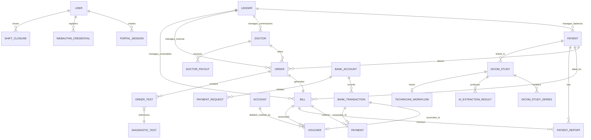

# Care Diagnostics ERP - Database Schema & Data Dictionary

This document serves as the canonical reference for the database schema used in the Care Diagnostics Hospital ERP. It details all tables, columns, constraints, classifications (sensitive, medical, financial, audit), and entity relationships.

---

## 1. Logical Module Groups

The database schema consists of several functional modules:
1. **Core Patient & Referral Management Module**
2. **Order & Test Catalog Module**
3. **Billing & Collections Module**
4. **Accounting & Double-Entry Ledger Module**
5. **Advanced Banking & Financial Automation Module**
6. **Clinical Reporting & Verification Module**
7. **DICOM PACS & RIS Workflow Module**
8. **Staff Authentication, Security & Sessions Module**

---

## 2. Entity-Relationship (ER) Architecture

Below is the logical mapping of primary data tables and their relationships:

---

## 3. Data Dictionary by Table

### 3.1 Patients Module
Files: [patients.ts](file:///c:/Users/abina/caredeoghar--antigravity/lib/db/src/schema/patients.ts)

#### Table: `patients`
*   **Purpose:** Stores demographic profiles and registration keys for clinical patients.
*   **Columns:**
    *   `id` (integer, serial, PRIMARY KEY): Auto-incrementing internal identifier.
    *   `patient_id` (text, UNIQUE): Custom clinic patient identifier (e.g. PAT-2026-NNN).
    *   `first_name` (text, NOT NULL): Patient first name.
    *   `last_name` (text, NOT NULL): Patient last name.
    *   `date_of_birth` (text, NOT NULL): ISO Birth date string.
    *   `gender` (text, NOT NULL): Gender (Male/Female/Other).
    *   `phone` (text, NOT NULL): Mobile phone number for communications/notifications.
    *   `email` (text, NULL): Contact email address.
    *   `address` (text, NULL): Residential address.
    *   `blood_group` (text, NULL): Blood group code.
    *   `photo_data_url` (text, NULL): Optional base64 portrait photo block.
    *   `ledger_id` (integer, NULL): Link to accounting ledger account.
    *   `portal_pin_hash` (text, NULL): Password hash for patient self-service portal.
    *   `age_value` (integer, NULL): Relative age value.
    *   `age_unit` (text, NULL): Age unit (years, months, days).
    *   `created_at` (timestamp, DEFAULT NOW): System creation date.
    *   `updated_at` (timestamp, DEFAULT NOW): Update timestamp.
*   **Data Classifications:**
    *   *Sensitive:* `first_name`, `last_name`, `phone`, `email`, `address`, `photo_data_url`, `portal_pin_hash`.
    *   *Medical:* `date_of_birth`, `gender`, `blood_group`.
    *   *Audit:* `created_at`, `updated_at`.

#### Table: `patient_counter`
*   **Purpose:** Simple tracking table to maintain unique auto-increment sequences for human-readable Patient IDs.
*   **Columns:**
    *   `id` (integer, serial, PRIMARY KEY): Internal identifier.
    *   `counter` (integer, DEFAULT 0): Numeric sequence counter.

---

### 3.2 Referral Doctors Module
Files: [doctors.ts](file:///c:/Users/abina/caredeoghar--antigravity/lib/db/src/schema/doctors.ts)

#### Table: `doctors`
*   **Purpose:** Registry of clinical diagnostic referral doctors.
*   **Columns:**
    *   `id` (integer, serial, PRIMARY KEY): Internal unique identifier.
    *   `name` (text, NOT NULL): Doctor's name (prefixed Dr.).
    *   `specialization` (text, NOT NULL): Medical specialty domain.
    *   `phone` (text, NULL): Contact mobile number.
    *   `email` (text, NULL): Contact email.
    *   `hospital_affiliation` (text, NULL): Affiliated hospital/clinic name.
    *   `address` (text, NULL): Medical chambers address.
    *   `area` (text, NULL): Geographic district/territory.
    *   `registration_number` (text, NULL): State medical council registration key.
    *   `default_commission_type` (text, DEFAULT 'percentage'): Default billing share type ('percentage' | 'flat').
    *   `default_commission` (numeric, DEFAULT 0.00): Billing commission rate.
    *   `ledger_id` (integer, NULL): Reference ID to accounts ledger.
    *   `created_at` (timestamp, DEFAULT NOW): Date registry.
*   **Data Classifications:**
    *   *Sensitive:* `phone`, `email`.
    *   *Financial:* `default_commission_type`, `default_commission`, `ledger_id`.
    *   *Audit:* `created_at`.

---

### 3.3 Orders & Catalog Module
Files: [orders.ts](file:///c:/Users/abina/caredeoghar--antigravity/lib/db/src/schema/orders.ts), [tests.ts](file:///c:/Users/abina/caredeoghar--antigravity/lib/db/src/schema/tests.ts)

#### Table: `orders`
*   **Purpose:** Tracks diagnostic requests placed for a patient.
*   **Columns:**
    *   `id` (integer, serial, PRIMARY KEY): Internal identifier.
    *   `order_number` (text, UNIQUE): Unique human-readable code.
    *   `patient_id` (integer, NOT NULL, FK -> `patients.id`): Linked patient records.
    *   `doctor_id` (integer, NULL, FK -> `doctors.id`): Requesting referral doctor.
    *   `status` (text, DEFAULT 'pending'): Process state ('pending' | 'collected' | 'completed' | 'cancelled').
    *   `total_amount` (numeric, DEFAULT 0.00): Aggregated price of diagnostic tests.
    *   `notes` (text, NULL): Clinic remarks.
    *   `ledger_id` (integer, NULL): Linked accounting ledger account.
    *   `collected_at` (timestamp, NULL): Specimen collection date.
    *   `completed_at` (timestamp, NULL): Test completion date.
    *   `created_at` (timestamp, DEFAULT NOW): Record date.
    *   `updated_at` (timestamp, DEFAULT NOW): Modification track.
*   **Data Classifications:**
    *   *Financial:* `total_amount`, `ledger_id`.
    *   *Audit:* `collected_at`, `completed_at`, `created_at`, `updated_at`.

#### Table: `order_tests`
*   **Purpose:** Intermediary table mapping specific tests to booking orders.
*   **Columns:**
    *   `id` (integer, serial, PRIMARY KEY): Internal identifier.
    *   `order_id` (integer, FK -> `orders.id`): Associated order.
    *   `test_id` (integer, FK -> `diagnostic_tests.id`): Booked diagnostic test.
    *   `price` (numeric, NOT NULL): Applied cost (copied at point of purchase to freeze history).
    *   `result` (text, NULL): Clinical values/measurements.
    *   `result_status` (text, NULL): Lab review status.
    *   `status` (text, DEFAULT 'active'): Test row status ('active' | 'cancelled').
    *   `cancelled_by_name` (text, NULL): Editor who cancelled test.
    *   `cancelled_at` (timestamp, NULL): Date of partial cancellation.
    *   `cancellation_reason` (text, NULL): Context for audit records.
    *   `outsource_cost` (numeric, NULL): Cost payable to third party lab.
    *   `display_name` (text, NULL): Invoice print name overrides.
    *   `created_at` (timestamp, DEFAULT NOW): Audit date.
*   **Data Classifications:**
    *   *Medical:* `result`, `result_status`.
    *   *Financial:* `price`, `outsource_cost`.
    *   *Audit:* `cancelled_by_name`, `cancelled_at`, `cancellation_reason`, `created_at`.

#### Table: `diagnostic_tests`
*   **Purpose:** Standard clinical catalog of services and tests.
*   **Columns:**
    *   `id` (integer, serial, PRIMARY KEY)
    *   `code` (text, UNIQUE): Canonical code (e.g. CBC, USG_ABD).
    *   `name` (text, NOT NULL): Diagnostic name.
    *   `category` (text, NOT NULL): Test category code.
    *   `price` (numeric, NOT NULL): Standard pricing.
    *   `duration` (text, NOT NULL): Estimated turnaround time.
    *   `description` (text, NULL): Patient preparation guidelines.
    *   `is_active` (boolean, DEFAULT true): Catalog availability flag.
    *   `department` (text, DEFAULT 'Pathology'): Queue routing target.
    *   `room_number` (text): Target test counter.
    *   `test_type` (text, DEFAULT 'inhouse'): Outsource flag ('inhouse' | 'outsourced').
    *   `outsourced_lab_id` (integer, NULL): Partner lab mapping reference.
    *   `outsource_cost` (numeric, NULL): Default cost structure.
    *   `room_id` (integer, NULL): Room assignment.
    *   `modality_id` (integer, NULL): Modality assignment.
    *   `floor_label` (text): Denormalized floor indicator.
*   **Data Classifications:**
    *   *Financial:* `price`, `outsource_cost`.

---

### 3.4 Billing & Collections Module
Files: [bills.ts](file:///c:/Users/abina/caredeoghar--antigravity/lib/db/src/schema/bills.ts)

#### Table: `bills`
*   **Purpose:** Financial ledger invoices representing transaction requests.
*   **Columns:**
    *   `id` (integer, serial, PRIMARY KEY)
    *   `bill_number` (text, UNIQUE): Unique identifier.
    *   `order_id` (integer, FK -> `orders.id`): Associated order.
    *   `patient_id` (integer, FK -> `patients.id`): Invoice recipient.
    *   `subtotal` (numeric, DEFAULT 0.00): Sum of catalog prices.
    *   `discount` (numeric, DEFAULT 0.00): Deducted value.
    *   `discount_reason` (text, NULL): Discount group mapping.
    *   `discount_reason_note` (text, NULL): Audit note.
    *   `tax_amount` (numeric, DEFAULT 0.00): Calculated tax.
    *   `total_amount` (numeric, DEFAULT 0.00): Final bill amount (`subtotal - discount + tax`).
    *   `paid_amount` (numeric, DEFAULT 0.00): Cumulative payments received.
    *   `balance_amount` (numeric, DEFAULT 0.00): Outstanding receivables.
    *   `status` (text, DEFAULT 'pending'): Settlement state ('pending' | 'partially_paid' | 'paid' | 'cancelled').
    *   `ledger_id` (integer, NULL): Linked accounting ledger account.
    *   `due_date` (text, NULL): Payment schedule target.
    *   `created_by_name` (text, NULL): Staff creator.
    *   `cancelled_at` (timestamp, NULL): Cancellation datetime.
    *   `cancelled_by_name` (text, NULL): Staff canceller.
    *   `cancellation_reason` (text, NULL): Audit trail reason.
    *   `refund_amount` (numeric, DEFAULT 0.00): Total cash refunded on cancellation.
    *   `original_total` (numeric, DEFAULT 0.00): Reference sum prior to edits.
    *   `qr_scan_count` (integer, DEFAULT 0): QR interaction metric.
    *   `receipt_verification_count` (integer, DEFAULT 0): Security check counter.
    *   `pdf_download_count` (integer, DEFAULT 0): Document sharing metric.
    *   `created_at` / `updated_at` (timestamp)
*   **Data Classifications:**
    *   *Financial:* `subtotal`, `discount`, `tax_amount`, `total_amount`, `paid_amount`, `balance_amount`, `ledger_id`, `refund_amount`, `original_total`.
    *   *Audit:* `created_by_name`, `cancelled_at`, `cancelled_by_name`, `cancellation_reason`, `created_at`, `updated_at`.

#### Table: `payments`
*   **Purpose:** Individual payment transactions associated with bills.
*   **Columns:**
    *   `id` (integer, serial, PRIMARY KEY)
    *   `bill_id` (integer, FK -> `bills.id`): Associated invoice.
    *   `amount` (numeric, NOT NULL): Value received.
    *   `method` (text, NOT NULL): Cash, UPI, Card, NetBanking, Cheque.
    *   `reference_number` (text, NULL): UTR, Transaction ID or check reference.
    *   `notes` (text, NULL): Optional memo.
    *   `recorded_by_name` (text, NULL): Staff user.
    *   `created_at` (timestamp)
*   **Data Classifications:**
    *   *Financial:* `amount`, `method`, `reference_number`.
    *   *Audit:* `recorded_by_name`, `created_at`.

---

### 3.5 Accounting Module
Files: [ledgers.ts](file:///c:/Users/abina/caredeoghar--antigravity/lib/db/src/schema/ledgers.ts), [accounting.ts](file:///c:/Users/abina/caredeoghar--antigravity/lib/db/src/schema/accounting.ts), [users.ts](file:///c:/Users/abina/caredeoghar--antigravity/lib/db/src/schema/users.ts)

#### Table: `ledgers`
*   **Purpose:** Tally groups used for financial ledger accounts mapping.
*   **Columns:**
    *   `id` (integer, serial, PRIMARY KEY)
    *   `name` (text, UNIQUE): Unique ledger name (e.g. Walk-In Customers).
    *   `is_default` (boolean, DEFAULT false): Fallback mapping target.
    *   `is_walk_in` (boolean, DEFAULT false): Flag indicating walk-in ledger.

#### Table: `accounts`
*   **Purpose:** Chart of Accounts for double-entry financial journaling.
*   **Columns:**
    *   `id` (integer, serial, PRIMARY KEY)
    *   `name` (text, NOT NULL): Account name.
    *   `type` (text, NOT NULL): Account types ('cash' | 'bank' | 'income' | 'expense' | 'liability' | 'asset').
    *   `code` (text, UNIQUE): Tally alias identifier.
    *   `bank_name` / `account_number` / `ifsc_code` (text, NULL): Financial banking records.
    *   `is_active` (boolean, DEFAULT true)
    *   `tally_group` (text): Mapping target group.
    *   `opening_balance` (numeric, DEFAULT 0.00): Beginning value.
    *   `opening_balance_type` (text, DEFAULT 'Dr'): Dr / Cr indicators.
    *   `gst_applicable` (boolean, DEFAULT false)
    *   `gst_number` / `pan` (text, NULL): Compliance credentials.
*   **Data Classifications:**
    *   *Sensitive:* `account_number`, `ifsc_code`, `gst_number`, `pan`.
    *   *Financial:* `opening_balance`, `opening_balance_type`.

#### Table: `vouchers`
*   **Purpose:** Immutable Double-Entry financial transactions journal.
*   **Columns:**
    *   `id` (integer, serial, PRIMARY KEY)
    *   `voucher_number` (text, UNIQUE): Reference transaction key.
    *   `type` (text, NOT NULL): 'payment' | 'receipt' | 'contra' | 'journal' | 'sales' | 'purchase'.
    *   `date` (text, NOT NULL): ISO execution date.
    *   `credit_account_id` / `debit_account_id` (text, NOT NULL): Balancing double-entry accounts references.
    *   `amount` (numeric, NOT NULL): Transaction value.
    *   `particular` (text, NOT NULL): Ledger comments.
    *   `remark` / `reference` / `narration` (text, NULL): Context notes.
    *   `performed_by` (text, NULL): Staff creator.
    *   `bill_id` (integer, NULL): Invoice tracking reference.
    *   `created_at` (timestamp)
*   **Data Classifications:**
    *   *Financial:* `amount`, `credit_account_id`, `debit_account_id`.
    *   *Audit:* `performed_by`, `created_at`.

#### Table: `voucher_audits`
*   **Purpose:** Audit ledger documenting all modifications to voucher entries.
*   **Columns:**
    *   `id` (integer, serial, PRIMARY KEY)
    *   `voucher_id` (integer, NOT NULL): Linked voucher reference.
    *   `voucher_number` (text, NOT NULL): Tracking reference.
    *   `edited_by` (text, NOT NULL): Author of change.
    *   `reason` (text, NOT NULL): Explanation.
    *   `change_type` (text, NOT NULL): Target modified ('amount' | 'particular' | 'date' | 'reference' | 'narration' | 'accounts' | 'general').
    *   `old_value` / `new_value` (text, NULL): State snapshots.
    *   `created_at` (timestamp)

---

### 3.6 Advanced Banking & Reconciliation Module
Files: [banking.ts](file:///c:/Users/abina/caredeoghar--antigravity/lib/db/src/schema/banking.ts)

#### Table: `bank_accounts`
*   **Purpose:** Configuration registry for live API banking integrations (e.g. ICICI Corporate Banking).
*   **Columns:**
    *   `id` (integer, serial, PRIMARY KEY)
    *   `provider` (text, DEFAULT 'mock'): Adapter target ('mock' | 'icici' | 'hdfc' | etc.).
    *   `bank_name` (text, NOT NULL)
    *   `account_nickname` (text, NULL)
    *   `masked_account_number` (text, NOT NULL): Sanitized banking string.
    *   `ifsc` / `branch` (text, NULL)
    *   `environment` (text, DEFAULT 'sandbox'): sandbox | production.
    *   `status` (text, DEFAULT 'active'): active | inactive | suspended.
    *   `credential_key` (text, NULL): Env key indicator (API keys kept out of DB).
    *   `ledger_account_id` (integer, NULL, FK -> `accounts.id`): Linked internal chart of account.
    *   `provider_config` (jsonb, NULL): Custom parameters (URLs, timeouts).
*   **Data Classifications:**
    *   *Sensitive:* `masked_account_number`, `ifsc`, `credential_key`, `provider_config`.

#### Table: `bank_transactions`
*   **Purpose:** Feed registry containing all items imported from bank account statements.
*   **Columns:**
    *   `id` (integer, serial, PRIMARY KEY)
    *   `bank_account_id` (integer, NOT NULL, FK -> `bank_accounts.id`)
    *   `provider` (text, NOT NULL)
    *   `external_transaction_id` (text, NULL): Bank's internal trace ID.
    *   `transaction_date` (timestamp, NOT NULL)
    *   `description` (text, NULL): Direct narration from bank statement.
    *   `amount` (numeric, NOT NULL): Credit or debit amount.
    *   `type` (text, NOT NULL): credit | debit.
    *   `balance_after` (numeric, NULL): Statement balance.
    *   `utr` (text, NULL): Unique Transaction Reference (crucial for automated reconciliation).
    *   `reference_number` (text, NULL)
    *   `raw_payload` (jsonb, NULL): Full API response from bank statement endpoint.
    *   `reconciliation_status` (text, DEFAULT 'unreconciled'): unreconciled | matched | manual | ignored.
    *   `voucher_id` (integer, NULL, FK -> `vouchers.id`)
    *   `payment_id` (integer, NULL, FK -> `payments.id`)
*   **Data Classifications:**
    *   *Financial:* `amount`, `balance_after`, `utr`.
    *   *Audit:* `raw_payload`.

#### Table: `payment_requests`
*   **Purpose:** Tracks outgoing payout requests (e.g. payouts to doctors or vendors via bank API).
*   **Columns:**
    *   `id` (integer, serial, PRIMARY KEY)
    *   `bank_account_id` (integer, NOT NULL, FK -> `bank_accounts.id`)
    *   `provider` (text, NOT NULL)
    *   `amount` (numeric, NOT NULL)
    *   `currency` (text, DEFAULT 'INR')
    *   `purpose` (text, NULL): Remarks/Memo.
    *   `beneficiary_name` / `beneficiary_account` / `beneficiary_ifsc` (text, NULL): Target details.
    *   `external_request_id` / `external_transaction_id` (text, NULL): Bank processing keys.
    *   `status` (text, DEFAULT 'pending'): pending | processing | completed | failed | cancelled.
    *   `failure_reason` (text, NULL)
    *   `bill_id` (integer, NULL, FK -> `bills.id`)
    *   `voucher_id` (integer, NULL, FK -> `vouchers.id`)
    *   `performed_by` (text, NULL): Initiating staff member.
*   **Data Classifications:**
    *   *Sensitive:* `beneficiary_account`, `beneficiary_ifsc`.
    *   *Financial:* `amount`.

#### Table: `reconciliation_logs`
*   **Purpose:** Logs matchmaking logic outcomes between statement items and bills.
*   **Columns:**
    *   `id` (integer, serial, PRIMARY KEY)
    *   `bank_transaction_id` (integer, NOT NULL, FK -> `bank_transactions.id`)
    *   `bill_id` (integer, NULL, FK -> `bills.id`)
    *   `payment_id` (integer, NULL, FK -> `payments.id`)
    *   `voucher_id` (integer, NULL, FK -> `vouchers.id`)
    *   `confidence_score` (integer, DEFAULT 0): Auto-matching score (0-100).
    *   `match_strategy` (text, DEFAULT 'none'): exact_utr | exact_invoice_ref | manual | etc.
    *   `status` (text, DEFAULT 'pending'): pending | auto_matched | manual_matched | failed | ignored.
    *   `review_reason` (text, NULL): Failure or manual verification triggers context.
    *   `auto_closed` (boolean, DEFAULT false): Direct matching closure flag.
    *   `auto_closed_amount` (numeric, NULL)
    *   `resolved_by` / `resolved_at` / `resolution_note` (text / timestamp)
    *   `match_metadata` (jsonb, NULL): Comparison details.

#### Table: `fraud_alerts`
*   **Purpose:** Automated detection triggers warning of anomalies (e.g. editing invoice after matching).
*   **Columns:**
    *   `id` (integer, serial, PRIMARY KEY)
    *   `alert_type` (text, NOT NULL): duplicate_utr | bill_deleted_after_collection | backdated_edit | etc.
    *   `severity` (text, DEFAULT 'medium'): critical | high | medium | low.
    *   `status` (text, DEFAULT 'open'): open | investigating | resolved | false_positive.
    *   `bill_id` / `payment_id` / `bank_transaction_id` (integer, NULL): Mappings.
    *   `user_id` / `user_name` (integer / text): Associated actor.
    *   `title` / `description` (text, NOT NULL)
    *   `affected_amount` (numeric, NULL)
    *   `evidence` (jsonb, NULL): Struct containing before/after transaction status.
    *   `resolved_by` / `resolved_at` / `resolution_note` / `resolution_action` (text / timestamp)

#### Table: `shift_closures`
*   **Purpose:** Tracks cashier checkout sessions to calculate vault drops and variances.
*   **Columns:**
    *   `id` (integer, serial, PRIMARY KEY)
    *   `user_id` / `user_name` (integer / text): cash register operator.
    *   `shift_label` (text, DEFAULT 'Morning'): Shift description.
    *   `started_at` / `ended_at` (timestamp): Scope of cash drawer shifts.
    *   `expected_cash` / `expected_upi` / `expected_card` / `expected_total` (numeric): Computed balance.
    *   `actual_cash` / `actual_upi` / `actual_card` / `actual_total` (numeric): Counted cash register values.
    *   `variance` (numeric): Mismatch count (`actual - expected`).
    *   `variance_note` (text)
    *   `denominations` (jsonb): Counter values of 500/200/100/50 notes.
    *   `denomination_total` (numeric)
    *   `bank_deposit_amount` / `bank_deposit_ref` (numeric / text)
    *   `supervisor_id` / `supervisor_name` / `approved_at` / `approval_note` (integer / text / timestamp)
    *   `status` (text, DEFAULT 'open'): open | closing | closed | approved.
    *   `user_day_closure_id` (integer)
    *   `notes` (text)

---

### 3.7 Clinical Reporting Module
Files: [patientReports.ts](file:///c:/Users/abina/caredeoghar--antigravity/lib/db/src/schema/patientReports.ts), [signatures.ts](file:///c:/Users/abina/caredeoghar--antigravity/lib/db/src/schema/signatures.ts)

#### Table: `patient_reports`
*   **Purpose:** Official medical records and clinical findings for pathology/radiology studies.
*   **Columns:**
    *   `id` (integer, serial, PRIMARY KEY)
    *   `report_number` (text, UNIQUE): Code mapping index (e.g. RPT-2026-NNN).
    *   `type` (text, DEFAULT 'pathology'): pathology | radiology.
    *   `patient_id` (integer, NOT NULL, FK -> `patients.id`)
    *   `test_id` (integer, NOT NULL, FK -> `diagnostic_tests.id`)
    *   `order_test_id` (integer, NULL, FK -> `order_tests.id`)
    *   `order_id` (integer, NULL, FK -> `orders.id`)
    *   `bill_id` (integer, NULL, FK -> `bills.id`)
    *   `study_id` (integer, NULL): Associated DICOM study reference.
    *   `title` (text, NOT NULL): Diagnostic header.
    *   `body` (text, NOT NULL): Narrative HTML/Markdown findings.
    *   `parameters` (text, NULL): JSON string storing quantitative parameters.
    *   `impression` (text, NULL): Diagnostic summary.
    *   `status` (text, DEFAULT 'draft'): draft | pending_verification | verified | delivered.
    *   `is_critical` (boolean, DEFAULT false): Critical result flag.
    *   `critical_note` (text, NULL)
    *   `critical_acknowledged_at` / `critical_acknowledged_by` (timestamp / text)
    *   `signature_id` (integer, NULL): Doctor signature mapping.
    *   `signed_by_name` / `signed_at` (text / timestamp): Creator signing track.
    *   `verified_by_signature_id` (integer, NULL): Reviewer signature mapping.
    *   `verified_by_name` / `verified_at` / `verifier_notes` (text / timestamp)
    *   `delivered_at` / `delivered_by` (timestamp / text)
    *   `template_id` (integer, NULL)
    *   `public_token` (text, UNIQUE): UUID sharing key.
    *   `public_token_expires_at` (timestamp): Time limits for token expiration.
    *   `created_by` / `created_at` / `updated_at` (text / timestamp)
*   **Data Classifications:**
    *   *Medical:* `body`, `parameters`, `impression`, `is_critical`, `critical_note`.
    *   *Audit:* `signed_by_name`, `signed_at`, `verified_by_name`, `verified_at`, `delivered_by`, `delivered_at`, `public_token`.

#### Table: `signatures`
*   **Purpose:** Doctors and pathologists signature blocks for print template rendering.
*   **Columns:**
    *   `id` (integer, serial, PRIMARY KEY)
    *   `name` (text, NOT NULL): Dr. profile label.
    *   `role` (text, DEFAULT 'Doctor'): Medical role string.
    *   `qualification` (text): Qualifications (e.g. MBBS, MD).
    *   `registration_no` (text): Medical registry number.
    *   `image_data_url` (text, NOT NULL): Base64 image payload.
    *   `is_active` (boolean, DEFAULT true)
*   **Data Classifications:**
    *   *Sensitive:* `image_data_url`.

---

### 3.8 DICOM PACS & RIS Workflow Module
Files: [dicomStudies.ts](file:///c:/Users/abina/caredeoghar--antigravity/lib/db/src/schema/dicomStudies.ts)

#### Table: `dicom_studies`
*   **Purpose:** Main registry for live studies ingested from modalities or PACS routers.
*   **Columns:**
    *   `id` (integer, serial, PRIMARY KEY)
    *   `study_instance_uid` (text, UNIQUE): Global unique tag (from tag 0020,000D).
    *   `series_instance_uid` / `sop_instance_uid` (text, NULL): Hierarchy anchors.
    *   `accession_number` (text, NULL): External billing identifier.
    *   `patient_id` (integer, NULL, FK -> `patients.id`): Matched internal patient record.
    *   `dicom_patient_id` (text, NULL): Raw patient ID tag from DICOM.
    *   `patient_name` (text, NOT NULL): Patient name string.
    *   `patient_age` / `patient_sex` (text, NULL)
    *   `modality` (text, DEFAULT 'OT')
    *   `study_date` / `study_time` (text, NULL)
    *   `referring_doctor` / `performing_technician` (text, NULL)
    *   `study_description` / `body_part_examined` (text, NULL)
    *   `ingest_status` (text, DEFAULT 'pending'): pending | ingested | failed | duplicate | linked.
    *   `ingest_error` / `ingest_source` (text)
    *   `linked_report_id` / `linked_bill_id` / `linked_order_id` (integer, NULL): Core associations.
    *   `link_status` (text, DEFAULT 'unlinked'): linked | suggested | conflict | unlinked.
    *   `link_confidence` / `link_reason` (text, NULL)
    *   `assigned_radiologist_id` / `assigned_radiologist_name` (integer / text): Staff routing.
    *   `pacs_source` / `sync_status` (text)
    *   `dicom_metadata` (jsonb, DEFAULT '{}'): Complete JSON representation of DICOM headers.
*   **Data Classifications:**
    *   *Sensitive:* `patient_name`, `dicom_patient_id`, `dicom_metadata`.
    *   *Medical:* `study_description`, `body_part_examined`, `modality`.

#### Table: `dicom_study_series`
*   **Purpose:** Series-level metadata breakdown associated with ingested studies.
*   **Columns:**
    *   `id` (integer, serial, PRIMARY KEY)
    *   `study_id` (integer, NOT NULL, FK -> `dicom_studies.id`)
    *   `series_instance_uid` (text, NOT NULL)
    *   `series_number` (integer, DEFAULT 1)
    *   `number_of_images` (integer, DEFAULT 0)

#### Table: `technician_workflow`
*   **Purpose:** Tracks raw scanning variables populated by imaging operators.
*   **Columns:**
    *   `id` (integer, serial, PRIMARY KEY)
    *   `study_id` (integer, NOT NULL, FK -> `dicom_studies.id`)
    *   `scan_started_at` / `scan_completed_at` (timestamp, NULL)
    *   `technician_notes` (text, NULL): Qualitative notes.
    *   `image_quality` (text): good | acceptable | repeat_needed.
    *   `contrast_used` (boolean, DEFAULT false): Contrast indicator.
    *   `contrast_name` / `contrast_dose` (text, NULL)
    *   `adverse_reaction` (boolean, DEFAULT false)
    *   `technician_id` / `technician_name` (integer / text)

---

### 3.9 Security & System Configurations Module
Files: [users.ts](file:///c:/Users/abina/caredeoghar--antigravity/lib/db/src/schema/users.ts), [rolePermissions.ts](file:///c:/Users/abina/caredeoghar--antigravity/lib/db/src/schema/rolePermissions.ts), [portalSessions.ts](file:///c:/Users/abina/caredeoghar--antigravity/lib/db/src/schema/portalSessions.ts)

#### Table: `users`
*   **Purpose:** Core staff credentials and profiles.
*   **Columns:**
    *   `id` (integer, serial, PRIMARY KEY)
    *   `name` (text, NOT NULL)
    *   `email` (text, NOT NULL, UNIQUE)
    *   `username` (text, UNIQUE): Login ID.
    *   `role` (text, DEFAULT 'receptionist')
    *   `permissions` (text, NULL): JSON array of string privileges.
    *   `pin` (text, NULL): Bcrypt numerical PIN string.
    *   `must_change_pin` (boolean, DEFAULT false)
    *   `remote_login_enabled` (boolean, DEFAULT false)
    *   `failed_login_attempts` (integer, DEFAULT 0)
    *   `locked_until` (timestamp, NULL)
    *   `is_active` (boolean, DEFAULT true)
    *   `max_discount` (numeric, NULL): Staff specific limits.
*   **Data Classifications:**
    *   *Sensitive:* `email`, `username`, `pin`, `permissions`.

#### Table: `role_permissions`
*   **Purpose:** RBAC permission matrix for (role, module) mappings.
*   **Columns:**
    *   `id` (integer, serial, PRIMARY KEY)
    *   `role` (text, NOT NULL): Target group.
    *   `module` (text, NOT NULL): Target component.
    *   `can_view` / `can_create` / `can_edit` / `can_delete` (boolean, DEFAULT false)
    *   `can_print` / `can_reprint` / `can_refund` / `can_export` (boolean, DEFAULT false)
    *   `can_approve` / `can_finalize` (boolean, DEFAULT false)

#### Table: `portal_sessions`
*   **Purpose:** Tracks active session tokens.
*   **Columns:**
    *   `id` (integer, serial, PRIMARY KEY)
    *   `token` (text, UNIQUE): Generated key.
    *   `scope` (text, NOT NULL): 'patient' | 'staff'.
    *   `subject_id` (integer, NOT NULL): Reference mapping to user or patient ID.
    *   `subject_name` (text, NOT NULL): Account name.
    *   `expires_at` (timestamp, NOT NULL): Expiry time.
    *   `ip_address` / `user_agent` (text, NULL): IP and browser agent metadata.
    *   `last_activity_at` (timestamp, DEFAULT NOW): Active tracking time.

---

## 4. Key Security & Relational Risks

### 4.1 Orphan Table Risks
*   **Missing Hard Cascades:** Many foreign key mappings (e.g. `patient_reports.order_id` references `orders.id`) do not enforce `ON DELETE CASCADE`. If an order is deleted directly by an administrator, related child records will retain dangling IDs, resulting in runtime server errors when attempting to resolve fields.
*   **Weak Linkages on Ingest:** In `dicom_studies`, the column `patient_id` is nullable. If incoming modality streams fail to parse correctly or cannot match the patient ID database record, the files remain orphaned in an unlinked state.

### 4.2 Duplicate Data Risks
*   **Denormalized Patient Names:** Both `patients` and `dicom_studies` contain fields for Patient Name. Since `dicom_studies` populates `patient_name` directly from the modality header tags, any typo or edit does not sync with the master `patients` record, creating data conflicts.
*   **Redundant Discount Logics:** Discount configurations exist in both `billsTable.discount_reason` (as a text string) and the specific `discounts` table. Modifying reasons globally can break past records where reason logs were stored as unmapped raw strings.
*   **Floor Labels:** `floor_label` is stored directly on `diagnostic_tests` (copied from `rooms.floor`), violating normalization rules and creating consistency risks if rooms are relocated.
