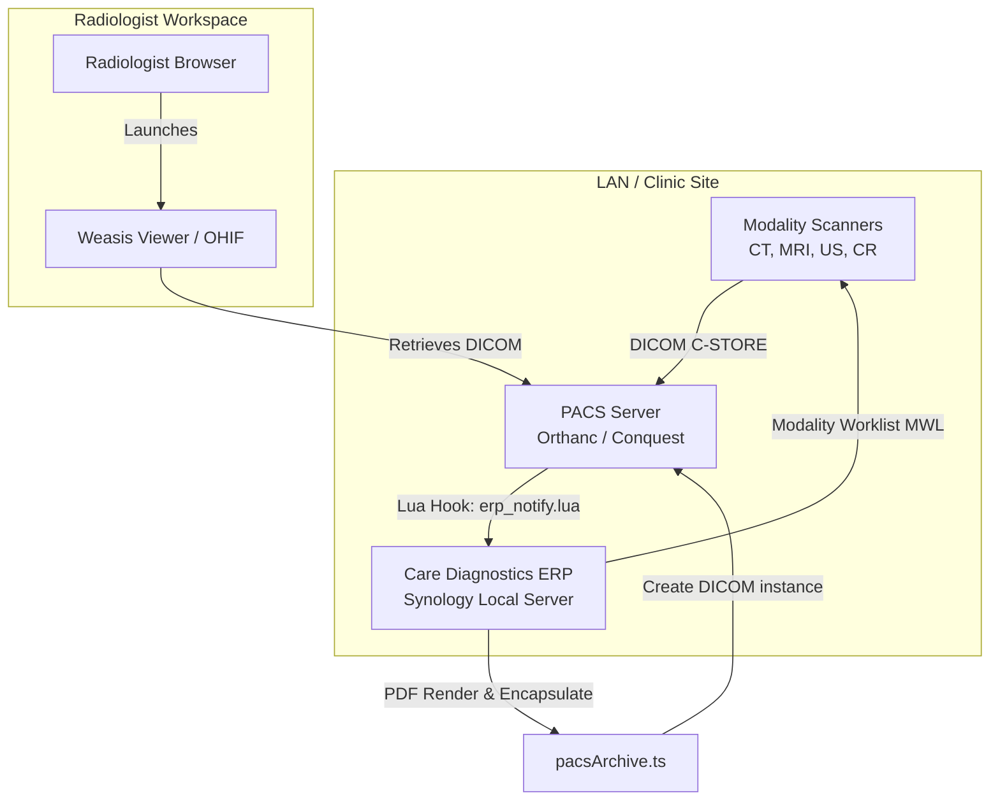
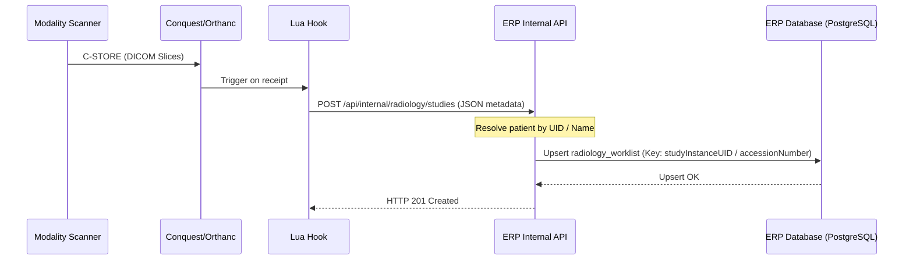
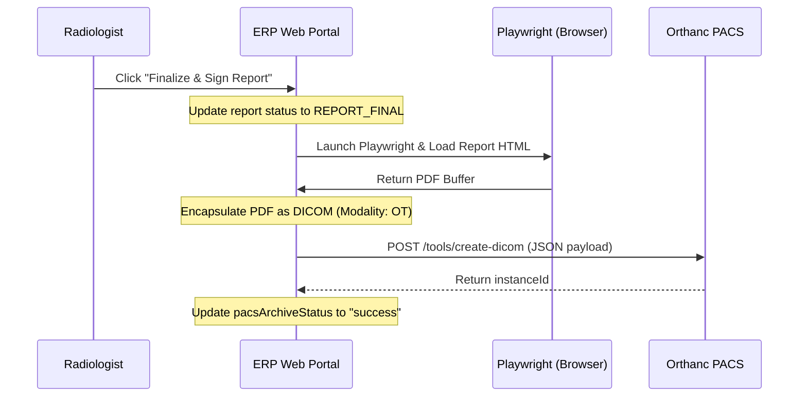
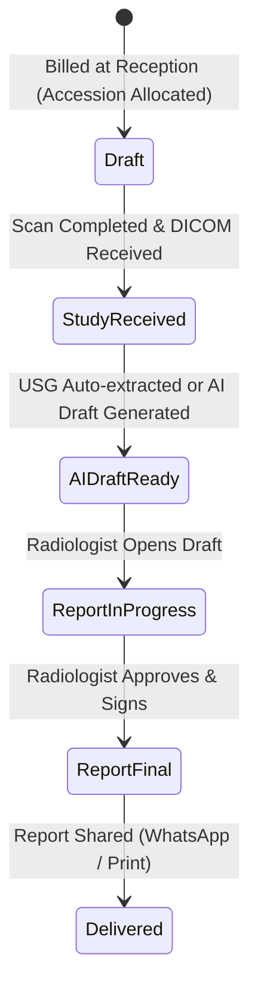

# Care Diagnostics ERP — PACS & DICOM Integration Architecture
**Complete Integration Mapping, Worfklow Auditing, and Risk Assessment**

This document provides a comprehensive technical overview of the PACS (Picture Archiving and Communication System) and DICOM integration within the Care Diagnostics ERP. It covers data flows, synchronization pipelines, client-side launcher mechanics, Lua scripting hooks, and a detailed risk analysis for future maintenance and scaling.

---

## 1. System Integration Overview

The Care Diagnostics ERP integrates with local LAN-hosted PACS servers (such as Orthanc and Conquest) to bridge clinic operations, billing workflows, patient records, and radiologist diagnostic reporting. 



---

## 2. Workflows & Technical Pipelines

### A. Modality Workflow
The Modality Workflow describes how imaging machines (CT, MRI, USG, X-Ray) communicate with the diagnostic center's systems:
1. **Patient Registration & Billing**: When a patient pays at the Billing Desk, an order is generated with a unique Accession Number (format: `ACC-YYYYMMDD-[Modality]-[Seq]`).
2. **Worklist Query (MWL)**: Modalities query the PACS server via DICOM C-FIND queries. 
3. **Scan Execution**: The technician selects the patient from the scanner console (which automatically populates patient details, accession numbers, and procedure names), executes the scan, and completes the study.

### B. DICOM Workflow
The core DICOM protocol interactions in the center are structured as follows:
- **C-STORE (Storage)**: Modalities push raw image slices (SOP Instances) directly to the local PACS server.
- **C-FIND (Query)**: Used by the ERP and the local pull-agents to query the PACS registry for studies matching patient name, dates, or study description.
- **C-MOVE (Retrieve)**: Used to retrieve images from remote DICOM nodes back to the local PACS disk cache.
- **Modality Worklist (MWL)**: The ERP populates a scheduled procedures registry which is exposed to local modalities via Conquest's or Orthanc's DICOM MWL service.

### C. Conquest PACS Workflow
Conquest is deployed as a lightweight DICOM receiver:
- **Listening Service**: Operates on standard port `5678` or `104`.
- **dgate CGI**: Exposes basic web queries at `/cgi-bin/dgate` to search or index stored studies.
- **Local Storage**: Stores received `.dcm` files under structured folders on the Synology NAS.
- **System Config**: Controlled via `dicom.ini` which triggers Lua hooks on specific DICOM events (such as image arrival).

### D. Weasis Workflow
For desktop viewing, Weasis (an open-source Java Web Start DICOM viewer) is launched directly from the ERP web portal:
1. **Link Click**: The radiologist clicks "Open Viewer" in the ERP worklist.
2. **XML Manifest Generation**: The ERP server constructs a launch protocol file (or issues a redirection URL containing query strings like `weasis://host?studyInstanceUID=...`).
3. **Weasis Ingestion**: Weasis opens locally on the radiologist's workstation and retrieves the DICOM slices directly from the PACS endpoint using Basic Authentication headers.

### E. Lua Script Workflow (`erp_notify.lua`)
Conquest invokes the [erp_notify.lua](file:///c:/Users/abina/caredeoghar--antigravity/conquest/erp_notify.lua) script upon receiving a DICOM image:
1. **Event Capture**: The `converter(callingae, calledae, ip, port)` function fires.
2. **Normalisation**: Patients' names are converted from DICOM format (e.g. `Last^First^Middle` to `Last First Middle`).
3. **Payload Construction**: A JSON payload is constructed containing patient ID, name, accession number, StudyInstanceUID, modality, study description, study date, AETitle, and IP address.
4. **Intake API Call**: The script POSTs this JSON to `/api/internal/radiology/studies` using `luasocket` (primary) or falls back to a CLI `curl` command using a temporary JSON file to avoid shell argument injection.

### F. Internal API Workflow
The internal API runs behind an `INTERNAL_API_KEY` barrier:
1. **Intake Endpoint**: Processes incoming Conquest hook alerts at `POST /api/internal/radiology/studies`.
2. **Patient Resolution**: Resolves incoming DICOM metadata to an existing patient profile using `createOrLinkPatientFromDicom`. If unmatched, it creates a new patient.
3. **Priority & Assignment**: Triggers `computeStudyPriority` and `assignRadiologistToStudy` to automatically triage the study.
4. **USG Extractor Trigger**: If the study modality is `"US"` (Ultrasound), it triggers the `runUsgExtraction` helper in the background to extract clinical measurements.

---

## 3. System Synchronizations

### A. Database Synchronization

- **Intake Deduplication**: The database ingestion uses upsert logic on `radiology_worklist` utilizing index structures. If a study was previously ingested (e.g., as part of a multi-series send), the record is updated in place, preventing row duplication.

### B. Report Synchronization

- **Playwright Rendering**: Playwright runs a headless Chromium instance to convert the final HTML report (complete with clinical signatures, letterheads, and margins) into an A4 PDF buffer.
- **DICOM Encapsulation**: The PDF buffer is base64-encoded and sent to Orthanc's `/tools/create-dicom` endpoint with SOP Class UID `1.2.840.10008.5.1.4.1.1.104.1` (Encapsulated PDF Storage). This places the written report directly inside the patient's image folder in the PACS, satisfying medical archiving standards.

### C. Billing Synchronization
- **Order Ingestion**: When a receptionist bills a radiology test, `generateStudiesForOrder` is executed in `bills.ts`.
- **Pre-allocation**: It auto-creates draft studies in the database with empty StudyInstanceUIDs, reserving the accession numbers.
- **Scan Association**: When the modality pushes the DICOM study carrying the same accession number, the incoming Conquest webhook matches it, populates the StudyInstanceUID, and moves the study state from `draft` to `STUDY_RECEIVED` in the worklist.

---

## 4. Study Lifecycle



1. **Draft**: Billed test. Awaiting images.
2. **STUDY_RECEIVED**: Images arrive at Conquest/Orthanc; Lua script notifies the ERP.
3. **AI_DRAFT_READY**: Measurements (like USG parameters) are auto-extracted, or an AI draft report is generated by Gemini.
4. **REPORT_IN_PROGRESS**: Radiologist locks the study and begins editing.
5. **REPORT_FINAL**: Radiologist signs off. Playwright PDF is generated and pushed to Orthanc PACS.
6. **DELIVERED**: WhatsApp link dispatched to patient or print receipt logged.

---

## 5. Security & Stability Risk Assessment

### A. Duplicate Study Risks
- **Issue**: Modalities sometimes send retries, or multiple series are pushed separately. In addition, technicians occasionally edit the patient ID at the scanner, creating a mismatch.
- **Mitigation**: The database enforces a `UNIQUE` index constraint on `StudyInstanceUID` and `AccessionNumber`. Webhook intakes use PostgreSQL upserts (`ON CONFLICT DO UPDATE`), which safely merges duplicate arrivals without creating redundant rows.

### B. Failed Import Risks
- **Issue**: Non-image DICOM objects (such as Structured Reports, Presentation States, or secondary captures) lack valid `AccessionNumber` fields. Pushing them to the ERP results in ingestion failures.
- **Mitigation**: The `erp_notify.lua` script filters out incoming DICOM objects that contain empty accession tags before making the HTTP POST call.

### C. Race Conditions
- **Issue**: A radiologist might attempt to finalize a report at the exact moment a background AI agent or USG measurement extractor tries to update the study draft.
- **Mitigation**: The ERP uses row-level locking (`FOR UPDATE` transactions) on the `radiology_studies` table during critical updates, ensuring database consistency.

### D. Missing Retries
- **Issue**: If the local clinic LAN connection is disrupted, the Lua webhook cannot reach the ERP. Since Conquest executes the Lua converter synchronously without an internal queue, failed POST calls are lost.
- **Mitigation**: The local pull-agent acts as a fallback. It scans the PACS periodically and matches any studies that did not get synced during the webhook outage.

### E. Authentication Risks
- **Issue**: The internal RIS/PACS endpoints (`/api/internal/*`) bypass staff session checks. If the `INTERNAL_API_KEY` is leaked or left empty, any intranet attacker can manipulate study workflows.
- **Mitigation**: The server implements a strict **Fail-Closed** rule in production. If `INTERNAL_API_KEY` is empty, the server disables the internal endpoints entirely.

### F. Data Integrity Risks
- **Issue**: Names pushed from modalities use caret separations (e.g. `DOE^JOHN^MARK`). Pushing these raw strings directly to patient notification channels (like WhatsApp) looks unprofessional.
- **Mitigation**: The Lua script cleans names by converting carets to spaces and trimming whitespaces before sending them to the intake API.

---

## 6. PACS API Endpoint Catalog

All endpoints listed below are mounted on the main API server.

### A. Internal Communication (Bearer Token Auth: `INTERNAL_API_KEY`)

#### 1. Ingest Study
- **Endpoint**: `POST /api/internal/radiology/studies`
- **Description**: Receives DICOM metadata from local webhooks on scan completion.
- **Payload**:
  ```json
  {
    "patientId": "P-00123",
    "patientName": "John Doe",
    "accessionNumber": "ACC-20260624-MR-001",
    "studyInstanceUID": "1.2.840.113619.2.55.3.2831.142",
    "modality": "MR",
    "studyDescription": "MRI Brain Plain",
    "studyDate": "20260624",
    "referringDoctor": "Dr. Smith",
    "aeTitle": "CONQUEST_PACS",
    "ipAddress": "192.168.1.50"
  }
  ```
- **Response**: `{ "success": true, "worklistId": 45 }`

#### 2. Update Worklist Status
- **Endpoint**: `POST /api/internal/radiology/report-status`
- **Description**: Triggers report workflow stage changes.
- **Payload**:
  ```json
  {
    "accessionNumber": "ACC-20260624-MR-001",
    "status": "REPORT_FINAL",
    "actor": "Dr. Jones"
  }
  ```
- **Response**: Full updated worklist row.

#### 3. AI Report Draft Ingestion
- **Endpoint**: `POST /api/internal/radiology/ai-draft`
- **Description**: Feeds an AI-suggested text block into the study's draft record.
- **Response**: Plain text and HTML formatted drafts.

---

### B. Client / Portal Interactions (Staff Session Auth Gated)

#### 1. Launch Viewer
- **Endpoint**: `POST /api/dicom-studies/:id/viewer`
- **Description**: Requests launch URLs for OHIF or Weasis.
- **Access Gate**: Authenticated Staff.
- **Response**:
  ```json
  {
    "studyId": 12,
    "studyInstanceUID": "1.2.840.113619.2.55.3.2831.142",
    "url": "weasis://viewer?url=https://pacs.local/study/1.2.840..."
  }
  ```

#### 2. PACS Node Sync Retry
- **Endpoint**: `POST /api/dicom-studies/:id/sync-retry`
- **Description**: Forces a retry to fetch DICOM instances from the remote PACS server.
- **Access Gate**: Authenticated Staff.
- **Response**: Updated DICOM study record.
