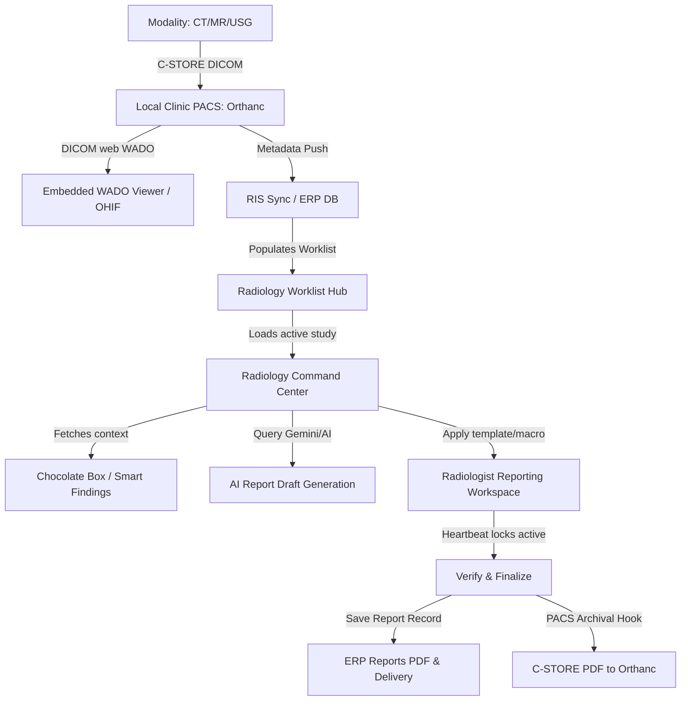

# Radiology Architecture Master Document — Care Diagnostics ERP

This document serves as the master architectural reference for developers, system administrators, and AI assistants working on the Care Diagnostics ERP Radiology, RIS, and PACS modules.

---

## SECTION 1 — RADIOLOGY MODULE INVENTORY

### Pages (Frontend Modules)
- **Active Worklist**: [RadiologyWorklist.tsx](file:///c:/Users/abina/caredeoghar--antigravity/artifacts/diagnostic-erp/src/pages/RadiologyWorklist.tsx) — Main RIS dashboard.
- **Unified Workspace**: [RadiologyCommandCenter.tsx](file:///c:/Users/abina/caredeoghar--antigravity/artifacts/diagnostic-erp/src/pages/RadiologyCommandCenter.tsx) — Integrated reporting hub.
- **Settings & Config**: [RadiologySettings.tsx](file:///c:/Users/abina/caredeoghar--antigravity/artifacts/diagnostic-erp/src/pages/RadiologySettings.tsx) — Modality and system switches.
- **DICOM Nodes & Jobs**: [DicomNodes.tsx](file:///c:/Users/abina/caredeoghar--antigravity/artifacts/diagnostic-erp/src/pages/DicomNodes.tsx) / [DicomAgentDashboard.tsx](file:///c:/Users/abina/caredeoghar--antigravity/artifacts/diagnostic-erp/src/pages/DicomAgentDashboard.tsx) — Connection settings.
- **Specialized Interfaces**: Echo Cardiology, Fetal Echo, and Fetal USG Level 4 reporting components.

### Backend Routes (`artifacts/api-server/src/routes/`)
- [radiology.ts](file:///c:/Users/abina/caredeoghar--antigravity/artifacts/api-server/src/routes/radiology.ts) — Operations, studies, locks, and favorites.
- `pacsEnterprise.ts` — Main PACS broker, URL/launcher resolvers.
- `echoCardiology.ts` / `fetalUsgLevel4.ts` — Specialized cardiology/OB-GYN routes.
- `usgExtraction.ts` — Handles USG frame analysis and measurement indexing.
- `aiModelRoutes.ts` — Smart routing of AI requests.

### Database Tables (`lib/db/src/schema/radiology.ts`)
- `radiology_studies`: Core study registration metadata.
- `radiology_study_locks`: Heartbeat-driven locks for concurrency control.
- `pacs_settings`: Global settings (IPs, AETs, OHIF, and Weasis configurations).
- `radiology_user_report_preferences` / `radiology_user_findings_preferences`: Personal templates, macros, and starred Chocolate Box tiles.
- `radiology_user_item_usage_logs`: Recents logs and analytics.

---

## SECTION 2 — WORKFLOW MAP

---

## SECTION 3 — VIEWER ARCHITECTURE

### OHIF Viewer
- Launching queries the `ohif_base_url` configuration inside the `pacs_settings` table.
- Constructs the study URL using `{OHIF_BASE_URL}/viewer?StudyInstanceUIDs={studyInstanceUID}` template.

### Weasis (Desktop Native Client)
- Launched using a custom protocol URL template: `weasis://$dicom:get -w "http://<pacs-ip>:<pacs-port>/weasis?studyUID={studyInstanceUID}"`.

### Embedded WADO Viewer
- Built directly into the Command Center via `EmbeddedWadoViewer.tsx`.
- Uses DICOMweb protocol to fetch frames, rendering images locally inside the browser viewport.

---

## SECTION 4 — REPORTING SYSTEMS

| Sub-system | Purpose | Location | Reusable? | Legacy? | Needs Enhancement? |
|------------|---------|----------|-----------|---------|---------------------|
| **Findings Library** | Modality-specific boilerplate text | `radiologyChocolateFindingsTable` | Yes | No | Populate more pre-sets |
| **Normal Templates** | One-click reports | `radiologyStructuredTemplatesTable` | Yes | No | Clean up old templates |
| **Measurements** | Indexing measurements | `radiologyDicomMeasurementsTable` | Yes | No | Needs automated parsing |
| **Macros** | Typing shortcuts | `radiology_user_report_preferences` | Yes | No | Expand to support placeholders |
| **AI Draft** | Automated drafts | `/api/ai-reporting/query` | Yes | No | Enable Ollama / Claude keys |
| **USG Reporting** | Custom ultrasound editor | `UsgReporting.tsx` | No | Yes | RETIRE (Merge to CommandCenter) |
| **Doppler Reporting** | Custom doppler editor | `UsgDopplerReporting.tsx` | No | Yes | RETIRE (Merge to CommandCenter) |

---

## SECTION 5 — COMMAND CENTER

- **Consolidated Components**:
  - Combined RIS patient metadata cards, prior reports list, and DICOM launch selectors.
  - Placed structured selections builder, Chocolate Box panel, and personal macros dashboard into side-by-side tabs.
- **Legacy Components to Consolidate**:
  - Standalone report pages (`RadiologyReportEditor.tsx`, `RadiologyReportGenerator.tsx`) are deprecated and should be fully redirected to `RadiologyCommandCenter.tsx`.

---

## SECTION 6 — PACS / DICOM INTEGRATION

- **Orthanc**: Serves as the primary local DICOM router and WADO source.
- **Conquest**: Present in code configurations, but unused in current LAN deployment.
- **SSRF Blockers**: The cloud environment blocks private loopback ranges (`172.16.x.x`), which requires the local `bridge-service` or local agents to act as the query-retrieve broker.

---

## SECTION 7 — AI FEATURES

- **AI Draft**: Queries Gemini via Replit's proxy and maps selected Chocolate Box tiles to contextual prompts.
- **Deterministic Fallback**: If AI provider settings have `is_enabled: false` (or network is lost), local keyword mapping triggers text suggestions deterministically.

---

## SECTION 8 — DUPLICATE & REDUNDANT FUNCTIONALITY

1. **Duplicate Editors**:
   - `RadiologyReportEditor.tsx` (deprecated standalone editor)
   - `RadiologyReportGenerator.tsx` (deprecated template editor)
   - `UsgReporting.tsx` (deprecated legacy USG editor)
   - `UsgDopplerReporting.tsx` (deprecated legacy Doppler editor)
   - *All these are superseded by [RadiologyCommandCenter.tsx](file:///c:/Users/abina/caredeoghar--antigravity/artifacts/diagnostic-erp/src/pages/RadiologyCommandCenter.tsx).*
2. **Duplicate Worklists**:
   - `UsgWorklist.tsx` (redundant)
   - `RadiologistQueue.tsx` (redundant)
   - *All worklists are superseded by [RadiologyWorklist.tsx](file:///c:/Users/abina/caredeoghar--antigravity/artifacts/diagnostic-erp/src/pages/RadiologyWorklist.tsx).*

---

## SECTION 9 — TECHNICAL DEBT & CONSOLIDATION OPPORTUNITIES

- **Schema Drifts**: The `clinic_settings` table schema drift in Drizzle causes a 500 error on `/api/portal/settings` in production. This must be aligned to unblock the ERP.
- **Redundant Routes**: Disable and delete unused routes in `api-server` to keep API surface small and clean (e.g. `/api/usg-reports` and `/api/radiology-workflow/incoming`).

---

## SECTION 10 — FUTURE ROADMAP

### High Priority
1. Resolve the `clinic_settings` database schema drift.
2. Enable Gemini / AI provider flag `is_enabled` in settings.
3. Deploy local LAN pull agents to query modalities and push metadata to Cloud.

### Medium Priority
1. Consolidate Echo and Obstetrical checks into the main CommandCenter layout.
2. Clean up and delete deprecated frontend files (e.g., `UsgReporting.tsx`, `RadiologyReportGenerator.tsx`).

---

## SECTION 11 — AI HANDOFF GUIDE
*(Instructional section for future Claude/Codex instances)*

### Key Files
- Schema definitions: `lib/db/src/schema/radiology.ts`
- Routes: `artifacts/api-server/src/routes/radiology.ts`
- CommandCenter Page: `artifacts/diagnostic-erp/src/pages/RadiologyCommandCenter.tsx`

### Workflows to Master
1. **Heartbeat Locking**: Polling on `/api/radiology/studies/:id/lock` prevents conflicts.
2. **Personal Macros**: Input listener expands typed `/MACRO` shortcuts to full strings.
3. **Chocolate Box**: Stars synchronize with `favoriteFindingIds` and float to the top of the grid.
