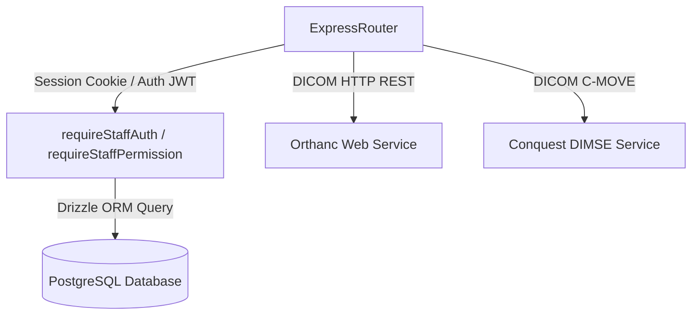

# API Inventory — Care Diagnostics ERP & PACS Ecosystem

This inventory maps all REST API endpoints within the Care Diagnostics ERP. It lists routes, methods, authentication scopes, module permissions, consumers, and dependency maps to guide developer integration and maintenance.

---

## 1. Dependency Maps

### 1.1 Client-to-Server Flow
```mermaid
graph TD
    ClientSPA[Vite SPA React App] -->|HTTP REST| ExpressRouter[index.ts API Router]
    KioskApp[Kiosk Terminal] -->|HTTP REST| KioskRouter[/api/kiosk]
    PublicWeb[Public Site] -->|HTTP REST| PublicBooking[/api/public/booking]
    MetaServer[Meta WhatsApp Cloud API] -->|HTTP POST Webhook| WhatsAppWebhook[/api/whatsapp/webhook]
    ConquestServer[Conquest Lua Hooks] -->|HTTP REST| InternalRadiology[/api/internal/*]
```

### 1.2 Database & PACS Dependency Flow


---

## 2. API Route Inventory

### 2.1 Public & Unauthenticated Endpoints

| Route Prefix | Method | Purpose | Authentication | Consumers | Frontend Usage | Background Job Usage | Status |
| :--- | :--- | :--- | :--- | :--- | :--- | :--- | :--- |
| `/health` | GET | Server health checks & Docker heartbeats. | None | Nginx / Docker Healthcheck | None | None | **Active** |
| `/super-admin/usb/status` | GET | Checks if USB hardware gate key is enforced. | None | Login page / SPA | Login page check | None | **Active** |
| `/super-admin/usb/verify` | POST | Submits presented USB key for verification. | Rate Limiter | Login page | Super Admin key validation | None | **Active** |
| `/internal/cron` | GET / POST | Triggers internal backup, sync, and notifications. | `CRON_SECRET` Bearer Token | Replit Cron scheduler | None | Hourly backup cron | **Active** |
| `/internal/backup` | GET | Streams off-site backup pg_dump file. | `INTERNAL_API_KEY` Bearer Token | Replication server | None | Daily DB dump | **Active** |
| `/internal/radiology` | GET / POST | Processes instances received notification from PACS. | `INTERNAL_API_KEY` Bearer Token | Orthanc/Conquest Lua Hooks | None | Real-time scan sync | **Active** |
| `/portal` | GET / POST | Patient portal logins and patient report downloads. | Patient token | Patients / Public website | Patient Portal page | None | **Active** |
| `/display` | GET | Displays current work queue on clinic TV screens. | None | Clinic TV display boards | TV Queue app | None | **Active** |
| `/bridge` | GET / POST | Communicates with local lab analyzers. | None | Analyzer local bridge agent | Bridge control panel | Syncing CBC results | **Active** |
| `/p/r/:token` | GET | Serves public patient PDF reports. | Token-based (URL) | Patients via WhatsApp | Web reader | None | **Active** |
| `/verify/:billId` | GET | Confirms validity of receipt via printed QR code. | None | Patients / Regulators | Bill Validation UI | None | **Active** |
| `/public/booking` | POST | Handles public test bookings & Razorpay checkouts. | None | Public Clinic Site | Booking checkout page | None | **Active** |
| `/kiosk` | GET / POST | Handles self-service registrations and payments. | Rate Limiter | Kiosk screen | Kiosk interface | None | **Active** |
| `/whatsapp/webhook` | GET / POST | Listens to incoming WhatsApp patient texts. | Meta hub token | WhatsApp Cloud API | None | AI chatbot replies | **Active** |
| `/website` | GET | Fetches website settings, FAQs, and pricing plans. | None | Public website SPA | Landing page layout | None | **Active** |

---

### 2.2 Staff-Authenticated ERP Endpoints
*All routes in this section require a valid staff session cookie (`requireStaffAuth`).*

| Route Prefix | Method | Purpose | Module Permission | Consumers | Frontend Usage | Background Job | Status |
| :--- | :--- | :--- | :--- | :--- | :--- | :--- | :--- |
| `/patients` | ALL | Query, create, and update patient demographics. | `/patients` | Reception / Billing Desk | Patient search & registration | None | **Active** |
| `/doctors` | ALL | Manage referring and consulting doctors list. | `/doctors` | Referral management | Billing Desk dropdowns | None | **Active** |
| `/tests` | GET | Fetches test catalogue. | None (All Staff) | Billing Desk / Lab Desk | Price lookup | None | **Active** |
| `/tests` | POST/PUT | Creates and modifies laboratory and radiology tests. | `/tests` | Admin Panel | Catalog Management | None | **Active** |
| `/orders` | ALL | Place test orders and track workflow states. | `/orders` | Reception Desk | Lab requisition lists | None | **Active** |
| `/bills` | ALL | Formulates invoices, settles payment, prints sheets. | `/billing` | Billing Desk | Checkout/Invoicing panels | None | **Active** |
| `/payments` | ALL | Records cash, UPI, card splits, and issue refunds. | `/payments` | Cashier desk | Payment modal | None | **Active** |
| `/reports` | ALL | Renders financial analytics and collection summary. | `/reports` | Management / Owners | Revenue dashboards | None | **Active** |
| `/inventory` | ALL | Registers reagents, films, and clinic consumption. | `/inventory` | Inventory Manager | Stock monitoring panel | None | **Active** |
| `/accounting` | ALL | Processes financial ledgers and accounting vouchers. | `/accounting` | Accounts Desk | Accounting book panels | None | **Active** |
| `/discounts` | ALL | Configures discount policies and tracks approvals. | `/discounts` | Billing Desk | Discount approval popups | None | **Active** |
| `/expenses` | ALL | Logs non-inventory payments and utility vouchers. | `/accounting` | Cashier / Accounts | Expense logs | None | **Active** |
| `/day-close` | ALL | Summarizes drawer collections and daily closeout. | None (All Staff) | Billing Staff / Admins | Shift closeout modal | None | **Active** |
| `/books-sanity`| GET | Performs financial auditing and checks balances. | `/day-close` | Audit Desk | Audit log viewer | None | **Active** |
| `/staff` | ALL | Manages staff profile records and shifts. | `/settings` (users) | HR Administrator | Shift schedule table | None | **Active** |
| `/hr-forms` | ALL | Processes staff onboarding and joining sheets. | `/settings` (users) | Onboarding portal | Employee onboarding | None | **Active** |
| `/storage` | ALL | Requests presigned S3 URLs for HR photos. | `/settings` | File Uploaders | Joining form upload | None | **Active** |
| `/clinic-settings`| GET | Fetches clinic settings details. | None (All Staff) | Billing / Reception | Print receipt configurations | None | **Active** |
| `/clinic-settings`| PUT | Updates infrastructure config settings. | `/settings` (clinic) | Admin panel | Setting manager | None | **Active** |
| `/email-settings`| ALL | Configures SMTP relays and notification triggers. | `/settings` (notifications) | Admin panel | SMTP configurations | None | **Active** |
| `/report-templates`| ALL | Configures lab template values. | `/settings` (infrastructure) | Pathology Desk | Template selection | None | **Active** |
| `/abnormal-findings`| ALL | Manages clinical warning indicators. | `/settings` (infrastructure) | Lab Managers | Warning triggers config | None | **Active** |
| `/machines` | ALL | Manages interface details for lab analyzers. | `/settings` (infrastructure) | Lab manager | Lab device dashboard | None | **Active** |
| `/departments` | ALL | Creates and edits clinical departments. | `/settings` (infrastructure) | Infrastructure manager | Setup config panel | None | **Active** |
| `/vendors` | ALL | Registers outsource labs and supply vendors. | `/settings` (infrastructure) | Supply Manager | Supplier directories | None | **Active** |
| `/printers` | ALL | Adds network printers and thermal paper types. | `/settings` (devices) | Biller terminal | Direct print dispatcher | None | **Active** |

---

### 2.3 Radiology & PACS REST Endpoints

| Route Prefix | Method | Purpose | Authentication | Permissions | Consumers | Frontend Usage | Status |
| :--- | :--- | :--- | :--- | :--- | :--- | :--- | :--- |
| `/api/radiology/pacs-worklist` | GET | Fetches current radiology studies matching worklist queue. | Staff Cookie | `/radiology` | Command Center | Worklist queue sidebar | **Active** |
| `/api/radiology/chocolate-findings` | GET / POST | Retrieves and modifies Chocolate Box quick-select tiles. | Staff Cookie | `/radiology` | Command Center | ChocolateBoxPanel grid | **Active** |
| `/api/radiology/user-findings-preferences`| GET / POST | Star/pin findings tiles and custom user tiles. | Staff Cookie | `/radiology` | Command Center | Star/Unstar toggle state | **Active** |
| `/api/radiology/user-report-preferences` | GET / POST | Star templates, macros, and impressions list. | Staff Cookie | `/radiology` | Command Center | Favorite Templates tab | **Active** |
| `/api/radiology/user-item-usage` | GET / POST | Logs usage of templates/macros and reads top statistics. | Staff Cookie | `/radiology` | Command Center | Analytics tab dashboard | **Active** |
| `/api/radiology/report-generator/save-draft` | POST | Saves structured template report draft. | Staff Cookie | `/radiology` | Command Center | Save Draft click action | **Active** |
| `/api/radiology/studies/:studyId/lock` | POST / DELETE | Acquires, refreshes, or releases concurrent report lock. | Staff Cookie | `/radiology` | Command Center | Takeover overlay logic | **Active** |
| `/api/radiology/network/health-monitor` | GET | Live latency check and status counters for PACS nodes. | Staff Cookie | `/radiology` | Control Center | Health monitor cards | **Active** |
| `/api/radiology/pacs-settings` | GET / POST | Retrieves and updates PACS host settings dynamically. | Staff Cookie | `/radiology` | Control Center | Apply suggested fix buttons | **Active** |

---

## 3. Deprecated & Unused APIs

- `/api/dicom-uploads` (POST): Deprecated in favor of the unified `/api/dicom/upload` handler routing to local Orthanc instances directly.
- `/api/ris-monitoring` (ALL): Merged into `/api/radiology/network/health-monitor` and monitored under the Radiology Network Control Center topology.
- `/api/sync/manual-trigger` (POST): Unused; replaced by `/internal/cron` scheduler synchronizing data on a 15-minute background loop.
- `/api/sync` (ALL): Legacy local-database sync router. Currently unused, as Drizzle replication handles state distribution across NAS nodes.
