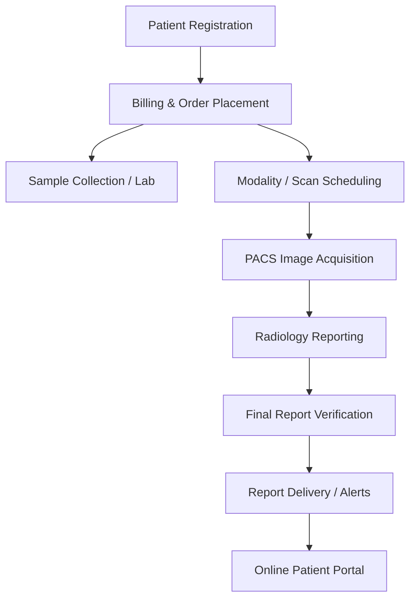

# ERP Data Flow Map: CareDeoghar Hospital ERP

This document maps the complete lifecycle of clinical and financial data through the CareDeoghar Hospital ERP. It serves as a verification blueprint for developers and system auditors.

---

## Data Flow Pipeline Overview

---

## Detailed Lifecycle Tracing

### 1. Patient Registration
* **APIs Involved:**
  * `POST /api/patients` - Creates new patient profile.
  * `PUT /api/patients/:id` - Updates demographic details.
  * `GET /api/patients/search` - Look up existing patients via MRN or Mobile.
* **Database Tables Involved:**
  * `patients` - Central patient demographic record.
* **Permission Checks Involved:**
  * Middleware: `requireStaffAuth`
  * Action Guard: `requireStaffPermission("/patients")` (write/update).
* **Audit Logs Generated:**
  * Action: `PATIENT_REGISTRATION` or `PATIENT_UPDATE`. Contains patient ID, operator user ID, and diff of demographic modifications.
* **Failure Points:**
  * Duplicate MRN generation due to concurrency race conditions.
  * Invalid mobile format leading to SMS notification delivery failures later.
  * Incomplete mandatory demographics (e.g. gender or age missing) causing invalid fields in DICOM headers.

---

### 2. Billing & Order Placement
* **APIs Involved:**
  * `POST /api/bills` - Generates a new bill and spawns associated test orders.
  * `POST /api/payments/checkout` - Initializes online or gateway payment transaction.
* **Database Tables Involved:**
  * `bills` - Header records containing total amount, discount, and status.
  * `bill_items` - Line items for individual tests (USG, X-Ray, Blood Test).
  * `ledgers` - Double-entry financial records.
  * `payments` - Records transaction identifiers, webhook responses, and gateway state.
  * `radiology_studies` - Auto-populated if any line item is a radiology/USG test.
* **Permission Checks Involved:**
  * Middleware: `requireStaffAuth`
  * Action Guard: `requireStaffPermission("/billing")`
* **Audit Logs Generated:**
  * Action: `BILL_CREATE`, `PAYMENT_RECEIPT`, `LEDGER_TRANSACTION`. Logs the amount, bill ID, payment gateway reference, and operator.
* **Failure Points:**
  * Double ledger entries due to duplicate billing clicks.
  * Failed PACS integration: `generateStudiesForOrder` fails but billing succeeds, resulting in missing entries on the radiologist worklist.
  * Orthanc patient record creation (`dicomPatientCreator`) timeout, leaving PACS unaware of the new patient.

---

### 3. Sample Collection (Lab)
* **APIs Involved:**
  * `GET /api/samples/worklist` - Retrieves lists of patients awaiting sample collection.
  * `POST /api/samples/collect` - Registers sample collection, assigns barcodes, and prints labels.
* **Database Tables Involved:**
  * `samples` - Tracks sample barcode, collection time, collector ID, status (`collected`, `received`, `processed`).
  * `bill_items` - Updates individual item status to `sample_collected`.
* **Permission Checks Involved:**
  * Middleware: `requireStaffAuth`
  * Action Guard: `requireStaffPermission("/lab")`
* **Audit Logs Generated:**
  * Action: `SAMPLE_COLLECTED`. Records sample barcode, patient ID, and collector.
* **Failure Points:**
  * Barcode collision with previously archived samples.
  * Lack of database transaction: Bill status updates but `samples` insertion fails, causing the sample to be orphaned.

---

### 4. Modality (Imaging/Scan Scheduling)
* **APIs Involved:**
  * Modality queries PACS via DICOM C-FIND (Modality Worklist Protocol).
  * `GET /api/radiology/worklist` - ERP-side dashboard for technicians to monitor scan statuses.
* **Database Tables Involved:**
  * `radiology_studies` - Scheduled scans awaiting image acquisition.
* **Permission Checks Involved:**
  * Middleware: `requireStaffAuth`
  * Action Guard: `requireStaffPermission("/radiology")`
* **Audit Logs Generated:**
  * Action: `STUDY_WORKLIST_ACCESS`. Records technician monitoring action.
* **Failure Points:**
  * Mismatch between modality configuration and PACS IP configuration (Network Mismatch).
  * Missing Accession Number: Modality technician types a generic number instead of the ERP-generated accession number, preventing auto-linking.

---

### 5. PACS (Image Acquisition & Sync)
* **APIs Involved:**
  * Modality pushes images to PACS via DICOM C-STORE.
  * `POST /api/pacs/event` - Webhook triggered by PACS (e.g. Conquest `erp_notify.lua` or Orthanc Event handlers) notifying the ERP that images have arrived.
* **Database Tables Involved:**
  * `radiology_studies` - Status updated from `scheduled` to `received`. Populates `StudyInstanceUID`, `number_of_instances`, and modality metadata.
* **Permission Checks Involved:**
  * Security Header: `Authorization: Bearer <INTERNAL_API_KEY>` (PACS-to-ERP internal system validation).
* **Audit Logs Generated:**
  * Action: `PACS_STUDY_RECEIVED`. Logs `StudyInstanceUID`, Accession Number, and count of images.
* **Failure Points:**
  * Internal API Key mismatch between `erp_notify.lua` and ERP API server settings.
  * Duplicate `StudyInstanceUID` caused by modality test pushes or incorrect patient grouping.
  * High-latency or timeout on the LAN link between the PACS NAS and ERP API server.

---

### 6. Reporting (Radiologist Draft & Lock)
* **APIs Involved:**
  * `GET /api/radiology/study/:id` - Fetch study metadata.
  * `POST /api/radiology/study/:id/lock` - Lock study for editing.
  * `POST /api/radiology/study/:id/draft` - Save incremental draft of report.
* **Database Tables Involved:**
  * `radiology_studies` - Updates `locked_by`, `locked_at`, and draft JSON content.
  * `reports` - Draft report records and template linkages.
* **Permission Checks Involved:**
  * Middleware: `requireStaffAuth`
  * Action Guard: `requireStaffPermission("/radiology")` + verified role (Radiologist).
* **Audit Logs Generated:**
  * Action: `REPORT_DRAFT_SAVE` or `STUDY_LOCKED`. Logs the user locking/saving and timestamp.
* **Failure Points:**
  * Indefinite study lock: Radiologist closes browser tab without saving, leaving the study locked for other users until the 30-minute timeout passes.
  * Multi-session editing: Race condition where draft updates overwrite each other due to network lag.

---

### 7. Final Report (Signing & PDF PACS Archival)
* **APIs Involved:**
  * `POST /api/radiology/study/:id/sign` - Electronically sign and authorize final report.
  * `POST /api/pacs/archive` - Internal API triggering Playwright conversion of HTML report to DICOM PDF.
* **Database Tables Involved:**
  * `radiology_studies` - Status updated to `completed`.
  * `reports` - Updates report status to `final`, records digital signature hash, and stores PDF path.
* **Permission Checks Involved:**
  * Middleware: `requireStaffAuth`
  * Action Guard: `requireStaffPermission("/radiology")` + restricted signatory permission.
* **Audit Logs Generated:**
  * Action: `REPORT_SIGNED`. Logs report ID, signature hash, and clinical reviewer.
* **Failure Points:**
  * Playwright crash: Headless Chromium fails to launch inside the docker container, blocking PDF generation.
  * Orthanc push timeout: PDF DICOM is generated but fails to upload back to PACS, leaving OHIF viewers without the report document.

---

### 8. Report Delivery (Alerts & Notifications)
* **APIs Involved:**
  * `POST /api/notifications/send` - Send notification via WhatsApp/SMS.
  * `GET /api/whatsapp/status` - Monitor delivery webhooks.
* **Database Tables Involved:**
  * `notifications` - Logs notification type, target contact, delivery status, and external message ID.
* **Permission Checks Involved:**
  * Middleware: `requireStaffAuth` (Internal triggers use standard system token verification).
* **Audit Logs Generated:**
  * Action: `NOTIFICATION_DISPATCHED` or `NOTIFICATION_FAILED`. Logs the alert type and patient ID.
* **Failure Points:**
  * Third-party SMS/WhatsApp gateway timeout or API key invalidation.
  * Invalid phone format on patient demographics blocks outbound delivery.

---

### 9. Online Patient Portal
* **APIs Involved:**
  * `POST /api/portal/auth` - Patient login via OTP (One-Time Password).
  * `GET /api/portal/reports` - Retrieve patient clinical reports.
  * `GET /api/portal/reports/:id/download` - Secure download link for PDFs.
* **Database Tables Involved:**
  * `portal_sessions` - Session tokens for active patient/portal users.
  * `reports` - Reads signed report PDFs.
  * `patients` - Verifies patient profile identity.
* **Permission Checks Involved:**
  * Middleware: `requirePatientAuth` (validated via SMS OTP session token validation).
* **Audit Logs Generated:**
  * Action: `PORTAL_LOGIN` and `REPORT_DOWNLOADED`. Logs target report, patient ID, and client IP.
* **Failure Points:**
  * SMS gateway failure blocks OTP delivery, locking patients out of the portal.
  * Weak session validation allows IDOR (Insecure Direct Object Reference) to access other patients' report paths.
