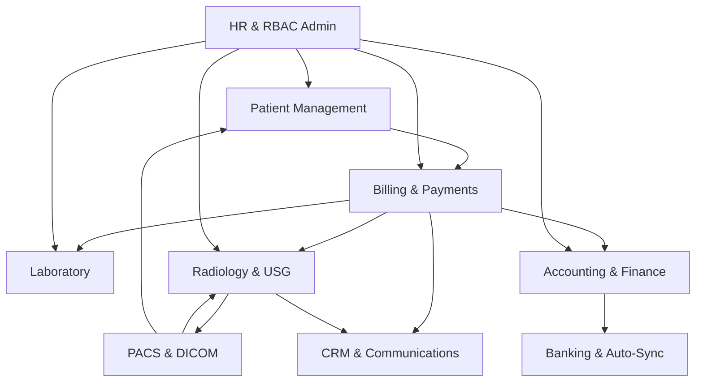

# ERP Module Dependency Map: CareDeoghar Hospital ERP

This document outlines the inter-module dependency graph, interfaces, and blast radiuses for the CareDeoghar Hospital ERP system. It serves as a safety reference for developers and automated AI systems prior to modifying code.

---

## 1. System-Wide Dependency Graph

---

## 2. Module Dependency Breakdown

### Module 1: Patient Management (Demographics & Appointments)
* **Frontend Pages:** `Register.tsx`, `Patients.tsx`, `PatientDetail.tsx`, `Appointments.tsx`, `Kiosk.tsx`, `Queue.tsx`
* **Backend Routes:** `POST /api/patients`, `GET /api/patients/search`, `GET /api/patients/:id`, `POST /api/appointments`
* **Database Tables:** `patients`, `appointments`, `queue_tokens`
* **External Services:** SMS Gateway (for OTP/reminders), WhatsApp Cloud API.
* **PACS Dependencies:** PACS depends on Patient Management to query patient profiles (`MRN`, `name`, `DOB`, `gender`) to bind DICOM studies correctly.
* **Billing Dependencies:** Billing requires a valid `patient_id` to generate invoices.
* **User Permission Dependencies:** Staff must have `/patients` permissions.

#### Modification Impact Analysis
* **What breaks?** Patient lookup, queue management, walk-in registrations.
* **What other modules are affected?** 
  * **Billing & Payments:** Cannot create bills for new patients.
  * **Radiology:** Cannot map PACS incoming studies because patient demographic search fails.
* **What APIs are affected?** `/api/patients`, `/api/bills`, `/api/pacs/event`
* **What database tables are affected?** `patients`, `appointments`, `bills`, `radiology_studies`

---

### Module 2: Billing & Payments (Financial Checkout)
* **Frontend Pages:** `BillingDesk.tsx`, `BillDetail.tsx`, `Dues.tsx`, `DayClose.tsx`
* **Backend Routes:** `POST /api/bills`, `GET /api/bills/:id`, `POST /api/payments/checkout`, `POST /api/payments/webhook`
* **Database Tables:** `bills`, `bill_items`, `payments`, `ledgers`, `discount_pins`
* **External Services:** Razorpay, PhonePe, PayU, Cashfree, ICICI Orange Pay.
* **PACS Dependencies:** Creates placeholder entries in `radiology_studies` via `generateStudiesForOrder` so PACS images have a matching order.
* **Billing Dependencies:** Self-dependent core.
* **User Permission Dependencies:** Staff must have `/billing` permissions.

#### Modification Impact Analysis
* **What breaks?** Invoicing, payment callbacks, discount approvals, cash register closures.
* **What other modules are affected?**
  * **Radiology:** Radiologists see empty worklists because billing failed to spawn `radiology_studies` rows.
  * **Laboratory:** Technicians cannot collect samples because no test orders exist on the lab worklist.
  * **Accounting:** General ledger remains empty, disabling financial health auditing.
* **What APIs are affected?** `/api/bills`, `/api/payments/checkout`, `/api/pacs/event`
* **What database tables are affected?** `bills`, `bill_items`, `ledgers`, `radiology_studies`, `payments`

---

### Module 3: Laboratory (Sample Collection & Pathology)
* **Frontend Pages:** `Samples.tsx`, `OutsourcedLabs.tsx`, `OutsourceReconciliation.tsx`, `Tests.tsx`
* **Backend Routes:** `GET /api/samples/worklist`, `POST /api/samples/collect`, `POST /api/lab/results`
* **Database Tables:** `samples`, `lab_results`, `tests`, `outsourced_labs`, `bill_items`
* **External Services:** Barcode label printers.
* **PACS Dependencies:** None.
* **Billing Dependencies:** Can only process samples for paid or approved `bill_items`.
* **User Permission Dependencies:** Staff must have `/lab` permissions.

#### Modification Impact Analysis
* **What breaks?** Sample collection workflows, lab reports, outsourcing logs.
* **What other modules are affected?**
  * **Billing & Payments:** Patient cannot get cleared of pending tests if results are missing.
* **What APIs are affected?** `/api/samples/collect`, `/api/lab/results`
* **What database tables are affected?** `samples`, `lab_results`, `bill_items`

---

### Module 4: Radiology & USG (Imaging Reporting)
* **Frontend Pages:** `RadiologyWorklist.tsx`, `RadiologyReportEditor.tsx`, `UsgReporting.tsx`, `EchoCardiology.tsx`, `FormF.tsx`
* **Backend Routes:** `GET /api/radiology`, `POST /api/radiology/:id/report`, `POST /api/radiology/:id/sign`, `POST /api/form-f`
* **Database Tables:** `radiology_studies`, `reports`, `form_f_records`, `report_templates`
* **External Services:** Local Ollama model, Google Gemini API, WADO image retriever.
* **PACS Dependencies:** Relies on DICOM metadata and `StudyInstanceUID` links. Playwright PDF reports are converted to DICOM format and archived to Orthanc.
* **Billing Dependencies:** Can only edit studies linked to an active, validated bill.
* **User Permission Dependencies:** Staff must have `/radiology` permissions.

#### Modification Impact Analysis
* **What breaks?** Diagnostic report typing, electronic signatures, legal obstetric reporting (Form-F).
* **What other modules are affected?**
  * **PACS:** Reports cannot be archived back to PACS as DICOM PDFs.
  * **CRM:** Patient notifications for report availability are not sent.
  * **Online Portal:** Patients cannot download PDFs.
* **What APIs are affected?** `/api/radiology/:id/sign`, `/api/pacs/archive`
* **What database tables are affected?** `radiology_studies`, `reports`, `notifications`

---

### Module 5: PACS & DICOM (Imaging Infrastructure)
* **Frontend Pages:** `PacsDashboard.tsx`, `DicomNodes.tsx`, `DicomQueryRetrieve.tsx`, `MwlDashboard.tsx`
* **Backend Routes:** `POST /api/pacs/event`, `POST /api/pacs/proxy`, `POST /api/pacs/archive`, `GET /api/pacs/study/:id`
* **Database Tables:** `pacs_settings`, `pacs_logs`, `radiology_studies`
* **External Services:** Orthanc PACS, Conquest PACS, OHIF Viewer Docker instance, local Weasis applications.
* **PACS Dependencies:** Self-contained core.
* **Billing Dependencies:** Relies on billing orders to match accession numbers.
* **User Permission Dependencies:** Staff must have `/dicom-nodes` permissions.

#### Modification Impact Analysis
* **What breaks?** DICOM routing, modality worklist (MWL) sync, OHIF viewer integration.
* **What other modules are affected?**
  * **Radiology:** Radiologists cannot open or report scans because images are missing/unlinked.
* **What APIs are affected?** `/api/pacs/event`, `/api/pacs/archive`, `/api/radiology`
* **What database tables are affected?** `radiology_studies`, `pacs_logs`

---

### Module 6: Accounting & Finance (Ledger Management)
* **Frontend Pages:** `Accounting.tsx`, `Expenses.tsx`, `BooksSanity.tsx`, `Referrals.tsx`
* **Backend Routes:** `GET /api/ledgers`, `POST /api/expenses`, `GET /api/commissions`
* **Database Tables:** `ledgers`, `expenses`, `users` (commissions map to doctors)
* **External Services:** E-invoicing portals, Tax APIs.
* **PACS Dependencies:** None.
* **Billing Dependencies:** Subscribes to Day Close processes to audit ledger balances.
* **User Permission Dependencies:** Staff must have `/accounting` permissions.

#### Modification Impact Analysis
* **What breaks?** Balance sheet audits, expense records, doctor commission summaries.
* **What other modules are affected?**
  * **Billing:** Billing continues to function, but reconciliation reporting will lock up.
* **What APIs are affected?** `/api/ledgers`, `/api/expenses`
* **What database tables are affected?** `ledgers`, `expenses`

---

### Module 7: CRM & Communications (Alerting Engine)
* **Frontend Pages:** `WhatsAppChatbot.tsx`, `PatientCommunication.tsx`
* **Backend Routes:** `POST /api/whatsapp/send`, `POST /api/whatsapp/webhook`
* **Database Tables:** `notifications`, `chatbot_sessions`
* **External Services:** Meta WhatsApp API, Twilio, Gupshup, WATI.
* **PACS Dependencies:** None.
* **Billing Dependencies:** Triggers checkout confirmation receipts to patients.
* **User Permission Dependencies:** Staff must have `/whatsapp` permissions.

#### Modification Impact Analysis
* **What breaks?** SMS notifications, OTP login gates, diagnostic reports delivery notices.
* **What other modules are affected?**
  * **Patient Portal:** Patients cannot log in because OTP delivery is broken.
  * **Radiology:** Patients do not get notified when their scans are signed.
* **What APIs are affected?** `/api/whatsapp/send`, `/api/portal/auth`
* **What database tables are affected?** `notifications`, `portal_sessions`

---

### Module 8: HR & Admin (RBAC & System Controls)
* **Frontend Pages:** `Staff.tsx`, `SystemUpdate.tsx`, `Website.tsx`
* **Backend Routes:** `POST /api/users`, `POST /api/role-permissions`, `POST /api/backup`
* **Database Tables:** `users`, `role_permissions`, `audit_logs`, `portal_sessions`
* **External Services:** Local backup directories, cloud replication servers.
* **PACS Dependencies:** None.
* **Billing Dependencies:** Verifies authorization for cashiers, billing updates, and discount overrides.
* **User Permission Dependencies:** Staff must have `/admin` permissions.

#### Modification Impact Analysis
* **What breaks?** Staff logins, role checks, audit logs, system backups.
* **What other modules are affected?**
  * **All Modules:** If user tables or permission indexes are corrupt, access control breaks globally, causing system-wide lockout or exposure.
* **What APIs are affected?** All backend routes containing auth guards.
* **What database tables are affected?** `users`, `role_permissions`, `audit_logs`, `portal_sessions`
