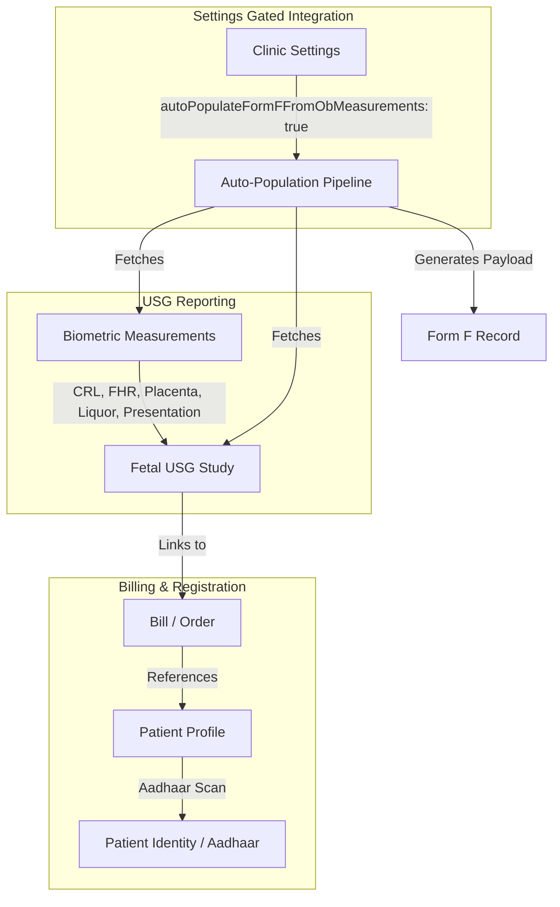

# Phase 3 PCPNDT Integration Audit & Implementation Roadmap

## 1. Audit Scope & Objectives

The goal of this audit is to design the integration path for **USG Phase 3: PCPNDT Integration**. This includes automatically populating Form F regulatory fields from approved obstetric (OB) measurements while keeping this behavior optional via system settings.

### Reviewed Modules:
1. **USG Module**: [fetalUsgLevel4.ts](file:///c:/Users/abina/caredeoghar--antigravity/lib/db/src/schema/fetalUsgLevel4.ts) (`fetal_usg_studies`, `fetal_usg_measurements`, `fetal_usg_checklists`, `fetal_usg_reports`)
2. **Form F Module**: [formF.ts](file:///c:/Users/abina/caredeoghar--antigravity/lib/db/src/schema/formF.ts) (`form_f_records`)
3. **Patient Registration**: [patients.ts](file:///c:/Users/abina/caredeoghar--antigravity/lib/db/src/schema/patients.ts) (`patients`)
4. **Aadhaar Scan Workflow**: [scanSessions.ts](file:///c:/Users/abina/caredeoghar--antigravity/lib/db/src/schema/scanSessions.ts) (`scan_sessions`, `paired_devices`)

---

## 2. Current State Analysis

### 2.1 USG Obstetric Schema
Fetal ultrasound records are structured across three primary tables:
* `fetal_usg_studies`: Tracks study metadata, pregnancy details (`lmp`, `gaWeeks`, `gaDays`, `edd`, `gravida`, `parity`, `isTwin`).
* `fetal_usg_measurements`: Tracks fetal biometry, amniotic fluid, and fetal heart rate (`crl`, `fetalHeartRate`, `afi`, `placentaLocation`, `presentation`, `twinA_fhr`, etc.).
* `fetal_usg_checklists`: Tracks anatomical checklist items (`skullBrain`, `heartFourChamber`, `liquor`, `placenta`, etc.).

### 2.2 Form F (PCPNDT) Schema
Obstetric regulatory forms are stored in `form_f_records`. 
* Demographic details (`patientName`, `age`, `husbandFatherName`, `address`, `mobile`).
* Clinical/regulatory details (`referredBy`, `doctorName`, `lmpWeeks`, `gestationalAgeWeeks`, `gestationalAgeDays`, `procedureDate`, `consentDate`).
* Diagnostic results (`ultrasoundResult`: `"Normal"` or `"Abnormal: [abnormality]"`, `abnormality`).
* Scanned ID / Aadhaar fields (`idCardFrontUrl`, `idCardBackUrl`, `idCardExtractedName`, `idCardExtractedAddress`, `idCardVerified`).

---

## 3. Metric Mapping (OB Measurements to Form F)

| OB Measurement Field | Source Table / Field | Destination Form F Column | Mapping Logic / Transformation |
| :--- | :--- | :--- | :--- |
| **GA** (Gestational Age) | `fetal_usg_studies.gaWeeks` & `gaDays` | `gestational_age_weeks` & `gestational_age_days` | Map integer weeks and days directly. |
| **EDD** (Estimated Delivery Date)| `fetal_usg_studies.edd` | `ultrasound_result` / Custom | Format into the ultrasound summary block. |
| **CRL** (Crown-Rump Length) | `fetal_usg_measurements.crl` | `ultrasound_result` / Custom | Optional structured field or formatted into results text. |
| **FHR** (Fetal Heart Rate) | `fetal_usg_measurements.fetalHeartRate` | `ultrasound_result` / Custom | Format into summary text (e.g. `FHR: 154 bpm`). |
| **Placenta** | `fetal_usg_measurements.placentaLocation` | `ultrasound_result` / Custom | Format into summary text (e.g. `Placenta: Anterior Grade I`). |
| **Liquor** | `fetal_usg_measurements.afi` / `afiInterpretation` | `ultrasound_result` / Custom | Format into summary (e.g. `Liquor: Normal (AFI: 12.5cm)`). |
| **Presentation** | `fetal_usg_measurements.presentation` | `ultrasound_result` / Custom | Format into summary text (e.g. `Presentation: Cephalic`). |

---

## 4. Key Deficiencies & Gaps Identified

### 4.1 Missing Tables
* **Centralized Patient Identity Table (`patient_identities`)**: 
  Currently, Aadhaar copy URLs, OCR extracted details, and verification status are saved inside `form_f_records` (`id_card_front_url`, etc.). There is no centralized table linking scanned ID cards to the core `patients` table. If a patient returns, their Aadhaar/identity details must be re-uploaded or re-scanned.

### 4.2 Missing Links
* **Direct Study relation (`fetal_usg_studies.id` ↔ `form_f_records.id`)**:
  `form_f_records` links to `bill_id` and `patient_id` but has no foreign key pointing to `fetal_usg_studies.id` or `radiology_studies.id`. If a patient has multiple scans, resolving which scan generated the Form F relies on weak date/billing matching.
* **Clinic Settings Flag**:
  `clinic_settings` is missing the toggle configuration flag (`form_f_auto_populate_ob` / `autoPopulateFormFFromObMeasurements`) to make this integration optional.

### 4.3 Duplicate Data Entry Points
* **Demographics Replication**: Patient Name, Address, Age, Gender, Mobile, and Guardian Name are keyed into Patient Registration (`patients`), replicated in Billing, and duplicated in Form F (`form_f_records`).
* **LMP and Gestational Age**: Entered on the USG recording page and re-entered manually in Form F.
* **Doctor Name**: Inputted in billing/assignment rules and typed again during Form F generation.

---

## 5. Proposed Solution Architecture

### 5.1 Auto-Population Formatting Pipeline
Since Form F fields in the official government reporting formats are generic text blobs, the biometric measurements will be compiled into the `ultrasoundResult` field if the study is marked as `"Normal"`. 
If an anomaly is detected (`fetal_usg_reports.status = 'finalized'` and checklist abnormalities are present), the Form F status will automatically toggle to `"Abnormal"` and populate the `abnormality` field with details from the USG checklist.

---

## 6. Implementation Roadmap

### Phase 3.1: Settings Gating & Database Schema Updates
1. Add `autoPopulateFormFFromObMeasurements` (boolean, default `false`) to `clinic_settings`.
2. Add `fetalUsgStudyId` (integer, foreign key referencing `fetal_usg_studies.id`) to `form_f_records` to establish a direct, clean relational link.
3. Add `patient_identities` table to decouple Aadhaar scanning, scanned URLs, and OCR extraction metadata from `form_f_records` and tie it directly to `patients`.

### Phase 3.2: Backend Auto-Population Service
1. Create a resolver utility `resolveFetalUsgForBill(billId)` that locates the approved/finalized obstetric scan associated with a bill.
2. Build an API endpoint `GET /api/form-f/prefill/:billId` which:
   * Inspects `clinic_settings` for the auto-population flag.
   * If enabled, fetches patient demographics, Aadhaar files, USG study, and measurements (`crl`, `ga`, `edd`, `fhr`, `placenta`, `liquor`, `presentation`).
   * Maps GA directly to `gestationalAgeWeeks`/`gestationalAgeDays`.
   * Composes a clinical summary of measurements and formats it into the `ultrasoundResult` text payload.
   * Resolves OCR identity details from `patient_identities` instead of forcing a re-upload.

### Phase 3.3: Frontend Integration
1. Add the "Auto-populate Form F from approved OB measurements" toggle checkbox under **Clinic Settings** ➔ **Radiology / USG Settings**.
2. Modify the **Form F Form** to:
   * Call `GET /api/form-f/prefill/:billId` on load.
   * Add a visual indicator showing that values were auto-populated from the finalized USG study.
   * Allow manual edits/overrides to the auto-populated measurements before saving.
