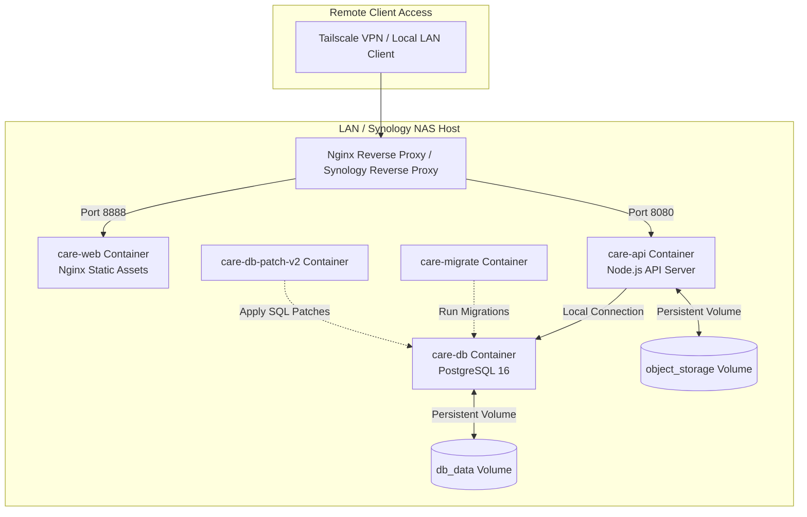

# Care Diagnostics ERP — Deployment & Operations Runbook
**Complete Synology NAS Deployment Architecture, Setup, and Disaster Recovery Procedures**

This runbook serves as the definitive reference guide for deploying, managing, and restoring the Care Diagnostics ERP on a Synology NAS server. It assumes no prior knowledge of the system and provides step-by-step instructions for rebuilding the system from scratch.

---

## 1. System Deployment Architecture

The Care Diagnostics ERP is containerized and managed using Docker Compose. The production environment is typically hosted on a local Synology NAS on the clinic's local network (LAN), accessible remotely via Tailscale.



### Network Ports Quick Reference
- **Internal Web Port**: `8888` (mapped to host)
- **Internal API Port**: `8080` (internal Docker network)
- **PostgreSQL Database Port**: `5400` (mapped to host for database tools, internal port `5432`)
- **DSM GUI**: `5000` (HTTP) / `5001` (HTTPS)

---

## 2. Shared Directory & Docker Volume Layout

On the Synology NAS, all software deployment descriptors and backups must be organized under a dedicated shared folder to ensure clean directory management:

```
/volume1/care-diagnostics/
├── deploy/                      # Main deployment folder
│   ├── docker-compose.yml       # Docker Compose service definition
│   ├── Dockerfile               # Multi-stage image build file
│   └── .env                     # Production environment variables configuration
├── backups/                     # Database export storage
│   └── daily_backups/           # Automatically generated PostgreSQL .sql dumps
└── object-storage/              # Uploaded physical files (employee photos, compliance PDFs)
```

---

## 3. Production Environment Variables Dictionary

The `.env` file located in the `/volume1/care-diagnostics/deploy` directory controls the ERP system properties. Use the table below to configure the secrets:

| Variable Name | Default / Example Value | Description |
| :--- | :--- | :--- |
| **`DB_HOST_PORT`** | `5400` | Port exposed on the Synology host to access the PostgreSQL instance. |
| **`DB_USER`** | `erp` | Username for the primary PostgreSQL connection. |
| **`DB_PASSWORD`** | *[Require Strong Secret]* | Password for the database user (Crucial to change during setup!). |
| **`DB_NAME`** | `diagnostic_erp` | The active database name. |
| **`HOST_PORT`** | `8888` | The HTTP port where the ERP public site and portal are served. |
| **`JWT_SECRET`** | *[Require 32-char Random]* | Encryption secret used to sign JWT staff session tokens. |
| **`SESSION_SECRET`**| *[Require 32-char Random]* | Encryption secret for Express cookie sessions. |
| **`INTERNAL_API_KEY`**| *[Require Hex/UUID Secret]* | Bearer key used for PACS webhooks (`erp_notify.lua` auth). |
| **`PUBLIC_BASE_URL`** | `https://caredeoghar.com` | Base URL used to formulate public patient portal and invoice links. |
| **`ALLOW_PRIVATE_IPS`** | `true` | Allows outgoing API calls to LAN endpoints (e.g. PACS, Orthanc local IPs). |
| **`ORTHANC_URL`** | `http://192.168.1.55:8042` | Connection string to the local Orthanc PACS REST API. |
| **`ORTHANC_USERNAME`**| `admin` | Username for Orthanc credentials. |
| **`ORTHANC_PASSWORD`**| *[pacs-password]* | Password for Orthanc credentials. |

---

## 4. Synology NAS Scratch Rebuild Guide
*Use these steps to stand up the entire Care Diagnostics ERP stack on a brand-new Synology NAS.*

### Step 1: Install Container Manager
1. Log into the Synology DSM web console (`http://<synology-ip>:5000`).
2. Open **Package Center**.
3. Search for **Container Manager** (on DSM 7.2+) or **Docker** (on older DSM versions).
4. Click **Install**.

### Step 2: Configure Shared Folder & File Layout
1. Open **Control Panel** → **Shared Folder**.
2. Click **Create** → **Create Shared Folder**.
3. Set the name to `care-diagnostics`. Choose a volume with at least 50 GB of free SSD/HDD storage.
4. Complete the wizard leaving default permissions.
5. Open **File Station**, navigate to `care-diagnostics`, and create a subfolder named `deploy`.
6. Upload the following files into the `deploy` folder:
   - `docker-compose.yml`
   - `Dockerfile`
   - `.env` (copied from `.env.docker.example` and configured with strong secrets).

### Step 3: Launch the Docker Stack
1. Open **Container Manager** on the Synology DSM.
2. Click **Project** in the left sidebar, then click **Create**.
3. Fill in the wizard fields:
   - **Project Name**: `care-erp`
   - **Path**: Click browse and select `/volume1/care-diagnostics/deploy`.
   - **Source**: Select **Create docker-compose.yml** (it will automatically load the uploaded file).
4. Click **Next** → **Done**.
5. Wait for Container Manager to download the images (PostgreSQL 16 Alpine, etc.) and compile the multi-stage node binaries. This takes 5–10 minutes depending on internet connection speeds.

### Step 4: Run Initial DB Migrations & Database Seeding
1. Once the project shows a green **Healthy** status, click the **Project** tab.
2. Select your project `care-erp` and click **Action** or **...** → **Run**.
3. Choose the `migrate` service from the list. This container will run the database migrations and exit automatically, creating the schemas.
4. Verify the container list in Container Manager:
   - `care-db` (Running)
   - `care-api` (Running)
   - `care-web` (Running)

2. The portal will prompt you for a **First-Time Setup PIN**.
3. Define a strong numeric PIN. This credentials profile is stored in the database.
4. Log in and navigate to **Settings** to add staff accounts and clinic settings.

---

## 5. Domain, Tailscale, SSL, and Reverse Proxy Configuration

To expose the ERP securely without exposing ports to the public internet:

### A. Tailscale Private Network Setup
1. Open **Package Center** on Synology and install **Tailscale**.
2. Open the Tailscale app on DSM and authenticate with the clinic’s admin account.
3. The NAS is assigned a stable tailnet IP (e.g., `100.65.255.115`) and a Tailscale hostname (e.g. `synology-erp.tailnet-name.ts.net`).
4. Install Tailscale on the staff computers or laptops. Staff can now access the ERP securely from home or on mobile using the private tailnet address.

### B. Synology Reverse Proxy & SSL Setup
To map requests to the correct Docker container and secure traffic via HTTPS:
1. In DSM, go to **Control Panel** → **Login Portal** → **Advanced** → **Reverse Proxy**.
2. Click **Create** and configure the rules:
   - **Source**:
     - Protocol: `HTTPS`
     - Hostname: `synology-erp.tailnet-name.ts.net` (or custom local domain)
     - Port: `443`
     - Enable HSTS (optional but recommended)
   - **Destination**:
     - Protocol: `HTTP`
     - Hostname: `localhost`
     - Port: `8888` (the `care-web` mapped port)
3. For SSL certificate issuance:
   - Go to **Control Panel** → **Security** → **Certificate**.
   - Click **Add** → **Add a new certificate** → **Get a certificate from Let's Encrypt**.
   - Input your domain name and email. Ensure port 80 is forwarded temporarily for validation, or utilize Tailscale's automated HTTPS certificates.
   - Click **Settings** and assign the newly issued certificate to your reverse proxy rule.

---

## 6. Backup Procedures

To safeguard clinic files and databases:

### A. Automated Daily DB Backup (Cron Job)
You can configure DSM to perform hot backups of the database without stopping the containers:
1. Open **Control Panel** → **Task Scheduler** on Synology DSM.
2. Click **Create** → **Scheduled Task** → **User-defined script**.
3. In the Task Wizard:
   - **Task**: `Backup-Care-ERP-DB`
   - **User**: `root`
   - **Schedule**: Daily at 01:00 AM.
4. Under **Task Settings**, paste this script into the Run Command box:
   ```bash
   BACKUP_DIR="/volume1/care-diagnostics/backups/daily_backups"
   DATE=$(date +\%Y-\%m-\%d_\%H-\%M)
   mkdir -p "$BACKUP_DIR"
   
   # Execute pg_dump inside the docker container
   docker exec care-db pg_dump -U erp -d diagnostic_erp -F c -b -v > "$BACKUP_DIR/db_backup_$DATE.dump"
   
   # Delete backups older than 30 days to save disk space
   find "$BACKUP_DIR" -type f -name "*.dump" -mtime +30 -delete
   ```
5. Click **OK** to activate the task.

### B. Synology Hyper Backup (Offsite Replication)
To protect against complete drive failures:
1. Open **Package Center** and install **Hyper Backup**.
2. Create a backup task pointing to a local USB Drive, Synology C2 Cloud, or a secondary NAS.
3. Select the complete `/volume1/care-diagnostics/` shared folder.
4. Schedule the backup task daily at 03:00 AM (after the database dump is written).

---

## 7. Restore Procedures

In the event of database corruption or data loss:

### Step 1: Stop the Application Server
To prevent half-written state records, stop the API and Web containers:
```bash
cd /volume1/care-diagnostics/deploy
docker-compose stop api web
```

### Step 2: Locate the Target Backup Dump
Navigate to `/volume1/care-diagnostics/backups/daily_backups` and select the target `.dump` file (e.g. `db_backup_2026-06-24_01-00.dump`).

### Step 3: Restore the Database Schema & Data
Run the restore utility using `pg_restore` inside the database container. This drops existing tables and restores the dump:
```bash
# Clean and restore the database using the compressed dump format
docker exec -i care-db pg_restore -U erp -d diagnostic_erp --clean --no-owner < /volume1/care-diagnostics/backups/daily_backups/db_backup_2026-06-24_01-00.dump
```

### Step 4: Run database patches (if restoring legacy database structure)
Start the patch container to ensure all schema alterations are active:
```bash
docker-compose start db-patch-v2
```

### Step 5: Start the Application Server
Restart the API and Web containers:
```bash
docker-compose start api web
```

---

## 8. Disaster Recovery (DR) Protocols

### Scenario A: Complete Hardware Failure (Synology NAS Crash)
*Goal: Re-establish the ERP on a temporary laptop or replacement NAS within 30 minutes.*

1. **Provision Replacement Host**: Get a new Synology NAS or a temporary Linux PC with Docker installed.
2. **Retrieve Hyper Backup or External USB**: Locate the latest Hyper Backup backup or copy the files from the external backup disk.
3. **Re-create Folders**: Create `/volume1/care-diagnostics/` on the replacement server.
4. **Restore Configuration**: Copy the `deploy/` directory (containing `docker-compose.yml`, `Dockerfile`, and the `.env` file) to the NAS.
5. **Start Database**: Start only the database container:
   ```bash
   docker-compose up -d db
   ```
6. **Restore Data**: Restore the latest `.dump` file using the restore procedure detailed in Section 7.
7. **Start Application**: Rebuild the stack and start the application:
   ```bash
   docker-compose up -d --build
   ```

### Scenario B: Database Volume Corruption
*Symptoms: PostgreSQL fails health checks or logs severe file read/write errors.*

1. Stop all containers:
   ```bash
   docker-compose down
   ```
2. Remove the corrupted database Docker volume:
   ```bash
   docker volume rm deploy_db_data
   ```
3. Re-create the volume and start the database:
   ```bash
   docker-compose up -d db
   ```
4. Perform the database restore using the latest daily backup `.dump` file (refer to Section 7).

### Scenario C: LAN Network Isolation (SSRF Block Bypass)
*Symptoms: The PACS server is active, but the ERP cannot fetch studies or trigger scans, throwing DNS or SSRF errors.*

1. Open the `.env` file in the `deploy` folder.
2. Ensure **`ALLOW_PRIVATE_IPS=true`** is set.
3. Verify that the NAS can ping the PACS server IP (e.g. `192.168.1.55`) inside the DSM Terminal.
4. If DNS lookup fails, configure hardcoded hosts mapping in `docker-compose.yml` or reference the PACS node by its direct IP instead of its hostname.
5. Restart the API container:
   ```bash
   docker-compose restart api
   ```
