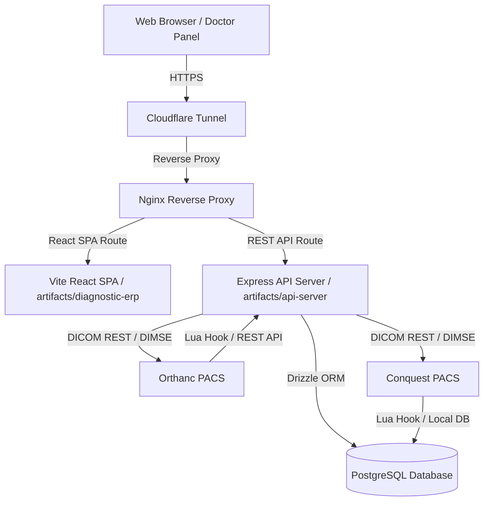

# AI Developer Handbook — Care Diagnostics ERP & PACS Ecosystem

Welcome! This handbook is designed to get a new AI agent or software engineer fully oriented in the Care Diagnostics ERP and Radiology PACS ecosystem within 15 minutes. It details the system architecture, business modules, DICOM routing pipelines, environment configurations, known pitfalls, roadmap, and safe development boundaries.

---

## Section 1: System Overview

### 1.1 Architecture
Care Diagnostics ERP is a monorepo-based healthcare enterprise application utilizing a modern TypeScript stack. It operates in a hybrid deployment environment, split between local clinic hardware (on-premise NAS) and public web access.



### 1.2 Tech Stack

#### Frontend
- **Framework**: React (Vite-based Single Page Application).
- **Location**: `artifacts/diagnostic-erp/src/`
- **Styling**: Tailwind CSS / Shadcn UI components.
- **Routing**: `wouter` for lightweight routing.
- **State Management & Queries**: TanStack React Query (`@tanstack/react-query`) for API resource caching.

#### Backend
- **Framework**: Node.js with Express.
- **Location**: `artifacts/api-server/src/`
- **Authentication**: Custom session cookie middleware backed by PostgreSQL staff session validation.

#### Database
- **Engine**: PostgreSQL.
- **ORM**: Drizzle ORM.
- **Location**: `lib/db/` (shared schemas and connections).
- **Migration Pipeline**: Drizzle Kit (`pnpm run db:generate` / `pnpm run db:push`).

#### Docker Configuration
- **Location**: Root `docker-compose.yml` and `docker/nginx.conf`.
- **Services**: Node API server, PostgreSQL database, Orthanc PACS, Conquest PACS, and Nginx.

#### Synology NAS Deployment
- The system runs on a Synology DiskStation on-premise at the clinic.
- **Path**: `/volume1/docker/caredeoghar/`
- Handles high-volume local raw DICOM binary storage while syncing reports and operational logs back to the local database.

#### Cloudflare Tunnel
- Exposes Nginx ports publicly without open WAN ports.
- Provides SSL termination and DDOS protection for doctor remote readings and online scheduling portals.

---

## Section 2: Modules

| Module Name | Purpose / Core Logic | Primary Files |
| :--- | :--- | :--- |
| **Radiology** | PACS queue monitoring, viewport launcher, reporting editor, structured findings templates, Gemini AI auto-drafts. | [RadiologyCommandCenter.tsx](file:///c:/Users/abina/caredeoghar--antigravity/artifacts/diagnostic-erp/src/pages/RadiologyCommandCenter.tsx) |
| **Billing** | Registers patients, issues invoices, tracks payment status, records cash/online splits, generates daily collection reports. | [BillingDesk.tsx](file:///c:/Users/abina/caredeoghar--antigravity/artifacts/diagnostic-erp/src/pages/BillingDesk.tsx) |
| **Reception** | Schedules appointments, queues patients, collects demographics, prints barcode labels for samples/sheets. | [ReceptionDesk.tsx](file:///c:/Users/abina/caredeoghar--antigravity/artifacts/diagnostic-erp/src/pages/ReceptionDesk.tsx) |
| **HR** | Manages staff rosters, checks in attendance via scanner/IP, processes monthly payroll summaries. | [HrManagement.tsx](file:///c:/Users/abina/caredeoghar--antigravity/artifacts/diagnostic-erp/src/pages/HrManagement.tsx) |
| **Pathology** | Records analyzer inputs, structures lab parameter reports (CBC, LFT, KFT), prints validation checksheets. | [PathologyDesk.tsx](file:///c:/Users/abina/caredeoghar--antigravity/artifacts/diagnostic-erp/src/pages/PathologyDesk.tsx) |
| **Website** | Public clinic portal for checking operating hours, services offered, contacts, and doctors. | [clinic-site/](file:///c:/Users/abina/caredeoghar--antigravity/artifacts/clinic-site/) |
| **Online Booking** | Patient self-registration portal with time-slot allocations and booking receipts. | [public-booking.ts](file:///c:/Users/abina/caredeoghar--antigravity/artifacts/api-server/src/routes/public-booking.ts) |
| **Payment Gateway** | Handles ICICI Bank/Razorpay webhooks for online bookings and invoice settlement. | [payments.ts](file:///c:/Users/abina/caredeoghar--antigravity/artifacts/api-server/src/routes/payments.ts) |
| **Inventory** | Tracks lab reagents, radiology films, and clinic consumables with low-stock alerts. | [InventoryDesk.tsx](file:///c:/Users/abina/caredeoghar--antigravity/artifacts/diagnostic-erp/src/pages/InventoryDesk.tsx) |
| **IPD / OPD** | Outpatient consultation notes and Inpatient admission sheets, bed allocation, and nurse vitals entry boards. | [IpdManager.tsx](file:///c:/Users/abina/caredeoghar--antigravity/artifacts/diagnostic-erp/src/pages/IpdManager.tsx) |

---

## Section 3: PACS Architecture & DICOM Routing

```
[Modality: CT/MRI] --(C-STORE DIMSE)--> [Conquest (AET: CONQUESTSRV)]
                                                |
                                          (Lua Hook)
                                                |
                                     [ERP DB / REST Update]
                                                v
[Modality: US/XR] --(HTTP/C-STORE)--> [Orthanc (AET: ORTHANC)] --(REST API Hook)--> [ERP API Server]
```

### 3.1 Orthanc
- **Role**: Primary DICOM storage, Web viewer backend, and WADO endpoint.
- **Port**: `8042` (HTTP API), `4242` (DICOM AET).
- **Web Interface**: Orthanc Explorer. Used primarily for X-Ray and Ultrasound studies.

### 3.2 Conquest
- **Role**: Secondary high-throughput PACS store, primarily routing local MRI and CT slices.
- **Port**: `5678` (DICOM AET).
- **Lua Hooks**: Triggered on `IncomingAssociation` and `AfterImport`. Notifies the ERP of incoming series and instance counts.

### 3.3 Viewport Integration: OHIF & Weasis
- **OHIF (Open Health Imaging Foundation)**: Zero-footprint web viewer loaded in an iframe via WADO-RS JSON metadata.
- **Weasis**: Native desktop DICOM viewer. Launched via client-side desktop protocol redirects (`weasis://url...`) for multi-gigabyte MRI/CT series reading.

### 3.4 MWL (Modality Worklist)
- Modalities query the Conquest or Orthanc worklist server using DICOM DIMSE C-FIND.
- Syncs patient name, age, accession number, and scheduled procedures directly to modality displays, eliminating manual typos.

### 3.5 DICOM Puller
- A python-based service executing C-MOVE/C-GET queries to pull external PACS archives to the local diskstation whenever a prior comparison is requested.

---

## Section 4: Important Settings

### 4.1 Configuration Locations
- **Docker Compose**: [docker-compose.yml](file:///c:/Users/abina/caredeoghar--antigravity/docker-compose.yml) — Details services, volumes, and ports.
- **Orthanc Config**: `/docker/orthanc.json` — Orthanc AE titles, paths, database plugins, and peers.
- **Conquest Config**: `/conquest/dicom.ini` — Storage paths, Lua hook scripts, database connections.
- **Nginx Config**: [docker/nginx.conf](file:///c:/Users/abina/caredeoghar--antigravity/docker/nginx.conf) — Proxy paths for backend api (`/api/`) and OHIF (`/ohif/`).

### 4.2 Core Environment Variables (`.env`)
- `DATABASE_URL`: Postgres DB connection string.
- `PORT`: Express API server listening port.
- `ORTHANC_URL`: HTTP REST API endpoint for Orthanc.
- `CONQUEST_URL`: Conquest service endpoint.
- `OHIF_URL` / `WEASIS_URL`: Web path locations for launching viewports.

### 4.3 Database Settings Table (`pacs_settings`)
- All network parameters (IP addresses, Port values, AE Titles) are saved inside the `pacs_settings` table. 
- **CRITICAL**: The application must fetch settings dynamically from this table, falling back to `.env` variables or source-code defaults only if the table is empty.

---

## Section 5: Known Pitfalls & Debugging

- **Network IP Mismatch**: The clinic local IP range frequently conflicts if static configurations hardcode `172.16.1.139` vs `192.168.1.137`. Always verify the network setup via the **Radiology Network Control Center** dashboard.
- **DICOM UID Collisions**: Modalities generating random accession numbers instead of the ERP-allocated prefix (`CD-YYYYMMDD-XXXX`) will fail worklist matching.
- **Weasis Protocol Handler Mute**: If Weasis launch fails, check if the client machine has registered the `weasis://` URL handler. If missing, show the troubleshooting prompt.
- **Lock Takeover Overwrite**: Do not allow simultaneous report editing. If a user bypasses the lock overlay, audit logs will record a `CONCURRENT_EDIT_TAKEOVER` incident.

---

## Section 6: Current Roadmap

### Implemented
- [x] Radiology Network Control Center topology health monitoring.
- [x] Multi-study merge preview UI and rollback capabilities.
- [x] Configurable Chocolate Box findings density/layout states.
- [x] Starred findings, personal macros, and lightweight usage analytics.

### In Progress
- [ ] Direct automated MWL population directly from billing receipts.
- [ ] Integration of local AI inference models (Ollama/Llama3) for offline draft compilation.

### Planned
- [ ] Synology disk alert notification relays via SMS/WhatsApp webhooks.
- [ ] Multi-tenant patient portal with integrated report sharing.

---

## Section 7: Safe Development Rules

> [!CAUTION]
> **Strict Operational Boundaries for AI Agents:**
> 1. **Never Hardcode IP Addresses/AE Titles**: Do not hardcode values like `192.168.1.137` or `5678`. Read them dynamically from `pacs_settings` or environment fallbacks.
> 2. **Never Seed Overwrite Custom Settings**: DB seeding scripts must check for existing entries and use `ON CONFLICT DO NOTHING` statements to preserve custom on-premise configurations.
> 3. **Never Directly Overwrite Drafts on Merge**: Multi-study merge must always present a preview-first modal offering "Apply to Draft" and "Cancel" buttons, with a valid cache for rollback.
> 4. **No Heavy Log Queries**: Do not perform telemetry/log queries on keystrokes. Use React Query caching models and trigger fetches only upon interface panel expansion.
