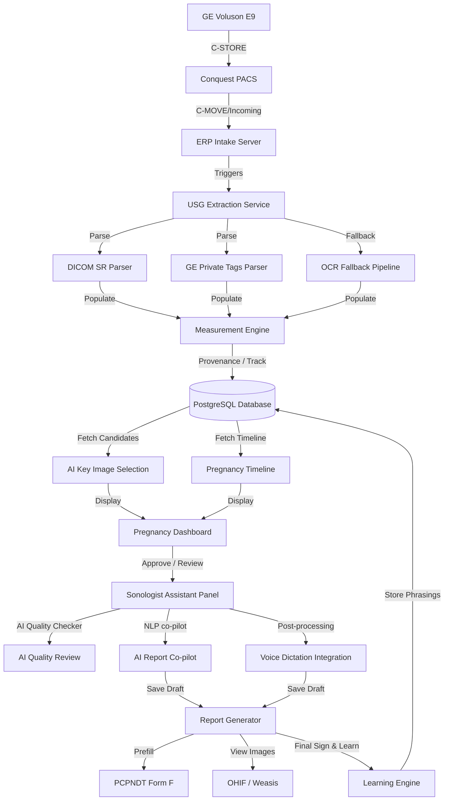

# USG & Doppler Module Master Documentation

## 1. Executive Summary
The USG and Doppler Module in Care Diagnostics ERP is a production-grade system supporting GE Voluson E9 image push ingestion, automatic DICOM structured report (SR) extraction, private tags resolution, OCR fallbacks, PCPNDT Form F regulatory prefill, interactive progression timeline steppers, AI-ranked key image selections, quality validation alerts (impossible values, L/R mismatches, GA/EDD discrepancies), NLP co-pilot editing assistants, post-dictation voice formatting, and adaptive template learning.

---

## 2. Overall Architecture & Workflow
The module operates on a pipeline extending from direct equipment capture to finalized reporting and regulatory archiving:

---

## 3. Database Schema Mapping
- **`pregnancy_episodes`**: Groups serial scans into 280-day intervals.
- **`fetal_usg_studies`**: Tracks scan metadata, LMP, composite GA, EDD, and chronological sequence index.
- **`fetal_usg_measurements`**: Holds biometric parameters (CRL, BPD, HC, AC, FL, AFI, FHR, Doppler RI/PI).
- **`usg_key_images`**: Stores AI ranking candidates, thumbnail indexes, and approval/rejection flags.
- **`usg_audit_log`**: Immutable audit logs capturing every user/AI action.
- **`radiologist_learning_settings`**: Toggles phrase template learning per radiologist (staff).
- **`radiology_memory_phrases`**: Stores phrases automatically indexed from final approved reports.

---

## 4. Backend API Routes
- Mounted under `/api/fetal-usg-dashboard`:
  - `GET /timeline/:patientId`: Generates scan sequences.
  - `GET /growth-charts/:patientId`: Retrieves serial data for Recharts plotting.
  - `GET /key-images/:studyId`: Fetches AI ranked images.
  - `POST /key-images/:id/approve` / `/reject` / `/replace`: Manages image lock states.
  - `GET /comparison/:studyId`: Compares current biometrics to prior study.
- Mounted under `/api/radiology-copilot/sonologist-assistant`:
  - `GET /checklist/:studyId`: Identifies missing values based on study type.
  - `GET /quality-review/:studyId`: Performs validation scans (mismatches/impossible values).
  - `POST /generate-drafts`: Synthesizes drafts.
  - `POST /copilot-action`: Invokes NLP grammar/terminology standardizers.
  - `POST /voice-integration`: Post-processes voice text.
  - `GET/POST /learning-settings` and `/learn`: Handles radiologist preferences and triggers template snippet ingest.

---

## 5. UI Layout
- **Pregnancy Dashboard Component**: Contains Tabs for Timeline vertical steppers, Growth Charts (using Recharts), Key Images workstation, and AI progression comparison highlights. Mounted under `/usg/pregnancy-dashboard`.
- **AI Sonologist Assistant Panel**: Rendered side-by-side with the editor textareas inside the report draft workspace. Features Clinical assistant, Quality checker, Co-pilot formats, and Voice dictation tools.
