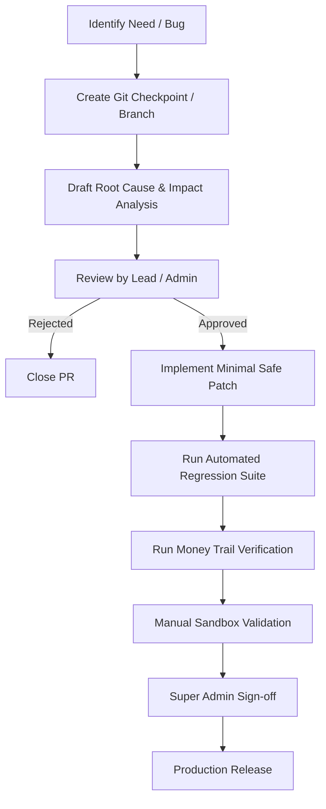

# Financial Change Control Policy
## Care Diagnostics ERP Production Governance

Any modification to files, APIs, database schemas, or logic designated as financially critical must undergo the formal Change Control workflow detailed here. No ad-hoc modifications are permitted.

---

## 1. Change Request Workflow



---

## 2. Change Control Template
Every Pull Request affecting a financial module must include the following completed questionnaire in its description:

### Section A: General Info
*   **Request Title**:
*   **Target Files**:
*   **Requestor**:

### Section B: Technical & Logical Impact
1.  **Root Cause Analysis**: Why is this change necessary? What specific bug or requirement does it address?
2.  **Impact Analysis**:
    *   **Affected Modules**: Which billing or reporting pages are touched?
    *   **Database Impact**: Are any columns added, renamed, or constraints altered?
    *   **API Impact**: Are any response payloads or request validators changed?
    *   **Dashboard Impact**: Does this affect outstanding, sales, or collection metrics?
    *   **Daily Summary Impact**: Does this change how cashier closing balances are computed?
    *   **Historical Report Impact**: Does this change totals returned for prior dates?

---

## 3. Mandatory Testing Protocol

Before a merge can occur:
1.  **Vitest Run**: Re-run the core tests:
    ```bash
    $env:DATABASE_URL="postgres://..."
    pnpm test
    ```
2.  **Typecheck**: Verify full compile safety:
    ```bash
    pnpm run --filter api-server typecheck
    ```
3.  **Sanity Check**: Run Books Sanity verification:
    ```
    GET /api/books-sanity
    ```
    Confirm zero anomalies or ledger imbalances exist after the patch is applied.
