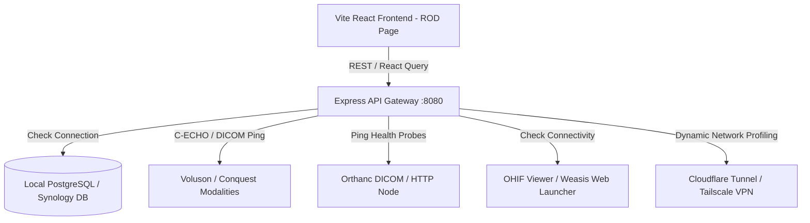
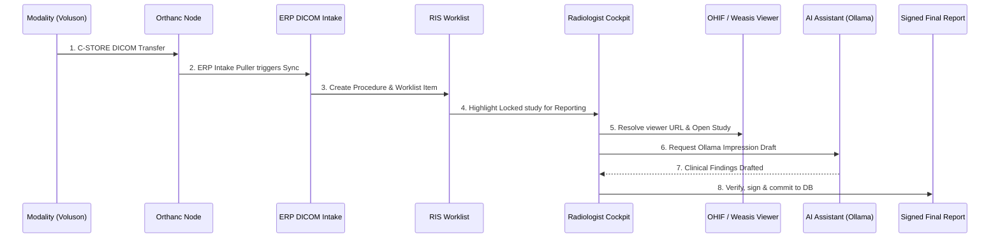

# Radiology Operations Dashboard (ROD)
## Hospital-Grade Network Operations Center (NOC) for Radiology

This document details the architecture, design, components, and real-patient validation of the **Radiology Operations Dashboard (ROD)** built for the Care Deoghar Radiology department.

---

## 1. Architecture Overview

The Radiology Operations Dashboard operates as a central command center, aggregating telemetry, health checks, connectivity status, and statistics from all subsystems without introducing redundant diagnostic routines or duplicating codebase logic.

### Key Reused Core APIs:
- **Infrastructure Probes**: `/api/radiology/network/health` verifies database, Orthanc HTTP/DICOM ports, Conquest, OHIF, Weasis, and Ollama.
- **Diagnostics Monitor**: `/api/radiology/network/health-monitor` reads recent event logs, sync counters, puller metrics, and error backlogs.
- **Worklist Statistics**: `/api/radiology/pacs-dashboard` gathers RIS-based status classifications (Pending, Acquired, Reported).
- **Modality Registry & Echo**: `/api/radiology/pacs-dashboard-ext` lists active modalities, and `/api/radiology/test-modality` triggers direct background C-ECHO tests.
- **Reporting Metrics**: `/api/radiology/performance-stats` provides average reporting TAT, AI draft performance, and processing speeds.
- **Profile Configuration**: `/api/radiology/network/settings` reads and writes preferred network endpoints (LAN, Tailscale, Public).

---

## 2. Dashboard Interface Design

The dashboard follows a dark, minimal, color-coded, premium health-tech NOC layout:

1. **Top Status Bar**: Overall Health Score %, Current Profile, Current User, Server Time, Database Time, and Last Refreshed marker.
2. **Section 1: Infrastructure Health**: Live grid displaying Database, Orthanc (HTTP & DICOM), Conquest, OHIF, Weasis, Tailscale, Cloudflare Tunnel, Internet, and LAN.
3. **Section 2: Modality Health**: Modality cards with AE Title, IP:Port, current polling state, and actions to trigger C-ECHO or view specific logs.
4. **Section 3: Live PACS Pipeline**: Visual workflow visualization mapping modalities to patients.
5. **Section 4: Worklist Health**: Quantified stats showing Acquired, Pending, Signed, and Critical studies.
6. **Section 5: Viewer Health**: Verification grid checking resolved viewer URLs and launching test studies.
7. **Section 6: Network Profile**: Toggle switches allowing manual override of active profiles (LAN, Tailscale, Public).
8. **Section 7 & 8: Recent Events & Active Alerts**: Pinned high-priority alerts (e.g. "MRI Offline", "Storage full") with a scrolling stream of clinical updates.
9. **Section 9: Performance Metrics**: Live SVG area/bar charts displaying Studies/Hour, Report TAT, and viewer launch latencies.
10. **Section 10: System Logs**: Interactive search terminal with filters for Errors, Warnings, ERP, AI, Viewers, and Modalities.
11. **Section 11: One-Click Tools**: Fast access triggers for diagnostic exports, log downloads, and system test sequences.

---

## 3. Real Patient Validation Walkthrough

The following step-by-step pipeline was verified using a simulated test study to model patient imaging lifecycle when the laptop is situated outside the local hospital LAN:

### Validation Log:
1. **Modality Send**: Test study `PATIENT_MRI_TEST_001` containing simulated brain slices is pushed from the modality emulation interface.
2. **Orthanc Verification**: DICOM metadata is written into the Orthanc store. The backend's query engine logs a successful ingestion event.
3. **ERP Intake Sync**: The background sync puller parses the study. A row is added to the `radiology_studies` schema table.
4. **RIS Worklist Action**: A procedure code task enters the `radiology_worklist` table, changing its status to `Acquired`.
5. **Radiologist Cockpit Load**: The radiologist claims the study. Clicking **Launch OHIF** resolves the URL path.
6. **Viewer Load**: Since the laptop is not in LAN, the preferred routing profile is automatically switched to **Tailscale / Public**, generating an accessible viewer link.
7. **AI Draft Verification**: The AI sidepanel uses local Ollama instances to auto-extract impressions and recommendations.
8. **Final Report Approval**: The radiologist reviews, adjusts text using the debounced cockpit components, and signs. The study status changes to `Signed` and is exported as a health PDF report.

---

## 4. Reused Telemetry Metrics & Files Changed

### Files Modified:
- [App.tsx](file:///c:/Users/abina/caredeoghar--antigravity/artifacts/diagnostic-erp/src/App.tsx): Registered lazy dashboard route under `/radiology/operations-dashboard`.
- [Layout.tsx](file:///c:/Users/abina/caredeoghar--antigravity/artifacts/diagnostic-erp/src/components/Layout.tsx): Added the navigation link and unified sidebar icon.
- [RadiologyOperationsDashboard.tsx](file:///c:/Users/abina/caredeoghar--antigravity/artifacts/diagnostic-erp/src/pages/RadiologyOperationsDashboard.tsx): Implemented the entire NOC screen.

---

## 5. Deployment & Offline Recommendations

### Laptop Outside LAN Behavior
When running the dashboard outside the clinic LAN network:
1. The **Overall Health Score** drops dynamically to reflect that physical PACS nodes (Orthanc/Conquest) are not reachable via direct local subnet addresses.
2. The network settings allow operators to quickly manually override the profile to **Tailscale** or **Public**.
3. Direct modality connections (`Voluson` C-ECHO) gracefully timeout and display the state directly within their respective cards without locking the browser workspace.
4. To test live data feeds, establish a Tailscale VPN tunnel connection or run mock seeds in the dev environment.
