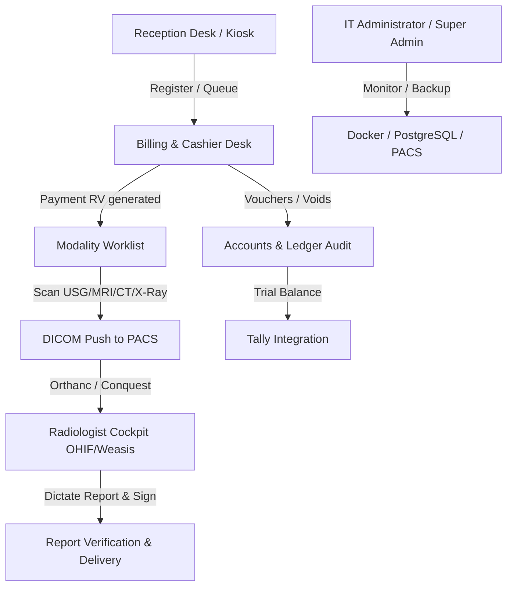

# Care Diagnostics ERP Hospital SOP Manual
## Standard Operating Procedures & Operations Guide

This manual is the official **Standard Operating Procedure (SOP) & Operations Handbook** for Care Diagnostics. It defines daily workflows, role-specific tasks, emergency protocols, and governance policies for all clinical, administrative, and technical operations.

---

## 1. Document Control & Scope

*   **Target Audience**: Receptionists, billing staff, cashiers, imaging technicians, radiologists, pathologists, accountants, and IT administrators.
*   **Effective Date**: June 2026 (Live Release v1.0)
*   **Objective**: Standardize front-office, backend, and clinical imaging workflows to minimize operational errors, achieve perfect financial accounting audit trails, and prepare the hospital for NABH compliance.

---

## 2. Departmental Mapping & Hierarchy

---

## 3. General SOP Policies

1.  **Strict ID Verification**: No patient may be registered without verifying phone number and spelling to avoid duplicate master patients.
2.  **No Payment Bypass**: Modalities will not execute scans unless the payment status in the ERP is set to `paid` or explicitly authorized as `VIP/Corporate` under supervisor credentials.
3.  **Voucher Auto-Generation**: Every transaction (payments, voids, refunds) must generate corresponding double-entry ledger lines immediately.
4.  **Disaster Recovery Readiness**: IT staff must run the daily automated backup verification drills inside the sandbox docker containers to ensure recovery capability.
