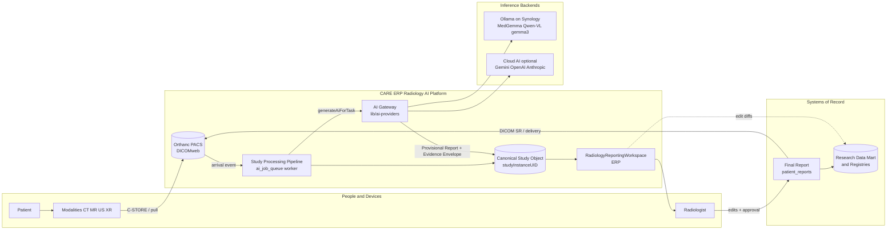

# 00 — Executive Summary: CARE ERP Radiology AI Platform

**Purpose.** This is the entry point to the 20-file master architecture blueprint for the CARE ERP Radiology AI Platform. It states the vision, shows how the design slots into the existing Platform Constitution without violating it, gives a one-paragraph statement of the target architecture, contrasts what already exists against what we add, names the 6–8 headline decisions (each deferred to `19-critical-decisions-before-coding.md` for the locked ruling), draws the C4-style context diagram, and hands the reader a guide to the other 19 files. It is deliberately executive: every downstream section owns its detail; this file owns coherence.

---

## 1. Vision

Every imaging study that arrives in the platform gets an **AI-generated structured Provisional Report before the radiologist opens it.** When the radiologist opens the Canonical Study Object in `RadiologyReportingWorkspace.tsx`, the draft, its measurements, its prior-comparison, and its evidence are already assembled and waiting. The radiologist reads, edits, and **always approves** — the AI is an expert assistant that advises, never the final authority that signs.

This vision is bounded by three non-negotiable invariants, all of which already exist in the codebase and must be preserved and hardened, never loosened:

1. **AI never auto-signs.** The explicit guard in `aiReporting.ts` and the universal *"AI Draft — Requires Radiologist Review"* labeling stay. The draft state machine becomes **server-enforced** rather than string-convention.
2. **The radiologist is the sole author.** Every AI-originated span must be traceable and distinguishable from radiologist-authored text (today `insert-to-report` writes no provenance marker — closing that gap is a headline decision).
3. **Deterministic before AI.** The Universal Measurement Registry (`lib/measurements`), the Quality Engine (`lib/report-quality`), the Comparison engine (`radiologyComparison.ts`), and the ~20 self-registering Copilot modules run first; the AI drafts *on top of* deterministic ground truth, not instead of it.

The vision is not "autonomous radiology." It is a **zero-cold-start reading room**: the radiologist's first action is a decision, not a blank page.

---

## 2. Honoring the Platform Constitution

The AI architecture is an **application on the frozen Reporting Platform (v1.0)**, not a parallel system. Each of the seven governing principles maps to a concrete design commitment:

| Constitution principle | How this architecture honors it |
|---|---|
| **1. One Workspace** | All AI output surfaces inside the single `RadiologyReportingWorkspace.tsx`; no new reading surface is created. |
| **2. One Engine** | One **Study Processing Pipeline** and one **AI Gateway**; the ERP never learns which model answered. |
| **3. Content over Code** | **Organ Companions** self-register like Copilot modules; clinical behaviour lives in `knowledge_packs`, the measurement catalog, and rule registries — engines only interpret. |
| **4. Deterministic Before AI** | `lib/measurements` + `lib/report-quality` + comparison run first; AI consumes their output. |
| **5. AI Advises, Humans Decide** | AI-never-auto-signs invariant; radiologist approval is a hard, server-enforced gate. |
| **6. Backward Compatibility** | No-delete / strangler migrations; `ai_job_queue` becomes the real queue (not a new table); `patient_reports.body` stays frozen and content-hashed at sign. |
| **7. Measure Before Building** | The **Feedback Ledger** measures suggestion-vs-edit diffs; the **Research Data Mart** measures outcomes — before any retraining is ever proposed. |

Two constitutional guardrails are load-bearing enough to restate: the fail-CLOSED **PCPNDT Form-F gate** (`checkPcpndtFormFCompliance`) remains a single shared implementation on every finalize path, and the hash-chained **`audit_logs`** trail (`auditLog()`, advisory-lock serialized) is extended via `radiology_ai_review_audits` — the AI layer never forks a parallel audit store.

---

## 3. Target Architecture (one paragraph)

The target architecture introduces a single **Canonical Study Object** keyed by `studyInstanceUID` (reconciling the three living study tables — `radiology_studies`, `radiology_worklist`, `dicom_studies` — behind one identity and crosswalk) as the aggregate everything revolves around; a **Study Processing Pipeline** (the real worker finally consuming the existing `ai_job_queue`) that drives each study through an enforced state machine from arrival to **Provisional Report**; an **AI Gateway** (the hardened evolution of `lib/ai-providers`' `generateAiForTask`/`resolveTaskRoute` seam, with JSON-contract enforcement, retries, and unified Gemini/Ollama paths) that the ERP calls without knowing the model; a fleet of independently registered **Organ Companions** (Brain, Spine, Chest, …) that assemble region-specific prompts from `radiology_memory`, `radiology_lesions`, and organ-intelligence context and emit structured JSON conforming to `docs/STRUCTURED_REPORT_JSON_SPEC_v1.md`; a canonical **Measurement Engine** with typed **Measurement Provenance** feeding the immutable measurements registry; an **Evidence Envelope** carrying confidence/evidence/images/measurements/reasoning for explainability; a **Feedback Ledger** capturing radiologist edits without auto-retraining; and a **Research Data Mart** built only from finalized structured reports — all governed by the frozen Reporting Platform, its Quality Engine, and its hash-chained audit trail, so that a human radiologist always approves the final report before it flows to PACS/registry.

---

## 4. What Exists vs What We Add

The recon is unambiguous: the current stack is **a thin synchronous prompt-proxy with strong governance scaffolding but no execution engine.** We build the engine *behind* the existing `generateAiForTask()` seam so callers stay unchanged.

| Concern | What exists today | What we add |
|---|---|---|
| **Provider abstraction** | `lib/ai-providers`: 4 providers (OpenAI/Gemini/Anthropic/Ollama), encrypted keys, task routing via `ai_model_routes` + `AI_TASK_CATALOG` | **AI Gateway**: JSON-contract enforcement, retry/backoff, health-fed routing/failover, unified Gemini + Ollama paths (`04`) |
| **Job queue** | `ai_job_queue` table (correct shape) — CRUD only, **no worker** | **Study Processing Pipeline** worker that dequeues → drafts → writes `result_json` (`05`, `07`) |
| **GPU / scheduling** | `AiInferenceSettings.tsx` + `pacs_settings(ai_inference)` persist config, **nothing consumes it** | GPU scheduling, priorities/STAT/VIP/emergency, night processing wired to the real queue (`07`) |
| **Study identity** | 3 overlapping tables; `patient_reports.studyId` overloaded, no discriminator | **Canonical Study Object** + crosswalk + typed report linkage (`03`) |
| **Structured output** | Providers return raw `{text}`; ad-hoc `match/JSON.parse` everywhere | Schema-validated `AiQueryResult`, structured-JSON-first generation → canonical engine (`04`, `06`) |
| **Organ intelligence** | Passive CRUD tables; memory never injected into prompts | **Organ Companions** framework: 12 modules, memory→prompt feedback loop (`09`) |
| **Measurement provenance** | Provenance fragmented across 4+ tables, inconsistent types | One typed **Measurement Provenance** adopted by registry + all stores (`11`) |
| **Explainability** | Confidence bands are design-only; no calibration store | **Evidence Envelope** with confidence/evidence/heatmaps/reasoning (`12`) |
| **Learning** | `radiology_memory` counters, deterministic ranking, never fed back | **Feedback Ledger**: suggestion-vs-edit diffs, **no auto-retrain** (`08`) |
| **Research** | Ad-hoc `ai_training_data_exports` | **Research Data Mart** from finalized structured reports (`13`) |
| **Safety** | AI-never-auto-signs convention; USG-only hard block; segment provenance absent | Server-enforced state machine, segment-level AI provenance, converged quality gates (`14`, `15`) |

Everything in the right column is **additive within the 🟡 Radiology zone** and behind `ff_radiology_*` server flags, shadow-first.

---

## 5. Headline Architectural Decisions

These are the 6–8 decisions that shape everything else. Each is stated here as intent; the **locked ruling, alternatives, and rationale live in `19-critical-decisions-before-coding.md`** and must be resolved before additional coding.

1. **Canonical Study Object anchored on `studyInstanceUID`.** `radiology_studies` remains the billing spine, `radiology_worklist` the reporting/queue spine; a crosswalk unifies identity and a discriminator fixes `patient_reports.studyId` overloading. → `19` §D1, detail in `03`.
2. **Build behind the `generateAiForTask` seam.** The AI Gateway keeps the existing task-routing contract; the queue/GPU worker sits behind it so callers never change. → `19` §D2, detail in `04`/`07`.
3. **`ai_job_queue` becomes the real pipeline — no new table.** Its existing columns (`studyId`, `jobType`, `priority`, `retryCount`, `gpuMode`, `confidenceScore`, `result_json`, `humanOverridden`) are the queue; we write the missing worker. → `19` §D3, detail in `05`.
4. **Structured-JSON-first, contract-enforced generation.** Every structured AI call validates against a schema (provider `response_format` where supported, zod + repair loop elsewhere) conforming to `docs/STRUCTURED_REPORT_JSON_SPEC_v1.md`. → `19` §D4, detail in `06`.
5. **Organ Companions via self-registration (Content over Code).** Per-region modules register by side-effect import like Copilot modules; zero core edits to add an organ. → `19` §D5, detail in `09`.
6. **Server-enforced draft state machine + segment-level AI provenance.** Draft→inserted→approved becomes DB-enforced; every AI-originated span is marked so signed text is never AI-vs-human ambiguous. → `19` §D6, detail in `14`.
7. **Consolidate the dual stacks before extending.** Unify the two Gemini paths (`@google/generative-ai` registry vs env `@google/genai`) and the two Ollama paths (registry `/v1` vs `radiologyOllama.ts` native `/api/generate`) so vision, keys, and config stop diverging. → `19` §D7, detail in `04`.
8. **Learning without auto-retrain.** The Feedback Ledger records diffs and the Research Data Mart aggregates finalized reports; **no model retrains itself** — humans decide when data becomes training data. → `19` §D8, detail in `08`/`13`.

---

## 6. System Context (C4-style)

The flow reads left to right: patients are scanned on **modalities** → images land in **Orthanc** → the **Study Processing Pipeline** materializes the **Canonical Study Object** and calls the **AI Gateway** → local (Ollama on the Synology NAS via Tailscale) or optional cloud models produce a **Provisional Report + Evidence Envelope** → the **ERP workspace** presents it to the **radiologist** → the radiologist approves the **Final Report** → which flows to PACS as DICOM SR and to the Research Data Mart. AI advises inside the dotted and gateway paths; the human sits on the only path that produces a final report.

---

## 7. Reader's Guide to the Other 19 Files

| File | What it locks down |
|---|---|
| `01-current-state-and-simplification.md` | Existing workspace sufficiency review + concrete simplification plan |
| `02-enterprise-and-service-architecture.md` | Enterprise/component/service diagrams, integration, scalability |
| `03-canonical-data-model.md` | Canonical Study Object, ER model, DB recommendations |
| `04-ai-gateway.md` | Provider abstraction, routing, JSON contracts, resilience |
| `05-study-pipeline-and-dataflow.md` | Lifecycle state machine, data-flow + end-to-end sequence diagrams |
| `06-ai-report-generation.md` | Structured-JSON-first generation → canonical engine conversion |
| `07-orchestration-and-night-processing.md` | Queue, retries, GPU scheduling, STAT/VIP/emergency priorities |
| `08-learning-and-feedback-system.md` | Feedback Ledger; suggestion-vs-edit diffs; no auto-retrain |
| `09-organ-companions.md` | 12 Organ Companions framework + per-organ specs |
| `10-prior-comparison-and-timeline.md` | Prior comparison, progression/regression/stable, timeline |
| `11-measurement-engine.md` | Canonical Measurement Engine + Measurement Provenance |
| `12-explainability.md` | Evidence Envelope: confidence/evidence/images/heatmaps/reasoning |
| `13-research-database.md` | Research Data Mart, registries, ML datasets |
| `14-safety-risk-and-failure-recovery.md` | Safety safeguards, risk analysis, failure recovery |
| `15-security-model.md` | PHI, authz, encryption, audit, network trust, model governance |
| `16-performance-and-scalability.md` | Performance + single→multi-hospital→cloud/edge/hybrid scaling |
| `17-api-and-folder-architecture.md` | API architecture + folder/service structure for new modules |
| `18-roadmap.md` | 3-year / 5-year / 10-year roadmap |
| `19-critical-decisions-before-coding.md` | The decisions to lock before any further coding |

**Suggested reading order.** Architects: `00 → 19 → 03 → 04 → 05`, then breadth. Coding agents implementing a slice: `00 → 19` for the locked decisions, then the single feature file (`06`–`13`) plus its dependencies, always cross-checking `14`/`15` before touching a finalize or audit path.

---

## Cross-references

- `19-critical-decisions-before-coding.md` — the locked rulings for every headline decision in §5
- `01-current-state-and-simplification.md` — the ground-truth baseline this summary compresses
- `03-canonical-data-model.md` — the Canonical Study Object referenced throughout
- `04-ai-gateway.md` — the hardened evolution of `lib/ai-providers`
- `05-study-pipeline-and-dataflow.md` — the Study Processing Pipeline and its state machine
- `14-safety-risk-and-failure-recovery.md` — the AI-never-auto-signs invariant and provenance enforcement
- `15-security-model.md` — PHI, audit-chain, and model governance the vision depends on
- `docs/reporting-platform/CARE_REPORTING_PLATFORM_ARCHITECTURE_V1.md` — the frozen Platform Constitution this architecture slots into
- `docs/STRUCTURED_REPORT_JSON_SPEC_v1.md` — the structured-report JSON contract all generation targets
