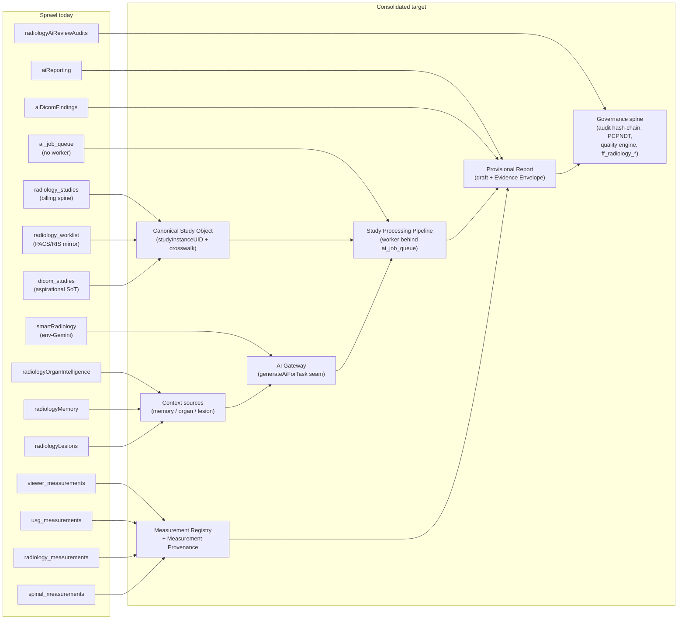

# 01 — Current State & Simplification (Goal 1 / Deliverable 16)

**Purpose.** This section audits what already exists in the radiology + AI surface of Care ERP, judges whether it is a sufficient foundation for the AI-first vision, and lays down a concrete, strangler-safe simplification plan. It is deliberately honest: the platform has *excellent governance scaffolding and a genuinely canonical workspace*, but it is drowning in overlapping schema and duplicate execution paths that will make the AI architecture impossible to reason about unless we consolidate first. Per **Principle 7 (Measure Before Building)** and **Principle 6 (Backward Compatibility)**, nothing below proposes deletion; every move is a strangler migration that leaves the old surface intact until the new spine is proven. This is the map that every sibling document (02–19) builds on top of — it names the sprawl so the rest of the blueprint can name the target.

---

## (a) Verdict: is the current workspace + study handling sufficient?

**Verdict: the *workspace* is sufficient and should be preserved; the *study identity* and the *AI execution layer* are NOT sufficient and are the two things that must be fixed before any new AI feature is built.**

Breaking that into the three things that matter:

1. **The reporting workspace — SUFFICIENT, keep it.** `artifacts/diagnostic-erp/src/pages/RadiologyReportingWorkspace.tsx` (~5.8k–6k lines) is already the *One Workspace* the Platform Constitution demands. Its finalize path is centralized in `lib/radiologyReportLifecycle.ts`; its queue logic is cleanly separated into pure functions (`lib/reportingWorkflow.ts` + `useReportingWorkflow`); its Copilot is a self-registering plug-in registry (`copilotOrchestrator` + ~20 modules); study launch is one control (`OpenStudyPanel` → `studyLaunchService`). The AI-first vision does **not** need a new workspace — it needs this one decomposed into the panel components it already imports. The 5.8k-line file is a maintainability risk, not an architectural one. **Do not rewrite it; strangle it into modules.**

2. **Canonical study handling — INSUFFICIENT, this is the #1 blocker.** There is no single study object. A study is smeared across three primary tables with conflicting identity rules — `radiology_studies` (the billing/order/financial spine, the de-facto production spine, `accessionNumber` unique, supplying the integer `study_id` surrogate used by orders/bills/patient_reports/`ai_job_queue`), `radiology_worklist` (the PACS-pushed reporting/queue spine, `studyInstanceUID` nullable + partial-unique, `accessionNumber` explicitly non-unique, and the row id that *is* the workspace `:studyId` route param), and `dicom_studies` (self-labels "single source of truth" and is still only aspirational in adoption — ~5 routes — yet it is in fact the imaging-identity registry and the `studyInstanceUID` uniqueness authority, `study_instance_uid` being notNull + unique). Identity therefore anchors on `studyInstanceUID` via the new `canonical_study` crosswalk (see `03-canonical-data-model.md`), never on any one of these three tables. The most dangerous defect: `patient_reports.studyId` is **overloaded with no discriminator** — it holds `radiology_studies.id` on the billing/USG path (`careUsgCompanion.ts`, `teleradiology.ts`) but `radiology_worklist.id` on the RIS/AI path (`aiReporting.ts:1041`). Downstream tables each key off a *different* one of these (`radiology_critical_findings` by studyId, `critical_findings` by reportId+worklistId; `radiology_tat_tracking` by studyId, `turnaround_times` by worklistId). An AI pipeline cannot attach a provisional report, an evidence envelope, or a feedback diff to a study whose identity is ambiguous. The **Canonical Study Object** (defined in `03-canonical-data-model.md`) is the precondition for everything else.

3. **The AI execution layer — INSUFFICIENT, it is a prompt-proxy, not an engine.** The current stack (`lib/ai-providers`, `aiReporting.ts` ~60 endpoints) is a *synchronous, blocking* LLM-prompting layer. `ai_job_queue` exists with exactly the right columns (studyId, jobType, priority, retryCount, gpuMode, result_json, humanOverridden) but has **no worker** — nothing dequeues `queued → processing`. The GPU inference config (`AiInferenceSettings.tsx` → `pacs_settings`) persists batchSize/concurrency/warmUp but nothing consumes it. There is **zero JSON-contract enforcement** — every structured consumer hand-rolls `match(/\{[\s\S]*\}/) + JSON.parse` with silent fallback. And the "learning" tables (`radiology_memory`, `radiology_lesions`, organ-intelligence) are pure deterministic CRUD whose counters are **never injected back into generation prompts**. The good news: the clean seam already exists — `generateAiForTask()` / `resolveTaskRoute()` / `AI_TASK_CATALOG` / `ai_model_routes`. The **AI Gateway** and **Study Processing Pipeline** slot *behind* that seam (see `04-ai-gateway.md`, `05-study-pipeline-and-dataflow.md`).

**Bottom line:** we are not starting from zero and we are not starting from a mess of bad code — we are starting from a strong-but-sprawling substrate. The AI-first vision is achievable *only if* we first collapse the sprawl into one study spine, one AI seam, one canonical finding/measurement entity, and one report document. Build order: **identity → execution seam → consolidation → features.**

---

## The overlapping clusters (what it is · why it sprawled · consolidation target)

The 140+ Drizzle schema modules contain several clusters where the same concept was implemented multiple times. For each: what it is, why it sprawled, and where it consolidates.

### Cluster 1 — AI reporting stores: `aiReporting` vs `aiDicomFindings` vs `smartRadiology` vs `radiologyOrganIntelligence` vs `radiologyMemory` vs `radiologyLesions` vs `radiologyAiReviewAudits`

- **`aiReporting`** (`ai_provider_settings`, `ai_reporting_drafts`, `ai_reporting_audit_logs`, `ai_quality_scores`) — the mainline registry-backed AI draft + audit store. **This is the survivor.**
- **`aiDicomFindings`** (`ai_dicom_findings`) — a parallel AI-finding review workflow (pending → accepted/rejected) that predates the draft model. *Sprawled* because DICOM-derived findings were modeled separately from text drafts before the draft lifecycle existed.
- **`smartRadiology`** (`ai_impressions`, `report_quality_checks`, `report_translations`, `follow_up_recommendations`, `sonographer_drafts`, `smart_routing_rules`) — a *second* AI generation path driven by the env-keyed Gemini helper (`lib/integrations-gemini-ai`), bypassing the provider registry entirely. *Sprawled* because a quick Gemini integration was bolted on outside `generateAiForTask()`.
- **`radiologyOrganIntelligence`** (`radiology_spine_sessions/_levels`, `radiology_brain_sessions`, `radiology_tumor_followups`) — passive structured-capture CRUD; **no LLM runs here.** *Sprawled* as per-organ tables authored ahead of the **Organ Companion** framework that would have unified them.
- **`radiologyMemory`** (8 tables: patterns/measurements/classifications/phrases/impressions/decisions/feedback/usage) — deterministic frequency-ranked suggestion engine; counters never reach a prompt. *Sprawled* as a learning engine built before there was a generation loop to feed.
- **`radiologyLesions`** (`radiology_lesions`, `radiology_lesion_timeline`, `radiology_measurements`, `viewer_measurements`) — longitudinal lesion registry + the fullest-provenance measurement table. *Sprawled* because lesion tracking and measurement storage were co-located.
- **`radiologyAiReviewAudits`** (`radiology_ai_review_audits`, Phase 10C) — per-AI-review provenance (providers queried + radiologist winner), retained ≥7yr. **This is the AI-decision audit survivor.**

**Why the whole cluster sprawled:** each AI capability was added as its own table island before a unifying execution engine or canonical suggestion record existed. Seven stores answer variants of one question — "what did the AI say and what happened to it?"

**Consolidation target:** ONE **Provisional Report** + ONE canonical **AI-suggestion record**. `ai_reporting_drafts` (extended with model+prompt+input-hash provenance for the Evidence Envelope) becomes the draft spine; `radiology_ai_review_audits` remains the decision-provenance trail under the existing hash-chain; the memory/organ/lesion tables become **context sources read by the prompt-assembly layer** rather than isolated CRUD — the wiring that is entirely absent today. `smartRadiology`'s `ai_impressions` path folds behind `generateAiForTask()` so the second Gemini integration stops diverging (see `04-ai-gateway.md`, `06-ai-report-generation.md`, `08-learning-and-feedback-system.md`, `09-organ-companions.md`).

### Cluster 2 — Multiple measurement tables

`viewer_measurements` (fullest provenance: seriesUID+sopUID+frame+numeric confidence), `usg_measurements`/`usg_doppler_measurements` (source + text confidence + untyped `provenanceJson`, no UIDs), `radiology_measurements` (no UIDs/confidence), `spinal_measurements` (free-**text** canal/cord columns, not registry-linked), `radiology_annotations` (overlays, no value/unit), `fetal_usg_measurements`, plus `usg_key_images`. **Why it sprawled:** each ingestion path (viewer caliper, DICOM SR, GE private tags, OCR, manual) grew its own table with its own provenance vocabulary and two incompatible confidence scales (real 0–1 vs text high/medium/low). **Consolidation target:** keep `lib/measurements` (the Universal Measurement Registry) as the immovable identity source; introduce ONE typed **Measurement Provenance** (`seriesUid + sopUid + frameNumber + extractionMethod enum + confidence 0–1 + engineVersion`) adopted by the registry types *and* every storage table, with `viewer_measurements` as the reference schema. Re-home `spinal_measurements` onto registry ids (`CANAL_AP`/`CORD_DIAMETER`/`DISC_HEIGHT`). Detail in `11-measurement-engine.md`.

### Cluster 3 — Legacy reporting pages retained

`RadiologistQueue`, `RadiologyCommandCenter`, `RadiologyReportGenerator` (and the `RadiologistCockpit`/Cockpit lineage) are **preserved-but-deprecated**, with `/radiology/report-legacy/:studyId` redirecting to the canonical route. **Why it sprawled:** V2 consolidation (Phases A–E done, F/G awaiting owner approval) intentionally keeps them as rollback insurance. **Consolidation target:** retire them *after* rollback confidence, not before — this is a Phase-G decision, not an architecture decision. Until then they are harmless as long as all finalize/queue transport stays routed through `lib/radiologyReportLifecycle.ts` (which it is).

### Cluster 4 — Companion still `Usg`-prefixed

`UsgCompanionPanel` / `usgCompanion` schema already serve **US + CT** (and the panel is invoked well beyond ultrasound), but the naming still says "Usg." **Why it sprawled:** the Companion was born ultrasound-first and generalized in place without a rename (no-delete doctrine discourages renames). **Consolidation target:** the **Organ Companion** framework (`09-organ-companions.md`) — an independent per-region module (Brain, Spine, Chest, …) registered like Copilot modules. `UsgCompanionPanel` becomes the first-registered companion behind a modality-neutral registry; the `Usg`-prefixed tables stay (append-only) with the region generalization expressed through registration, not renaming.

### Cluster 5 — Quality engine mid-strangler

Quality gating lives in three disjoint stores — `report_quality_gates` (client-asserted presence booleans), `report_quality_checks` (PASS/WARNING/BLOCKER + acknowledge, closest to canonical), `report_quality_findings` (shadow, migration 0009) — plus the new universal `lib/report-quality` engine (Q001–Q115, Phases 0–3 landed, running **entirely in shadow**, `blockingEligibility:false`). The only enforced hard block today is USG (`runQualityCheck → HTTP 422`). **Why it sprawled:** each modality/phase added its own gate before PR#101's one-engine doctrine existed. **Consolidation target:** converge all stores onto `report_quality_checks` + the universal `runQualityEngine`; AI safety findings route through the *existing* shadow pipeline, never a parallel AI quality surface. Detail in `14-safety-risk-and-failure-recovery.md`.

---

## (b) Consolidation moves

| # | From (sprawl today) | To (consolidated target) | Rationale | Backward-compat method |
|---|---|---|---|---|
| 1 | 3 study tables: `radiology_studies` (billing), `radiology_worklist` (PACS/RIS), `dicom_studies` (aspirational) | **Canonical Study Object** keyed by `studyInstanceUID` + crosswalk `{radiology_studies.id, radiology_worklist.id, dicom_studies.id, accessionNumber}` | One identity to attach pipeline, provisional report, envelope, feedback | New crosswalk table + read-through view; the 3 tables persist unchanged; retire bare-integer cross-links gradually |
| 2 | `patient_reports.studyId` overloaded (studies.id vs worklist.id) | Discriminated linkage (typed `studyRef` + explicit `worklistId`/`reportId`) | Removes the single most dangerous ambiguity in the schema | Add columns, backfill by inspecting caller path; keep `studyId` populated during transition |
| 3 | `smartRadiology.ai_impressions` (env-Gemini) + `lib/integrations-gemini-ai` | Behind `generateAiForTask()` / **AI Gateway** | Two Gemini + two Ollama paths must stop diverging on keys/models | Gateway wraps existing helper; env path deprecated but callable until cutover |
| 4 | 7 AI stores (Cluster 1) | `ai_reporting_drafts` (**Provisional Report**) + `radiology_ai_review_audits` (decision provenance) + memory/organ/lesion as **context sources** | One "what did AI say / what happened" record; features 9/10/19/20 read one source | Extend, don't replace, `ai_reporting_drafts` with model+prompt+input-hash; old tables remain readable |
| 5 | `ai_job_queue` (CRUD only, no worker) | **Study Processing Pipeline** worker behind the same table | The table already has the right shape; only the consumer is missing | Write the worker; **do not invent a new queue table** (`07-orchestration-and-night-processing.md`) |
| 6 | GPU config in `pacs_settings` (unwired) | Fold into the real queue once the worker exists | Two disconnected config surfaces collapse to one | Keep `pacs_settings` rows; worker reads them instead of ignoring them |
| 7 | 5+ measurement tables, 2 confidence scales | Registry + one typed **Measurement Provenance** | Kill source-vs-viewerName + text-vs-real-confidence splits | Add typed provenance column (jsonb) alongside legacy columns; `viewer_measurements` is the reference shape |
| 8 | 5 template families + 4 report stores + 3–4 amendment chains | ONE versioned template entity + ONE content-hashed **Provisional/final Report** document | Render pipeline becomes reproducible; authorship gate enforceable | `report_template_versions` is the seed; freeze `patient_reports.body` (already content-hashed) as authoritative |
| 9 | `radiology_critical_findings` (studyId) + `critical_findings` (reportId+worklistId) | ONE critical-finding lifecycle keyed off canonical study id | AI-flagged criticals need one home | Merge behind a view; new writes go to the unified table |
| 10 | `radiology_tat_tracking` (studyId) + `turnaround_times` (worklistId) | ONE TAT table keyed off canonical study id | Split existed only because callers used different study tables | Same crosswalk resolves both keys during transition |
| 11 | Quality: `report_quality_gates` + `report_quality_checks` + `report_quality_findings` + shadow engine | `report_quality_checks` + universal `runQualityEngine` (shadow-first) | PR#101 one-engine doctrine; AI safety reuses it | Keep shadow tiering; no live blocking until parity proven |

---

## (c) What to STOP building

- **STOP** adding new AI-finding, AI-draft, or "smart" tables. Cluster 1 already has seven; the eighth must be a *column on the Provisional Report*, not a new island.
- **STOP** building AI paths that bypass `generateAiForTask()` — no more env-keyed Gemini (`@google/genai`) calls, no more native-`/api/generate` Ollama proxies that skip the registry. Every model call goes through the seam.
- **STOP** hand-rolling `match(/\{...\}/) + JSON.parse + silent fallback`. That pattern is a defect; the JSON-contract primitive (schema-validated `AiQueryResult`) is the single highest-leverage missing piece (`04-ai-gateway.md`, `06-ai-report-generation.md`).
- **STOP** persisting GPU/inference config (batchSize/concurrency/warmUp/cacheResults/maxRetries) that nothing consumes. No new config surface until a worker reads it.
- **STOP** treating `dicom_studies` as "the single source of truth" in comments while shipping to `radiology_studies`. Either adopt it via crosswalk or stop advertising it.
- **STOP** authoring per-organ tables ahead of the Organ Companion registry, and per-page finalize/queue copies (the M1.1 consolidation exists to prevent exactly this).
- **STOP** relying on string-convention draft lifecycle (`draft→inserted→approved` by label). The state machine must become server-enforced — but that is *building the enforcement*, not building new tables.

---

## (d) The minimal canonical spine everything should revolve around

Six primitives. Everything else is an application (Knowledge Pack) on top of these — the OS, per the Constitution.

1. **Canonical Study Object** — one logical aggregate keyed by `studyInstanceUID`, persisted over `dicom_studies` + `radiology_worklist` + `radiology_studies` via a crosswalk. The anchor for identity. (`03`)
2. **AI Gateway** — the hardened `lib/ai-providers` seam (`generateAiForTask` / `resolveTaskRoute` / `AI_TASK_CATALOG` / `ai_model_routes`). The ERP never knows which model answered. (`04`)
3. **Study Processing Pipeline** — the worker behind `ai_job_queue` driving arrival → provisional report through a *server-enforced* state machine. (`05`, `07`)
4. **Provisional Report** — one AI-generated structured draft record (`ai_reporting_drafts`, extended) that is never final; the radiologist approves. Carries the **Evidence Envelope** and feeds the **Feedback Ledger**. (`06`, `08`, `12`)
5. **Universal Measurement Registry + Measurement Provenance** — `lib/measurements` identity plus one typed provenance shape across every store. (`11`)
6. **Governance spine (reuse, never fork)** — the hash-chained `audit_logs` (`auditLog()`), `radiology_ai_review_audits`, the canonical `checkPcpndtFormFCompliance` gate, `report_quality_checks`, and `ff_radiology_*` fail-safe flags. AI is additive within the 🟡 Radiology zone and must not fork these. (`14`, `15`)

Everything revolves around the **Canonical Study Object**; the Gateway and Pipeline *operate on* it; the Provisional Report, measurements, envelope, and feedback all *hang off* it; governance *audits* every transition.

---

## Mermaid — sprawl today → consolidated target

---

## Cross-references

- `00-executive-summary.md` — the vision and headline decisions this simplification enables.
- `02-enterprise-and-service-architecture.md` — where the consolidated spine sits in the service topology.
- `03-canonical-data-model.md` — the full Canonical Study Object + crosswalk + ER model (moves #1, #2, #9, #10).
- `04-ai-gateway.md` — the hardened `generateAiForTask()` seam that absorbs the dual Gemini/Ollama paths (move #3).
- `05-study-pipeline-and-dataflow.md` and `07-orchestration-and-night-processing.md` — the worker behind `ai_job_queue` (moves #5, #6).
- `06-ai-report-generation.md` — the Provisional Report + JSON-contract enforcement (move #4).
- `08-learning-and-feedback-system.md` — memory/organ/lesion promoted to Feedback Ledger context sources.
- `09-organ-companions.md` — the Organ Companion framework that generalizes the `Usg`-prefixed Companion (Cluster 4).
- `11-measurement-engine.md` — Measurement Provenance unification (Cluster 2, move #7).
- `12-explainability.md` — the Evidence Envelope carried on the Provisional Report.
- `14-safety-risk-and-failure-recovery.md` and `15-security-model.md` — the governance spine AI must reuse, not fork (Cluster 5, move #11).
- `19-critical-decisions-before-coding.md` — the identity/discriminator/queue-worker decisions that must be locked before further coding.
