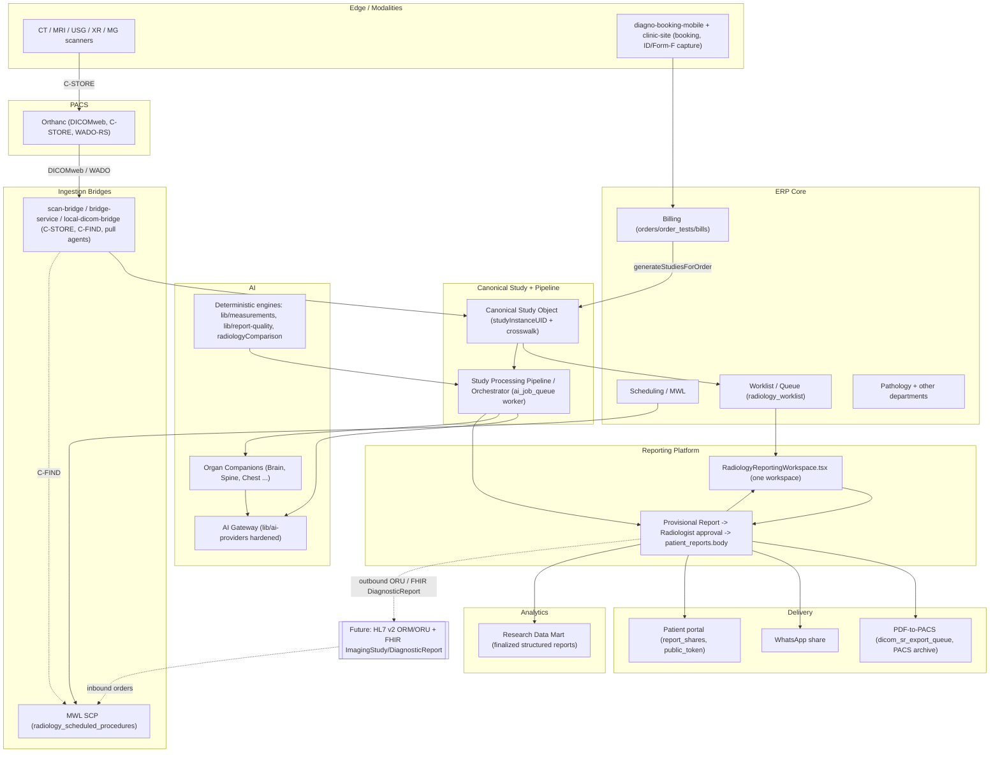
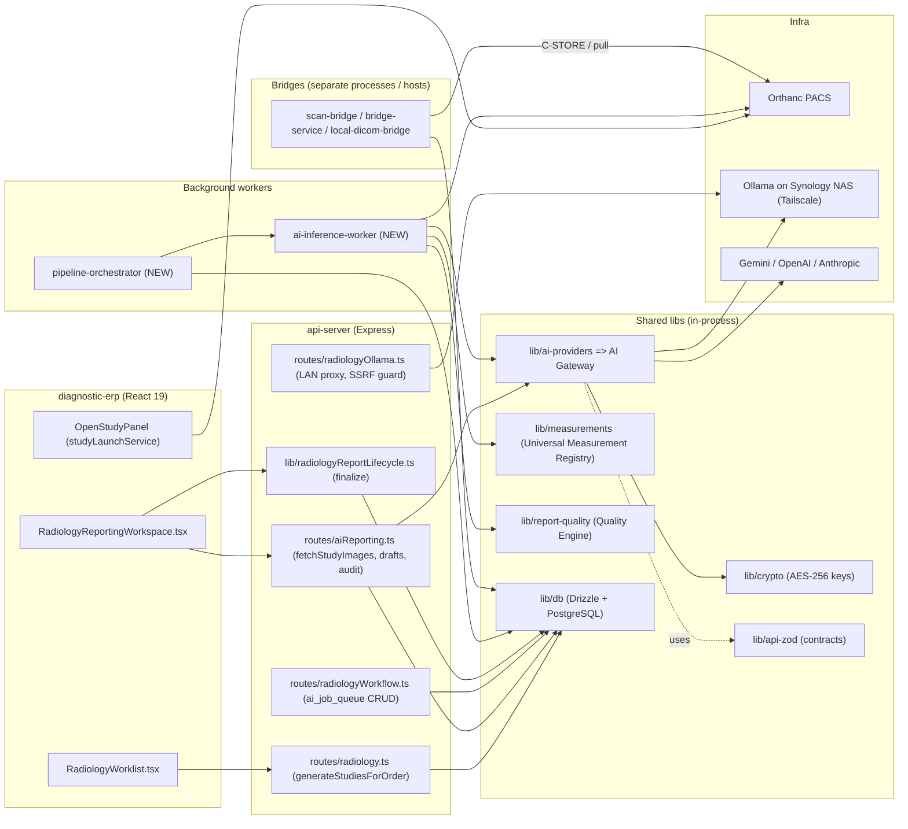
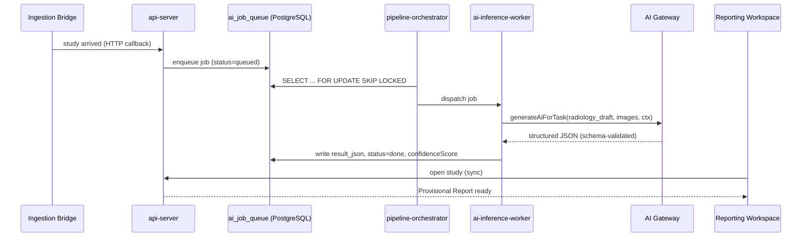

# 02 — Enterprise and Service Architecture

**Purpose.** This file fixes the *shape* of the Radiology AI platform: where every component lives, which are in-process libraries versus standalone services versus background workers, where the process boundaries fall, whether calls are synchronous or asynchronous, and how the pieces talk (HTTP versus queue). It draws the layered **enterprise-architecture diagram** (Deliverable 1) and the **component diagram** (Deliverable 2), specifies the **service architecture** (Deliverable 9), and names the **integration contracts** (Goal 14) with Orthanc, OHIF, Weasis, the CARE ERP core, and future HL7/FHIR. It then makes the single load-bearing topology decision — **modular monolith with background workers, not microservices** — and justifies it for a single-NAS hospital that must scale to many (Goal 13, at the architecture level). Detailed data contracts, pipeline internals, and scaling curves are owned by sibling files and cross-referenced, not duplicated here.

---

## 1. Enterprise architecture (layered)

The platform is a set of **layers**, each a stable seam. Imaging identity flows up from the modalities; a study is reconciled into the **Canonical Study Object**; the **Study Processing Pipeline** drives it to a **Provisional Report** by calling the **AI Gateway** and the registered **Organ Companions**; the radiologist reads and approves inside the one **Reporting Workspace**; and only finalized, human-approved structured reports flow out to Delivery and into the **Research Data Mart**. The ERP core (billing, scheduling, queue, pathology) sits alongside as the financial/operational spine that seeds studies and consumes their status.

Two edges are drawn dashed on purpose. **MWL C-FIND** already exists (`radiology_scheduled_procedures` is the C-FIND source). **HL7/FHIR** is a *future* seam: the pipeline and delivery layers are designed so an HL7 v2 `ORM` inbound and an `ORU`/FHIR `DiagnosticReport` outbound can be added as adapters at the ingestion and delivery boundaries without touching the AI core (`hl7Schema`, `enterpriseRadiology` tables are the scaffolded destinations).

---

## 2. Component diagram (real services and libraries)

Every box below is a real workspace member from `artifacts/*` or `lib/*`, except the two explicitly labeled **NEW** — the only new *processes* this architecture introduces. The AI Gateway is not new code so much as the hardened evolution of `lib/ai-providers` behind its existing `generateAiForTask()` seam.

The seam that keeps this coherent: **`aiReporting.ts` and `ai-inference-worker` both call `GW.generateAiForTask()`** — the caller never learns which model answered, satisfying *One Engine*. The worker path is asynchronous; the interactive path stays synchronous for radiologist-triggered actions.

---

## 3. Service architecture: process boundaries, sync vs async, transport

The recon is decisive that today's stack is *"a thin synchronous prompt-proxy with strong governance scaffolding but no execution engine."* The service architecture closes exactly one gap — it adds the **execution engine** *behind* the existing seam — and changes nothing about how the ERP calls AI.

### 3.1 Classification of every component

| Component | Kind | Process boundary | Sync/async | Transport |
|---|---|---|---|---|
| `lib/ai-providers` (**AI Gateway**) | In-process library | Inside `api-server` **and** inside `ai-inference-worker` | Sync (per call) | Direct function call → HTTPS to provider |
| `lib/measurements` | In-process library (pure, isomorphic) | Inside `api-server`, `diagnostic-erp`, and worker | Sync | Function call |
| `lib/report-quality` | In-process library | Inside `api-server` and worker | Sync | Function call |
| `lib/db` (Drizzle) | In-process library | Every server/worker process | Sync | pg wire protocol to PostgreSQL |
| `api-server` | Standalone service | Own process | Sync HTTP | Express HTTP/JSON |
| `diagnostic-erp` | Standalone SPA | Browser | Sync HTTP | fetch → `api-server` |
| `scan-bridge` / `bridge-service` / `local-dicom-bridge` | Standalone services | Own process, often a different host (LAN/NAS) | Async ingestion | DICOM (C-STORE/C-FIND) + HTTP callback to `api-server` |
| **`pipeline-orchestrator`** (NEW) | Background worker | Own process, co-located on the NAS | **Async** | Dequeues `ai_job_queue`; writes DB |
| **`ai-inference-worker`** (NEW) | Background worker | Own process (may be N replicas) | **Async** | Pulled by orchestrator; calls AI Gateway + Orthanc |
| Orthanc | External service | Own process | Sync request/response | DICOMweb / WADO-RS / C-STORE |
| Ollama (NAS) | External service | Own host | Sync | HTTP `/v1` (Gateway) or `/api/generate` (proxy) |

### 3.2 The one asynchronous seam

Everything a radiologist does is **synchronous request/response** through `api-server` — load a study, save a draft, finalize. The **only** asynchronous path is study processing, and it uses a queue that **already exists in the right shape**: `ai_job_queue` (columns `studyId`, `jobType`, `priority`, `retryCount`, `gpuMode`, `confidenceScore`, `result_json`, `humanOverridden`). We do **not** invent a new table; we finally write the consumer.

**Transport rules.** Interactive ERP↔API is HTTP/JSON. API↔worker is **the queue, not HTTP** — the orchestrator polls PostgreSQL with `SELECT ... FOR UPDATE SKIP LOCKED` (no new broker on a single NAS). Worker↔providers is HTTPS via the Gateway. Bridges↔PACS is native DICOM; bridges↔API is an HTTP status callback. This keeps the async fabric inside PostgreSQL, which the deployment already runs and backs up.

### 3.3 Why two workers, not one

`pipeline-orchestrator` owns **scheduling and the state machine** (priority ordering, STAT/VIP/emergency, retries, GPU-slot admission — the columns `AiInferenceSettings.tsx` already persists to `pacs_settings` but nothing consumes). `ai-inference-worker` owns **one job's execution** (fetch images via `fetchStudyImages()`, run deterministic engines, call the Gateway, validate JSON). Splitting them means inference workers are **stateless and horizontally scalable** (run 1 on the NAS, run N when a GPU box or a second hospital appears) while the orchestrator stays a **single elected leader** that never double-dispatches. Details of GPU scheduling and night processing are owned by `07-orchestration-and-night-processing.md`.

---

## 4. Integration contracts

| Integration | Direction | Contract | Existing anchor |
|---|---|---|---|
| **Orthanc PACS** | in/out | DICOMweb (QIDO/WADO-RS) for images; C-STORE for PDF-to-PACS; rendered JPEG for vision | `fetchStudyImages()`, `pacsSettings`, `dicom_sr_export_queue` |
| **OHIF viewer** | out | Network-aware launch URL (AUTO/LAN/Tailscale/Cloudflare/Public) keyed by `studyInstanceUID` | `OpenStudyPanel`, `studyLaunchService`, `EmbeddedWadoViewer` |
| **Weasis** | out | `.jnlp`/weasis URI launch keyed by study/accession | `OpenStudyPanel` |
| **CARE ERP core** | in | `generateStudiesForOrder()` fans `order_tests` → `radiology_studies`; ERP accession `ACC-YYYYMMDD-MOD-NNN` | `routes/radiology.ts`, `bills.ts` |
| **Billing** | in | Bill/order creation seeds the study; `orderTestId` 1:1 idempotent bridge | `orders`, `order_tests`, `bills` |
| **Scheduling / MWL** | in/out | `radiology_scheduled_procedures` is the C-FIND MWL source-of-truth | MWL SCP agent |
| **Worklist / Queue** | in/out | `radiology_worklist` is the reporting/queue spine; row id **is** the workspace `:studyId` | `radiologyWorklist.ts`, `useReportingWorkflow` |
| **Pathology / other depts** | lateral | Shared PostgreSQL, same audit chain; no cross-module coupling in code | `lib/db`, `audit_logs` |
| **Delivery** | out | PDF-to-PACS via `dicom_sr_export_queue`; WhatsApp manual share; portal via `report_shares.public_token` | `radiologyOps`, `patientReports.ts` |
| **Future HL7 v2** | in/out | `ORM` inbound order → MWL; `ORU` outbound on finalize | `hl7Schema` (scaffolded) |
| **Future FHIR** | out | `ImagingStudy` + `DiagnosticReport` resources projected from the Canonical Study + finalized report | `enterpriseRadiology` |

**Contract invariant:** every integration keys on the **Canonical Study Object identity** (`studyInstanceUID` as imaging identity, ERP accession as billing identity), which `03-canonical-data-model.md` defines. HL7/FHIR adapters are **boundary adapters only** — they translate to/from the Canonical Study Object and the finalized structured report (`docs/STRUCTURED_REPORT_JSON_SPEC_v1.md`), never reaching into ERP internals. This is what lets a future hospital speak HL7 while Deoghar speaks native DICOM, with one core.

---

## 5. Topology decision: modular monolith with workers

**Decision: a modular monolith (`api-server`) plus a small fleet of background workers sharing one PostgreSQL — not microservices.** This is locked in `19-critical-decisions-before-coding.md`; the justification lives here.

| Force | Verdict |
|---|---|
| **Deployment reality** | Single on-prem clinic, one Synology NAS (Deoghar). Microservices would add network hops, service discovery, and distributed-tx failure modes with **zero** operational benefit on one box. |
| **One Engine (Constitution #2)** | A single AI Gateway seam and a single pipeline are *definitionally* one engine. N provider microservices would re-fragment exactly what the recon says to consolidate (two Gemini paths, two Ollama paths). |
| **Data gravity** | Study identity, audit hash-chain (`audit_logs`, advisory-lock serialized), and PCPNDT gate are **transactional** and must share one PostgreSQL. Splitting services splits transactions and forks the audit chain — the CTO review already flags chain-forking (CRIT-2) as blocking. |
| **Scale path (Goal 13)** | Scale is achieved by **replicating stateless `ai-inference-worker` processes** and, later, pointing them at a GPU host — not by shattering the monolith. `16-performance-and-scalability.md` owns the single→multi-hospital→cloud/edge curve. |
| **Backward compatibility (Constitution #6)** | The monolith already exists and works (295/295 tests). A strangler that adds two workers behind an existing seam is additive; a microservice rewrite is not. |

The boundary we **do** enforce is the **process boundary between synchronous serving and asynchronous processing**: `api-server` must never block a radiologist on a provider call inside a request handler (today's anti-pattern). Long-running inference moves behind the queue. That is the whole architectural change — a modular monolith that *offloads*, not a distributed system that *fragments*.

Multi-hospital, when it comes, is a **cell** of {api-server + workers + Orthanc + PostgreSQL} per site, federating only finalized structured reports into a shared **Research Data Mart** — replication of the same cell, still not microservices. Identity strategy (bigint PKs, nullable tenant/branch key) is honored now even though multi-tenancy is deferred, so the cell can be re-keyed without a rewrite.

---

## 6. Mapping to the Constitution (One Engine)

| Principle | Enforcement in this topology |
|---|---|
| **1. One Workspace** | All AI output surfaces in `RadiologyReportingWorkspace.tsx`; workers write to `ai_job_queue.result_json`, never to a new UI. |
| **2. One Engine** | Exactly one AI Gateway (`generateAiForTask`) and one Study Processing Pipeline; both interactive and worker paths route through the same seam. The two Gemini and two Ollama paths are unified behind it (`04`). |
| **3. Content over Code** | Organ Companions self-register like Copilot modules; the topology treats them as pluggable content the pipeline *interprets*, not new services. |
| **4. Deterministic Before AI** | `lib/measurements` + `lib/report-quality` run **in-process inside the worker before** the Gateway call; AI drafts on top of deterministic ground truth. |
| **5. AI Advises, Humans Decide** | The pipeline terminates at a **Provisional Report**; only the synchronous finalize path (`lib/radiologyReportLifecycle.ts`) crosses into `patient_reports`, gated on radiologist approval. No worker can auto-sign. |
| **6. Backward Compatibility** | Workers consume the **existing** `ai_job_queue`; no table is deleted; the ERP seam is unchanged. |
| **7. Measure Before Building** | The pipeline emits `confidenceScore` and audit rows the **Feedback Ledger** and **Research Data Mart** measure before any retraining is proposed. |

---

## Cross-references

- `00-executive-summary.md` — the vision, headline decisions, and C4 context this topology realizes.
- `01-current-state-and-simplification.md` — the consolidation moves (dual Gemini/Ollama paths, queue-with-no-worker) this architecture assumes as its starting point.
- `03-canonical-data-model.md` — the Canonical Study Object + crosswalk that every integration in §4 keys on.
- `04-ai-gateway.md` — the hardened `generateAiForTask()` seam that is the "one engine" of §2 and §6.
- `05-study-pipeline-and-dataflow.md` — the pipeline state machine and data-flow behind the `pipeline-orchestrator` worker.
- `07-orchestration-and-night-processing.md` — GPU scheduling, priorities/STAT/VIP/emergency, and retries for `ai_job_queue` (the columns `AiInferenceSettings.tsx` persists).
- `09-organ-companions.md` — the Organ Companion registration framework referenced in the component diagram.
- `14-safety-risk-and-failure-recovery.md` and `15-security-model.md` — the audit hash-chain, PCPNDT gate, and network-trust model this topology must reuse, not fork.
- `16-performance-and-scalability.md` — the single→multi-hospital→cloud/edge scaling curve the modular-monolith-with-workers decision enables.
- `19-critical-decisions-before-coding.md` — where the monolith-vs-microservices ruling and the queue-worker decision are locked.
