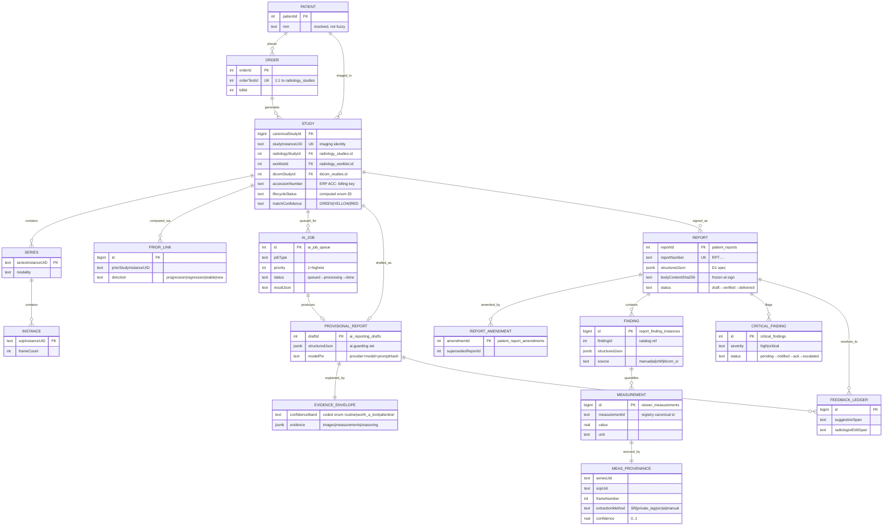
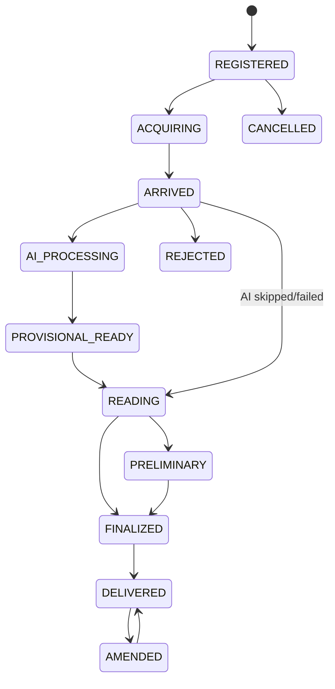

# 03 — The Canonical Study Object & Data Model

**Purpose.** This section defines the single logical aggregate every other document revolves around — the **Canonical Study Object**, keyed by `studyInstanceUID` — and the physical data model beneath it. Today a "study" is fragmented across three overlapping primary tables (`radiology_studies`, `radiology_worklist`, `dicom_studies`), a report record (`patient_reports`) whose foreign key silently means two different things, and duplicated downstream tables for critical findings and turnaround. This document rules on how those representations reconcile into one addressable object without deleting any of them (Constitution Principle 6, Backward Compatibility / no-delete), draws the entity-relationship model of the core radiology domain, fixes the canonical study lifecycle status enum, gives the database recommendations (PostgreSQL as system-of-record, JSONB, pgvector, object storage, append-only audit, date partitioning), reconciles all of it with the existing `STRUCTURED_REPORT_JSON_SPEC_v1`, and closes with a precise type sketch of the object contract. It owns *identity and persistence*; the pipeline that populates it lives in `05`.

---

## 1. The problem in one paragraph

There is no canonical study entity today. `radiology_studies` (`lib/db/src/schema/radiology.ts`) is the production spine — billing-driven, fanned out from orders by `generateStudiesForOrder` (`routes/radiology.ts`), keyed by serial `id`, with a **unique** ERP `accessionNumber` (`ACC-YYYYMMDD-MOD-NNN`) and unique `orderTestId`, but a **nullable, non-unique** `studyInstanceUid`. `radiology_worklist` (`radiologyWorklist.ts`) is the PACS-pushed RIS mirror, keyed by `id`, carrying `studyInstanceUID` (partial-unique), an explicitly **non-unique** `accessionNumber`, uppercase lifecycle plus independent `aiDraftStatus`/`deliveryStatus`/lock/match columns; its row `id` is the `:studyId` route param the reporting workspace opens. `dicom_studies` (`dicomStudies.ts`) self-labels as the "canonical study registry / single source of truth" with a **unique, not-null** `studyInstanceUID` and four independent status columns — but it is aspirational, adopted by only a handful of newer routes, and links to `usg_report_drafts`, not `patient_reports`. Reports live in `patient_reports`, whose `studyId` FK holds `radiology_studies.id` on the billing/USG path but `radiology_worklist.id` on the RIS/AI path, with **no discriminator**. Reconciliation is bolted on afterward (`reconcileMissingStudies`, `lib/pacs/matchingEngine.ts`, `radiologyDeploymentDiagnostics.ts`). See `01-current-state-and-simplification.md` for the full inventory.

---

## 2. Decision — a projection spine, not a fourth study table

**We introduce one new thin table, `canonical_study`, as the identity spine and single addressable handle for the Canonical Study Object. We do NOT rip out or merge the three existing tables.** This is a strangler projection (Principle 6): the three living tables keep their jobs; `canonical_study` sits above them as the authoritative crosswalk + computed-status projection that every new AI subsystem references.

| Table | Role after this decision | Authority it retains |
|---|---|---|
| `radiology_studies` | **Financial / order spine** | ERP accession authority (`ACC-…`), `orderTestId` 1:1, billing linkage, scheduling/MWL fields |
| `radiology_worklist` | **Reporting / queue spine** | Reading-room queue, study lock, radiologist assignment, AI-draft state, anti-forgery match verdict |
| `dicom_studies` | **Imaging-identity registry** | `studyInstanceUID` uniqueness, series/instance counts, ingest provenance, source PACS |
| `canonical_study` *(new)* | **Identity spine + computed status** | The one surrogate `canonicalStudyId`, the crosswalk to all three, the single derived lifecycle status, the FK target for every new AI table |

Why a projection and not a merge: merging would violate Backward Compatibility (37 files reference `radiology_studies`; 26 reference `radiology_worklist`), require a hard re-key of 319 serial PKs, and contradict *Measure Before Building*. The projection is cheap, reversible, and lets the three machines keep running while every new AI artifact (`ai_job_queue`, provisional reports, evidence, feedback) attaches to the stable `canonicalStudyId`. `dicom_studies` becomes what its header always claimed — the imaging registry — but stops pretending to be the operational study.

The Canonical Study Object is therefore **a logical aggregate, materialized as a read projection over the spine tables plus the `canonical_study` crosswalk row** — assembled by an application-layer resolver (§9), never a single physical row duplicating upstream columns.

---

## 3. Identity reconciliation

Three identifiers exist; each is authoritative for exactly one thing. The crosswalk pins them together.

| Identifier | Meaning | Uniqueness rule | Authority |
|---|---|---|---|
| `studyInstanceUID` | **Imaging identity** — the DICOM study | Globally unique (enforced on `dicom_studies`, `dicom_pulled_studies`) | The natural key of the Canonical Study Object |
| `accessionNumber` (ERP `ACC-…`) | **Billing identity** — the ordered test | Unique in `radiology_studies` only | ERP order/bill reconciliation |
| `radiology_worklist.id` | **Reporting handle** — the queue row | Table-local serial | Workspace route param, lock/assignment scope |
| `canonicalStudyId` *(new)* | **Stable surrogate** | `bigint` sequence | FK target for all new AI subsystems |

**Reconciliation rules (locked):**

1. `studyInstanceUID` is the canonical natural key. Every `canonical_study` row has exactly one, non-null. When images arrive before an order exists (walk-in, external CD), the row is created imaging-first and matched to billing later.
2. **External DICOM accession numbers are treated as non-unique** and are never used as a join key — only the ERP `ACC-YYYYMMDD-MOD-NNN` accession is unique, and only within `radiology_studies`. This resolves the current conflict where `accessionNumber` is unique in one table and explicitly non-unique everywhere else.
3. Matching a DICOM arrival to a billed test stays the job of `lib/pacs/matchingEngine.ts` (GREEN/YELLOW/RED). Its verdict is recorded on the crosswalk as `matchConfidence` — RED blocks auto-linking, never auto-forces it.
4. **`patient_reports.studyId` overloading is retired.** New reports carry `canonicalStudyId` (nullable during backfill, then not-null); the legacy `studyId` column is kept, dual-written, and deprecated. No route ever again guesses whether `studyId` means a study or a worklist row.

---

## 4. Entity-relationship model

The diagram is at the **logical** level — `STUDY` is the Canonical Study Object aggregate; the physical spine/crosswalk mapping is the table in §6. Real backing tables are noted in each entity comment.



**Physical mapping.** `FINDING` → `report_finding_instances` (`bigserial`, `structuredJson` JSONB, `source` enum). `MEASUREMENT` → `viewer_measurements` (the fullest-provenance existing shape, adopted as reference per `11`). `MEAS_PROVENANCE` is the **Measurement Provenance** value object (`seriesUid + sopUid + frameNumber + extractionMethod + confidence`) that `11` promotes into the shared type. `AI_JOB` → the existing `ai_job_queue` (`radiologyWorkflow.ts`) — reused, **not** reinvented; it already carries `studyId`, `jobType`, `priority`, `retryCount`, `gpuMode`, `confidenceScore`, `resultJson`, `humanOverridden`. `PROVISIONAL_REPORT` → `ai_reporting_drafts`. `EVIDENCE_ENVELOPE` and `FEEDBACK_LEDGER` are new tables defined in `12` and `08`. `EVIDENCE_ENVELOPE.confidenceBand` stores the snake_case coded enum (`routine|worth_a_look|attention`); the title-case `Routine / Worth-a-look / Attention` form is UI display only. `CRITICAL_FINDING` unifies the two parallel tables (`critical_findings` by `reportId` vs `radiology_critical_findings` by `studyId`) onto one, keyed by `canonicalStudyId` + optional `reportId`.

---

## 5. Study lifecycle status enum

Today a study's true state is smeared across 8+ disjoint columns (`radiology_studies.status`, `worklist.status`+`aiDraftStatus`+`deliveryStatus`+`matchDecision`, `dicom_studies.ingest/link/sync/reportStatus`, `report_verifications.status`). The Canonical Study Object exposes **one computed `lifecycleStatus`**, derived from the underlying machines — not a ninth stored column that can drift.

| Canonical status | Meaning | Derived from |
|---|---|---|
| `REGISTERED` | Order/MWL exists, no images yet | `radiology_studies.status=scheduled` |
| `ACQUIRING` | Acquisition in progress | `status=in_progress` / MWL fields set |
| `ARRIVED` | Images present in PACS/Orthanc | `dicom_studies.ingestStatus=ingested`, `worklist=STUDY_RECEIVED` |
| `AI_PROCESSING` | `ai_job_queue` job in flight | job `status=processing` |
| `PROVISIONAL_READY` | AI Provisional Report drafted | `worklist.aiDraftStatus=AI_DRAFT_READY` |
| `READING` | Radiologist has the study locked | `worklist` lock held, `REPORT_IN_PROGRESS` |
| `PRELIMINARY` | Preliminary report issued | `reported_preliminary` |
| `FINALIZED` | Report signed | `patient_reports.status=verified`, `worklist=REPORT_FINAL` |
| `DELIVERED` | Sent to patient/referrer | `deliveryStatus`, `delivered` |
| `AMENDED` | Post-sign amendment exists | `patient_report_amendments` row present |
| `CANCELLED` / `REJECTED` | Terminal exception | order cancelled / match RED unresolved |



The transition `ARRIVED → READING` (AI skipped/failed) is mandatory: **the AI is never on the critical path to a human reading**. This preserves *Deterministic Before AI* and the failure-recovery posture in `14`.

---

## 6. Physical crosswalk and the report-link fix

`canonical_study` is a narrow table — identity, crosswalk, computed status, match verdict — with **real, DB-enforced foreign keys** to the three spine tables (the current comment-only integer "FKs" are a documented gap). Its natural key `studyInstanceUID` gets a unique index; `canonicalStudyId` is a `bigint` surrogate (honoring the risk-review C1 identity strategy — `bigint` PKs, globally-unique business keys — even though multi-tenancy is deferred).

Downstream cleanups this enables (each additive, each a strangler migration):

- `patient_reports` gains `canonicalStudyId` (dual-written with legacy `studyId`); the overloaded FK is deprecated, not dropped.
- The two critical-finding tables converge on one keyed by `canonicalStudyId`.
- The two TAT tables (`radiology_tat_tracking` by `studyId`, `turnaround_times` by `worklistId`) converge on one keyed by `canonicalStudyId`.
- `peer_review_assignments`, `radiology_ai_review_audits`, `ai_job_queue`, and all new AI tables reference `canonicalStudyId`, ending the "which id did the caller use" ambiguity.

---

## 7. Database recommendations

| Concern | Recommendation | Grounding |
|---|---|---|
| **System-of-record** | PostgreSQL via Drizzle (`lib/db`), migrations auto-applied (`care-db-patch-v2`). One database, one schema; no new store for structured clinical data. | Existing stack; Principle 2 (One Engine) |
| **Structured report + evidence** | JSONB. `structured_json` columns already staged on `radiology_report_drafts` and `patient_reports`; add JSONB `evidence` on the Evidence Envelope table and `structuredJson` on `report_finding_instances` (already JSONB). Validate against the D1 schema on write. | `STRUCTURED_REPORT_JSON_SPEC_v1` §13 |
| **Vector store (RAG / similar-case)** | pgvector, **required not optional** in production. `rag_document_embeddings` currently stores embeddings as JSON-text with a pgvector fallback — promote to a real `vector` column with an `hnsw` (or `ivfflat`) index. Serves similar-case retrieval for the Organ Companions and prior-context injection. | `ragDocuments.ts`; `04`, `09` |
| **Images / heatmaps** | Object storage, never DB blobs. DICOM lives in **Orthanc** (the PACS object store); AI heatmaps/overlays go to S3-compatible / NAS object storage. The DB stores **URIs + content hashes only**. `fetchStudyImages()` (Orthanc DICOMweb → `sharp` → base64) stays the single image-acquisition path. | `aiReporting.ts`; `12` |
| **Audit / time-series** | Append-only, hash-chained. Reuse `audit_logs` (`lib/audit.ts`, advisory-lock-serialized SHA256 chain) and extend `radiology_ai_review_audits` for AI-decision provenance. The Feedback Ledger and Evidence Envelope are append-only; snapshots retained ≥7 years. Never a parallel AI audit store. | `15`, `08`; risk-review CRIT-2 |
| **Worklist indexing / partitioning** | The high-churn read surface. Composite index on `(lifecycleStatus, studyDate, assignedRadiologistId)`; **partition `report_finding_instances` and the worklist projection by `created_at`/`study_date`** (the roadmap's Strand-N partitioning is sentinel-gated and starts non-partitioned by design). Date-range queries are the dominant worklist access pattern. | `reportFindingInstances.ts`; `16` |

Two hardening pre-reqs the model assumes (both convention-only today, flagged in the CTO review): a **unique** index on the audit chain hash plus `REVOKE UPDATE/DELETE` for real DB-level immutability, and `bigint` PKs on new tables against `int4` overflow. Do not build the AI data layer on the un-hardened chain.

---

## 8. Reconciliation with the structured-report JSON spec

The Canonical Study Object does **not** redefine report structure — it **hosts** the existing `STRUCTURED_REPORT_JSON_SPEC_v1` document. Mapping:

- The **Provisional Report** is a D1 `structured_json` document with `ai.guarding` populated and the `ai` block carrying the reproducible model pin (provider + model + prompt hash + input hash) — closing the "AI text indistinguishable from radiologist text" gap the spec calls out in its design principles.
- On radiologist approval, that document becomes the signed `patient_reports.structured_json`, and the rendered prose is frozen into `patient_reports.body` with a `content_sha256` (the spec's byte-verifiability guarantee). `body` remains the authoritative append-only artifact; `structured_json` is the machine-readable projection.
- Each `FINDING` (`report_finding_instances`) row corresponds to a D1 `findings[]` element addressed by its `lid`; measurements map to `measurements[]` with Measurement Provenance; `critical_flags[]` map to the unified `CRITICAL_FINDING` rows.
- `document_id` (ULID, spec §1.3) is the report-document identity; `canonicalStudyId` is the *study* identity. Both are stable and distinct — one report belongs to one study; a study may carry a preliminary report, a final report, and amendments.

Generation and the JSON→canonical-engine conversion are owned by `06`; this section only guarantees the object has a home for the spec-compliant document and a stable study key.

---

## 9. Canonical Study Object contract (type sketch)

A precise-but-short contract for the application-layer aggregate the resolver returns. This is the shape `RadiologyReportingWorkspace.tsx` and the AI Gateway consume; it is assembled from the spine tables, never a single stored row.

```typescript
// The one logical aggregate keyed by studyInstanceUID.
interface CanonicalStudyObject {
  canonicalStudyId: bigint;            // stable surrogate, FK target
  studyInstanceUID: string;            // imaging identity (natural key)
  identity: {
    accessionNumber: string | null;    // ERP ACC- billing key (unique in radiology_studies)
    radiologyStudyId: number | null;   // financial spine
    worklistId: number | null;         // reporting/queue spine, workspace route param
    dicomStudyId: number | null;       // imaging registry
    matchConfidence: "GREEN" | "YELLOW" | "RED";
  };
  patient: { patientId: number; name: string; sex?: string; age?: string };
  lifecycleStatus: StudyLifecycleStatus;   // computed enum §5, never stored raw
  imaging: { modality: string; seriesCount: number; instanceCount: number };
  priors: PriorLink[];                 // §4 PRIOR_LINK, resolved for comparison
  ai: {
    activeJob?: { jobType: string; status: string; priority: number };  // ai_job_queue
    provisionalReport?: { draftId: number; modelPin: string };          // ai_reporting_drafts
    evidenceEnvelopeRef?: string;                                       // §4, doc 12
  };
  report: {
    reportId: number | null;           // patient_reports
    structuredJson: StructuredReportDocumentV1 | null;   // D1 spec
    bodyContentSha256: string | null;  // frozen at sign
    status: "draft" | "pending_verification" | "verified" | "delivered";
    amendments: number;                // patient_report_amendments count
  };
  criticalFindings: CriticalFindingRef[];   // unified critical_findings
}
```

The resolver is read-only and side-effect-free; writes still go through each spine's existing transactional path (`generateStudiesForOrder`, `lib/studyLocks.ts`, `lib/studyAssignments.ts`, `radiologyReportLifecycle.ts`). The object is the **read** contract; the spines remain the **write** authorities.

---

## Cross-references

- `01-current-state-and-simplification.md` — the three-study-table inventory and overloaded-FK gap this model resolves
- `02-enterprise-and-service-architecture.md` — where the resolver sits in the service topology
- `05-study-pipeline-and-dataflow.md` — the state machine that drives `lifecycleStatus` transitions
- `06-ai-report-generation.md` — Provisional Report generation and JSON→canonical-engine conversion
- `08-learning-and-feedback-system.md` — the Feedback Ledger table shape and append-only rules
- `11-measurement-engine.md` — the Measurement Provenance value object adopted here
- `12-explainability.md` — the Evidence Envelope table and its JSONB payload
- `13-research-database.md` — the Research Data Mart built from finalized `structured_json`
- `15-security-model.md` — audit-chain hardening and immutability the model depends on
- `docs/STRUCTURED_REPORT_JSON_SPEC_v1.md` — the report-document contract the object hosts
