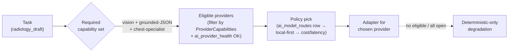
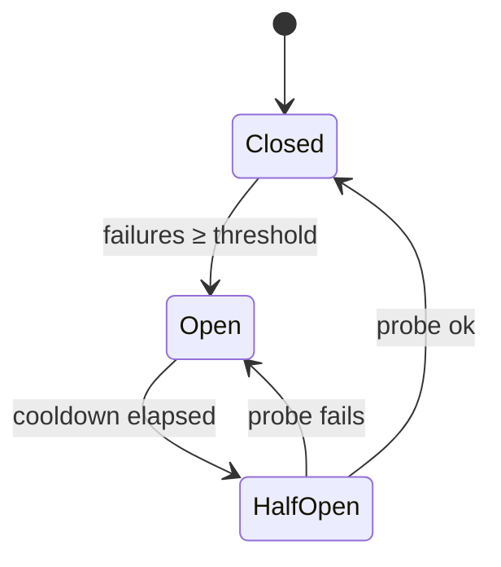
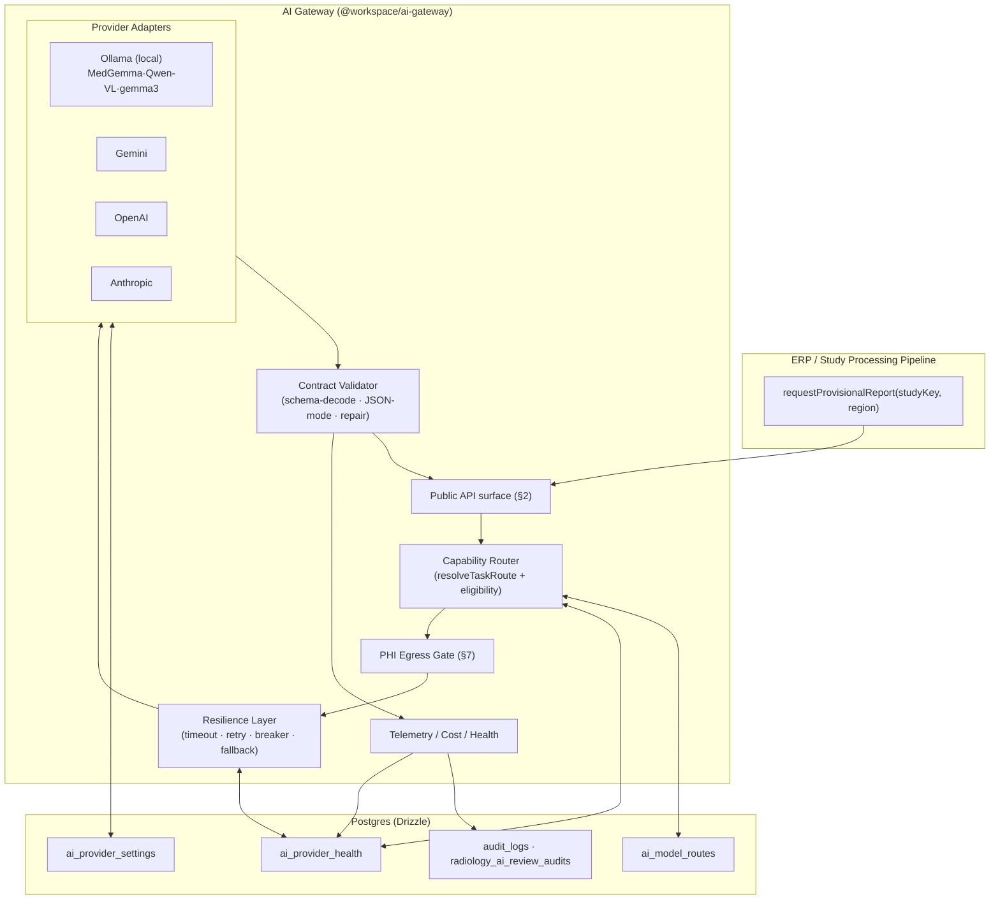
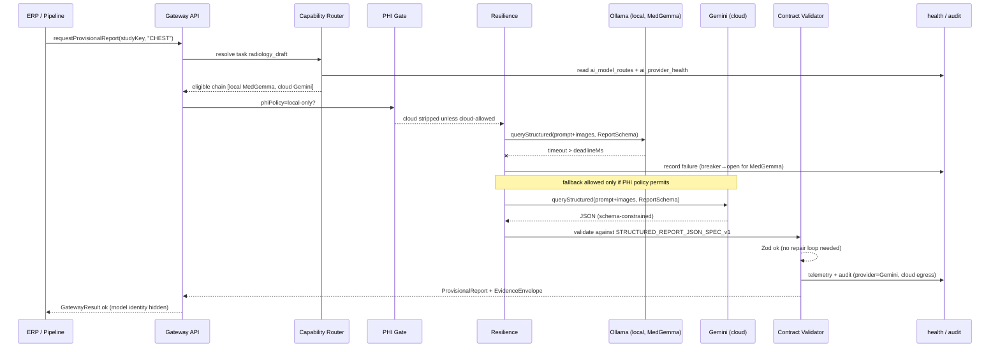

# 04 — The AI Gateway

**Purpose.** The AI Gateway is the hardened evolution of `lib/ai-providers` into the single, model-agnostic inference boundary for all of radiology. Its one non-negotiable contract is this: **the ERP must never know which model produced a report.** Callers ask for clinical outcomes ("give me a provisional chest report for this study"), and the Gateway alone decides which capability is required, which provider is eligible, whether that provider may see PHI or pixels, how to enforce a structured-JSON response, and what to do when the first choice times out. This section defines the stable public API the ERP calls, the extended provider abstraction, capability-based routing built on `generateAiForTask`/`ai_model_routes`, the model-agnostic request/response contract, the resilience layer keyed on `ai_provider_health`, the PHI egress boundary, and telemetry. It obeys Principle 4 (Deterministic Before AI) and Principle 5 (AI Advises, Humans Decide): the Gateway is an advisory engine that produces a **Provisional Report**, never a signed one.

---

## 1. Design mandate: what changes and what is preserved

The current stack (see `01-current-state-and-simplification.md`) is a thin **synchronous prompt-proxy**: `generateAiForTask(taskKey, prompt, images, opts)` resolves `explicit override → active ai_model_routes row → global default`, calls one provider over blocking HTTP inside a route handler, and returns `AiQueryResult{ text, success, error }` with **zero JSON-contract enforcement**. Two Gemini paths (`lib/ai-providers` registry vs the env-keyed `lib/integrations-gemini-ai`) and two Ollama paths (registry `OllamaProvider` on `/v1` vs the bespoke `radiologyOllama.ts` proxy on native `/api/generate`, which is text-only) diverge and bypass the registry.

The Gateway **keeps the good seam and hardens everything behind it.** `generateAiForTask` / `resolveTaskRoute` / `AI_TASK_CATALOG` / `ai_model_routes` remain the resolution core — callers stay unchanged. We add, behind that seam: a capability layer, a contract validator, a resilience layer, a PHI-boundary gate, and telemetry. We **consolidate** the two Gemini and two Ollama integrations into single adapters so config stops diverging, and give Ollama the vision path it currently lacks by reusing `fetchStudyImages()` (Orthanc DICOMweb → `sharp` 512px → base64) as the one image-acquisition function.

| Preserve exactly | Harden / add |
| --- | --- |
| `AiProvider` interface, `createAiProviderFromDb`, encrypted keys via `@workspace/crypto` | Capability descriptors per provider/model |
| `generateAiForTask` / `resolveTaskRoute` / `AI_TASK_CATALOG` / `ai_model_routes` | Policy pick over *eligible* providers, not just first-match |
| `ai_provider_settings`, `ai_provider_health` tables | Circuit breaker + fallback chains that *read and write* health |
| `AI Draft — Requires Radiologist Review` labeling; never-auto-sign guard | Server-enforced Provisional Report state, segment provenance (see `06`, `12`) |
| `aiPromptTemplates` / `aiPromptLibrary` prompt store | Versioned prompt binding stamped into every response |

---

## 2. The stable public API the ERP calls

The ERP imports **task-oriented functions**, never a provider name, never a model string. This is the whole surface; adding a modality means adding a task, not a call site.

```ts
// @workspace/ai-gateway — the ONLY entry points the ERP/pipeline use
requestProvisionalReport(studyKey: StudyKey, region: RegionKey, opts?: GatewayOpts): Promise<GatewayResult<ProvisionalReport>>;
requestImageReview(studyKey: StudyKey, series: SeriesRef[], opts?: GatewayOpts): Promise<GatewayResult<FindingSet>>;
requestImpressionPolish(draft: StructuredReport, opts?: GatewayOpts): Promise<GatewayResult<StructuredReport>>;
requestComparison(current: StudyKey, prior: StudyKey, opts?: GatewayOpts): Promise<GatewayResult<ComparisonDelta>>;
requestMeasurementNormalization(raw: RawMeasurement[], opts?: GatewayOpts): Promise<GatewayResult<CanonicalMeasurement[]>>;
requestOrganCompanionPass(studyKey: StudyKey, companion: CompanionKey, opts?: GatewayOpts): Promise<GatewayResult<CompanionOutput>>;

type StudyKey = { studyInstanceUID: string };        // the Canonical Study Object key (see 03)
type GatewayOpts = { priority?: 'STAT'|'routine'; phiPolicy?: 'local-only'|'cloud-allowed'; deadlineMs?: number };
type GatewayResult<T> = { ok: true; value: T; envelope: EvidenceEnvelope } | { ok: false; degraded: DegradeReason };
```

Every task maps to an `AI_TASK_CATALOG` key (`radiology_draft`, `report_enhancement`, `echo_draft`, …), so routing is table-driven. `studyKey` is the `studyInstanceUID` of the **Canonical Study Object** (`03-canonical-data-model.md`) — never a `radiology_worklist.id` or `radiology_studies.id`, which the Gateway resolves internally. Results are always wrapped: on success an **Evidence Envelope** (confidence, evidence, images, measurements, reasoning — see `12-explainability.md`) rides alongside the value; on failure the Gateway returns a typed `degraded` reason so the pipeline can fall to deterministic-only output rather than crash.

---

## 3. Provider abstraction — `AiProvider` extended

Today `AiProvider` is `{ config, query(opts), testConnection() }` with `AiQueryOptions{ model, prompt, images, maxTokens }`. We extend it additively (Principle 6, no-delete) with a **capability descriptor** and a **structured query** variant, so MedGemma, Qwen-VL, Llama (gpt-oss/gemma3 via Ollama), Gemini, GPT, and future multimodal models all describe themselves uniformly:

```ts
interface ProviderCapabilities {
  vision: boolean;                 // accepts image[] (Qwen-VL, MedGemma, GPT-4o, Gemini)
  longContext: number;             // usable context window in tokens
  groundedJson: 'schema'|'json-mode'|'none'; // native schema-constrained decoding, JSON-mode, or neither
  regionSpecialist?: RegionKey[];  // e.g. MedGemma → chest/abdomen; declared, not guessed
  phiClass: 'local'|'cloud';       // physical trust zone (drives §7 egress gate)
  streaming: boolean;
}
interface AiProvider2 extends AiProvider {
  readonly capabilities: ProviderCapabilities;      // static + probed (Ollama /api/show, classifyOllamaModelVisionByName)
  queryStructured<T>(opts: AiQueryOptions, schema: ZodSchema<T>): Promise<StructuredResult<T>>;
}
```

Capabilities are **partly static** (declared per model in `ai_provider_settings`/route config) and **partly probed** — the existing `classifyOllamaModelVisionByName()` and `probeOllamaModelVision()` (via `/api/show` capabilities) feed `vision` and reachability so we never send images to a text-only local model, the exact bug `radiologyOllama.ts` has today.

---

## 4. Capability-based routing

Routing is a four-stage funnel that sits **inside** `resolveTaskRoute`, not beside it:



1. **Task → required capability.** Each `AI_TASK_CATALOG` entry declares required capabilities. `radiology_draft` needs `vision + groundedJson + regionSpecialist(region)`; `report_enhancement` needs `longContext + groundedJson`; `id_card_ocr` needs `vision` only.
2. **Required capability → eligible providers.** Filter all registered providers by `capabilities` **and** by `ai_provider_health` (a provider with an open circuit is not eligible). This is the step missing today — health is logged but never consulted for routing.
3. **Eligible → policy pick.** Apply the existing precedence (`explicit override → ai_model_routes row → global default`) *restricted to the eligible set*, then break ties **local-first** (Principle: keep PHI on the Synology/Tailscale NAS) and by recorded cost/latency.
4. **No eligible provider** (all circuits open, or capability unmet) → return `degraded`, and the pipeline uses deterministic-only output. The ERP still gets a report; it just has no AI advice attached.

The region specialist dimension is what lets MedGemma serve chest/abdomen while Qwen-VL or Gemini serve neuro, entirely by config in `ai_model_routes` — no code change, honoring **Content over Code**.

---

## 5. Model-agnostic contract + structured-JSON enforcement

This is the **highest-leverage missing primitive.** Today providers return raw `{ text }` and every consumer hand-rolls `result.match(/\{[\s\S]*\}/) + JSON.parse` with silent fallback. The Gateway replaces this with one **three-tier enforcement ladder**, applied by the Contract Validator on the way out, so the ERP is guaranteed a schema-valid object or an honest failure:

| Tier | When | Mechanism |
| --- | --- | --- |
| **1. Schema-constrained decoding** | provider `groundedJson === 'schema'` (Gemini `responseSchema`, GPT `response_format: json_schema`, Ollama `format` + JSON schema) | Model is *forced* to emit conforming JSON; validate with Zod (`@workspace/api-zod`) as belt-and-braces |
| **2. JSON-mode + validate** | `groundedJson === 'json-mode'` | Request JSON mode, parse, Zod-validate |
| **3. Repair loop** | validation fails, or provider is text-only (local Ollama `/api/generate`) | Re-prompt once with the Zod error + the offending text ("return ONLY valid JSON matching …"); on second failure → `degraded`, never a silent partial |

The response schema is the existing **`docs/STRUCTURED_REPORT_JSON_SPEC_v1.md`** contract — the Gateway does not invent a report shape; it enforces the one that already feeds the canonical engine (`06-ai-report-generation.md`). `queryStructured<T>()` is the single validated variant of `AiQueryResult`; the ad-hoc fence-stripping scattered across teaching/OCR endpoints is deleted in favour of it.

---

## 6. Resilience layer

Wrapped around every adapter call, driven by `GatewayOpts.deadlineMs`/`priority` and persisted in `ai_provider_health`:

- **Timeouts** — a hard per-call deadline; STAT studies get a tighter budget and jump the fallback chain sooner.
- **Retries with backoff** — transient (5xx, connection reset, timeout) retried with exponential backoff + jitter, capped; the `maxRetries` flag already stored in `pacs_settings` finally gets a consumer. Non-retryable (schema-fatal, auth) fail fast.
- **Circuit breaker per provider** — consecutive failures trip the breaker `closed → open → half-open`, recorded in `ai_provider_health`. An open provider is removed from the eligible set (§4) until a half-open probe succeeds. This closes the loop the current stack leaves open (health is logged, never acted on).
- **Fallback chains, local → cloud** — the eligible set is an *ordered* chain. On failure or open circuit, advance to the next eligible provider **subject to the PHI gate** (§7): a `local-only` study may only fall to another local provider, never to cloud.
- **Graceful degradation** — chain exhausted ⇒ `degraded` result ⇒ pipeline emits a deterministic-only report. AI advice is always optional (Principle 4/5); its absence must never block a radiologist.



---

## 7. PHI-boundary control

Radiology payloads carry PHI and pixel data. The Gateway enforces a **local-first egress policy** at a single gate that every adapter call passes through:

| Provider zone | May receive | Governed by |
| --- | --- | --- |
| **Local** (Ollama on Synology NAS via Tailscale `http://100.79.100.41:11434` — MedGemma/Qwen-VL/gemma3/gpt-oss) | PHI text **and** DICOM-rendered images | default; always eligible |
| **Cloud** (Gemini/OpenAI/Anthropic) | Only when `phiPolicy: 'cloud-allowed'` **and** a per-workspace feature flag permits it | `ProviderCapabilities.phiClass`, `feature_flags` (server-side, fail-safe to false — see `15-security-model.md`) |

The gate is **deny-by-default for cloud**: unless the task explicitly carries `cloud-allowed` and the workspace flag is on, cloud providers are stripped from the eligible set *before* the policy pick, so a fallback can never silently spill PHI to a cloud vendor. Image egress reuses `fetchStudyImages()` so there is one auditable path for pixels leaving the PACS. Every cloud egress is written to the hash-chained `audit_logs` and to `radiology_ai_review_audits` (which providers were queried), satisfying the medico-legal trail (`14`, `15`).

---

## 8. Prompt & version management

Prompts already live in `aiPromptTemplates` / `aiPromptLibrary` and the Care-Diagnostics templates inside `radiologyOllama.ts`. The Gateway makes them **first-class and versioned**: each task resolves a `{ templateId, templateVersion }` at call time, and that tuple — plus `{ providerName, modelId, capabilitySet }` — is stamped into the Evidence Envelope and persisted with the draft. This is what makes explainability's "second-press shows model/version/prompt lineage" (feature 10) structurally possible, which today it is not (`ai_reporting_drafts` stores only `provider/model/promptText`). Prompt assembly for **Organ Companions** reads `radiology_memory` / `radiology_lesions` / organ-intelligence context and injects it here — the wiring that is entirely absent today (`08`, `09`).

---

## 9. Telemetry, cost & latency accounting

Every call emits one structured telemetry record: `taskKey, providerName, modelId, capabilitySet, latencyMs, promptTokens, completionTokens, estimatedCost, retries, circuitState, phiZone, contractTier, outcome`. These feed:

- **Health** → `ai_provider_health` (drives §6 breaker and §4 eligibility).
- **Cost/latency** → routing tie-breaks (§4 step 3) and the ops dashboard.
- **Quality** → `ai_quality_scores`, correlated with the **Feedback Ledger** (`08`) so we learn which provider/model/prompt combination the radiologist edits least — without auto-retraining.

Accounting is per-call and non-blocking (fire-and-forget, mirroring `auditLog()` semantics) so telemetry never breaks an inference.

---

## 10. Gateway internals — component diagram



---

## 11. One gateway call with fallback — sequence diagram



The ERP receives a validated **Provisional Report** and its Evidence Envelope. It is never told MedGemma timed out or that Gemini answered — model identity stays inside the Gateway, and the draft carries the universal `AI Draft — Requires Radiologist Review` label. Had the chain been exhausted (or cloud fallback blocked by the PHI gate with no local provider left), the Gateway would have returned `degraded` and the pipeline would emit a deterministic-only report.

---

## Cross-references

- `03-canonical-data-model.md` — the **Canonical Study Object** keyed by `studyInstanceUID`; `StudyKey` resolves through it.
- `05-study-pipeline-and-dataflow.md` — the **Study Processing Pipeline** that calls the Gateway and consumes `degraded` results; async queue (`ai_job_queue`) sits behind the Gateway seam.
- `06-ai-report-generation.md` — the structured-JSON contract (`STRUCTURED_REPORT_JSON_SPEC_v1`) the Contract Validator enforces and the JSON→canonical-engine conversion.
- `07-orchestration-and-night-processing.md` — GPU scheduling, STAT/VIP priority, and retry budgets that parameterize the resilience layer.
- `08-learning-and-feedback-system.md` — the **Feedback Ledger** that consumes Gateway telemetry to score provider/prompt combinations (no auto-retrain).
- `09-organ-companions.md` — per-region companions that call `requestOrganCompanionPass` and supply the region-specialist routing dimension.
- `12-explainability.md` — the **Evidence Envelope** shape returned by every `GatewayResult`.
- `14-safety-risk-and-failure-recovery.md` — graceful degradation, deterministic-before-AI invariants, and never-auto-sign.
- `15-security-model.md` — PHI trust zones, cloud-egress feature flags, encrypted keys, and the `audit_logs` / `radiology_ai_review_audits` chain.
- `17-api-and-folder-architecture.md` — the `@workspace/ai-gateway` module/folder structure that houses this surface.
