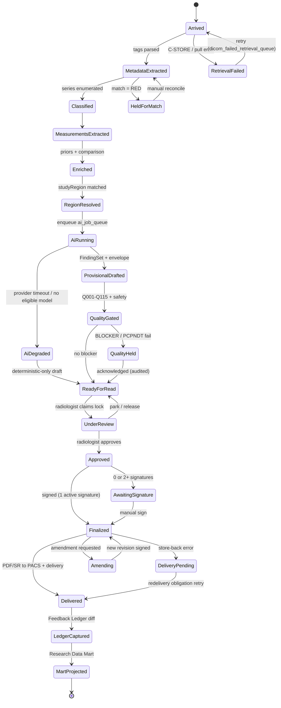
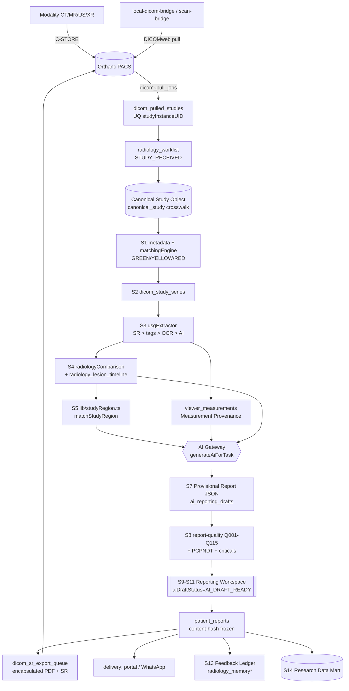
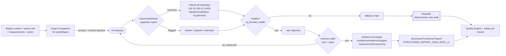
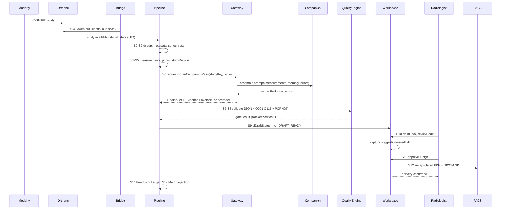

# 05 — The Study Processing Pipeline & Data Flow

**Purpose.** This section defines the **Study Processing Pipeline** (a.k.a. the Orchestrator): the single, governed path a study travels from the instant pixels land in Orthanc to the moment an encapsulated PDF/SR is pushed back to PACS, the Feedback Ledger is written, and the Research Data Mart is projected. Today there is *no running pipeline* — `ai_job_queue` is CRUD-only, draft lifecycle is string-convention, and AI is a synchronous prompt-proxy bolted into route handlers (see `01-current-state-and-simplification.md`). This document rules that the study lifecycle becomes a **server-enforced state machine** over the Canonical Study Object (`03-canonical-data-model.md`), that every stage has explicit inputs/outputs, an idempotency key, a retryability class, and a provenance sink, and that **AI failure never blocks the radiologist** (Constitution Principle 4, Deterministic Before AI). It owns *the lifecycle and dataflow*; the queue/worker/GPU mechanics live in `07`, the JSON contract in `06`, the Gateway in `04`.

---

## 1. The fifteen stages

The pipeline is fifteen ordered stages. Every stage reads and writes the Canonical Study Object (keyed `studyInstanceUID`, surrogate `canonicalStudyId`, see `03`) and records provenance to an existing table — we invent no new audit store. Stages S6–S7 are the only AI stages; all other stages (S0–S5 and S8–S14) are deterministic and run with AI fully offline.

| # | Stage | Input | Output | Idempotency key | Retryable | Provenance sink |
|---|---|---|---|---|---|---|
| S0 | **Arrival** (Orthanc / bridge) | C-STORE / DICOMweb from modality via `local-dicom-bridge` / `scan-bridge` / `dicom_pull_jobs` | `dicom_pulled_studies` row, `radiology_worklist` `STUDY_RECEIVED` | `studyInstanceUID` + `hashSignature` | Auto (idempotent no-op on same hash) | `dicom_pulled_studies`, `dicom_study_audit_log`, `radiology_audit_log` |
| S1 | **Metadata extraction** | DICOM header tags | `canonical_study` crosswalk, patient/modality/accession, match verdict | `canonicalStudyId` + `metadata` | Auto | `radiology_worklist.match*` (GREEN/YELLOW/RED), `dicom_studies` |
| S2 | **Parse / series classification** | Series + instance manifest | Classified series (localizer / T1·T2·FLAIR·DWI / pre·post-contrast / plane), hanging hints | `canonicalStudyId` + `seriesManifestDigest` | Auto | `dicom_study_series` |
| S3 | **Measurement extraction** | DICOM SR, private tags, WADO frames | Canonical measurements + **Measurement Provenance** | `canonicalStudyId` + `sopUid` + `measurementId` | Auto (OCR/AI at-least-once) | `viewer_measurements`, `usg_measurements`, `usg_extraction_logs` |
| S4 | **Prior fetch + comparison** | Current study + patient identity | Prior set, per-measurement delta, progression verdict | `canonicalStudyId` + `priorStudyUID` | Auto | `radiology_lesion_timeline`, `radiology_measurements` |
| S5 | **Region / protocol resolution** | Modality + study description + body part | `studyRegion`, Knowledge Pack, Organ Companion, template, checklist | `canonicalStudyId` + `regionRuleVersion` | Auto (pure) | `radiology_worklist`, `dicom_studies.reportStatus` |
| S6 | **AI analysis** (Gateway + Companion) | Series refs, measurements, priors, region context | `FindingSet` + Evidence Envelope | `ai_job_queue(studyId,jobType,inputHash)` | Auto w/ fallback → **degrade** | `ai_reporting_audit_logs`, `radiology_ai_review_audits`, `ai_job_queue.result_json` |
| S7 | **Structured Provisional Report** | `FindingSet`, region template | Schema-valid JSON per `STRUCTURED_REPORT_JSON_SPEC_v1` | `canonicalStudyId` + `promptBindingVersion` | Auto (repair loop) | `ai_reporting_drafts`, `radiology_worklist.aiDraftJson` |
| S8 | **Quality-gate + safety pre-checks** | Provisional Report + measurements | Q001–Q115 findings, PCPNDT verdict, critical-finding scan | `canonicalStudyId` + `reportContentHash` | Auto (deterministic) | `report_quality_findings` (shadow), `report_quality_checks`, `critical_findings` |
| S9 | **Surface to workspace** | Provisional Report + envelope + gates | `aiDraftStatus = AI_DRAFT_READY`, ghost/margin/gutter/banner | `canonicalStudyId` + `draftRevision` | Auto | `radiology_worklist`, `radiology_copilot_logs` |
| S10 | **Radiologist review / approve** | Provisional Report | Accepted / edited findings, held/parked | worklist lock (`lock_user_id`) | **Human** (not auto) | `radiology_ai_review_audits`, `audit_logs` |
| S11 | **Final report** | Approved structured report | `patient_reports` signed, content-hash frozen | sign `Idempotency-Key` | Human-gated | `patient_reports.body`, `report_amendments`, `audit_logs` |
| S12 | **PDF/SR back to PACS + delivery** | Final report | Encapsulated PDF + DICOM SR to Orthanc, delivery | `studyInstanceUID` + `revisionNo` | Auto (obligation retry) | `dicom_sr_export_queue`, `radiology_pacs_archive_revisions`, `radiology_redelivery_obligations` |
| S13 | **Feedback Ledger capture** | AI suggestion vs radiologist final | Suggestion-vs-edit diff (no auto-retrain) | `canonicalStudyId` + `draftRevision` | Auto | `radiology_memory*`, `ai_reporting_audit_logs` (see `08`) |
| S14 | **Research Data Mart projection** | Finalized structured report | De-identified analytics/registry/ML rows | `patient_reports.id` + `renderEngineVersion` | Auto | `ai_training_data_exports`, Research Data Mart (see `13`) |

---

## 2. Idempotency & exactly-once keys

The pipeline is **at-least-once delivery with idempotent, upsert-keyed stage writes → effectively-once execution.** No stage may have a non-idempotent side effect outside its keyed write. The two externally visible side effects — PACS store-back and patient delivery — are guarded by revision keys and recorded as obligations, so a retry re-uses the same revision rather than emitting a duplicate.

- **Arrival key** — `studyInstanceUID` is the natural key; content changes are detected by `hashSignature` on `dicom_pulled_studies` (unique `studyInstanceUID`). A re-sent study with the same hash is a **no-op**; a changed hash opens a new pipeline *revision* rather than corrupting the prior one.
- **Run key** — `canonicalStudyId + pipelineVersion`. At most one active run per canonical study; a second arrival for the same UID resumes the existing run.
- **Stage key** — `canonicalStudyId + stageId + inputDigest`. Stage writes are upsert-by-key, so a crash-and-retry overwrites in place. `inputDigest` is the SHA-256 of the stage's declared inputs, which also detects *stale* work (upstream changed → digest changes → stage re-runs).
- **Job dedup** — `ai_job_queue` gains a unique constraint on `(studyId, jobType, inputHash)`. `studyId` is the existing integer `study_id` FK on `ai_job_queue` (references the Canonical Study Object's order/financial spine row); `inputHash` is a new `input_hash` text column = SHA-256 over the normalized tuple `{ sorted SOPInstanceUIDs (series manifest) of the analyzed series, promptTemplateVersion, provisionalReportSchemaVersion }` — it hashes **input content**, not model identity. `modelVersion` is deliberately **not** part of the key: re-running identical inputs is deduped, while a model upgrade that must re-analyze prior studies is an explicit, audited reprocessing job (new row via a reprocess flag), never a silent key collision. Migration adds the `input_hash` column + the unique index backward-compatibly (nullable → backfill → enforce). The S6 enqueue is idempotent and the worker (see `07`) claims rows with `FOR UPDATE SKIP LOCKED`. We reuse `ai_job_queue` as-is (it already carries `studyId, jobType, priority, retryCount, gpuMode, confidenceScore, result_json, humanOverridden`) — no new queue table.
- **Finalize key** — the sign endpoint already carries an `Idempotency-Key` (safety baseline, `patient_reports` sign path); double-submit yields the same signed row.
- **Store-back key** — `studyInstanceUID + revisionNo` on `radiology_pacs_archive_revisions`; every amendment (`report_amendments`) increments `revisionNo` and enqueues exactly one `dicom_sr_export_queue` row.

---

## 3. The lifecycle state machine

The draft lifecycle is today a **convention** (status strings + `AI Draft — Requires Radiologist Review` labels) with no server guard against out-of-order transitions. We make it a **server-enforced `stateDiagram-v2`.** AI-path failures divert to *degraded* or *held* states that always re-converge on `READY_FOR_READ` — the radiologist can report a study even if every AI stage failed.

**State ownership.** `Arrived`→`ReadyForRead` is owned by the pipeline (background). `UnderReview`→`Finalized` is owned by the radiologist in `RadiologyReportingWorkspace.tsx` via `lib/radiologyReportLifecycle.ts` — the single canonical finalize transport. `Delivered`→`MartProjected` is background again. The transition guard is server-side: `AwaitingSignature` can never skip to `Delivered`, and `QualityHeld` requires an audited acknowledgement (the USG `runQualityCheck → HTTP 422` + super-admin bypass-with-reason pattern generalized). This retires the string-convention draft lifecycle called out in the baseline.

---

## 4. Data-flow diagram

Physical flow of *data* across systems — who reads/writes what. Deterministic stages are the spine; the Gateway is one bounded box the ERP never sees inside (`04`).

---

## 5. AI-pipeline diagram (S6–S8 detail)

The AI slice is drawn separately because it is the only non-deterministic slice and the only one that may *degrade*. The Gateway resolves capability → eligible provider → policy pick (`04`); the **Organ Companion** (Brain, Spine, Chest, … — `09`) is the region-specific module that assembles the prompt from measurements, memory, priors, and its own checklist, exactly the memory→prompt wiring absent today.

Two invariants hold here. **First**, `fetchStudyImages()` (Orthanc DICOMweb → `sharp` 512px → base64) is the *single* image-acquisition function; the Organ Companion never re-implements it, and the Ollama path finally gets the vision it lacks (baseline gap). **Second**, degradation is a first-class outcome: if no eligible provider is healthy or the repair loop is exhausted, S6 emits `AiDegraded` and the workspace surfaces a deterministic-only draft — the radiologist's ability to read is never coupled to model availability.

---

## 6. End-to-end sequence

Actors span the whole chain: **Modality, Orthanc, Bridge, Pipeline, Gateway, Companion, QualityEngine, Workspace, Radiologist, PACS.** The Pipeline is the orchestrator; the human decision point is explicit (Principle 5, AI Advises / Humans Decide).

---

## 7. Retryability & failure classes

Every stage declares a **retry class** so the orchestrator (`07`) knows what to do on failure without a human:

| Class | Stages | Behaviour on failure |
|---|---|---|
| **Auto-retry (transient)** | S0 retrieval, S6 provider call, S12 store-back | Exponential backoff via `ai_job_queue.retryCount` / `dicom_failed_retrieval_queue` / `radiology_redelivery_obligations`; capped, then escalate to `Held`. |
| **Auto-degrade** | S6 AI analysis | On exhausted fallback → `AiDegraded` → deterministic-only draft; never blocks read. |
| **Held for human** | S1 RED match, S8 BLOCKER/PCPNDT | Route to reconcile/acknowledge queue; audited super-admin bypass-with-reason. |
| **Human-gated (not retryable)** | S10 review, S11 sign | Only a radiologist advances; `AwaitingSignature` if 0 or 2+ active signatures. |
| **Idempotent replay** | S1–S5, S7–S9, S13–S14 | Re-run freely; upsert-by-`stageKey` makes replay a no-op or a clean overwrite. |

**Poison-study handling:** a study that fails the same stage past the retry cap is parked in a dead-letter state (`ai_job_queue` terminal status), flagged on the worklist, and — critically — still routes to `ReadyForRead` with whatever deterministic content exists, so a stuck AI stage never hides a study from the radiologist.

---

## 8. Where provenance is recorded

Provenance is not a new subsystem — it is a *property of each stage's keyed write*, landing in the existing tables the baseline already ships. The chain is: `dicom_study_audit_log` / `radiology_audit_log` (S0–S2) → **Measurement Provenance** on `viewer_measurements` (`seriesUid + sopUid + frameNumber + extractionMethod + confidence`, S3, see `11`) → `ai_reporting_audit_logs` + `radiology_ai_review_audits` (S6, the immutable prompt/model/input tuple, see `04`/`12`) → `report_quality_findings` (S8) → the hash-chained `audit_logs` at sign (S11, immutable SHA-256 chain, `lib/audit.ts`) → `radiology_pacs_archive_revisions` per store-back (S12) → Feedback Ledger diff (S13, `08`). Two hardening pre-reqs this pipeline assumes and must not paper over (safety baseline): the AI audit writes stop being best-effort `.catch(()=>{})` and instead join the chain, and every S11 finalize inserts its own row **under the advisory-lock chain guard** so concurrent signs cannot fork the chain.

---

## Cross-references

- `03-canonical-data-model.md` — the Canonical Study Object, `canonical_study` crosswalk, and the identity keys every stage reads/writes.
- `04-ai-gateway.md` — the Gateway API, capability routing, resilience/health, and the Evidence Envelope produced at S6.
- `06-ai-report-generation.md` — the structured-JSON-first contract and JSON→canonical-engine conversion at S7.
- `07-orchestration-and-night-processing.md` — the queue/worker/GPU scheduler that *drives* this state machine, priorities/STAT, and retry mechanics.
- `08-learning-and-feedback-system.md` — the Feedback Ledger (S13): suggestion-vs-edit diffs, no auto-retrain.
- `09-organ-companions.md` — the per-region Companion modules that assemble the S6 prompt.
- `10-prior-comparison-and-timeline.md` — the S4 prior fetch, comparison strategies, and progression/timeline logic.
- `11-measurement-engine.md` — the S3 canonical measurement engine and Measurement Provenance schema.
- `12-explainability.md` — the Evidence Envelope contract carried from S6 to the workspace.
- `13-research-database.md` — the Research Data Mart projection at S14.
- `14-safety-risk-and-failure-recovery.md` — quality-gate/PCPNDT enforcement at S8 and the failure-recovery posture behind §7.
