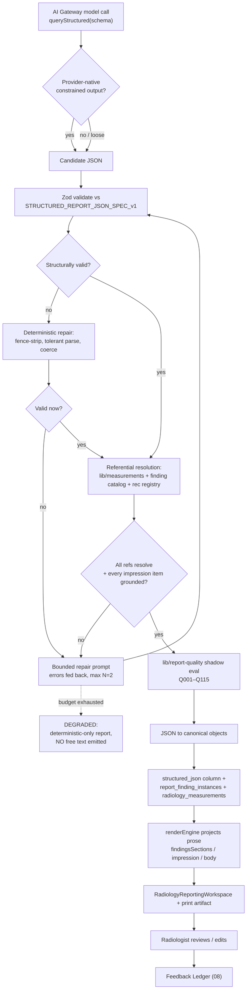

# 06 — AI Report Generation: Structured JSON First, Prose Last

**Purpose.** This section rules on *how* a **Provisional Report** is generated: the AI Gateway (`04`) must emit a **validated structured JSON document first**, and the reporting engine derives free text from that JSON — never the reverse. It argues the case rigorously (determinism, registry validation, quality-gate evaluability, provenance binding, prior-comparison diffability, research capture, safety, i18n, and Constitution alignment), defines the **Provisional Report JSON** as an AI-producer *profile* of the already-frozen `docs/STRUCTURED_REPORT_JSON_SPEC_v1.md` (D1) rather than a competing format, specifies the JSON→canonical-engine mapping so an AI draft is structurally indistinguishable from a human one, and pins down the schema-validate/repair loop that replaces today's fragile `result.match(/\{[\s\S]*\}/) + JSON.parse` pattern. It owns the *generation contract*; the lifecycle that invokes it lives in `05`, the provider mechanics in `04`.

---

## 1. The decision: JSON is authored, prose is projected

Today the stack has **no JSON-contract enforcement** anywhere — `generateAiForTask()` returns a raw `{ text }`, and every structured consumer (teaching endpoints, `lib/integrations-gemini-ai` OCR helpers) hand-rolls fence-stripping with a silent text fallback. That is exactly the anti-pattern this section forbids. The rule is one sentence, inherited verbatim from D1 §0.1:

> **The JSON is the source of truth for structure; prose is a projection.**

An AI producer writes the `structured_json` document. The **same deterministic renderer** that already projects human-authored structured findings (`renderEngine` + `smartFindings` inside `RadiologyReportingWorkspace.tsx`) then produces `findingsSections`, `impression`, and the `patient_reports.body` prose. The model never writes narrative prose that lands in a report body. This is not a stylistic preference — it is the only design in which the following nine guarantees hold simultaneously.

| # | Property | Why free-text-first cannot deliver it |
|---|---|---|
| 1 | **Determinism** | Two runs of the same model on the same study yield different sentences but should yield the *same clinical claims*. Diffing/validating prose is undecidable; diffing a `findings[]` array of `finding.*` refs + measurement `lid`s is exact. |
| 2 | **Registry validation** | Every `meas.*` value resolves against `lib/measurements` (`resolveMeasurement`, unit families, `normalRange`/`criticalRange`); every `finding.*` resolves against the B1/B2 catalog. Prose has nothing to resolve against — "6 mm CBD" in a sentence is un-checkable. |
| 3 | **Quality-gate evaluability** | `lib/report-quality` (`runQualityEngine`, rules Q001–Q115, the `report_quality_findings` shadow store) evaluates *structured atoms*. Phase-4 auto-generates one range rule per ranged measurement, reading thresholds from the registry at eval time. A gate cannot fire on a paragraph. |
| 4 | **Provenance / explainability binding** | The **Evidence Envelope** (`12`) binds confidence, images, and reasoning to a specific atom via its `lid`. Prose has no atoms to bind to, so AI text becomes indistinguishable from radiologist text — the medico-legal gap CRIT-flagged in the risk review. |
| 5 | **Prior-comparison diffability** | `radiologyComparison.ts` + `lib/measurements/compare.ts` compute deltas per canonical measurement id using `comparisonStrategy`. Two prose reports cannot be diffed into progression/regression/stable. |
| 6 | **Research-data capture** | The **Research Data Mart** (`13`) is built from coded structured reports. Free text yields nothing queryable — the current stores are "prose + CSV-in-column + un-indexed jsonb". |
| 7 | **Safety — no ungrounded prose** | Every impression item and recommendation must cite a supporting finding/measurement `lid` (D1 source-traceable law). An ungrounded atom is *rejected by validation*; an ungrounded sentence would ship. |
| 8 | **i18n / templating** | Pinned `sentence` / `impression_fragment` strings and `structured_report_templates` + `report_translations` render per-locale from one coded document. Translating generated prose loses the coded anchor. |
| 9 | **Constitution alignment** | Principle 4 **Deterministic Before AI**, Principle 3 **Content over Code** (clinical behaviour lives in versioned registries, engines only interpret), Principle 5 **AI Advises, Humans Decide**. JSON-first *is* the deterministic layer AI feeds. |

---

## 2. The Provisional Report JSON — an AI-producer profile of D1

The Provisional Report is **not a new schema**. It is a `kind: radiology.structured_report` document (`schema_version` `1.0.0`) written to the D1-defined columns `radiology_report_drafts.structured_json` / `patient_reports.structured_json` (`jsonb`, nullable, additive — see D1 §13), landing first in the AI-draft store `ai_reporting_drafts`. It obeys every base rule in `STRUCTURED_REPORT_JSON_SPEC_v1.md`; this section only defines the **AI overlay** — the constraints that make a base document a *provisional AI draft*. The section brief's required members map onto the base envelope as follows (referenced, not re-specified):

| Brief requirement | D1 home | AI-overlay obligation (this section) |
|---|---|---|
| Study context | `study_context` (§3.1) | Populated from the **Canonical Study Object** (`03`) — `studyInstanceUID`, modality, protocol, region resolved via `lib/studyRegion.ts`. |
| Per-organ findings with codes | `findings[]` (§3), `finding.*` refs | Each finding tagged with its **Organ Companion** origin (`09`) and `confidence_band`; grouped by resolved body region. |
| Measurements with provenance | `measurements[]` (§4), `meas.*` | Every value carries **Measurement Provenance** (`seriesUid + sopUid + frameNumber + extractionMethod + confidence`); `finding_ref` non-null (D1 §4). |
| Impression items, ranked | `impression` (§7) | Items ordered by clinical priority; **every item cites ≥1 supporting `lid`** — no ungrounded impression. |
| Recommendations → Recommendation Registry | `recommendations[]` (§6), `rec.*` | Resolve against `lib/clinicalRecommendations.ts` (the Recommendation Registry); no free-text advice. |
| Comparison deltas | overlay `comparison{}` per atom | Computed by `radiologyComparison.ts` + `compare.ts`; direction ∈ progression/regression/stable/new/resolved. |
| Confidence + evidence refs | overlay `confidence_band` + `evidence_ref[]` | Three-band, **no percentages**; `evidence_ref` points into the Evidence Envelope (`12`). |
| Safety flags | `critical_flags[]` (§3.6), `crit.*` | Plus the ungrounded-atom guard and the `ai.guarding` never-auto-sign block. |

### 2.1 The overlay, precisely (short type sketch)

```ts
// AI-only fields attached to each finding / measurement / impression item.
// Everything else is base D1. `additionalProperties:false` admits these via the ^x_ channel
// or as first-class provisional fields owned by the lib/report-contract package, which formalizes
// and extends the v1 spec via its $defs overlay (lib/api-zod only re-exports transport wrappers).
type ProvisionalAtomOverlay = {
  confidence_band: "routine" | "worth_a_look" | "attention"; // master-spec bands, NO % shown
  evidence_ref: string[];        // lids into the Evidence Envelope (12): images, heatmaps, reasoning
  companion: string;             // Organ Companion key that produced this atom (09)
  comparison?: {                 // present only when a prior study is linked (10)
    prior_lid?: string;
    direction: "progression" | "regression" | "stable" | "new" | "resolved";
    delta?: number; percent_change?: number; // per comparisonStrategy in lib/measurements
  };
};
```

**Confidence bands are a presentation projection, not a probability.** The master design spec mandates three honest bands with **no percentages**; the raw numeric `confidence` (0–1) stays in Measurement Provenance and the Evidence Envelope. The mapping is a fixed, versioned table, never a model free-choice:

| Band | Surface intent (master spec) | Backing signal |
|---|---|---|
| `routine` (◌) | silent / normal baseline | high provenance confidence, in-range measurements |
| `worth_a_look` (△) | margin card | borderline range, moderate model confidence |
| `attention` (✕) | interrupt-budget candidate | `critical_flags` present or low-confidence high-stakes finding |

### 2.2 Anti-laundering: AI drafts are structurally identical, provenance is not

After conversion (§4) an AI-authored document is **byte-for-byte structurally indistinguishable** from a human-authored structured report — same `findings[]`, same `meas.*` resolution, same renderer output. The *only* difference is the mandatory `ai` block (D1 §9) and the per-atom AI pin in `provenance` (D1 §8): `model`, `prompt_digest`, input hash. This is deliberate. Indistinguishable **structure** is what lets the one canonical engine render AI and human drafts identically (One Engine); distinguishable **provenance** is what satisfies the authorship gate (feature 20) and the segment-level shading the risk review found missing today. `ai.guarding.signed` is always `false` on a Provisional Report — the AI-never-auto-signs invariant (`aiReporting.ts` guard) is encoded in the document, not merely in a route.

---

## 3. Generation and the validate/repair loop

The AI Gateway calls a **structured** variant of `generateAiForTask` — `queryStructured(taskKey, prompt, images, schema)` — that requests provider-native constrained output where available and validates unconditionally where not. This is the highest-leverage missing primitive identified in the recon.

| Provider | Native constraint used | Fallback |
|---|---|---|
| OpenAI | `response_format: json_schema` | Zod validate + repair |
| Gemini | `responseSchema` / `responseMimeType` | Zod validate + repair |
| Anthropic | tool-use forced schema | Zod validate + repair |
| Ollama (local, MedGemma/Qwen-VL) | `format: json` | Zod validate + repair (primary path — local models honour the schema loosely) |



**The loop never emits ungrounded prose as an escape hatch.** If structural repair, referential resolution, and the bounded re-ask (max N attempts, validation errors fed back into the prompt) all fail, the pipeline returns `degraded` and the study falls back to a deterministic-only skeleton report — exactly the graceful degradation the Gateway contract (`04`) and safety model (`14`) require. A malformed model response is *dropped*, never salvaged into a paragraph. Every attempt, repair, and outcome is written to `ai_reporting_audit_logs` under the tamper-evident hash chain (`15`).

---

## 4. JSON → canonical-engine mapping

Conversion is a pure, deterministic transform from the validated document to the **same objects the workspace and print artifact already render**. There is no AI-specific rendering path — that is the point of One Engine.

| Provisional Report JSON | Canonical object written | Renders as |
|---|---|---|
| `findings[]` (`finding.*` + params) | `report_finding_instances` rows / `smartFindings` entries | Findings section, via `renderEngine` |
| `measurements[]` (`meas.*` + provenance) | `radiology_measurements` / `viewer_measurements` (registry-resolved `measurementId`) | Measurement tables + inline sentences |
| `impression` (ranked, grounded) | Impression items | Impression section |
| `recommendations[]` (`rec.*`) | Recommendation entries | Recommendation section |
| `critical_flags[]` (`crit.*`) | `critical_findings` escalation lifecycle | Critical-finding banner + escalation |
| `comparison{}` per atom | Prior-comparison rows | Delta brief / prior tab |
| whole document | `structured_json` (jsonb) + `content_sha256` at sign | Frozen, content-hashed record |

Because the AI writes the **same** `structured_json` a human structured report writes, the workspace loads an AI draft through the identical code path as a human draft; the radiologist edits it in place, and edits are captured as suggestion-vs-edit diffs in the **Feedback Ledger** (`08`) — no auto-retrain. On finalize, the document freezes under `content_sha256` (D1 §10) and the pinned `sentence`/`impression_fragment` strings render identically for the full retention period.

### 4.1 Annotated JSON skeleton

```jsonc
{
  "schema_version": "1.0.0",
  "kind": "radiology.structured_report",
  "document_id": "01J9Z6Q2K7X8Y0AB3C4D5E6F7G",   // ULID, minted once
  "catalog_snapshot": { "content_pack_versions": { "neuro.mri": "2.1.0" } },
  "study_context": { "modality": "MR", "region": "brain" },  // from Canonical Study Object (03)
  "findings": [
    { "lid": "f1", "definition_ref": "finding.brain.lacunar_infarct",
      "laterality": "lat.left",
      "confidence_band": "attention",              // AI overlay — no % shown
      "companion": "companion.brain",              // Organ Companion (09)
      "evidence_ref": ["ev_img_3", "ev_reason_1"] } // into Evidence Envelope (12)
  ],
  "measurements": [
    { "lid": "m1", "meas_ref": "meas.lesion_diameter", "finding_ref": "f1",
      "value": 8, "unit": "mm",
      "provenance": { "seriesUid": "1.2...", "sopUid": "1.2...", "frameNumber": 42,
                      "extractionMethod": "ai_normalize", "confidence": 0.86 },
      "comparison": { "prior_lid": "m1@prior", "direction": "progression",
                      "delta": 2, "percent_change": 33.3 } }  // radiologyComparison + compare.ts
  ],
  "impression": { "items": [
    { "lid": "imp1", "rank": 1, "supports": ["f1", "m1"],     // grounded — cites lids
      "impression_fragment": "Enlarging left lacunar infarct." } ] },
  "recommendations": [ { "lid": "r1", "rec_ref": "rec.followup_mri_3mo", "supports": ["f1"] } ],
  "critical_flags": [],
  "ai": { "guarding": { "signed": false }, "prompt_digest": "sha256:...", "model": "medgemma" },
  "provenance": { "authored_by": "ai", "gateway_task": "radiology_draft" },
  "audit": { "content_sha256": null }               // stamped only at sign
}
```

---

## 5. What this section deliberately does not do

It does not redefine the D1 envelope, invent a second measurement or finding vocabulary, or add a rendering path. It does not permit any route to persist model prose into a report body. It does not let the AI sign. It reuses `fetchStudyImages()` as the single image path, `generateAiForTask`/`resolveTaskRoute` as the routing seam (behind which the queue and GPU scheduler of `07` sit), and the existing shadow-first strangler discipline of `lib/report-quality` — no user-visible blocking until parity is proven.

---

## Cross-references

- `docs/STRUCTURED_REPORT_JSON_SPEC_v1.md` — the **base D1 contract** this section profiles; all field-level semantics (`study_context`, `findings`, `measurements`, `impression`, `recommendations`, `critical_flags`, `provenance`, `ai`, `audit`, `content_sha256`) live there.
- `03-canonical-data-model.md` — the **Canonical Study Object** that populates `study_context`; the `structured_json` columns on `radiology_report_drafts` / `patient_reports`.
- `04-ai-gateway.md` — `queryStructured`, provider-native constrained output, and the `degraded` fallback the repair loop terminates into.
- `05-study-pipeline-and-dataflow.md` — the **Study Processing Pipeline** state machine that requests the Provisional Report and consumes `degraded`.
- `08-learning-and-feedback-system.md` — the **Feedback Ledger** that captures radiologist suggestion-vs-edit diffs on the converted draft.
- `09-organ-companions.md` — the per-region **Organ Companions** that emit the `companion`-tagged findings.
- `10-prior-comparison-and-timeline.md` — `radiologyComparison.ts` deltas that fill the `comparison{}` overlay.
- `11-measurement-engine.md` — `lib/measurements` registry resolution, `comparisonStrategy`, and **Measurement Provenance**.
- `12-explainability.md` — the **Evidence Envelope** that `evidence_ref` points into.
- `13-research-database.md` — the **Research Data Mart** built from finalized coded documents.
- `14-safety-risk-and-failure-recovery.md` — never-auto-sign, no-ungrounded-prose, and degradation invariants.
