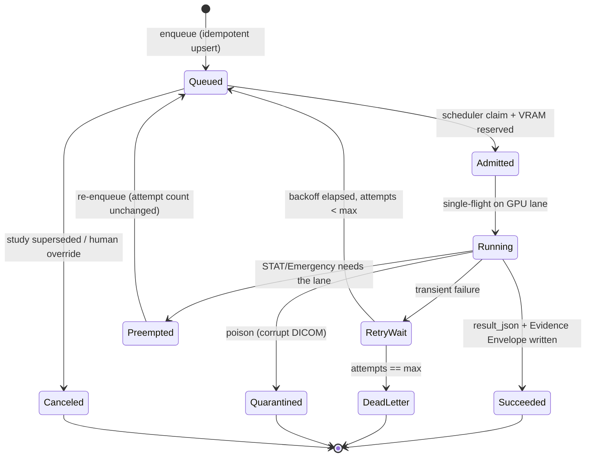
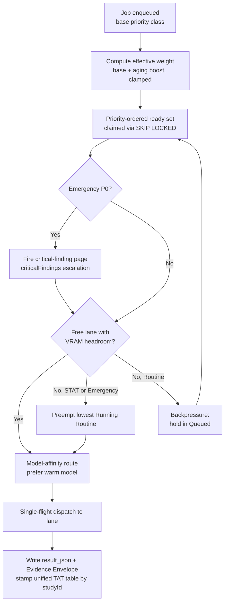

# 07 — Orchestration & Night Processing

**Purpose.** This section designs the execution engine that *drives* the Study Processing Pipeline (`05`): the background AI job queue, its worker, the retry and poison-message policy, GPU scheduling on the single Synology/Ollama node (scaling to a small GPU fleet), and the **priority lattice** (Emergency/STAT > VIP > Same-day > Routine backlog) with aging, preemption, and emergency paging. Today there is *no engine* — `ai_job_queue` (`lib/db/src/schema/radiologyWorkflow.ts`) is CRUD-only (POST inserts, PATCH flips status) with **no consumer**, and the GPU-inference config in `pacs_settings(category=ai_inference)` (surfaced by `AiInferenceSettings.tsx`: `batchSize`/`concurrency`/`warmUpOnStartup`/`requestPriority`/`cacheResults`/`maxRetries`) is persisted but *nothing executes it*. This document turns those two disconnected data models into one running scheduler. The engine sits **behind** the `generateAiForTask` / `resolveTaskRoute` / `AI_TASK_CATALOG` seam (`lib/ai-providers`) so callers stay synchronous-looking while work is actually queued, and it honors Constitution Principle 4 (**Deterministic Before AI**) and Principle 5 (**AI Advises, Humans Decide**): the queue never blocks the radiologist, and no job ever signs a report.

---

## 1. Where the queue sits, and the three processing modes

The ERP and the pipeline call `generateAiForTask(taskKey, ...)`. For the AI-analysis stage S6 (`05`), that call **enqueues** rather than blocks: it upserts an `ai_job_queue` row and returns a job handle; the workspace shows "AI Draft pending" via `radiology_worklist.aiDraftStatus` and hydrates when `result_json` lands. We do **not** invent a new table — `ai_job_queue` already carries the right shape (`studyId`, `jobType`, `priority`, `retryCount`, `gpuMode`, `confidenceScore`, `result_json`, `humanOverridden`); we add a worker, a state machine, and the missing scheduler columns.

Three processing modes share one queue and one priority order:

| Mode | Trigger | Latency posture |
|---|---|---|
| **Near-real-time** | STAT / Emergency arrival (S0), or radiologist opens a study with no draft | Admitted immediately; preempts Routine if lanes are saturated |
| **Overnight batch** | Routine studies acquired during the day | Drained after hours against warm model pools; large model warm-window amortized |
| **Scanner-idle window** | Bridge reports no active C-STORE for *N* minutes (`scanSessions` / continuous-scan idle signal) | Opportunistic Routine drain; yields instantly when a STAT job arrives or scanning resumes |

Idle-window detection reuses the acquisition signal the bridges already emit; the scheduler treats "scanner busy" as backpressure on Routine, not a hard gate.

---

## 2. The job model and its state machine

**Identity & idempotency.** A job is keyed by the study surrogate plus the work it represents: `(studyId, jobType, inputHash)`. `studyId` is the existing integer `study_id` FK already on `ai_job_queue`, referencing the Canonical Study Object's order/financial spine row; `inputHash` is a new `input_hash` text column holding a SHA-256 over the normalized tuple `{ sorted SOPInstanceUIDs (series manifest) of the analyzed series, promptTemplateVersion, provisionalReportSchemaVersion }`. It hashes **input content, not model identity**: `modelVersion` is deliberately not part of the key, so re-running identical inputs is deduped, while a model upgrade that must re-analyze prior studies is an explicit, audited reprocessing job (a new row via a reprocess flag), never a silent key collision. This is the same key `05` records for stage S6. Enqueue is an **idempotent upsert**: re-arrival of the same study/hash, a duplicate bridge push, or a worker replay collapses onto the existing row instead of double-inferring. `jobType` distinguishes routable units (`radiology_draft`, `image_review`, `report_enhancement`, `compare`, per `AI_TASK_CATALOG`) so a study can have several jobs without collision. The `input_hash` column and its unique index are added to `ai_job_queue` backward-compatibly (nullable → backfill → enforce).

**States** (server-enforced, mirroring the draft-lifecycle discipline of `05` — string convention is replaced by guarded transitions):

`Succeeded` writes `result_json`, `confidenceScore`, and the Evidence Envelope pointer (`12`), and flips `radiology_worklist.aiDraftStatus` to `AI_DRAFT_READY`. `humanOverridden` short-circuits any pending job to `Canceled` the moment a radiologist starts authoring — AI must never race the human (Principle 5). Terminal states (`Succeeded`/`DeadLetter`/`Quarantined`/`Canceled`) are immutable; every transition writes the hash-chained `audit_logs` via `auditLog()` (`lib/audit.ts`) so the engine's decisions are part of the tamper-evident trail, not best-effort `.catch(()=>{})` side-writes.

---

## 3. Retry, dead-letter, and poison quarantine

**Retryability class per failure**, not per job. The worker classifies the provider/GPU error and only re-enqueues *transient* faults:

| Failure | Class | Action |
|---|---|---|
| Provider timeout, 5xx, GPU OOM at admission, Ollama endpoint unreachable (`100.79.100.41:11434`) | Transient | `RetryWait` → backoff → `Queued` |
| Schema-invalid model output after the `06` repair loop exhausts | Semi-transient | One retry with stricter prompt binding, then `DeadLetter` (draft simply absent — radiologist authors unaided) |
| Corrupt / non-parseable DICOM, missing pixel data, decode failure | **Poison** | `Quarantined` immediately — **no retry** |
| Study superseded, human took over | Terminal | `Canceled` |

**Backoff.** Exponential with jitter: `delay = min(base * 2^attempt, cap) ± jitter`, defaults `base = 30s`, `cap = 15min`, `maxAttempts = 5` (reusing the `maxRetries` intent from `pacs_settings`). `retryCount` on the existing row is the attempt counter; `Preempted → Queued` does **not** increment it — preemption is not a failure.

**Dead-letter.** After `maxAttempts`, the job moves to `DeadLetter` — a filtered view over `ai_job_queue` (`status = dead_letter`), not a new table. Dead-letter is operationally visible and replayable by an admin, but it is **never** a blocker: a study with a dead-lettered draft is a study the radiologist reads without AI, exactly as today. This is Principle 4 in the failure path.

**Poison quarantine.** Corrupted DICOM is quarantined on first contact so it can never wedge a GPU lane in a crash loop. The quarantine reason and offending `sopUid` are recorded; the study still routes to the worklist for human reading (the corruption is a rendering/AI concern, not a reason to hide the study). Recovery of quarantined studies is owned by `14`.

---

## 4. GPU scheduling — single node to small fleet

The only real inference backends are the cloud HTTP APIs and the Ollama node on the Synology NAS (Tailscale `http://100.79.100.41:11434`; models MedGemma / Qwen-VL / gemma3 / gpt-oss). The scheduler models each GPU as a **lane** and enforces four rules:

1. **Single-flight per GPU.** One in-flight inference per lane. Ollama serializes anyway; making it explicit prevents VRAM thrash and gives honest latency accounting. A `single_flight` claim is held for the lane's duration.
2. **Model warm-pools.** Loading a vision model into VRAM is the dominant cost. The scheduler keeps a small set of models resident and **routes to a lane that already has the target model warm** before evicting. `warmUpOnStartup` (today dead in `pacs_settings`) becomes the real warm-pool seed. Overnight batch is ordered to *group jobs by model* so a warm model is amortized across a run instead of reloaded per study.
3. **VRAM-aware admission.** A job is `Admitted` only if the target lane's free VRAM ≥ the model's footprint (plus headroom). If no lane can host the model without eviction, and the job is Routine, it stays `Queued` (backpressure); if it is STAT/Emergency, the scheduler evicts the coldest idle model or preempts (see §5).
4. **Model-affinity routing.** `jobType` → model comes from `resolveTaskRoute` / `ai_model_routes` (unchanged seam). The scheduler adds a *placement* decision on top of the *provider* decision: which lane, given warmth and VRAM. When the fleet is one GPU, affinity degenerates to "the lane"; the same logic scales to N lanes with zero caller change.

The dead `pacs_settings(category=ai_inference)` fields collapse into scheduler config: `concurrency` → lanes × single-flight, `batchSize` → overnight model-grouping batch, `warmUpOnStartup` → warm-pool seed, `requestPriority` → default priority class, `maxRetries` → §3 cap, `cacheResults` → dedupe on `inputHash`. One config surface, one consumer.

Health feeds placement. `ai_provider_health` / `ai_provider_health_logs` stops being log-only: a lane whose recent health probes fail is drained (no new admits), and `resolveTaskRoute` failover to a cloud provider is triggered for STAT/Emergency jobs when the local node is unhealthy — routing and failover become **health-aware**, closing a gap the baseline flags.

---

## 5. Priority lattice, aging, preemption, and emergency paging

Every job carries a **priority class**. Effective ordering is `effectiveWeight = baseWeight + agingBoost`, where `agingBoost` grows with wait time but is **clamped below the floor of the next-higher class** — so a starved Routine job climbs steadily yet can never overtake a fresh STAT job. This gives starvation-freedom without inverting clinical priority.

| Class | Trigger source | SLA — AI provisional ready | Scheduling behavior |
|---|---|---|---|
| **P0 Emergency** | `radiology_critical_findings` red flag, ED/trauma order, STAT + critical suspicion | **≤ 5 min**, near-real-time | Jumps to head; **preempts** the lowest-weight Running Routine; **pages a radiologist** (see below) |
| **P1 STAT** | `radiology_worklist.priority = STAT`, inpatient urgent | **≤ 15 min** | Front of ready set; preempts Routine only if all lanes busy beyond a hold threshold |
| **P2 VIP** | Patient/referrer VIP flag | **≤ 30 min** | Ranks above Same-day; **no preemption** (never delays clinical urgency for VIP) |
| **P3 Same-day** | Routine, same calendar day | **≤ 4 h** (business hours) | FIFO within class; aged |
| **P4 Routine backlog** | Overnight/idle-window batch | **Next morning** | Batched by warm model in scanner-idle windows; lowest weight; aged so it always eventually runs |

**Preemption rules.** Only P0/P1 preempt, and only Running **Routine** (P3/P4) — never a P2+ job mid-flight, never another STAT. A preempted job returns to `Queued` with its attempt count intact and its partial work discarded (inference is not resumable mid-token); it re-runs cleanly. Preemption is bounded: a lane can be preempted at most once per configurable window to avoid livelock under a STAT flood, after which the scheduler waits for natural completion.

**Emergency jumps the queue *and* pages.** A P0 job runs two paths in parallel. (1) The AI path is admitted ahead of everything and may preempt. (2) The **paging path** is independent of AI and fires immediately on the deterministic critical-finding signal — it does not wait for, or depend on, the model. It writes the `radiology_critical_findings` / `critical_findings` escalation lifecycle (`pending_notification → notified → acknowledged → escalated`) and, where LOW confidence or unattended, triggers `peer_review_assignments`. Because paging is AI-independent, an Emergency reaches a human **even if the AI job dead-letters or the GPU is down** — Principle 4 at the highest stakes.

---

## 6. Backpressure & concurrency caps

The queue is bounded at every level so a night-time surge degrades gracefully instead of collapsing:

- **Lane cap:** one in-flight per GPU (single-flight); global in-flight = lane count.
- **Admission cap:** a max `Admitted`-but-not-`Running` reservation depth so the scheduler doesn't over-commit VRAM.
- **Per-class ready caps:** Routine admission is throttled while STAT/Emergency depth is non-zero, and while the scanner is actively storing (idle-window backpressure).
- **Cloud spill (optional, flagged):** when local lanes are saturated *and* a job is STAT/Emergency *and* `fallbackToCloud` is enabled, the scheduler spills that job to a cloud provider via the existing routing seam rather than making a time-critical read wait. Routine never spills (cost + PHI-egress posture, see `15`).

Backpressure is expressed *in the queue*, not by dropping work: excess jobs remain `Queued`, correctly ordered, and drain as capacity frees. Enqueue never blocks a route handler.

---

## 7. Observability — queue depth, GPU utilization, TAT

The engine emits three metric families, each landing in an **existing** store:

- **Queue depth & age** — per class and per `jobType`, plus oldest-waiting age (the aging signal). Derived from `ai_job_queue`; dead-letter and quarantine counts are first-class alerts.
- **GPU utilization** — lane busy fraction, model-warm hit rate, eviction/reload count, VRAM headroom. Lane health rides on `ai_provider_health` / `ai_provider_health_logs`, which now *feeds* placement and failover (§4), not just dashboards.
- **Turnaround time** — the engine stamps arrival→admitted→running→succeeded onto the TAT layer. The baseline has **two** TAT tables (`turnaround_times` keyed by `worklistId`, `radiology_tat_tracking` keyed by `studyId`, plus `study_tat_metrics`); these converge onto **one** unified turnaround table keyed by the Canonical Study Object via the integer `studyId` surrogate, and the engine writes each stage's **AI-stage segment** (time-in-queue, GPU time, retries) to that unified table keyed by `studyId` — **not** to `turnaround_times` keyed by `worklistId` — so end-to-end TAT (arrival → provisional → final sign) is reconstructable from one place with no cross-table join. TAT breaches per priority class are the SLA alarms in the table above.

These three are the KPIs `16` (performance/scalability) reads to decide when one GPU must become several.

---

## 8. Queue technology decision — Postgres `SKIP LOCKED`

**Decision: a Postgres-backed queue over `ai_job_queue`, dequeued with `SELECT … FOR UPDATE SKIP LOCKED`, waking workers via `LISTEN/NOTIFY`.** No Redis, no NATS, for the NAS-first deployment.

| Option | Verdict for a single Synology NAS |
|---|---|
| **Postgres + `SKIP LOCKED`** | **Chosen.** Zero new infrastructure — PostgreSQL is already the system of record via Drizzle. The claim (`FOR UPDATE SKIP LOCKED` over the priority-ordered ready set) is transactional **with** the Canonical Study Object and audit writes, so enqueue/dequeue/result are one durable unit — no dual-write between a broker and the DB. Survives NAS restart with no separate persistence config. Idempotency is a unique index on `(studyId, jobType, inputHash)`; the `input_hash` column and its unique index are added to `ai_job_queue` backward-compatibly (nullable → backfill → enforce). `LISTEN/NOTIFY` gives near-real-time wakeups for STAT without polling latency. Throughput (a clinic's study volume, not millions/sec) is far inside what `SKIP LOCKED` handles. |
| Redis (Streams / RQ) | Rejected. Adds a second stateful service competing for scarce NAS RAM against warm models; default durability is weaker than the DB; reintroduces the broker-vs-DB dual-write the chosen option avoids. Its throughput ceiling is irrelevant at this scale. |
| NATS JetStream | Rejected for now. Excellent for multi-node fan-out, but it is a distributed-systems component with its own ops, storage, and failure modes — unjustified on a single node and counter to the NAS-first, minimal-moving-parts posture. |

**Scaling path (owned by `16`).** The same table survives the small-GPU-fleet stage: multiple worker processes claim disjoint rows via `SKIP LOCKED` with no coordinator, and each worker owns one or more lanes. Only at genuine multi-hospital / multi-node fan-out does NATS JetStream become worth its complexity — a deliberate later migration, not a day-one dependency. The queue **contract** (idempotent upsert, priority claim, state machine) is broker-agnostic, so that migration never touches callers.

---

## What this section does and does not do

It **does**: give `ai_job_queue` a real worker + server-enforced state machine; unify the dead `pacs_settings(category=ai_inference)` config into one scheduler; make health-aware GPU placement, warm-pools, VRAM admission, and single-flight real; enforce the priority lattice with starvation-free aging and bounded STAT preemption; and run emergency paging **deterministically and independently of AI**.

It **does not**: invent a new queue table (extends `ai_job_queue`); block any radiologist on AI (dead-letter/quarantine/GPU-down all degrade to unaided reading); let a job sign a report or write prose into a report body; or duplicate the routing seam — the scheduler sits *behind* `generateAiForTask` / `resolveTaskRoute`.

---

## Cross-references

- `02-enterprise-and-service-architecture.md` — where the worker process sits in the service topology and its scaling envelope.
- `03-canonical-data-model.md` — the Canonical Study Object (identity spine `studyInstanceUID`) whose order/financial-spine row supplies the integer `studyId` surrogate the job key is built on, and the TAT-table consolidation this engine writes into.
- `04-ai-gateway.md` — the `generateAiForTask` / `resolveTaskRoute` / `AI_TASK_CATALOG` seam the queue hides behind, and the `ai_provider_health` signal that now drives failover.
- `05-study-pipeline-and-dataflow.md` — the pipeline stage **S6** this engine executes; the job key `(studyId, jobType, inputHash)` originates there.
- `06-ai-report-generation.md` — the structured-JSON repair loop whose exhaustion is the semi-transient dead-letter path in §3.
- `08-learning-and-feedback-system.md` — the Feedback Ledger written after a `Succeeded` draft is edited; no auto-retrain is triggered by the queue.
- `09-organ-companions.md` — the per-region Companion that assembles the S6 prompt each job runs.
- `12-explainability.md` — the Evidence Envelope written on `Succeeded`.
- `14-safety-risk-and-failure-recovery.md` — poison-quarantine recovery, critical-finding escalation, and the failure-recovery posture behind §3/§5.
- `15-security-model.md` — the PHI-egress rules governing optional cloud spill in §6.
- `16-performance-and-scalability.md` — the single-node → GPU-fleet → multi-node scaling path and the KPIs from §7 that trigger it.
