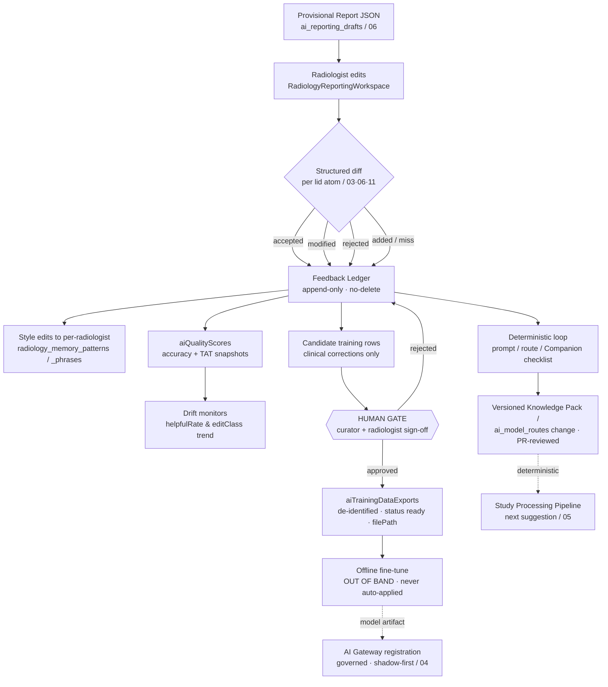

# 08 — Learning System / Feedback Ledger: Suggestion-vs-Edit Diffs, No Auto-Retrain

**Purpose.** The radiologist edits almost every AI draft, and today that edit evaporates: `POST /insert-to-report` (`aiReporting.ts`) flips a status flag and the signed text becomes indistinguishable from the model's, while `radiology_memory` counts usage but never feeds anything back into a prompt. This section defines the **Feedback Ledger** — the append-only store that captures the full `AI-suggestion → radiologist-edit → structured DIFF` chain for every atom of every **Provisional Report** (`06`), classifies each edit as *style* or *clinical correction*, and routes the signal three deterministic ways: analytics snapshots, **Content-over-Code** improvements (prompts, routes, **Organ Companion** checklists), and a human-gated curated dataset for **offline** fine-tuning. The governing invariant is absolute: **the platform never auto-retrains and never silently drifts.** Every model change is an out-of-band, human-approved, PR-reviewed event. This section owns the learning contract; the generation contract lives in `06`, the lifecycle in `05`, the provider mechanics in `04`.

---

## 1. Doctrine: capture everything, retrain nothing automatically

Four Constitution principles converge here. **Measure Before Building** demands we quantify where the AI is wrong before touching it. **AI Advises, Humans Decide** means the radiologist's edit is the ground truth, always outranking the model. **Content over Code** means we improve behaviour by changing *versioned clinical content* (prompt registries, Knowledge Packs, Organ Companion checklists, `ai_model_routes`) — never by an unreviewed weight update. **Backward Compatibility / no-delete** means the Ledger is append-only, like `audit_logs` and `patient_reports.body`.

The current stack already has the right *organs* but no *nervous system*: `radiology_memory_decisions` records `action ∈ {accepted, rejected, edited}` with `finalText` and `timeToDecideMs`; `radiology_memory_feedback` records explicit ratings; `aiQualityScores` aggregates helpful/needs-improvement/inaccurate; `aiTrainingDataExports` scaffolds a curated export. These are disconnected CRUD tables. The Feedback Ledger is the **spine that unifies them** and — critically — closes the loop that is "entirely absent today."

---

## 2. What we capture: the observable edit

The unit of capture is the **atom**, not the report. Because the Provisional Report is JSON-first (`06`), every finding, measurement, impression item, and recommendation carries a stable `lid`. When the radiologist finalizes in `RadiologyReportingWorkspace.tsx`, the signed structured document is diffed against the AI draft **per `lid`**, yielding one Ledger row per atom.

| Granularity | Source atom | What the diff yields |
|---|---|---|
| **Per-field** | `technique`, `clinical_history`, `study_context` | replaced / retained; edit distance on the coded value |
| **Per-finding** | `findings[]` (`finding.*` ref) | disposition + which sub-attributes changed (severity `sev.*`, laterality `lat.*`, location `loc.*`) |
| **Per-measurement** | `measurements[]` (`meas.*`) | value delta via `lib/measurements/compare.ts` using the definition's `comparisonStrategy`; unit corrections; provenance retained |
| **Per-impression** | `impression` items | reorder / reword / drop; whether the cited supporting `lid` survived |
| **Per-recommendation** | `recommendations[]` (`rec.*`) | swapped registry id vs free-text override |

Each atom is stamped with one **disposition**:

- **accepted** — AI atom survived unchanged into the signed report.
- **modified** — AI atom present but altered (the interesting case; carries the full before/after).
- **rejected** — AI atom deleted, no radiologist replacement.
- **added** — radiologist authored an atom the AI never suggested (a *miss*; the single most valuable signal for Companion-checklist gaps).

Plus two continuous metrics the brief mandates: **edit distance** (computed on the *structured/coded* representation — see §3, never raw Levenshtein on prose) and **time-to-edit** (`timeToEditMs`, from the moment the suggestion surfaced to the first keystroke against it — the existing `radiology_memory_decisions.timeToDecideMs` generalized). Together, disposition + edit distance + time-to-edit let analytics distinguish "AI is reliably right" (high accept, low distance) from "AI is confidently wrong" (low time-to-edit, high distance — the radiologist knew instantly it was wrong).

---

## 3. Diffing structured objects, not prose

Text diffing is undecidable for clinical intent: "no acute infarct" vs "no evidence of acute infarction" is a *zero-content* edit, while "6 mm" → "16 mm" is a critical one — yet a character diff scores the first larger. We therefore diff **only the coded document**, exploiting the same registries the rest of the platform uses:

1. **Align by `lid`.** Draft and signed documents share `lid`s (`06`), so alignment is exact, not heuristic. Unmatched draft `lid` ⇒ *rejected*; unmatched signed `lid` ⇒ *added*.
2. **Per-attribute comparison.** Findings diff over their `finding.*` sub-refs (severity/laterality/location) — each is a controlled vocabulary, so equality is well-defined. A severity downgrade `sev.severe → sev.moderate` is one countable, analyzable event.
3. **Measurements via `comparisonStrategy`.** Reuse `lib/measurements/compare.ts` so a measurement edit is expressed as `delta`/`percentChange`/`direction` per the definition's strategy (`absolute-change`, `percent-change`, `ratio-trend`, `presence`, `categorical`) — the same math the prior-comparison engine (`10`) uses. **Measurement Provenance** (`seriesUid + sopUid + frameNumber + extractionMethod + confidence`) is retained so we know whether the edit corrected an OCR misread or a genuine model error.
4. **Coded edit distance.** "Edit distance" = count of changed coded attributes + normalized measurement delta, not string distance. This is what makes the Ledger *analyzable* rather than a pile of text diffs.

This is only possible because prose is *projected* from JSON (`06`); it is the direct payoff of the JSON-first decision.

---

## 4. Style capture vs clinical correction — the load-bearing distinction

Every `modified` row is classified `editClass ∈ {style, clinical, none}`, and this classification governs where the signal is allowed to flow:

| editClass | Definition | Example | Where it flows |
|---|---|---|---|
| **style** | Same clinical claim, different expression/preference | "disc bulge" → "posterior diffuse disc bulge"; bullet → numbered impression | Per-radiologist `radiology_memory_patterns` / `_phrases` / `_impressions` — personalizes *presentation*, never the model's clinical output |
| **clinical** | The clinical claim changed | severity/laterality/measurement/finding presence altered | `aiQualityScores` accuracy signal + Organ Companion checklist review + candidate training row |
| **none** | Semantically identical (normalization only) | "infarct" ↔ "infarction" | Discarded from accuracy metrics; kept for audit only |

The distinction is derivable from the structured diff itself: a change confined to `sentence`/`impression_fragment` string variants with identical coded atoms is `style`; any change to a `finding.*`/`meas.*`/`sev.*`/`lat.*`/`loc.*`/`crit.*` code is `clinical`. **Style edits reshape the individual radiologist's memory (`radiology_memory` family) deterministically and are never exported as training corrections** — one radiologist's phrasing is not a model error. **Clinical corrections are the training and drift signal.** Conflating the two would teach the model a single reader's stylistic idiolect as if it were clinical truth — a classic silent-drift failure this design forbids.

---

## 5. The Feedback Ledger schema — built on what exists

We do **not** invent a parallel store. The Ledger is a thin canonical table plus a diff-record type, wiring the existing tables into defined roles:

| Existing asset | Role in the Feedback Ledger |
|---|---|
| `ai_reporting_drafts` / `ai_reporting_audit_logs` | The **suggestion** side: the Provisional Report atoms + `(provider, model, promptVersion, routeId)` lineage (extended per `06`'s immutable tuple requirement) |
| `radiology_memory_decisions` | The seed of the **per-atom disposition** (`accepted/rejected/edited`, `finalText`, `timeToDecideMs`) — generalized to all four dispositions and coded diffs |
| `radiology_memory_patterns` / `_phrases` / `_impressions` | Sink for **style** edits (per-radiologist personalization) |
| `radiologist_learning_settings.learningEnabled` | The **per-radiologist consent gate** — no capture when false |
| `aiQualityScores` | The **analytics rollup** (scope overall/modality/template/radiologist; helpful/needs-improvement/inaccurate; `qualityScore`; `avgTurnaroundMinutes`) |
| `aiTrainingDataExports` | The **human-gated curated dataset** (status `pending → processing → ready`, `minQualityScore`, `filePath`, `exportedById`) |
| `radiology_ai_review_audits` | Multi-provider provenance / winner selection feeding routing analysis |
| `audit_logs` hash-chain | Ledger writes and every export approval are recorded under the tamper-evident chain (`14`, `15`) |

The diff record — the one precise contract (rendered from the coded documents, persisted append-only):

```ts
type FeedbackDiffRecord = {
  id: string;
  studyInstanceUID: string;      // Canonical Study Object key (03)
  reportId: number;              // patient_reports linkage
  radiologistId: number;         // consent checked vs radiologist_learning_settings.learningEnabled
  companion: string;             // Organ Companion that emitted the atom (09)
  taskKey: string;               // AI_TASK_CATALOG key that produced the suggestion (04)
  model: { provider: string; name: string; promptVersion: string; routeId: number };
  atomPath: string;              // lid / JSON pointer into the Provisional Report JSON (06)
  atomKind: "field" | "finding" | "measurement" | "impression" | "recommendation";
  disposition: "accepted" | "modified" | "rejected" | "added";
  editClass: "style" | "clinical" | "none";
  suggested: unknown | null;     // coded AI atom (null when disposition = added)
  final: unknown | null;         // coded signed atom (null when disposition = rejected)
  codedEditDistance: number;     // changed coded attributes + normalized measurement delta
  timeToEditMs: number | null;   // suggestion-surfaced → first edit
  confidenceBand: "routine" | "worth_a_look" | "attention"; // as shown (12) — for calibration
  createdAt: string;             // append-only; no update, no delete
};
```

Storing `confidenceBand` alongside disposition is what lets us **calibrate confidence** (`12`): a band that says "routine" but is edited half the time is mis-calibrated, and that is a content fix (band-threshold registry), not a weight update.

---

## 6. Flow: suggestion → edit → diff → ledger → three sinks, with a hard human gate



The two arrows leaving the Ledger toward improvement are asymmetric by design: the **`J` path (Content over Code)** is fast, reversible, and PR-reviewed — it ships *today's* wins; the **`K/L/M` path (fine-tuning)** is slow, gated, and out-of-band. Note the flowchart has **no edge from any automated node back into a live model** — the only way a model changes is through the human gate `K` and the governed Gateway registration `N`.

---

## 7. Closing the loop deterministically (Content over Code)

Most learning happens *without touching a model at all*. The Ledger's aggregated clinical-correction patterns drive three deterministic, versioned changes:

- **Prompt tuning.** A recurring correction (e.g. the model omits Fazekas grading on brain MRI) becomes a line in the versioned prompt content — the Care-Diagnostics templates behind `radiologyOllama.ts` / the prompt registry feeding `generateAiForTask`. Changed as content, diffed in a PR, attributable, reversible.
- **Routing improvement.** If `aiQualityScores` scoped by `modality` shows one provider consistently corrected on CT while another is clean, that updates an `ai_model_routes` row (the `resolveTaskRoute` precedence in `04`) — a data change, not a code change. Health/quality feeding routing is the wiring "absent today."
- **Organ Companion checklists.** A cluster of **added** atoms (misses) for a region means the **Organ Companion** (`09`) checklist is incomplete. The fix is a new checklist item in that Companion's versioned content pack — the model is prompted to *look for* the thing it kept missing. Deterministic, inspectable, per-organ.

Every one of these is a **content edit to a versioned registry**, reviewed like any clinical-content change, so improvement is auditable and reversible — the antithesis of silent drift.

---

## 8. The human gate before any training export

Fine-tuning is the last resort, never automatic. The path from Ledger to a training set is deliberately effortful:

1. **Candidate selection.** Only `clinical`-class, non-rejected-by-quality rows above `aiTrainingDataExports.minQualityScore`, scoped by `modality` and date window, become candidates.
2. **De-identification.** Every candidate is stripped of PHI *before* a human sees the curated set (§9) — imaging references reduced to Provenance UIDs, patient identity removed.
3. **Curator + radiologist sign-off.** A named curator reviews the corrections and a radiologist signs off that the "ground-truth" edits are genuinely correct (a wrong edit must not become a training label). Rejected candidates return to the Ledger, never silently dropped.
4. **Export.** Approval flips `aiTrainingDataExports.status → ready`, writes `filePath` and `exportedById/Name`, and records the approval in the `audit_logs` chain. Nothing downstream is automatic — the export is a file a human hands to an **out-of-band** fine-tuning process.
5. **Re-entry only through the Gateway.** A resulting model artifact re-enters exactly like any new model: registered in `ai_provider_settings` / `ai_model_routes`, run **shadow-first** against live traffic until parity is proven (`04`, `14`), never hot-swapped.

---

## 9. Privacy, consent, and drift monitoring

**Consent.** Capture is gated per radiologist by `radiologist_learning_settings.learningEnabled` (default may be opt-in per site policy); a radiologist who disables it produces no Ledger rows. Patient-side, training-data use is governed by the same PHI regime as the rest of the platform (`15`): the Ledger stores coded atoms + study keys, not raw report bodies, and **no dataset leaves the de-identification boundary with PHI**. Because deployment is a single on-prem clinic (Deoghar / Synology NAS), local-first models mean corrections need never leave the premises; cloud fine-tuning requires an explicit, logged data-egress decision.

**Immutability.** Ledger rows and export approvals are append-only and written under the `audit_logs` hash-chain, so the learning record itself is tamper-evident and cannot be quietly rewritten to justify a model change after the fact.

**Drift monitoring.** `aiQualityScores` snapshots (scoped overall/modality/template/radiologist) are the drift dashboard: a falling `helpfulRate`, a rising `codedEditDistance` mean, a rising *clinical* editClass fraction, or a confidence band whose edit rate diverges from its label are all early-warning signals. Crucially, drift monitoring watches for change **in the live deterministic content and provider mix**, not for autonomous model movement — because by construction there is none. Any real model swap is a discrete, dated, PR-reviewed event, so a shift in metrics maps to a known change rather than to unexplained decay.

---

## Cross-references

- `03-canonical-data-model.md` — the **Canonical Study Object** (`studyInstanceUID`) that keys every Ledger row and its report linkage.
- `04-ai-gateway.md` — `AI_TASK_CATALOG` / `ai_model_routes` / `resolveTaskRoute` (routing improvements) and the shadow-first governed registration of any fine-tuned artifact.
- `05-study-pipeline-and-dataflow.md` — the **Study Processing Pipeline** that requests the Provisional Report and consumes deterministic loop improvements.
- `06-ai-report-generation.md` — the **Provisional Report JSON**, `lid` atoms, and the immutable `(model, promptVersion, input)` lineage tuple the Ledger records.
- `09-organ-companions.md` — the per-organ **Organ Companion** checklists that *added*-atom (miss) clusters improve as versioned content.
- `10-prior-comparison-and-timeline.md` — `radiologyComparison.ts` and the `comparisonStrategy` math reused for measurement diffs.
- `11-measurement-engine.md` — `lib/measurements/compare.ts`, `comparisonStrategy`, and **Measurement Provenance** retained on each measurement diff.
- `12-explainability.md` — the **Evidence Envelope** and confidence bands the Ledger calibrates against edit rates.
- `13-research-database.md` — the **Research Data Mart** that shares the same coded, de-identified substrate as curated training exports.
- `14-safety-risk-and-failure-recovery.md` — never-auto-sign, shadow-first, and the no-silent-drift invariant.
- `15-security-model.md` — PHI handling, de-identification boundary, consent, and `audit_logs` immutability governing training data.
