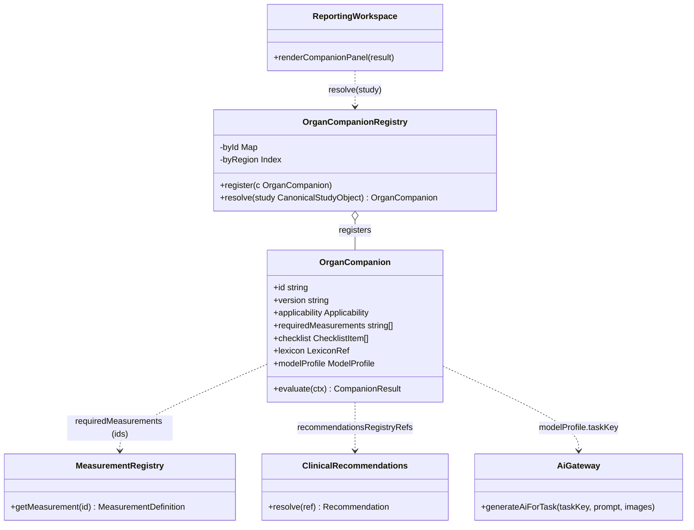
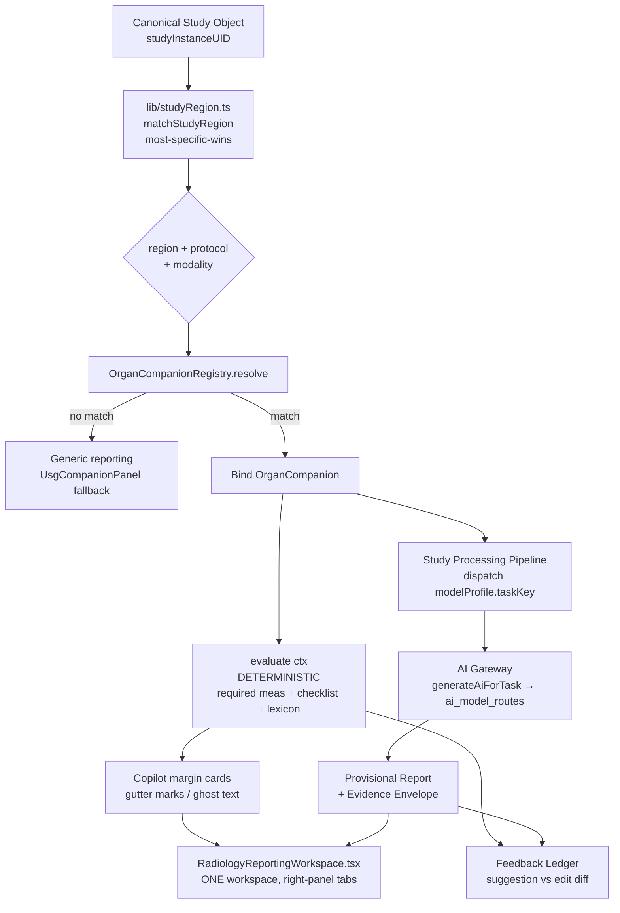

# 09 — Organ-Specific AI Companions (Goal 7)

**Purpose.** This section specifies the **Organ Companion** framework — the mechanism by which per-region clinical intelligence (Brain, Spine, Chest, Abdomen, Liver, Kidney, Prostate, Breast, OBGYN, Ultrasound, Doppler, Musculoskeletal) is expressed as *content*, not forked code. An Organ Companion is an independent, self-registering module that owns the templates, required measurements, systematic-search checklists, scoring lexicons (BI-RADS, PI-RADS, LI-RADS, TI-RADS, Lung-RADS, Bosniak, ASPECTS, Fazekas, modified Fisher), rules, and the model/prompt profile a region requires — but it plugs into the *one* Reporting Workspace and the *one* AI Gateway rather than standing up a parallel stack. Companions are the radiology-domain analogue of the ~20 self-registering deterministic Copilot modules (`copilotOrchestrator.ts` + `registerCopilotModule`) already in production: engines interpret, registries decide. This honours Platform Constitution principles **One Workspace**, **One Engine**, **Content over Code**, and **Deterministic Before AI**.

---

## 1. Design doctrine

The current codebase already contains the *raw material* of organ intelligence but not the framework: `radiology_spine_sessions`/`radiology_spine_levels`, `radiology_brain_sessions`, `radiology_tumor_followups` (from `radiologyOrganIntelligence.ts`) are passive structured-capture tables with **no AI agent and no memory→prompt loop** — `radiology_memory` counters are ranked by `usageCount`/`acceptanceCount` and *never injected into a generation prompt*. The Companion framework closes that gap without inventing new subsystems. It obeys four rules:

1. **Content over Code.** A Companion is a versioned registry object, not a new service. Adding the Kidney Companion must not require touching `RadiologyReportingWorkspace.tsx`, the AI Gateway, or the Study Processing Pipeline. Companions register via side-effect import exactly like Copilot modules, so the core has zero edits per organ.
2. **Deterministic Before AI.** A Companion's checklist, required measurements, and lexicon are pure/deterministic and evaluate *before* any model call. The `modelProfile` is the *last* thing consulted, and only to request a draft the radiologist must approve (**AI Advises, Humans Decide**).
3. **One resolver, most-specific-wins.** Companions are selected by the existing `lib/studyRegion.ts` `matchStudyRegion` resolver (most-specific-wins) keyed off the **Canonical Study Object** (`studyInstanceUID` → region/protocol/modality). No new dispatch mechanism.
4. **Reuse the canon.** Required measurements are **canonical ids** from `@workspace/measurements` (`MeasurementDefinition.id`, e.g. `STONE_SIZE`, `CBD`, `CANAL_AP`, `CORD_DIAMETER`, `DISC_HEIGHT`) — never per-organ constants. Recommendations reference `lib/clinicalRecommendations.ts`. Quality rules are the Phase-4 registry-driven shadow rules in `lib/report-quality`. Model routing goes through `generateAiForTask()` / `ai_model_routes` — the Companion *names a task*, the AI Gateway *chooses the model*.

---

## 2. The Companion contract

Every Companion implements one interface. This is a **data contract**, not a class hierarchy — a Companion is mostly declarative content plus a deterministic `evaluate` hook. TypeScript sketch (illustrative, not implementation):

```ts
interface OrganCompanion {
  id: string;                       // stable, immutable, e.g. "companion.liver"
  version: string;                  // additive-only semver; deprecate, never rename
  displayName: string;              // "Liver Companion"

  // --- Resolution: how the study→companion resolver matches this module ---
  applicability: {
    regions: string[];              // studyRegion keys (most-specific-wins via matchStudyRegion)
    modalities: Array<'US'|'CT'|'MR'|'XR'|'MG'|'BMD'>;
    protocolHints?: string[];       // radiology_protocols keys, e.g. "triphasic-liver"
    priority: number;               // tie-break when >1 companion matches
  };

  // --- Owned clinical content (Content over Code) ---
  requiredMeasurements: string[];   // canonical MeasurementDefinition ids ONLY
  checklist: ChecklistItem[];       // systematic-search / "don't-miss" list
  structuredFindingSchema: string;  // ref into STRUCTURED_REPORT_JSON_SPEC_v1
  lexicon: LexiconRef;              // BI-RADS | PI-RADS | LI-RADS | ... + version
  recommendationsRegistryRefs: string[]; // ids in lib/clinicalRecommendations.ts
  templateRefs: string[];           // structured_report_templates / knowledge_packs ids

  // --- AI request (names a task; never a model) ---
  modelProfile: {
    taskKey: string;                // AI_TASK_CATALOG key routed by generateAiForTask
    vision: boolean;                // needs fetchStudyImages() DICOMweb frames?
    promptPackId: string;           // versioned Knowledge Pack prompt assembly
    contextSources: Array<          // what the prompt-assembly layer injects
      'radiology_memory'|'radiology_lesions'|'organ_intelligence'|'priors'>;
  };

  // --- Deterministic hook (runs BEFORE any AI; pure) ---
  evaluate(ctx: CompanionContext): CompanionResult; // missing meas, checklist gaps, lexicon prompts
}
```

`evaluate` is pure and isomorphic (client + server), mirroring `lib/measurements` and `copilotOrchestrator`. It emits deterministic advisories (missing required measurement, un-scored lesion, unaddressed checklist item) that surface as Copilot margin cards. It **does not** call a model — that is the Study Processing Pipeline's job when it dispatches `modelProfile.taskKey` through the AI Gateway. Companion output is always **Provisional** and carries an **Evidence Envelope**; the AI-never-auto-signs invariant and the universal "AI Draft — Requires Radiologist Review" label are inherited from the platform, not re-implemented per organ.

---

## 3. Framework, registration, and resolution



Resolution flow, from the **Canonical Study Object** to a live Companion panel inside the *same* workspace:



Two properties are load-bearing. First, resolution is **deterministic and existing** — `matchStudyRegion` already powers the `UsgCompanionPanel`; Companions are additional matchers on the same resolver, not a new one. Second, everything downstream of the split converges back into the **one** `RadiologyReportingWorkspace.tsx`: deterministic advisories render as Copilot cards, the model draft becomes a **Provisional Report**, and the suggestion-vs-edit diff lands in the **Feedback Ledger** (see `08-learning-and-feedback-system.md`). No Companion forks the workspace, the queue, or the finalize contract (`lib/radiologyReportLifecycle.ts`).

---

## 4. The twelve companions

Each Companion is an independent registry object. The table gives its key **canonical measurement ids** (from `@workspace/measurements` — append-only), its **lexicon/scoring system**, and its top **must-not-miss** findings that the deterministic checklist enforces before AI runs.

| Companion | Key measurements (canonical ids) | Lexicon / scoring | Must-not-miss (checklist "don't-miss") |
|---|---|---|---|
| **Brain** | `MIDLINE_SHIFT`, `EVANS_INDEX`, `HEMORRHAGE_VOLUME` (ABC/2), ventricular size | **ASPECTS**, **Fazekas**, **modified Fisher** | Acute infarct / early ischemic change, intracranial hemorrhage, mass effect + herniation, hydrocephalus, SAH |
| **Spine** | `CANAL_AP`, `CORD_DIAMETER`, `DISC_HEIGHT`, canal/cord area | Modic, Pfirrmann, canal-stenosis grade | Cord compression / myelomalacia, cauda equina, unstable fracture, epidural collection, high-grade canal stenosis |
| **Chest** | Nodule long/short axis, `CTR` (cardiothoracic ratio) | **Lung-RADS**, Fleischner follow-up | Pneumothorax (esp. tension), large effusion, aortic dissection flap, PE filling defect, suspicious spiculated nodule |
| **Abdomen** | `CBD`, `STONE_SIZE`, appendix diameter, aortic diameter | Balthazar / CTSI (pancreatitis) | Free air / perforation, bowel obstruction, AAA, active bleed, appendicitis, bowel ischemia |
| **Liver** | Lesion size, portal vein diameter, liver span | **LI-RADS** | HCC (LR-5), portal/hepatic vein thrombus, biliary obstruction, ruptured lesion, macrovascular invasion |
| **Kidney** | `STONE_SIZE`, cyst size, cortical thickness | **Bosniak** (cystic), RENAL nephrometry | Obstructive hydronephrosis, renal infarct, complex (Bosniak III/IV) cyst, perinephric collection, RCC |
| **Prostate** | Prostate volume (ellipsoid), lesion size, PSA density | **PI-RADS v2.1** | PI-RADS 4/5 index lesion, extraprostatic extension, seminal-vesicle invasion, suspicious nodal disease |
| **Breast** | Lesion size, distance-from-nipple | **BI-RADS** | BI-RADS 4/5 mass, suspicious calcifications, architectural distortion, skin/nipple retraction, axillary nodes |
| **OBGYN** | `BPD`, `HC`, `AC`, `FL`, `CRL`, `FHR`, `AFI`, `EFW`, endometrium | Fetal biometry percentiles, AFI ranges | Absent/abnormal cardiac activity, previa/low-lying placenta, severe oligo/polyhydramnios, IUGR, ectopic, structural anomaly (Level-II) |
| **Ultrasound** (general) | `CBD`, `STONE_SIZE`, organ dimensions, wall thickness | **TI-RADS** (thyroid), gallbladder wall criteria | Free fluid (FAST), gallbladder perforation, thyroid TR4/TR5 nodule, torsion, abscess |
| **Doppler** | PSV, EDV, RI, PI, S/D ratio, waveform class | ICA stenosis (NASCET velocity), DVT compressibility | Critical carotid stenosis, DVT (non-compressible vein), arterial occlusion, portal-vein thrombosis, pseudoaneurysm |
| **Musculoskeletal** | Effusion depth, tear size, alignment angles | Tear grade (I–III), OA grade (KL) | Full-thickness tendon/ligament tear, occult/stress fracture, osteomyelitis, avascular necrosis, aggressive bone lesion |

Notes binding this table to the codebase: OBGYN measurement ids already exist as the 8 private-tag OB fields extracted by `usgExtractor.ts` (`parseGePrivateTagsWithProvenance`) and stored in `fetal_usg_measurements`; the OBGYN Companion also owns the **fail-closed PCPNDT Form-F gate** (`checkPcpndtFormFCompliance`, `pcpndtCompliance.ts`) — it does not re-implement it. Spine ids (`CANAL_AP`, `CORD_DIAMETER`, `DISC_HEIGHT`) already exist in the catalog and are the re-homing target for the free-text `spinal_measurements` columns (see `11-measurement-engine.md`). Any measurement a Companion needs that is *not* yet in `MEASUREMENT_CATALOG` is added there **append-only** (deprecate + `replacedBy`, never rename) so Phase-4 quality rules and the registry admin console pick it up automatically — Companions never introduce private measurement constants.

---

## 5. Composition with the Reporting Platform (no fork)

A Companion is a *tenant* of the workspace, never a copy of it. The seams it uses already exist:

- **Right-panel surface.** Companion deterministic output renders through the existing 8-tab right panel (`RightTab = copilot|quickselect|templates|followup|prior|ai|measurements|teaching`) and the Copilot hero cards — the same `copilotOrchestrator` pipeline. `UsgCompanionPanel` (which already serves US+CT) is the reference implementation; the 12 Companions generalize it. There is no per-organ panel component tree.
- **Templates & quick content.** `templateRefs` point at `structured_report_templates` / `knowledge_packs` / `radiology_quick_findings` / `radiology_quick_measurements` rows — Knowledge Packs are the applications, the platform is the OS. A Companion ships as pack content plus a registry entry.
- **AI dispatch.** The Study Processing Pipeline dispatches `modelProfile.taskKey` (an `AI_TASK_CATALOG` key such as `radiology_draft`) through `generateAiForTask()`; `ai_model_routes` resolves override→route→default and the ERP never learns which model answered (**AI Gateway** contract, `04-ai-gateway.md`). Vision-needing Companions reuse the single canonical image path `fetchStudyImages()` (Orthanc DICOMweb → `sharp` 512px → base64) — no duplicate acquisition.
- **Prompt assembly (the missing wire).** The Companion's `contextSources` tell the prompt-assembly layer to inject `radiology_memory`, `radiology_lesions`, and organ-intelligence rows into the prompt — the exact feedback loop that is *absent today*. This is where the passive organ-intelligence tables finally feed generation.
- **Measurements & quality.** Required-measurement gaps flow through `@workspace/measurements` and surface as Phase-4 shadow quality findings (`care.measurement.range.<id>`); nothing Companion-specific is hard-coded in `lib/report-quality`.
- **Safety & finalize.** Companions inherit the *one* finalize contract (`lib/radiologyReportLifecycle.ts`), the hash-chained `audit_logs` trail, `radiology_ai_review_audits` provenance, and the USG `runQualityCheck → HTTP 422` hard-block pattern. New Companion behaviour ships behind `ff_radiology_*` server flags (fail-safe to false), shadow-first, exactly like the universal quality engine.

The result: adding an organ is a **content** change (a registry entry + Knowledge Pack + any append-only catalog measurements + a routable task key), reviewable in the 🟡 Radiology zone, with zero edits to the workspace, the Gateway, or the pipeline.

---

## Cross-references

- `03-canonical-data-model.md` — the Canonical Study Object (`studyInstanceUID`) that `matchStudyRegion` resolves against.
- `04-ai-gateway.md` — `generateAiForTask()` / `ai_model_routes` task routing; how `modelProfile.taskKey` is resolved to a model.
- `05-study-pipeline-and-dataflow.md` — the Study Processing Pipeline that dispatches a Companion's model profile and produces the Provisional Report.
- `06-ai-report-generation.md` — structured-JSON-first generation and the `STRUCTURED_REPORT_JSON_SPEC_v1` schemas Companions reference.
- `08-learning-and-feedback-system.md` — the Feedback Ledger that captures Companion suggestion-vs-edit diffs (no auto-retrain).
- `11-measurement-engine.md` — `@workspace/measurements` canonical ids and Measurement Provenance every Companion depends on.
- `12-explainability.md` — the Evidence Envelope wrapping every Companion Provisional Report.
- `14-safety-risk-and-failure-recovery.md` — PCPNDT gate, hard-block policy, and `ff_radiology_*` shadow-first rollout Companions inherit.
