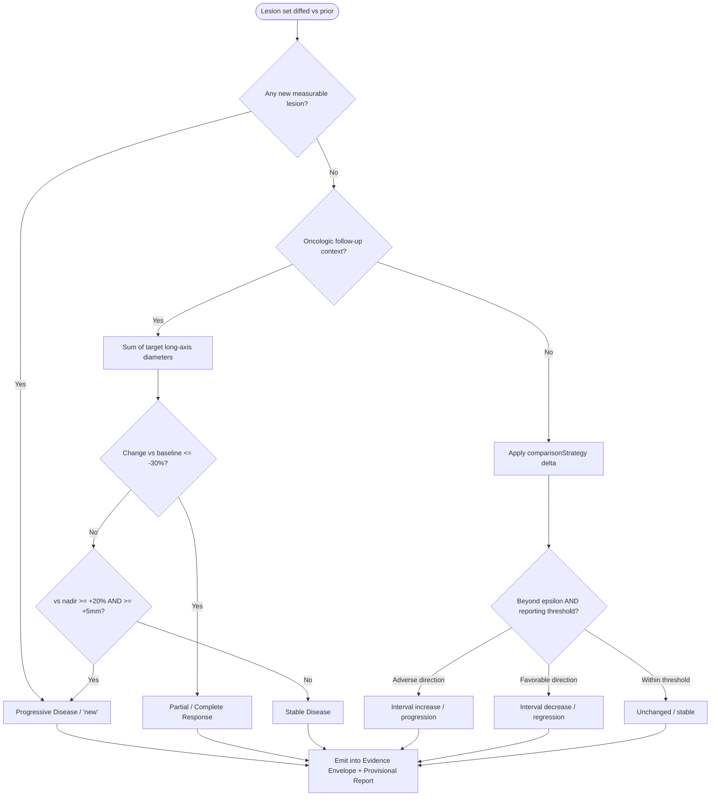
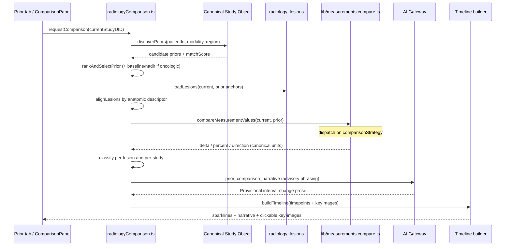

# 10 — Prior Comparison & Timeline

**Purpose.** This section designs how the platform compares a current study against the correct prior study of the same patient/region and produces a defensible interval-change verdict — progression, regression, or stable disease — plus an automatically generated longitudinal timeline. It builds directly on three existing assets: the client-side comparison engine `artifacts/diagnostic-erp/src/lib/radiologyComparison.ts` (surfaced through the **Prior** tab / `ComparisonPanel.tsx`), the longitudinal lesion registry `lib/db/src/schema/radiologyLesions.ts` (`radiology_lesions` + `radiology_lesion_timeline`), and the canonical measurement comparison logic `lib/measurements/src/compare.ts` driven by each `MeasurementDefinition.comparisonStrategy`. Nothing here auto-signs or auto-finalizes: comparison output is a **Provisional Report** contribution and every delta carries **Measurement Provenance** and rides inside the **Evidence Envelope** (see `12-explainability.md`). The comparison engine is deterministic-first (Principle 4); the **AI Gateway** only phrases the narrative, never invents the numbers.

---

## 1. Prior discovery — finding the right previous study

Discovery keys off the **Canonical Study Object** (see `03-canonical-data-model.md`), keyed by `studyInstanceUID`, so identity is stable regardless of which underlying table (`radiology_studies`, `radiology_worklist`, `dicom_studies`) a given consumer wrote. The candidate set is the set of finalized prior Canonical Study Objects for the **same patient** matched on three axes:

| Axis | Source of truth | Match rule |
|---|---|---|
| Patient identity | Canonical Study Object → patient | Exact patient id; **never** name/DOB heuristics for comparison (heuristic matching is only advisory, see §7) |
| Modality | study modality | Same modality preferred; cross-modality allowed only when explicitly requested (e.g. CT vs MR of same organ) and flagged |
| Body region | `lib/studyRegion.ts` `matchStudyRegion` (most-specific-wins) | Region must resolve to the same node or an ancestor/descendant in the region tree |

**Picking the "right" prior.** When multiple priors qualify, the engine ranks candidates and defaults to the **most recent finalized prior of the same modality and same resolved region** — this is the clinical "immediately preceding comparable study." Ranking factors, in precedence order:

1. Region specificity match (exact `matchStudyRegion` node beats ancestor match).
2. Same modality and same protocol family (`radiology_protocols`).
3. Report state = finalized (`REPORT_FINAL`/`verified`); an unfinalized prior is offered only as a labeled fallback.
4. Recency (most recent qualifying study).
5. Presence of tracked lesions in `radiology_lesions` for that study pair (a prior that already has a lesion baseline is preferred so the timeline is continuous).

**Multi-prior handling.** Oncologic follow-up needs more than the immediate prior. The engine therefore exposes two comparison modes:

- **Interval comparison** (default) — current vs single selected prior; drives the narrative "interval change" language.
- **Baseline + nadir comparison** — for RECIST-style oncology, current vs (a) the enrollment **baseline** study and (b) the **nadir** (smallest recorded sum of target-lesion diameters). Progression in RECIST is measured from nadir, response from baseline — so both anchors must be retrievable, not just the previous study. These anchor roles are persisted on the lesion timeline (§4) so they survive across sessions.

The radiologist can always override the auto-selected prior in the **Prior** tab; the override is recorded so the Evidence Envelope shows which prior was compared.

---

## 2. Registration & anatomic correspondence caveats

The platform does **not** perform voxel-level deformable registration. It establishes *correspondence*, not *alignment*, and is explicit about the difference:

- **Anatomic descriptor matching, not pixel registration.** Two lesions correspond when their anatomic descriptors match (organ + laterality + segment/level + relative position), reinforced by measurement proximity — never by assuming slice numbers or coordinates are comparable across studies.
- **Non-comparable acquisitions are flagged, not silently diffed.** Different scanner, protocol, contrast phase, slice thickness, or field strength materially change a measured value. The engine reads acquisition metadata from the Canonical Study Object and, when the current and prior acquisitions diverge on comparison-sensitive parameters, downgrades the comparison confidence band and annotates the delta ("prior was non-contrast; enhancement comparison limited"). This annotation is surfaced in the Evidence Envelope reasoning field.
- **Measurement technique drift.** A delta computed from a DICOM-SR caliper on the prior vs an OCR-extracted value on the current is lower-trust than SR-vs-SR. Because every value carries **Measurement Provenance** (`seriesUid + sopUid + frameNumber + extractionMethod + confidence`; see `11-measurement-engine.md`), the engine can and must weight the delta by the weaker of the two provenance confidences.
- **No cross-patient, no mixed-series diffing.** Correspondence is refused outright when series belong to different `studyInstanceUID`s that fail the patient/region guard (§7).

---

## 3. Measurement delta computation — strategy-dispatched

Every numeric comparison flows through `compareMeasurementValues` in `lib/measurements/src/compare.ts`, using unit normalization from `units.ts` so a prior recorded in cm and a current in mm are compared in canonical base units. The critical design rule: **`compare.ts` must dispatch on `MeasurementDefinition.comparisonStrategy`** rather than always emitting both delta and percent (a known gap called out in the measurements baseline — the module currently returns both unconditionally). The five strategies map to distinct interval semantics:

| `comparisonStrategy` | Delta semantics | Example measurement | Interval language driver |
|---|---|---|---|
| `absolute-change` | signed delta in canonical unit, compared against `epsilon = 10^-precision / 2` | `CANAL_AP`, `DISC_HEIGHT` | "increased by 2 mm" |
| `percent-change` | percentChange from prior | `STONE_SIZE`, tumor diameter | RECIST-style % thresholds |
| `ratio-trend` | trend of a ratio across timepoints | Doppler ratios, CTR | "ratio rising over 3 studies" |
| `presence` | present↔absent transition | a finding lesion | "new" / "resolved" |
| `categorical` | category-to-category change | BI-RADS-like, grade | "upgraded from X to Y" |

Direction (`increase`/`decrease`/`stable`) is decided by the definition's epsilon so that sub-precision jitter never reads as change. Each computed delta is emitted as a `MeasurementComparison` record and stored on the lesion timepoint (§4) together with both endpoints' provenance, so the number is reproducible and auditable, never a floating UI artifact.

---

## 4. Per-lesion tracking & stable lesion identity

Longitudinal tracking is anchored on the existing `radiology_lesions` (the durable lesion registry) and `radiology_lesion_timeline` (per-timepoint rows), bridged to values via `radiology_measurements` / `viewer_measurements`. The design adds **stable lesion identity** so that "the 12 mm right-lobe nodule" is provably the same object across studies.

**Lesion identity contract.** Each lesion carries an immutable `lesionKey` (assigned once, never reused — mirroring the append-only / no-delete doctrine). Correspondence of a *new-study observation* to an *existing lesion* is a two-stage deterministic match:

1. **Anatomic descriptor equality** — organ + laterality + segment/level + position bucket. For spine and organ-structured capture this reuses `radiology_spine_levels` / `radiologyOrganIntelligence` descriptors.
2. **Measurement plausibility** — the candidate's size sits within a plausible growth/shrinkage envelope of the prior timepoint given the interval; wildly inconsistent sizes force a new lesion rather than a false link.

If both stages pass with a single candidate, the observation appends a timepoint to that `lesionKey`. Ambiguous matches (two plausible lesions) are **never auto-merged** — they are surfaced to the radiologist as a correspondence question. Human correction of a lesion link always outranks the engine and is captured in the **Feedback Ledger** (see `08-learning-and-feedback-system.md`), with no auto-retrain.

**Lesion-timeline data sketch** (type sketch only — precise contract, not implementation):

```typescript
// Durable identity (radiology_lesions)
type Lesion = {
  lesionKey: string;            // immutable, append-only
  patientId: string;
  bodyRegion: string;          // resolved via matchStudyRegion
  organ: string; laterality?: 'L' | 'R' | 'midline';
  segment?: string;            // e.g. hepatic segment, spine level
  descriptor: string;          // stable anatomic phrase
  targetRole?: 'target' | 'non-target' | 'new';   // RECIST role
  createdFromStudyUID: string;
};

// One row per study the lesion appears in (radiology_lesion_timeline)
type LesionTimepoint = {
  lesionKey: string;
  studyInstanceUID: string;    // Canonical Study Object key
  studyDate: string;
  measurementId: string;       // registry id, e.g. tumor long-axis
  value: number; unit: string; // canonical
  provenance: MeasurementProvenance;   // seriesUid+sopUid+frame+method+confidence
  keyImage?: { seriesUid: string; sopUid: string; frameNumber?: number };
  comparison?: MeasurementComparison;  // vs immediate prior (compare.ts)
  anchorRole?: 'baseline' | 'nadir' | 'interval';
  status: 'stable' | 'progression' | 'regression' | 'new' | 'resolved';
};
```

The `anchorRole` field is what makes RECIST baseline/nadir retrieval a lookup rather than a recomputation; `keyImage` is what makes the timeline clickable (§6).

---

## 5. Classification — progression / regression / stable

Classification runs at two levels: **per-lesion** and **per-study** (aggregate). The engine is deterministic; the AI Gateway only narrates the result.

### 5.1 Oncologic (RECIST-like)

Applied only when the study is in an oncologic follow-up context (tumor follow-up, `radiology_tumor_followups`, which already models RECIST-like change %). Uses the sum of long-axis diameters of **target** lesions:

| Verdict | Criterion (RECIST 1.1-aligned) | Anchor |
|---|---|---|
| **Complete Response (CR)** | All target lesions disappear | vs baseline |
| **Partial Response (PR)** | Sum of diameters decreased ≥ 30% | vs baseline |
| **Progressive Disease (PD)** | Sum increased ≥ 20% **and** ≥ 5 mm absolute; **or** any new lesion | vs nadir |
| **Stable Disease (SD)** | Neither PR nor PD criteria met | vs nadir |

The dual anchor (response from baseline, progression from nadir) is why §1 requires multi-prior retrieval. A **new measurable lesion** (a `presence`-strategy transition, §3) forces PD regardless of the target-sum arithmetic. All thresholds are constants sourced from the registry/knowledge layer, not hard-coded in the engine, so oncology protocol variants (irRECIST, PERCIST) can be added as content, not code (Principle 3).

### 5.2 Non-oncologic interval change

For the high-volume general body (a nodule, a stone, canal stenosis, ventricular size), RECIST does not apply. Classification is delta-vs-threshold per measurement, using the definition's `comparisonStrategy` and a per-measurement reporting threshold layered on top of the precision epsilon:

- **Increase / progression** — delta beyond epsilon and beyond the reporting threshold, in the clinically adverse direction.
- **Decrease / regression** — delta beyond threshold in the favorable direction.
- **Unchanged / stable** — within threshold (sub-threshold jitter is reported as "unchanged," not "minimally increased").

Output prose uses conservative interval-change language keyed to the transition: **new · resolved · unchanged · minimally increased/decreased · increased/decreased · significantly increased/decreased**. `presence` transitions yield "new"/"resolved"; `categorical` transitions yield "upgraded/downgraded from X to Y."

### 5.3 Classification decision flow



Each verdict is emitted with a confidence band (Routine / Worth-a-look / Attention — no percentages, per the master design spec) that is downgraded whenever §2 caveats apply (mismatched acquisition, weak provenance, ambiguous correspondence).

---

## 6. Automatic timeline generation

The timeline is a byproduct of the lesion registry, not a separate store. For every tracked `lesionKey`, ordering `radiology_lesion_timeline` rows by `studyDate` yields three renderable artifacts:

1. **Per-lesion sparkline.** The ordered `value` series per lesion, rendered as a compact trend with the classification color of the latest transition. Because units are canonicalized (§3), the sparkline is dimensionally consistent even when historical values were recorded in different units.
2. **Study-to-study interval-change narrative.** For each consecutive pair, the engine emits one deterministic sentence per changed measurement using the §5.2 vocabulary, aggregated into a per-organ paragraph. This is exactly the "insert comparison" output the existing **Prior** tab (`ComparisonPanel.tsx`) already surfaces — the design keeps that insertion path and enriches it with the lesion-level detail. The AI Gateway (`generateAiForTask`, an added `prior_comparison_narrative` task key in `AI_TASK_CATALOG`) may *phrase* the paragraph more naturally, but the numbers and verdicts are the engine's; the model receives them as fixed inputs and may not alter them.
3. **Key-image linkage.** Each timepoint's `keyImage` (`seriesUid + sopUid + frameNumber`) is a deep link into OHIF/Weasis at the exact slice where the lesion was measured, so a reviewer can jump from any sparkline point to the source image. Links resolve through the network-aware launch path (LAN/Tailscale/Cloudflare/Public) already used by `OpenStudyPanel`/`studyLaunchService`.

### 6.1 End-to-end sequence



---

## 7. Safety — wrong-prior / wrong-patient / mixed-series guards

Comparison is one of the highest-risk AI surfaces: a diff against the wrong prior can fabricate progression or hide it. Full safeguards, escalation, and failure-recovery live in `14-safety-risk-and-failure-recovery.md` and `15-security-model.md`; this section defines the comparison-specific guards that must fire **before** any delta is shown:

- **Wrong-patient guard.** Priors are selected by exact patient identity on the Canonical Study Object only. The anti-forgery matching verdict from `artifacts/api-server/src/lib/pacs/matchingEngine.ts` (GREEN/YELLOW/RED, `patientMatchStatus`) is a hard precondition: a study whose `patientMatchStatus` is `UNMATCHED` or `RED` is **excluded** from the prior candidate set, never silently compared.
- **Wrong-prior guard.** The auto-selected prior is always displayed with its identity band (date, modality, accession, region) so the radiologist confirms *what* is being compared; an override is one action away and is logged.
- **Mixed-series guard.** Correspondence refuses to diff measurements whose `studyInstanceUID` provenance disagrees, or whose series belong to different acquisitions than claimed — reusing the identity-consistency cross-checks in `radiologyDeploymentDiagnostics.ts`.
- **Non-comparable-acquisition guard.** Per §2, divergent protocol/contrast/scanner downgrades confidence and annotates the delta rather than presenting it as equivalent.
- **Human-decides invariant.** Every comparison verdict is Provisional. It enters the report only on radiologist action, is labeled "AI Draft — Requires Radiologist Review," and its provenance/audit trail is written through the existing hash-chained `audit_logs` / `radiology_ai_review_audits` path — the comparison layer must not fork a parallel audit store.

---

## Cross-references

- `03-canonical-data-model.md` — Canonical Study Object identity (`studyInstanceUID`) and prior discovery keys.
- `04-ai-gateway.md` — `generateAiForTask` / `AI_TASK_CATALOG` for the advisory `prior_comparison_narrative` task.
- `06-ai-report-generation.md` — how comparison output folds into the Provisional Report structured JSON.
- `08-learning-and-feedback-system.md` — Feedback Ledger capture of lesion-correspondence and prior-selection corrections.
- `09-organ-companions.md` — per-organ descriptors and structured capture that feed lesion identity.
- `11-measurement-engine.md` — `comparisonStrategy` dispatch, unit canonicalization, and Measurement Provenance.
- `12-explainability.md` — Evidence Envelope carrying delta provenance, confidence bands, and reasoning.
- `14-safety-risk-and-failure-recovery.md` — full wrong-prior/wrong-patient/mixed-series safety model and recovery.
- `15-security-model.md` — PHI handling, audit chain, and network-trust for cross-study access.
