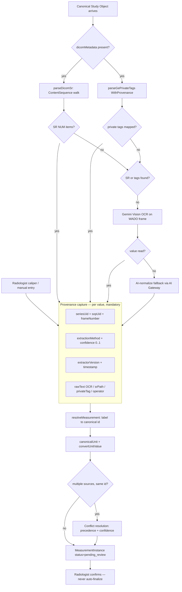
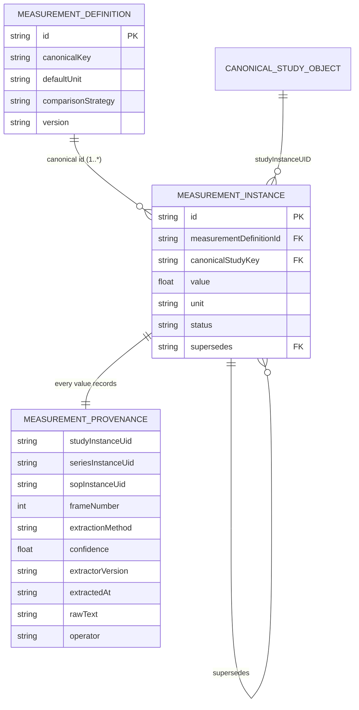

# 11 — Canonical Measurement Engine & Provenance (Goal 9)

**Purpose.** This section specifies the **Measurement Engine**: the single path by which every numeric measurement in a radiology report acquires a *canonical identity* and a *complete provenance record*. It builds directly on `@workspace/measurements` (`lib/measurements/src`) — the immovable Universal Measurement Registry that already owns identity (`MeasurementDefinition.id`), unit vocabulary (`units.ts`), comparison semantics (`compare.ts`), and viewer/SR mapping (`ViewerMapping{tool, dicomSrPattern}`). The registry answers *"what is a CBD?"*. What the platform lacks — and what this section defines — is the **MeasurementInstance**: a *measured value on a specific study*, which must always answer *"where did this number come from, how, and how sure are we?"*. The governing invariant is absolute: **no measured value may exist without Measurement Provenance** (`seriesUid + sopUid + frameNumber + extractionMethod + confidence`, plus `extractorVersion`, `timestamp`, `rawText` for OCR, and `operator` for manual). This realises the design spec's authorship/audit laws (features 19/20) at the granularity of a single number, and honours the Constitution's **Deterministic Before AI**, **AI Advises Humans Decide**, and **Measure Before Building**.

---

## 1. Two entities, never conflated

The registry and the instance are different objects with different lifecycles. The registry is *content* (versioned, append-only, isomorphic, ~55 definitions at `MEASUREMENT_CATALOG_VERSION` 1.0.0); the instance is *observed data* (per study, immutable once confirmed, provenance-bearing).

| Aspect | `MeasurementDefinition` (registry) | `MeasurementInstance` (new) |
| --- | --- | --- |
| Answers | "What is `STONE_SIZE`? units, ranges, strategy" | "Stone measured 8.4 mm on this study" |
| Home | `lib/measurements/src/catalog.ts` (pure, client+server) | Persisted store (DB), server-authoritative |
| Cardinality | one per concept | `1..*` per definition, per study |
| Provenance | none (it is a *type*, not an *observation*) | **required** on every instance |
| Mutability | append-only, deprecate-never-rename | append-only; losers `superseded`, never deleted |
| Version key | `def.version` + `MEASUREMENT_CATALOG_VERSION` | `provenance.extractorVersion` + confirm audit |

A `MeasurementInstance` carries a foreign key to `MeasurementDefinition.id` (the stable SCREAMING_SNAKE id, e.g. `CBD`, `CANAL_AP`, `MIDLINE_SHIFT`) and *inherits* unit/precision/`comparisonStrategy`/ranges from the registry at read time — it never copies them. This mirrors how Phase-4 quality rules read thresholds from the registry at eval time rather than baking them in.

---

## 2. The Measurement Instance & Provenance data model

Provenance is a *first-class, typed, required* structure — not the untyped `provenanceJson` text blob (`default '{}'`) that `usg_measurements` carries today. It unifies the two divergent vocabularies currently in the codebase (`source` = `dicom_sr|ocr|combined|manual` on the USG tables vs `viewerName` = `OHIF|Weasis|DICOM SR|manual|AI` on `viewer_measurements`) into one `extractionMethod` enum, and collapses the two incompatible confidence scales (numeric `0..1` on `viewer_measurements`/`usg_key_images` vs text `high|medium|low` on `usg_measurements.overallConfidence`) into a single numeric `confidence ∈ [0,1]`.

```ts
// Illustrative data contract — NOT implementation.
type ExtractionMethod = 'dicom_sr' | 'private_tag' | 'ocr' | 'ai_normalize' | 'manual';

interface MeasurementProvenance {
  // WHERE — image identity (Canonical Study Object → series → object → frame)
  studyInstanceUid: string;
  seriesInstanceUid: string | null;   // null only for a study-level manual note
  sopInstanceUid: string | null;
  frameNumber: number | null;         // multi-frame US / CINE / Doppler waveform

  // HOW — capture method + calibrated confidence, always present
  extractionMethod: ExtractionMethod;
  confidence: number;                 // ONE scale: 0..1 (text bands mapped on ingest)
  extractorVersion: string;           // e.g. "usg-extractor@1.5.0", "ohif-bridge@2.1"
  extractedAt: string;                // ISO-8601

  // METHOD-SPECIFIC evidence (discriminated by extractionMethod)
  rawText?: string;                   // ocr: burned-in annotation text as read
  srConceptPath?: string;             // dicom_sr: ContentSequence path (0040,A730 walk)
  privateTag?: string;                // private_tag: "0029,xx10 creator=Philips_USG"
  operator?: string;                  // manual: staff identity (who placed the caliper)
  viewerName?: 'OHIF' | 'Weasis';     // manual/caliper origin
}

interface MeasurementInstance {
  id: string;
  measurementDefinitionId: string;    // FK → MeasurementDefinition.id (registry)
  canonicalStudyKey: string;          // studyInstanceUID (Canonical Study Object)
  patientId: number;
  laterality?: 'left' | 'right' | 'bilateral' | 'midline';
  vessel?: string;                    // Doppler grouping (Umbilical/MCA/Uterine/Renal)
  value: number;                      // NUMERIC — no dual text+numeric drift
  unit: string;                       // canonicalUnit(); allowedUnits enforced
  provenance: MeasurementProvenance;  // REQUIRED — a value without this is rejected
  status: 'pending_review' | 'confirmed' | 'superseded' | 'rejected';
  supersedes?: string;                // conflict-resolution lineage (no-delete)
  confirmedBy?: string;               // radiologist identity at confirm time
}
```

`viewer_measurements` (`radiologyLesions.ts`) is the closest existing shape to this target — it already has `studyInstanceUID`, `seriesInstanceUID`, `sopInstanceUID`, `frameNumber`, `confidence` (real), and a nullable registry `measurementId` — and is therefore the **reference schema** for the migration in §7.

---

## 3. The multi-source extraction pipeline

Every measurement originates from exactly one of four source families, evaluated in a fixed confidence order that `usgExtractor.ts` already implements and that the engine generalises across modalities. The ordering — **DICOM SR → Private Tags → OCR → AI-normalize → Manual** — is a preserved invariant.

| Source | Extractor (today) | `extractionMethod` | Baseline confidence | Provenance specifics |
| --- | --- | --- | --- | --- |
| **DICOM SR** | `parseDicomSr()` walks `ContentSequence` (0040,A730), reads `ConceptNameCodeSequence` (0040,A043) + `MeasuredValueSequence` (0040,A300); captures doc SOP/Series UID | `dicom_sr` | high (machine-authored) | `srConceptPath`; concept matched to a definition via `ViewerMapping.dicomSrPattern` |
| **Private Tags** | `parseGePrivateTagsWithProvenance()` — GE/Siemens/Samsung/Philips private groups (0029/0019/2001/200d/0033…), XML or `KEY=VAL` dumps | `private_tag` | high | `privateTag` (group/element + `privateCreator`); currently only 8 OB fields mapped |
| **Burned-in OCR** | `geminiUsgOcr()` on WADO frames (`fetchWadoFrame`) → per-field value + `rawText` + per-field confidence | `ocr` | medium/low + **human confirm required** | `rawText` mandatory; `frameNumber`; `sopInstanceUid` of the OCR'd frame |
| **AI-normalize** | `geminiNormalizeMeasurements()` fallback when OCR image fetch fails | `ai_normalize` | low | routed through the **AI Gateway** (`generateAiForTask`), never a bespoke key |
| **Manual / caliper** | Radiologist entry, or OHIF/Weasis caliper via the viewer import bridge | `manual` | operator-set (1.0 when confirmed) | `operator`, `viewerName`; **corrections outrank model** |

Concept→identity resolution is **deterministic, never fuzzy**: SR concept names and OCR labels resolve through `resolveMeasurement(label)` (exact id → `canonicalKey` → normalized alias → parenthetical-stripped alias). New spellings are added to `aliases[]` in the catalog, never matched heuristically. **Gap to close:** the structured `/measurements` route already calls `resolveMeasurement(label)` server-side, but the viewer `POST /viewer-measurements` route does **not** — so OHIF/Weasis calipers that carry only a caliper *kind* (`linear`/`area`) land with `measurementId = null`. The engine mandates server-side resolution on *every* ingestion route.

The extractor's `pending_review` safety posture is non-negotiable: **the engine never auto-finalizes.** Every instance lands `status = pending_review` (or `pending`) until a radiologist confirms it (`humanReviewRequired`, `autoFinalize: false` defaults in `usg_extraction_settings`). This is the measurement-level expression of **AI Advises, Humans Decide**.



---

## 4. Entity relationships



---

## 5. Conflict resolution & unit normalization

**When sources disagree** (e.g. an SR-reported CBD of 6 mm and an OCR-read 6.4 mm), the engine selects a *winner* deterministically and *retains the losers* (`status = superseded`, linked by `supersedes`) — no-delete, fully auditable.

1. **Precedence first.** `dicom_sr` > `private_tag` > `ocr` > `ai_normalize`. This is the same ordering `usgExtractor` applies when it lets SR values override GE-private override OCR during merge.
2. **Confidence breaks ties within a method.** Two OCR reads of the same field → higher numeric `confidence` wins; both are persisted.
3. **Human correction outranks everything.** A radiologist-confirmed `manual` value supersedes *any* machine value regardless of precedence (**AI Advises, Humans Decide**; the design law "corrections outrank model"). The machine value is not discarded — it becomes `superseded`, preserving the disagreement for the Feedback Ledger.
4. **Never silently average.** The engine picks a source; it does not fabricate a blended number that no instrument produced.

**Unit normalization** is the sole responsibility of `units.ts` (`canonicalUnit`, `convertUnitValue`). Values are stored in the unit as measured, and normalized to the definition's `defaultUnit` at comparison time via `toDefaultUnit()` in `compare.ts`. Same-family conversion only (length→mm, volume→ml, mass→g); cross-family returns `null` and the value stays incomparable rather than wrong. Two catalog-append gaps must be filled (append-only, never breaking): **area units (`mm²`/`cm²`)** — required by `spinal_measurements.canalArea`/`cordArea` — and **`mmHg`** for any pressure metric. `allowedUnits` on the definition remains the guard against a value arriving in a nonsensical unit.

---

## 6. How measurements feed the rest of the platform

The engine is the *single upstream* for four downstream consumers; each reads canonical instances + provenance, none re-parses raw DICOM.

- **Quality Engine** (`lib/report-quality`, §14). The Phase-4 `measurement.registry-range` executor generates one shadow rule per ranged definition (`care.measurement.range.<id>`) directly from the catalog — zero hand-authored thresholds. A `MeasurementInstance` is scored via `classifyMeasurementValue()` → `normal|abnormal|critical`; a critical-range breach escalates to a blocker finding. Provenance rides along so a quality finding can cite the exact `sopUid`/`frameNumber` it fired on.
- **Recommendation Registry** (`lib/clinicalRecommendations.ts`). Size thresholds (nodule follow-up, aneurysm surveillance) key off the definition id + normalized value, so a recommendation is reproducible and traceable to the measured evidence.
- **Prior Comparison** (`radiologyComparison.ts`, §10). `compareMeasurementValues()` computes unit-normalized `delta`/`percentChange`/`direction` on the canonical id — **never on display labels**. The `comparisonStrategy` field (`absolute-change|percent-change|ratio-trend|presence|categorical`) is the intended dispatch key; `compare.ts` must branch on it (today it unconditionally returns both `delta` and `percentChange` and has no `presence`/`categorical` handling — a defect the engine owns).
- **Report + Evidence Envelope** (§06, §12). Confirmed instances flow into the structured report (`STRUCTURED_REPORT_JSON_SPEC_v1`) and every one contributes its provenance to the **Evidence Envelope**, so the medico-legal authorship gate can show *which frame, which method, what confidence* produced each number.

---

## 7. Gap & migration: current tables lack full provenance

**The gap (ground truth).** The canonical `MeasurementDefinition`/`MeasurementComparison` types carry *no* provenance — it lives only in storage, inconsistently: `viewer_measurements` has full UIDs + frame + numeric confidence; `usg_measurements` has `source` + text `overallConfidence` + an **untyped** `provenanceJson` blob but **no UIDs on the row**; `radiology_measurements` and `spinal_measurements` have **no UIDs, no confidence, no extractionMethod** at all, and `spinal_measurements` stores free-text `canalAP`/`cordAP`/`discHeight` with no registry link despite `CANAL_AP`/`CORD_DIAMETER`/`DISC_HEIGHT` existing in the catalog. The good news: `usgExtractor.ts` *already builds* a per-field provenance map with exactly the right fields (`seriesInstanceUID`, `sopInstanceUID`, `frameNumber`, `sourceType`, `sourceConfidence`, `rawExtractedValue`, `extractedByEngineVersion`) — it is simply flattened into an untyped `provenanceJson` string instead of a typed store.

**The migration (strangler, no-delete, Backward Compatibility).**

1. **Introduce `measurement_instances`** with typed `MeasurementProvenance` (jsonb or promoted columns), modelled on `viewer_measurements`. Gate behind the existing `ff_radiology_measurement_pool` flag (fail-safe to false), shadow-first.
2. **Dual-write.** Extraction and viewer ingestion write both the legacy table *and* `measurement_instances`. No existing reader breaks.
3. **Backfill** by parsing the existing `provenanceJson` blobs (the fields already exist), mapping `source`/`viewerName` → `extractionMethod` and text `high|medium|low` → numeric confidence bands, and re-homing `spinal_measurements` onto `CANAL_AP`/`CORD_DIAMETER`/`DISC_HEIGHT` with numeric `value`+`unit`.
4. **Align ingestion.** Add server-side `resolveMeasurement(label)` to the viewer `POST` route so caliper-only imports get a canonical id; collapse `usg_measurements`' dual text + numeric `*Mm` columns to one numeric+unit representation to end drift.
5. **Cut readers over** to `measurement_instances`; retire the legacy provenance blob once parity tests pass. Catalog stays the source of truth throughout — no per-consumer measurement constants are ever reintroduced.

---

## Cross-references

- `03-canonical-data-model.md` — the Canonical Study Object (`studyInstanceUID`) that `canonicalStudyKey` and all provenance UIDs resolve against.
- `04-ai-gateway.md` — `generateAiForTask()` routing for the OCR / `ai_normalize` extraction methods (no bespoke Gemini key).
- `06-ai-report-generation.md` — structured-JSON-first generation and `STRUCTURED_REPORT_JSON_SPEC_v1`, into which confirmed instances flow.
- `08-learning-and-feedback-system.md` — the Feedback Ledger that captures machine-value-vs-radiologist-correction diffs (the `superseded` lineage feeds it).
- `09-organ-companions.md` — Companions declare `requiredMeasurements` as canonical `MeasurementDefinition` ids only.
- `10-prior-comparison-and-timeline.md` — `compareMeasurementValues()` / `comparisonStrategy` dispatch over canonical ids.
- `12-explainability.md` — the Evidence Envelope that surfaces each value's provenance (method, frame, confidence, `rawText`).
- `14-safety-risk-and-failure-recovery.md` — `pending_review`/never-auto-finalize invariant, PCPNDT Form-F gate, and `ff_radiology_*` shadow-first rollout the engine inherits.
