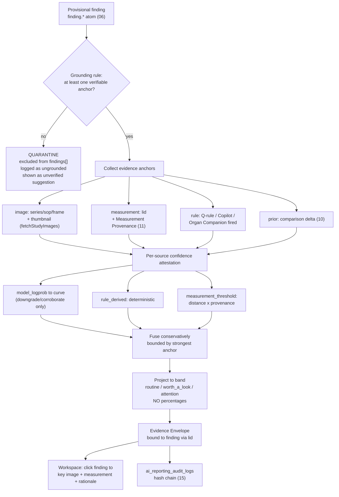
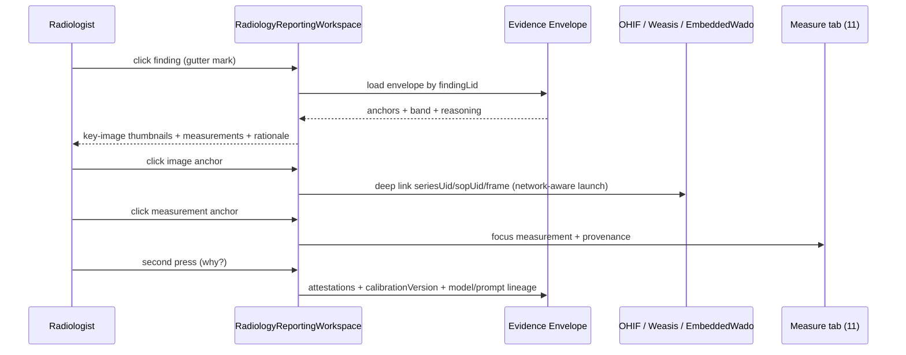

# 12 — Explainability: The Evidence Envelope

**Purpose.** This section defines the **Evidence Envelope** — the explainability payload every AI-produced finding in a **Provisional Report** must carry before it renders as anything more than an unverified suggestion. Goal 10 is uncompromising: each finding ships with *confidence*, *evidence* (why the claim exists), *supporting images* (series/SOP/frame plus a key-image thumbnail), *supporting measurements* (each with **Measurement Provenance**), a *reasoning summary*, and a *reserved slot for heatmaps/overlays* for future segmentation models. The Envelope is the concrete mechanism behind two trust-chassis features from the master design spec — **feature 9 (honest three-band confidence)** and **feature 10 (explainability drill-down)** — and feeds **feature 19 (audit/provenance)** and **feature 20 (authorship gate)**. It is deterministic-first (Principle 4): the AI Gateway may *phrase* a reasoning line, but the anchors, measurements, and calibration inputs come from real code paths that already exist. Critically, the Envelope carries the anti-hallucination invariant: **no finding without at least one verifiable evidence anchor**; findings that fail the grounding rule are **quarantined**, never shown as confident.

---

## 1. The one rule: no finding without evidence

The single load-bearing rule of this section is the **grounding rule**, inherited from D1's source-traceable law (see `06-ai-report-generation.md` §2, property 7):

> Every finding in `findings[]` MUST reference at least one **verifiable** evidence anchor. A finding grounded only on model-generated reasoning is **not grounded**.

"Verifiable" is a hard word here. A reasoning sentence is text the model wrote; it corroborates nothing on its own. An anchor is verifiable only when it points at something a human or a deterministic engine can independently check: a **pixel location** (series/SOP/frame), a **measured value** with provenance, a **deterministic rule** that fired, or a **prior-study delta**. This separates explainability from post-hoc rationalisation — a hallucinated finding dressed up with a plausible paragraph. The Envelope makes that impossible by construction: the reasoning summary is a *field inside* the Envelope, never a substitute for an anchor.

---

## 2. The Evidence Envelope data contract

One Envelope binds to one finding by its `lid` (the local id used throughout the Provisional Report JSON, `06`). The `evidence_ref[]` array on each `findings[]` atom (`06` §2.1) holds the `anchorId`s resolving into this Envelope — so the report stays lean and the heavy payload (thumbnails, calibration inputs, reasoning provenance) lives beside it in the AI-draft store, not inline in the signed body.

### 2.1 Anchor taxonomy

| Anchor kind | Backing source (real component) | Verifiable? | Grounds a finding? |
|---|---|---|---|
| `image` | `fetchStudyImages()` (Orthanc DICOMweb `/rendered` → sharp 512px → thumbnail); UIDs from the series/instance | Yes — pixel location | **Yes** |
| `measurement` | `lib/measurements` value resolved via `resolveMeasurement`; **Measurement Provenance** from `viewer_measurements` / `radiology_measurements` / `usg_measurements` | Yes — reproducible number | **Yes** |
| `rule` | A deterministic engine that fired: `lib/report-quality` rule (Q001–Q115), a Copilot module (`copilotOrchestrator` / `registerCopilotModule`), or an **Organ Companion** check (`09`) | Yes — re-runnable | **Yes** |
| `prior` | A `MeasurementComparison` delta from `radiologyComparison.ts` + `lib/measurements/compare.ts` (`10`) | Yes — recomputable | **Yes** |
| `heatmap` | Reserved (§8) — future segmentation/saliency overlay as DICOM PR / Secondary Capture / OHIF layer | Yes (when populated) | Yes (future) |
| `reasoning` | Model-authored one-line rationale, produced by the AI Gateway | **No** | **Never alone** |

The grounding rule is precisely: at least one anchor of kind `image`, `measurement`, `rule`, or `prior`. A `reasoning` anchor may accompany them but can never satisfy the rule by itself.

### 2.2 Type sketch (data contract, not implementation)

```ts
type ConfidenceSource =
  | "model_logprob" | "rule_derived" | "measurement_threshold" | "prior_comparison";

type EvidenceAnchor =
  | { kind: "image"; anchorId: string;
      seriesUid: string; sopUid: string; frameNumber?: number;
      thumbnail?: { mime: "image/jpeg"; dataRef: string }; // sharp 512px, by reference
      role: "key_image" | "representative" }
  | { kind: "measurement"; anchorId: string;
      measurementLid: string;              // -> measurements[].lid in the report (06)
      measurementId: string;               // canonical registry id, e.g. STONE_SIZE
      value: number; unit: string;         // canonical unit (lib/measurements/units.ts)
      provenance: MeasurementProvenance;   // seriesUid+sopUid+frame+extractionMethod+confidence (11)
      classification: "normal" | "abnormal" | "critical" } // classifyMeasurementValue
  | { kind: "rule"; anchorId: string;
      ruleId: string;                      // Q001..Q115 | copilotKey | companionKey
      engine: "report-quality" | "copilot" | "organ-companion"; deterministic: true }
  | { kind: "prior"; anchorId: string;
      priorStudyUID: string; comparison: MeasurementComparison } // compare.ts (10)
  | { kind: "heatmap"; anchorId: string; heatmap: HeatmapRef }    // reserved (§8)
  | { kind: "reasoning"; anchorId: string; text: string };        // never grounds alone

type ConfidenceAttestation = {
  source: ConfidenceSource;
  rawSignal: number;         // logprob | distance-from-threshold | provenance confidence
  calibrated: number;        // 0..1 after the per-source calibration curve (§4)
  calibrationVersion: string;
};

type EvidenceEnvelope = {
  findingLid: string;        // binds to findings[].lid in the Provisional Report (06)
  companion: string;         // Organ Companion key that produced the finding (09)
  grounded: boolean;         // >= 1 verifiable anchor present
  quarantined: boolean;      // true => excluded from findings[], see §5
  anchors: EvidenceAnchor[];
  confidence: {
    attestations: ConfidenceAttestation[];
    fused: number;                 // 0..1, INTERNAL — never shown as a percentage
    band: "routine" | "worth_a_look" | "attention"; // the ONLY surfaced form
  };
  reasoning: { summary: string; generatedBy: string; promptDigest: string };
  heatmap?: HeatmapRef;      // reserved future overlay (§8)
};
```

`fused` and the raw `rawSignal` values stay internal — they are auditable and drill-downable but are **never** rendered as a percentage (§4.3).

---

## 3. Producing the Envelope — evidence emitted alongside each finding

The Envelope is not a post-processing pass bolted onto a finished draft; it is emitted **during** structured generation, inside the same validate/resolve loop the JSON-first contract (`06`) already runs:

1. **The model emits `findings[]` with `evidence_ref[]` already populated.** `queryStructured` (`04`/`06`) requests, per finding, the series/SOP/frame it points at and the `measurement` lids it relies on. The schema makes `evidence_ref` a required, non-empty array — an empty one fails Zod validation and enters the repair loop.
2. **Referential resolution builds the anchors.** During the `RES` step of the `06` flowchart, each measurement lid resolves against `lib/measurements` (attaching **Measurement Provenance** from `viewer_measurements`); each image UID is verified against the study's Orthanc instances and a thumbnail is minted through the canonical `fetchStudyImages()` path; each deterministic engine that fired (a Q-rule, a Copilot module, an Organ Companion check) attaches a `rule` anchor.
3. **The grounding gate runs.** A finding left with zero verifiable anchors is quarantined (§5) rather than emitted — the anti-hallucination checkpoint.
4. **Confidence is attested and calibrated** (§4), and the Envelope is written to the AI-draft store and referenced from the report JSON.

The reasoning summary is generated last and separately, so it can never *become* the evidence — it only *describes* anchors that already exist.

---

## 4. Confidence — defined and calibrated per source, displayed honestly

Confidence is **not** a single model number. Different signals mean different things and are trustworthy to different degrees, so the Envelope keeps a per-source attestation and fuses conservatively.

### 4.1 Per-source definition

| `ConfidenceSource` | Raw signal | Trust posture |
|---|---|---|
| `model_logprob` | Sequence/segment log-probability where the provider exposes it (e.g. OpenAI logprobs). **Local models (MedGemma/Qwen-VL via Ollama `/api/generate`) do not expose calibrated logprobs today** — see recon. | **Weakest.** May corroborate or *downgrade*, never *upgrade* a finding above what its verifiable anchors support. A self-reported "I am confident" is untrusted. |
| `rule_derived` | A deterministic engine fired (report-quality Q-rule, Copilot module, Organ Companion check). | **Strong / near-certain** — the rule is re-runnable and its firing is a fact, not a guess (Principle 4). |
| `measurement_threshold` | Distance of a measured value from `normalRange` / `criticalRange` (`lib/measurements`), weighted by the value's provenance confidence (`11`). | **Strong** when provenance is DICOM-SR/private-tag; **weaker** when OCR/AI-normalised. |
| `prior_comparison` | Magnitude of a `MeasurementComparison` delta relative to the reporting threshold and precision epsilon (`10`). | **Strong**, but downgraded by non-comparable-acquisition caveats (`10` §2). |

### 4.2 Calibration and fusion

Each raw signal passes through a **per-source calibration curve** mapping it to a calibrated probability. Curves are fit against observed radiologist acceptance from the **Feedback Ledger** (`08`) — "when the measurement-threshold signal was X, how often did the radiologist keep the finding?" Two non-negotiable properties:

- **Curves are versioned content, not code** (Principle 3). Each attestation stamps `calibrationVersion` so any band is reproducible for the full retention period. Curves are updated **deliberately and reviewed** — never auto-retrained (`08`).
- **Fusion is conservative and deterministic-dominant.** The fused confidence is bounded by the *strongest verifiable* anchor. `model_logprob` can only lower or corroborate. A confident-sounding model claim with only weak evidence therefore lands in a low band — the honest outcome.

### 4.3 Honest display — bands, not false precision

The surfaced confidence is exactly three bands, **with no percentages**, per the master design spec's eight AI laws:

| Band | Master-spec surface | Gutter mark | Backing condition |
|---|---|---|---|
| `routine` | silent / normal baseline | ◌ | high fused confidence, in-range, strong provenance |
| `worth_a_look` | margin card | △ | borderline range or moderate confidence |
| `attention` | interrupt-budget candidate | ✕ | `critical_flags` present, or low-confidence high-stakes finding |

The numeric `fused` value and every `rawSignal` remain **internal** — surfaced only on the **explainability drill-down** (feature 10's "second press"): the anchors, per-source attestations, calibration version, and model/prompt lineage. A radiologist never sees "83%"; they see △ and, on demand, *why*.

---

## 5. Anti-hallucination — the quarantine

A finding that fails the grounding rule is **quarantined** — a first-class state, not a silent drop:

- It is **excluded from `findings[]`**, so it can never render into `patient_reports.body`, carry a band above the minimum, or be signed (the authorship gate, feature 20, has nothing to gate).
- It is **logged** to `ai_reporting_audit_logs` under the tamper-evident hash chain (`15`) with reason `ungrounded`, so quarantine is auditable and measurable (Principle 7).
- It **may** surface in a clearly labelled "unverified AI suggestions" tray — explicitly *not* a finding, explicitly *not* confident — so a useful lead is not lost; it enters the report only if the radiologist attaches evidence and promotes it (captured in the Feedback Ledger, `08`).

This is the structural answer to "AI advises, humans decide" (Principle 5): the platform would rather show *nothing* than an ungrounded claim with a confident band.

### 5.1 Required flowchart — finding → anchors → calibration → envelope → UI



---

## 6. Rendering in the workspace — click finding, jump to evidence

The Envelope powers the master spec's four presentation surfaces inside the one canonical `RadiologyReportingWorkspace.tsx`. There is no separate "explainability page"; explainability attaches to the finding wherever it appears.

- **Gutter mark.** The band renders as ◌/△/✕ in the editor gutter — the glanceable confidence signal (§4.3).
- **Click-through.** Clicking the finding opens its Envelope: the **key-image thumbnail(s)**, the **supporting measurements** with values and provenance, the **reasoning summary**, and — on second press — the calibration/lineage drill-down.
- **Jump to source.** Each image anchor's `seriesUid + sopUid + frameNumber` deep-links into `EmbeddedWadoViewer` or an external OHIF/Weasis launch via `studyLaunchService` / `OpenStudyPanel`, network-aware across LAN/Tailscale/Cloudflare/Public — the exact slice the finding points at. Thumbnails come from `fetchStudyImages()`; `ReportImagePicker` reuses the same key images for attachment.
- **Measurement jump.** A measurement anchor links to its row in the **Measure** tab (`UsgMeasurementReviewPanel` / `ViewerMeasurementsPanel`), where provenance and registry resolution are already surfaced (`11`).

### 6.1 Click-through sequence



---

## 7. Storage and audit — reuse, do not sprawl

The Envelope introduces **no new sprawling store** — baseline recon flagged store fragmentation as a top risk:

- **Anchor references** live in the Provisional Report `structured_json` (`evidence_ref[]`); the heavy payload sits in the AI-draft store `ai_reporting_drafts`.
- **Image thumbnails / key images** reuse the key-image shape (`usg_key_images` carries UIDs + confidence today) and are fetched, not re-stored as pixels where avoidable.
- **Measurement provenance** is *referenced* from `viewer_measurements` / `radiology_measurements`, never copied (`11`).
- **Audit and AI-decision provenance** flow through the existing hash-chained `audit_logs` (via `auditLog()`) and `radiology_ai_review_audits` — the Envelope must **not** fork a parallel AI audit trail (`14`/`15`). Every quarantine, band, and calibration version is recorded under the chain.

---

## 8. Heatmaps and overlays — reserve the contract now

No segmentation or saliency model runs today, but the Envelope reserves the slot so adding one later is additive, not a schema break. `HeatmapRef` is defined now, populated later:

```ts
type HeatmapRef = {
  status: "reserved" | "available";
  overlayType: "dicom-pr" | "secondary-capture" | "ohif-overlay";
  seriesUid?: string; sopUid?: string;   // where the overlay object lives in Orthanc
  colormap?: string; opacity?: number;   // render hints
};
```

**Decision for when heatmaps arrive:**

| Delivery | Mechanism | When to prefer |
|---|---|---|
| **DICOM PR (GSPS)** | A Presentation State object referencing the original SOP, stored in Orthanc; non-destructive | **Default** — original pixels untouched, viewer-native in Weasis/OHIF, medico-legally clean |
| **DICOM Secondary Capture** | A burned-in overlay image stored as a new SOP in Orthanc | Universal fallback for any viewer that cannot render GSPS |
| **OHIF overlay layer** | Rendered at view time via OHIF's segmentation/annotation layer | In-workspace preview without persisting a new SOP |

The overlay is anchored to pixels via `radiology_annotations` (which already carries series/SOP/frame). The Envelope stores only a **reference** (`seriesUid + sopUid`) — never overlay pixels inline. Until a model produces one, `heatmap.status = "reserved"` and the UI simply shows no overlay chip; nothing else in the contract changes.

---

## 9. What this section deliberately does not do

It does not invent a new evidence store, measurement vocabulary, or second image path — it reuses `lib/measurements`, `fetchStudyImages()`, `viewer_measurements`, and the existing audit chain. It does not let confidence be a percentage, let a reasoning sentence ground a finding, or let the AI sign (the Envelope attaches to a **Provisional** report only; `ai.guarding.signed` stays `false`, `06`). It does not decide *whether a finding blocks finalize* — hard-block policy lives in `14-safety-risk-and-failure-recovery.md`; the Envelope only makes the finding honest and inspectable.

---

## Cross-references

- `06-ai-report-generation.md` — the JSON-first generation loop that emits `evidence_ref[]`, the `confidence_band` overlay, and the ungrounded-atom rejection this section grounds.
- `04-ai-gateway.md` — `queryStructured` / `generateAiForTask`; which providers expose logprobs and the `degraded` fallback.
- `08-learning-and-feedback-system.md` — the **Feedback Ledger** that supplies acceptance data for calibration curves; no auto-retrain.
- `09-organ-companions.md` — Organ Companion checks that emit `rule` anchors and tag each finding's `companion`.
- `10-prior-comparison-and-timeline.md` — `radiologyComparison.ts` / `compare.ts` deltas that become `prior` anchors and the acquisition caveats that downgrade confidence.
- `11-measurement-engine.md` — `lib/measurements` resolution, `classifyMeasurementValue`, and **Measurement Provenance** carried by `measurement` anchors.
- `03-canonical-data-model.md` — the **Canonical Study Object** identity anchors resolve against.
- `14-safety-risk-and-failure-recovery.md` — quarantine policy, hard-block-vs-warn, never-auto-sign, and failure recovery.
- `15-security-model.md` — hash-chained `audit_logs` / `radiology_ai_review_audits`, PHI handling of thumbnails/overlays, and network trust for viewer deep links.
