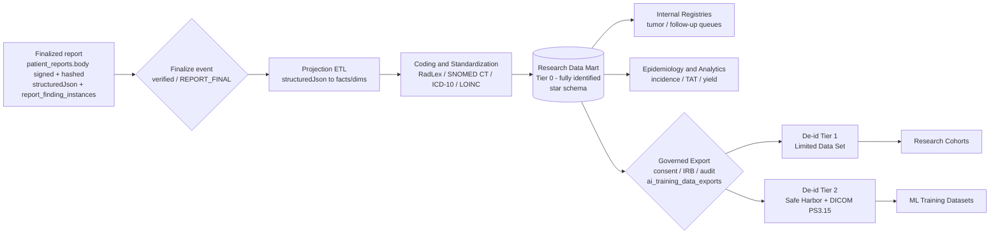
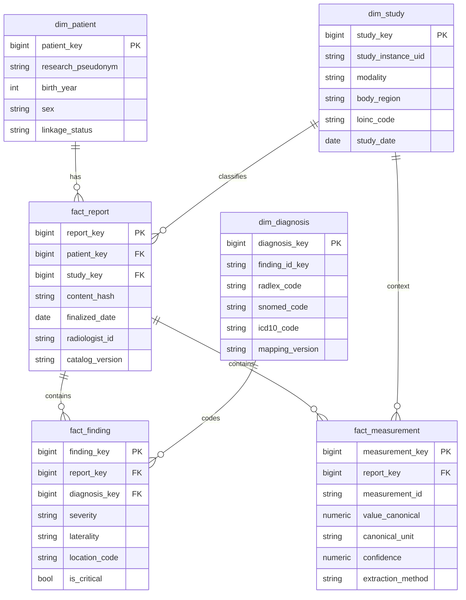

# 13 — Research Data Mart (Goal 11)

**Purpose.** Every FINALIZED radiology report is a durable clinical asset that should answer questions long after the study is delivered — incidence and epidemiology, longitudinal follow-up, tumor-registry surveillance, retrospective research cohorts, and supervised ML training sets. This section specifies the **Research Data Mart**: an analytics/registry store, physically and logically separate from the OLTP reporting path, that is fed *only* by finalized, radiologist-signed reports via a one-way projection pipeline. It converts the immutable `patient_reports.body` + `structuredJson` record (per [`docs/STRUCTURED_REPORT_JSON_SPEC_v1.md`](../../STRUCTURED_REPORT_JSON_SPEC_v1.md)) and its canonical measurements into a coded, query-ready star schema; it maintains fully-identified internal registries alongside tiered de-identified exports for research and ML; and it reuses the existing `ai_training_data_exports` governance surface for consent/IRB/audit. The mart *reads* the clinical record; it never writes back to it (Principle 6, Backward Compatibility; Principle 4, Deterministic Before AI).

## 1. Core invariant — finalized-only, one-way

The mart is downstream of the finalize gate, never upstream of it. It observes the same signing event the reporting workspace already produces and nothing earlier:

- **Trigger.** Projection is initiated when a report reaches its terminal signed state — `patient_reports.status = verified` and the worklist reaching `REPORT_FINAL`/`DELIVERED` — the point at which `patient_reports.body` is frozen and content-hashed at sign (the no-delete / append-only doctrine, D-19). Drafts (`ai_reporting_drafts`, `radiology_worklist.aiDraftJson`), provisional AI output, `ai_extraction_results` still in `pending`, and unsigned `usg_report_drafts` are **never** projected.
- **Provisional Report exclusion.** A Provisional Report (AI-generated structured draft) is invisible to the mart by construction. Only the radiologist-authored, signed content crosses the boundary. This preserves "AI Advises, Humans Decide" (Principle 5) end-to-end: the research corpus is a corpus of *human-signed* conclusions.
- **Amendments are versions, not overwrites.** When a signed report is amended via `report_amendments`, the mart appends a new report-version fact keyed by content hash rather than mutating the prior row, mirroring the source system's immutable snapshot model. Analytics can therefore reproduce "what was known at sign time" for any historical date.
- **Separate store, not the OLTP path.** The mart lives in an isolated OLAP-style schema/database (see §3), refreshed asynchronously. No analytic query ever touches the production reporting tables (`radiology_studies`, `radiology_worklist`, `patient_reports`) on their hot path.

## 2. End-to-end flow



De-identification is applied at the **export boundary**, not on ingest: the mart itself is fully identified (Tier 0) so internal registries and operational analytics keep patient linkage, while every dataset leaving the trust boundary is de-identified to the tier the governing consent/IRB permits.

## 3. Placement — a separate analytics store

The mart is **not** a set of views over the OLTP tables. It is a dedicated store, decoupled from reporting latency and load:

| Concern | Decision |
| --- | --- |
| Physical location | A separate PostgreSQL logical database (or a `research` schema on a **read replica**), managed by the same Drizzle/`care-db-patch-v2` migration discipline. Single-clinic today (Deoghar / Synology NAS); the schema is columnar-friendly for a future warehouse migration (see [16-performance-and-scalability.md](./16-performance-and-scalability.md)). |
| Load model | Append-mostly star schema (`fact_*` + `dim_*`), refreshed by an idempotent ETL job. Materialized views serve the heavy aggregate registries. |
| Refresh cadence | **Event-driven** on finalize (near-real-time projection of the single report) **plus** a nightly full-consistency sweep that re-derives any facts whose source hash changed (amendments, backfills). The nightly sweep runs on the same background worker fabric described in [07-orchestration-and-night-processing.md](./07-orchestration-and-night-processing.md). |
| Isolation | Reads never contend with reporting. Analysts and ML export jobs hit only the mart / replica. |
| Durability caveat | The mart's backup path must **not** inherit CRIT-1 (the scheduled backup that truncates every table at 5,000 rows yet stamps success — [14-safety-risk-and-failure-recovery.md](./14-safety-risk-and-failure-recovery.md)). A research corpus that silently truncates is worse than none; the mart requires row-count-verified, unbounded backups before it is trusted for registry use. |

## 4. Projection pipeline (finalized report → mart rows)

The ETL is a deterministic transform, not an LLM step (Principle 4). It reads three already-canonical inputs and fans them into facts:

1. **Report envelope** — `patient_reports` (report number, signed-at, authoring radiologist, content hash, catalog/template/render-engine versions) + `structuredJson` conforming to the Structured Report JSON Spec v1.
2. **Findings** — `report_finding_instances` (the signed snapshot rows, never hard-deleted) provide the discrete finding grammar: severity, laterality, location, and the finding `id_key` bound by reference to the seed catalog namespaces (`sev.*`, `lat.*`, `loc.*`, `crit.*`). These become `fact_finding` rows.
3. **Measurements** — canonical values resolved through `@workspace/measurements` (`lib/measurements`). Each measurement carries its stable immutable `MeasurementDefinition.id` (e.g. `STONE_SIZE`, `CBD`), `canonicalUnit`, and the `comparisonStrategy`, plus **Measurement Provenance** (`seriesUid` + `sopUid` + `frameNumber` + `extractionMethod` + `confidence`) per [11-measurement-engine.md](./11-measurement-engine.md). These become `fact_measurement` rows already normalized — no unit re-parsing occurs in the mart.

Because findings and measurements arrive pre-coded and pre-normalized from the reporting engine, the projection is a **mapping**, not an interpretation. The ETL records, for every fact, the source report content hash and catalog version, so the mart is fully reproducible and auditable back to the signed record.

### Projection contract (sketch)

```ts
// Emitted per finalize event; consumed by the mart loader. Types only.
type ReportProjection = {
  sourceReportId: number;         // patient_reports.id
  contentHash: string;            // frozen body hash at sign
  studyInstanceUid: string;       // Canonical Study Object key
  finalizedAt: string;            // ISO signed-at
  catalogVersion: string;         // seed catalog version at sign
  findings: FindingFact[];        // from report_finding_instances
  measurements: MeasurementFact[];// canonical id + provenance + value
  recommendations: RecommendationFact[]; // from lib/clinicalRecommendations
  codes: CodedConcept[];          // RadLex/SNOMED/ICD-10/LOINC bindings
};
```

## 5. De-identification tiers

Data leaves the identified core only through a tiered de-identification gate aligned with **DICOM PS3.15** (pixel/metadata attribute confidentiality) and HIPAA **Safe Harbor**:

| Tier | Name | Identifiers | Dates | Pixels / SR | Primary consumer |
| --- | --- | --- | --- | --- | --- |
| **0** | Fully Identified | Retained | Real | Full | Internal tumor registry, follow-up queues, operational analytics (stays inside the trust boundary) |
| **1** | Limited Data Set | Direct identifiers removed; a stable **research pseudonym** retained for linkage | Date-**shifted** per patient by a consistent offset | Metadata stripped | IRB-approved internal research cohorts needing longitudinal linkage |
| **2** | De-identified (Safe Harbor + PS3.15) | All 18 HIPAA identifiers removed; ages > 89 generalized | Year-only or removed | DICOM PS3.15 Basic Profile applied to any exported images/SR; burned-in pixel text handled per the OCR-flagged regions from `usgExtractor` | External research sharing, ML training datasets |

Rules:

- **Crosswalk isolation.** The pseudonym↔MRN crosswalk lives in a separately-permissioned table, never co-located with exported data, and never in a Tier ≥1 export.
- **Consistent date-shift** preserves inter-study intervals (essential for follow-up interval analysis) without exposing true dates.
- **Free-text safety.** Narrative fields (`Findings`, `Impression`) risk re-identification; Tier ≥1 exports prefer the coded/structured facts and gate any free text through a scrub step. The structured-JSON-first corpus makes this tractable — most analytic value is in coded facts, not prose.
- Tier selection is bound to the governing consent/IRB record, not chosen by the exporter (see §9).

## 6. Coding & standardization

The mart is the layer where the platform's existing canonical grammar is bound to external terminologies so the corpus is interoperable and queryable. Measurements are *already* canonical (`lib/measurements`); coding adds the diagnostic/observational vocabularies:

| Vocabulary | Bound to | Purpose in the mart |
| --- | --- | --- |
| **RadLex** | Finding `id_key`, anatomy (`loc.*`), imaging observations | Radiology-native finding/anatomy coding; the primary axis of `dim_diagnosis` and `fact_finding` |
| **SNOMED CT** | Diagnoses, problems, procedures | Cross-domain clinical linkage; registry classification |
| **ICD-10** | Impression-level diagnoses | Epidemiology, tumor registry reporting, billing/epi cross-walks |
| **LOINC** | Study/observation type (modality + region + laterality) | `dim_study` observation coding; harmonizes study types across the fragmented study tables |
| **UCUM** | Measurement units | Already enforced by `@workspace/measurements` canonical units |

Coding is **content, not code** (Principle 3): the code bindings are maintained as versioned mapping tables in the seed catalog (the same "bind by reference" model the design spec mandates), so a coder can extend RadLex/SNOMED coverage without a deploy. Every coded concept in `fact_finding` / `dim_diagnosis` records the mapping version used, keeping historical facts stable when the mapping evolves (additive-only, immutable `id_key`s).

## 7. Longitudinal patient linkage

Cohorts, registries, and follow-up depend on stitching a patient's studies across time — a known weak point in the current data model, where patient matching is fuzzy (Levenshtein on names) and `patientMatchStatus` defaults `UNMATCHED`.

- `dim_patient` is anchored by a **stable master-patient key** (a research patient id), the mart's authoritative linkage spine. It is derived once at projection time from the Canonical Study Object's resolved patient identity (see [03-canonical-data-model.md](./03-canonical-data-model.md)), **not** re-fuzzy-matched inside the mart.
- Unresolved / `UNMATCHED` studies are projected into a **linkage-quarantine** partition and excluded from longitudinal registries until identity is confirmed, rather than silently merged. This prevents cross-patient contamination of tumor and follow-up registries — a safety property, not just data hygiene.
- The lesion timeline (`radiology_lesions` / `radiology_lesion_timeline`) and tumor follow-ups (`radiology_tumor_followups`, with RECIST-like change %) provide ready-made longitudinal chains; the mart projects them as `fact_finding` sequences linked by lesion id under one `dim_patient`, enabling progression/regression/stable trend queries without re-deriving deltas (those are already computed by `compare.ts` per the measurement engine).

## 8. Entity sketch — the star schema



`fact_measurement` mirrors the canonical `MeasurementDefinition.id` and carries flattened Measurement Provenance (`extraction_method`, `confidence`; series/sop/frame retained on the row for image-linked ML). `dim_diagnosis` is the coded backbone. A conformed `dim_date` and `dim_radiologist` (peer-review / TAT analytics) are added as the registry surface grows; kept out of the sketch for clarity.

## 9. Registries, cohorts & governed export

**Internal registries (Tier 0)** are materialized, continuously-refreshed views over the star schema:

- **Tumor registry** — every finalized report coded to an oncologic SNOMED/ICD-10 concept, joined across `dim_patient` to a single longitudinal record, with staging/measurement trends from `fact_measurement` and lesion chains. Sourced from finalized reports only, so registry counts are defensible.
- **Follow-up queues** — **auto-generated from recommendations**. The Recommendation Registry (`lib/clinicalRecommendations.ts`) and `follow_up_recommendations` already emit structured follow-up intents at sign time (e.g. "repeat US in 6 months"). The mart projects these into a `fact_recommendation` stream and materializes a due-date queue, closing the loop that today has no home. Overdue follow-ups become a proactive worklist, not a lost sentence in a PDF.
- **Epidemiology / incidence** — modality × region × diagnosis × period aggregates for incidence and diagnostic-yield reporting.

**Cohort builder** — analysts define inclusion/exclusion predicates over coded facts (diagnosis codes, measurement ranges, modality, date windows) producing a reproducible cohort definition (stored, versioned, hash-stamped) rather than an ad-hoc query.

**Governed dataset export — reuse `aiTrainingDataExports`.** Every dataset that leaves the identified core (research cohort or ML training set) is issued through the existing `ai_training_data_exports` table and workflow — do **not** invent a parallel export store. Each export row binds:

- the **consent** basis and **IRB** approval reference,
- the **de-identification tier** applied (§5) — enforced by policy, not exporter choice,
- the cohort-definition hash and mart snapshot version (reproducibility),
- an **audit** entry written into the immutable hash-chained `audit_logs` via `auditLog()` / `auditFromRequest()` (the same tamper-evident chain used platform-wide; see [15-security-model.md](./15-security-model.md)). Export is a governance event and is recorded unconditionally under the chain lock.

ML training datasets are simply Tier-2 exports whose feature set includes image references (`seriesUid`/`sopUid`/`frameNumber` from Measurement Provenance) and coded labels. The **Feedback Ledger** (AI-suggestion-vs-radiologist-edit diffs, [08-learning-and-feedback-system.md](./08-learning-and-feedback-system.md)) is a *separate* learning surface and is **not** merged into the research mart — the mart trains on signed ground truth, the Ledger measures model drift; conflating them would leak provisional AI text into the research corpus.

## 10. Example analytic questions the mart answers

- **Incidence / epidemiology:** "Incidence of renal calculi > 10 mm (`STONE_SIZE`) on abdominal US among adults, by quarter, last 3 years."
- **Tumor registry / surveillance:** "All patients with a hepatic lesion whose longest diameter grew > 20% (RECIST-like) between consecutive finalized studies."
- **Follow-up tracking:** "Recommended follow-ups now overdue by > 30 days, by modality and referring source."
- **Diagnostic yield / ops:** "Critical-finding rate and median TAT for CT head STAT studies, by radiologist, last 12 months."
- **Cohort assembly:** "Build an IRB-approved, date-shifted (Tier 1) cohort of BI-RADS-equivalent mammography findings with linked priors for a reader study."
- **ML dataset:** "Export a Tier-2 de-identified set of finalized chest X-rays with pneumothorax labels (RadLex-coded), each linked to its key image frame, under consent basis X."

## Cross-references

- [03-canonical-data-model.md](./03-canonical-data-model.md) — Canonical Study Object and the patient/study identity the mart's `dim_patient` / `dim_study` anchor to; longitudinal linkage source of truth.
- [06-ai-report-generation.md](./06-ai-report-generation.md) and [`docs/STRUCTURED_REPORT_JSON_SPEC_v1.md`](../../STRUCTURED_REPORT_JSON_SPEC_v1.md) — the `structuredJson` contract the projection ETL consumes.
- [08-learning-and-feedback-system.md](./08-learning-and-feedback-system.md) — the Feedback Ledger, deliberately kept separate from the research corpus.
- [10-prior-comparison-and-timeline.md](./10-prior-comparison-and-timeline.md) — lesion timeline / progression logic reused for longitudinal facts.
- [11-measurement-engine.md](./11-measurement-engine.md) — canonical `MeasurementDefinition` and Measurement Provenance flattened into `fact_measurement`.
- [12-explainability.md](./12-explainability.md) — Evidence Envelope; provenance concepts shared with `fact_measurement` image references.
- [14-safety-risk-and-failure-recovery.md](./14-safety-risk-and-failure-recovery.md) — CRIT-1 backup-truncation risk the mart's durability plan must avoid.
- [15-security-model.md](./15-security-model.md) — PHI handling, de-identification, `audit_logs` hash-chain, and `ai_training_data_exports` governance the export path reuses.
- [16-performance-and-scalability.md](./16-performance-and-scalability.md) — read-replica / warehouse scaling path for the OLAP store.
