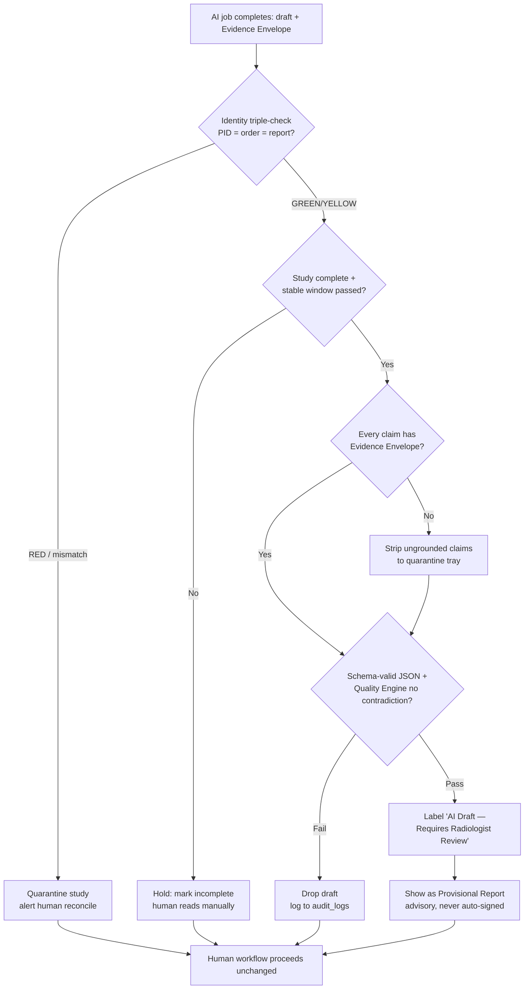
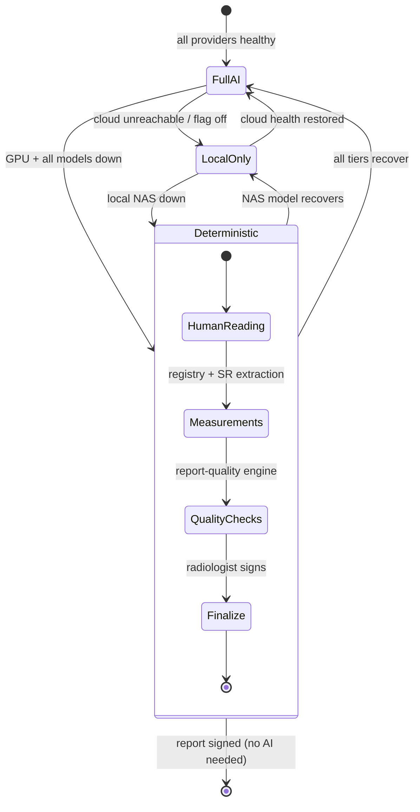

# 14 — Safety, Risk Analysis, and Failure Recovery

**Purpose.** This section specifies the safety envelope of the Radiology AI platform: the concrete safeguards that defend each named clinical threat, a hospital-grade risk register with residual-risk accounting, and per-subsystem failure-recovery procedures with RTO/RPO targets. It builds directly on the safety substrate that already exists in the codebase — the hash-chained `audit_logs` (`lib/audit.ts`), the fail-closed PCPNDT Form-F gate (`pcpndtCompliance.ts`), `report_quality_gates` / `report_quality_checks`, `peer_review_assignments`, the two critical-finding tables, server-side `feature_flags` (`ff_radiology_*`), and the no-delete/append-only doctrine on `patient_reports.body`. Nothing here forks those controls; every new safeguard is additive within the 🟡 Radiology zone defined in `PROTECTED_FILES.md`.

> ## THE HARD RULE (non-negotiable, stated once, enforced everywhere)
> **AI never blocks, delays, gates, or overrides the radiologist.** The Provisional Report is advisory input, never a precondition. On *any* AI failure — GPU down, model timeout, corrupt output, network partition, provider outage — the human reading workflow (`RadiologyReportingWorkspace.tsx` → draft → finalize → sign) proceeds **unchanged and uninterrupted**. The radiologist can always open the study in OHIF/Weasis, dictate, and sign without a single AI subsystem being alive. This is a direct application of Constitution principles **4 (Deterministic Before AI)** and **5 (AI Advises, Humans Decide)**, and of the master design doctrine "AI assists, never replaces; radiologist is sole author." Any design that violates this rule is rejected on sight.

---

## Part A — Safeguards (per named threat)

Each safeguard states *what deterministic check runs*, *where the data lives*, and *what happens on failure*. The universal failure mode is **fail-safe: quarantine the AI artifact, label it, never inject it into a report, and let the human workflow continue.**

### A1. Hallucinations (invented findings, phantom measurements, fabricated priors)
- **Grounding rule.** Every Provisional Report claim must carry an **Evidence Envelope** (§12): `seriesUid + sopUid + frameNumber` provenance plus a source-trace. A claim with no envelope is **ungrounded** and is quarantined before it ever reaches the workspace — it is stored on the draft but rendered only in a "quarantined / unverifiable" tray, never as ghost text or an insertable card.
- **Deterministic-before-AI ordering.** Measurements come from the canonical `lib/measurements` registry and DICOM-SR/private-tag extraction (`usgExtractor.ts`) *first*; the AI may only annotate or compare values that the deterministic layer already produced. The AI is never the sole author of a numeric value.
- **Structured-JSON contract.** The AI Gateway (§04) enforces a schema-validated `AiQueryResult` (zod + repair loop) rather than the current ad-hoc `match(/\{...\}/)+JSON.parse`. Output that fails schema validation N times is dropped, not silently coerced.
- **Cross-check against the Quality Engine.** `lib/report-quality` (rules Q001–Q115, shadow tier) re-evaluates the generated draft; measurement-range rules (`care.measurement.range.<id>`) flag values outside `normalRange`/`criticalRange` for human attention. Contradictions (e.g., "no mass" + a MASS measurement) surface as WARNING, never as an auto-edit.

### A2. Missing studies / incomplete series (order says CT abdomen+pelvis; only abdomen arrived)
- **Completeness check vs order/worklist.** The **Study Processing Pipeline** reconciles the arrived Canonical Study Object against the expected procedure from `radiology_worklist` / `mwl_entries` / `order_tests`. `matchingEngine.ts` already emits GREEN/YELLOW/RED verdicts; a modality/region mismatch or short series set produces a **completeness warning** on the worklist, not a silent AI run.
- **AI never fabricates the missing half.** If expected regions are absent, the Organ Companions for those regions do not execute. The radiologist sees "Chest series expected, not received" — an advisory flag, never a block.

### A3. Wrong patient (identity triple-check)
- **Identity triple-check** runs before any AI processing and before the Provisional Report is shown: **DICOM PatientID (from Orthanc tags) ⟷ order/worklist patient ⟷ report patient** must all reconcile. This reuses `matchingEngine.ts` (name Levenshtein + accession + modality) and `radiologyDeploymentDiagnostics.ts` (accession/identity cross-reference against Orthanc tags).
- **Barcode / accession reconciliation.** ERP accession (`ACC-YYYYMMDD-MOD-NNN`, unique) is the billing-identity key; `studyInstanceUID` is the imaging-identity key. A RED verdict (`matchDecision=RED`, `matchScore=RED`) **hard-quarantines** the study from AI entirely and raises a critical-finding-style alert for human reconciliation. The radiologist can still read manually, but no AI artifact and no auto-linked report is produced for a RED study.

### A4. Wrong comparison (prior belongs to a different body part / modality / patient)
- **Prior-selection guards.** The Comparison engine (`radiologyComparison.ts`, §10) may only auto-suggest a prior when **same PID + same body region (via `lib/studyRegion.ts` `matchStudyRegion`) + compatible modality**. A prior failing any predicate is not offered.
- **Human-confirm.** Even a guard-passing prior is presented as a *suggestion* in the Prior tab; the comparison is inserted only on explicit radiologist confirmation. No auto-inserted delta ever reaches a signed report unconfirmed.

### A5. Mixed series (one study contains unrelated series — e.g., a stray localizer from another patient, or CT + US bundled)
- **Series classification + separation.** During ingestion the pipeline classifies each series (modality, body part, orientation) and separates series that do not belong to the study's declared modality/region. Off-profile series are excluded from the AI image set (`fetchStudyImages()` selects only in-profile series) and flagged for technologist review.
- The single canonical image-acquisition path (`fetchStudyImages()`, Orthanc DICOMweb → sharp → base64) is the only function permitted to assemble the AI image set — no per-route duplication.

### A6. Partial uploads (study still arriving when processing triggers)
- **Instance-count vs expected + stability window.** The pipeline compares received instance count against the expected count (MWL / prior-arrival heuristics) and enforces a **stability window**: no AI job is enqueued to `ai_job_queue` until the study has been quiescent (no new instances) for a configured interval. This prevents the AI from reading half a study.
- Partial studies remain fully readable by the human at any time; only the *AI trigger* waits.

### A7. Corrupted DICOM (unparseable pixel data, truncated files, bad transfer syntax)
- **Parse validation + quarantine.** Ingestion validates DICOM parse integrity (via the bridge / Orthanc). Files that fail parse are routed to `dicom_failed_retrieval_queue` and the study is marked with an ingest fault; the AI job is not created. `fetchStudyImages()` skips unrenderable instances rather than passing garbage bytes to a provider.
- Corruption never propagates into a provider call; the worst case is "AI unavailable for this study," and the human reads the salvageable images directly in the viewer.

### A8. GPU / model / network failure (fallback chains — degrade to deterministic, never block)
- **Fallback chain in the AI Gateway.** `generateAiForTask()` resolution (explicit override → `ai_model_routes` → global default) is extended into a **health-aware failover ladder** driven by `ai_provider_health`: local Ollama on the Synology NAS (`http://100.79.100.41:11434`, MedGemma/Qwen-VL) → alternate local model → optional cloud (Gemini/OpenAI/Anthropic, feature-flagged) → **deterministic-only mode**.
- **Degrade to deterministic.** When every model tier is unreachable, the platform serves the deterministic layer alone: `lib/measurements` extraction, `lib/report-quality` checks, `radiologyComparison.ts`, quick findings, and normal-templates. The workspace shows an "AI unavailable — deterministic mode" banner; nothing is blocked.
- **Never block the radiologist.** GPU scheduling and retries live *behind* the `generateAiForTask()` seam (see §07); a stalled `ai_job_queue` worker changes nothing about the human's ability to open, dictate, and sign.

### A9. The safety gate BEFORE a Provisional Report is shown

Every terminal path leads to **K: the human workflow proceeds unchanged** — the visual proof of the Hard Rule.

---

## Part B — Risk Analysis (register)

Likelihood: Low / Med / High. Clinical severity uses a patient-harm lens (Catastrophic = missed/incorrect diagnosis on a signed report; Major = delayed care; Moderate = rework/TAT; Minor = cosmetic). Residual = risk remaining after the stated mitigation.

| # | Risk | Likelihood | Impact | Clinical severity | Mitigation (real components) | Residual |
|---|------|-----------|--------|-------------------|------------------------------|----------|
| R1 | AI hallucinates a finding that reaches a signed report | Med | Wrong Dx | Catastrophic | Grounding rule + Evidence Envelope quarantine (§12); AI-never-auto-signs guard; "AI Draft" label; Quality Engine cross-check | Low — human must actively insert + sign |
| R2 | Wrong-patient study processed / mislinked report | Low | Wrong Dx on wrong patient | Catastrophic | Identity triple-check; `matchingEngine` RED hard-quarantine; accession reconciliation; fix `patient_reports.studyId` overload with discriminator (§03) | Low |
| R3 | Wrong prior auto-compared (progression called on wrong baseline) | Med | Wrong trend | Major | Prior-selection guards (same PID+region+modality) + mandatory human-confirm (§10) | Low |
| R4 | Partial/incomplete study read as complete by AI | Med | Missed finding | Major | Instance-count vs expected + stability window; completeness warning | Low |
| R5 | Corrupted DICOM crashes pipeline or yields garbage findings | Med | AI unavailable / bad output | Moderate | Parse validation → `dicom_failed_retrieval_queue`; `fetchStudyImages` skips unrenderable | Low |
| R6 | Mixed/foreign series contaminates AI image set | Low | Wrong Dx | Major | Series classification + separation; in-profile-only image assembly | Low |
| R7 | Critical finding missed by weak keyword scanner (`no pneumothorax` matches; `haemorrhage` missed; no negation) | High | Missed emergent Dx | Catastrophic | **Owned remediation plan (not a deferral):** (1) Retire keyword matching for **deterministic critical triggers** derived from `lib/measurements` `criticalRange` — a value crossing `criticalRange` fires the trigger, no string scanning. (2) Per-Organ-Companion **critical-checklist coverage matrix** — each region (Brain, Chest, Abdomen, …) enumerates its must-not-miss criticals so every one is explicitly detectable, with the matrix as the coverage audit. (3) **Negation-aware detection** so `no pneumothorax` does not fire and `haemorrhage` is not missed. (4) Measurable target **≥99% recall** on a labelled critical-findings validation set, owned by the Radiology AI clinical-safety lead. (5) **Invariant:** this path NEVER gates the radiologist — it escalates/pages (`peer_review_assignments`, critical-finding alert), never blocks. Human read remains the ultimate safety net. | Med now → Low once deterministic `criticalRange` triggers + negation-aware checklists land at ≥99% validated recall (paging-only, never gating) |
| R8 | AI outage blocks reporting | Low | Care delay | Major | Degrade-to-deterministic ladder; Hard Rule; workspace offline mode | Very Low |
| R9 | Backup silently truncates (CRIT-1: `cron.ts` caps tables at 5,000 rows, stamps success) | High | Unrecoverable data loss | Catastrophic | **Blocking pre-req**: remove row cap, verify row counts, fail loudly; restore-drill validation (Part C) | Med until landed |
| R10 | Audit hash-chain forks under concurrency (CRIT-2: un-serialized read→insert, non-unique index) | Med | Non-repudiation loss | Major | `pg_advisory_xact_lock` serialization landed; **land** unique `chain_hash` index + `REVOKE UPDATE/DELETE` + bigint PK | Low once DB-hardened |
| R11 | Feature-flag toggle changes AI behavior with no audit trace | Med | Governance gap | Moderate | Add `auditLog()` to `PATCH /feature-flags` (one-line reuse) | Low |
| R12 | Provider key leak / SSRF via Ollama endpoint | Low | PHI exposure | Major | AES-256 encrypted keys; `radiologyOllama.ts` SSRF guard; see §15 | Low |
| R13 | Stale PCPNDT Form-F record false-allows an obstetric USG finalize | Low | Regulatory breach | Major | Single fail-closed `checkPcpndtFormFCompliance`; by-patient-latest documented; audited admin override only | Low (accepted) |
| R14 | Silent JSON-parse coercion injects malformed AI text | Med | Wrong content | Moderate | Schema-validated `AiQueryResult` + repair loop; drop-not-coerce | Low |
| R15 | Queue poison message stalls night processing | Med | TAT breach | Moderate | DLQ + `retryCount` cap → dead-letter; idempotent reprocessing (Part C) | Low |

---

## Part C — Failure Recovery (per subsystem)

### C1. AI job queue — DLQ, replay, idempotent reprocessing
`ai_job_queue` already carries the right shape (`studyId, jobType, priority, retryCount, gpuMode, confidenceScore, result_json, humanOverridden`). The worker (§07) treats it as an at-least-once queue:
- **Retry with backoff** up to `retryCount` cap; exhausted jobs move to a **dead-letter** state (a `status='dead_letter'` value, not a new table) with the last error captured.
- **Idempotent reprocessing.** Jobs are deduped by a UNIQUE constraint `(studyId, jobType, inputHash)` on `ai_job_queue`. `studyId` is the **existing** integer `study_id` FK (the order/financial spine surrogate) — the queue keeps its integer key and does *not* invent a `studyInstanceUID`/`canonicalStudyId` column. `inputHash` is a **new** `input_hash` text column = SHA-256 over the normalized tuple `{ sorted SOPInstanceUIDs (series manifest) of the analyzed series, promptTemplateVersion, provisionalReportSchemaVersion }`; it hashes input *content*, not model identity. `modelVersion` is deliberately **not** part of the key: re-running identical inputs is deduped, while a model upgrade that must re-analyze prior studies is an **explicit, audited reprocessing job** (a new row via a reprocess flag), never a silent key collision. Migration is backward-compatible — add `input_hash` + the unique index nullable → backfill → enforce. Re-running produces a new draft row but never a duplicate signed report (finalize idempotency-key already exists). Replay is a status reset on dead-letter rows — safe because the human report is unaffected.
- A stuck queue is a **degradation, not an outage**: deterministic mode covers the gap.

### C2. PACS / ingestion — re-pull and dedup
- **PACS re-pull.** Failed retrievals land in `dicom_failed_retrieval_queue`; `dicom_pull_jobs` (pending→running→completed/partial/failed) drive retries against `dicom_nodes`. `dicom_pulled_studies` (unique `studyInstanceUID` + `hashSignature`) guarantees dedup on re-pull.
- **Reconciliation self-heal.** `reconcileMissingStudies` (48h window) and `radiologyDeploymentDiagnostics.ts` continuously repair studies present in Orthanc but missing from the worklist.

### C3. AI Gateway / providers — failover
- Health-aware ladder (C-A8) driven by `ai_provider_health`. A provider marked unhealthy is skipped in `resolveTaskRoute()`; recovery is automatic on the next successful health probe. No human action required; no reporting impact.

### C4. Workspace — offline mode
- `RadiologyReportingWorkspace.tsx` already has `useLocalDraftBackup` + `draftRescue` (offline rescue, retry/backoff) and client-side park. On network loss the radiologist keeps editing; drafts persist locally and sync on reconnect. Finalize/PCPNDT gates run server-side on reconnect. Reading and dictation never stop.

### C5. Database — backup, restore, replication (`backupReplication`)
- **`backupReplication`.** PostgreSQL streaming replication to a standby (Synology-local + off-site) is the durability spine. **Blocking pre-req:** fix CRIT-1 — the current `cron.ts` backup truncates every table at 5,000 rows while stamping success; this must be replaced with full `pg_dump` + verified row counts + fail-loud on mismatch, and paired with a **quarterly restore drill** that reloads into a scratch DB and runs the audit-chain verifier (`verifyAuditChain()`).
- **No-delete doctrine** means recovery rarely needs point-deletes: `patient_reports.body` is frozen + content-hashed at sign, amendments only via `report_amendments`, snapshot rows retained ≥7yr. Restore integrity is provable via the hash chain.

### C6. RTO / RPO targets

| Subsystem | RPO (max data loss) | RTO (max downtime) | Recovery mechanism |
|-----------|--------------------|--------------------|--------------------|
| Signed reports (`patient_reports`) | 0 (sync replication) | ≤ 15 min | Standby promotion + chain verify |
| Canonical Study / worklist | ≤ 5 min | ≤ 30 min | Replica + PACS re-pull |
| PACS pixel data (Orthanc) | 0 (source is modality/PACS) | ≤ 1 h | Re-pull via `dicom_pull_jobs` |
| AI drafts / `ai_job_queue` | Best-effort (regenerable) | N/A (degrade to deterministic) | Idempotent replay |
| `audit_logs` | 0 (must never lose) | ≤ 15 min | Replica; append-only, verifiable |

### C7. Degraded-mode operation (state machine)

In **every** state — including `Deterministic` — the radiologist can complete and sign a report. Degradation reduces AI *assistance*, never *authorship capability*.

---

## Cross-references
- **[04-ai-gateway.md](04-ai-gateway.md)** — health-aware failover ladder, `ai_provider_health`, schema-validated `AiQueryResult`.
- **[05-study-pipeline-and-dataflow.md](05-study-pipeline-and-dataflow.md)** — ingestion, stability window, series classification, safety-gate placement in the lifecycle.
- **[07-orchestration-and-night-processing.md](07-orchestration-and-night-processing.md)** — `ai_job_queue` worker, retries, DLQ, GPU scheduling behind the `generateAiForTask()` seam.
- **[03-canonical-data-model.md](03-canonical-data-model.md)** — identity keys, `patient_reports.studyId` discriminator, crosswalk that powers the identity triple-check.
- **[10-prior-comparison-and-timeline.md](10-prior-comparison-and-timeline.md)** — prior-selection guards and human-confirm.
- **[11-measurement-engine.md](11-measurement-engine.md)** & **[12-explainability.md](12-explainability.md)** — Measurement Provenance and the Evidence Envelope that the grounding rule depends on.
- **[15-security-model.md](15-security-model.md)** — audit hash-chain DB-hardening (CRIT-2), key encryption, SSRF, feature-flag audit.
- **[16-performance-and-scalability.md](16-performance-and-scalability.md)** — scaling of the recovery mechanisms across single→multi-hospital deployments.
- **[19-critical-decisions-before-coding.md](19-critical-decisions-before-coding.md)** — CRIT-1 (backup truncation) and cross-modality hard-block policy as decisions to lock first.
