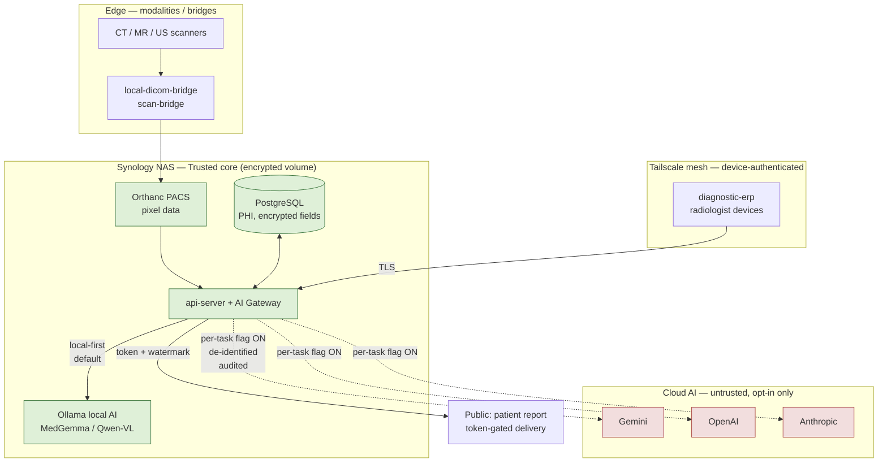

# 15 — Security Model

**Purpose.** This section specifies the security model for the Radiology AI platform: how Protected Health Information (PHI) is protected at rest, in transit, and across the network trust tiers already in production; how identity and authorization are enforced; where the AI-specific security boundary sits (which providers may ever see an image or PHI, and how prompt-injection and data exfiltration are defended); how audit and tamper-evidence make the record non-repudiable; how secrets are managed; how multi-hospital isolation is achieved; and the regulatory posture (HIPAA-style safeguards, India DPDP, PCPNDT, and Software-as-a-Medical-Device considerations) plus supply-chain/model governance. Every control below builds on components that already exist — `@workspace/crypto` (`lib/crypto/src/index.ts`), the hash-chained `audit_logs` (`lib/audit.ts`), `role_permissions`, `teleradiology_users`, `ai_provider_settings`, `study_access_log`, and the network-aware viewer tiers (`networkProfiles.ts`, `studyLaunchService.ts`). Nothing here forks those controls; every addition is additive within the 🟡 Radiology zone of `PROTECTED_FILES.md`.

> ## THE PHI EGRESS RULE (non-negotiable, stated once, enforced everywhere)
> **No pixel data and no PHI leaves the Synology NAS / Tailscale trust perimeter unless a per-task, server-side, feature-flagged, audited policy explicitly permits it.** The default AI backend is **local-first**: Ollama on the Synology NAS over Tailscale (`http://100.79.100.41:11434`, MedGemma / Qwen-VL / gemma3 / gpt-oss). Cloud providers (Gemini / OpenAI / Anthropic) are **opt-in per `AI_TASK_CATALOG` task**, gated behind `ff_radiology_*` server flags, and every image or PHI-bearing prompt that crosses that boundary is logged to `radiology_ai_review_audits` and the `audit_logs` chain. A task whose route resolves to a cloud provider but whose egress policy forbids PHI **degrades to deterministic**, it does not silently send. This is a direct application of Constitution principle **4 (Deterministic Before AI)** and the master-design doctrine "multi-provider: local-first default, cloud under feature flags, engine disclosed in footer."

---

## Part A — PHI Protection

### A1. Data classification → handling → allowed destinations

Everything the platform touches is classified into one of five bands. The band determines encryption, retention, and — most importantly — which AI destinations may receive it. This table is the machine-checkable contract the AI Gateway (§04) enforces before any provider call.

| Class | Examples | Handling | Allowed AI destinations |
|-------|----------|----------|-------------------------|
| **P0 — Direct identifiers** | Name, Aadhaar, phone, address, `patients.*`, DICOM `PatientName`/`PatientID`, Form-F | Encrypted at rest; TLS in transit; never in prompts; `sw.js` `NETWORK_ONLY_PREFIXES` cache guard | **None.** Stripped/pseudonymized before any AI call |
| **P1 — Image pixel data** | Orthanc DICOM instances, `fetchStudyImages()` rendered JPEGs | AES + disk encryption on NAS; DICOMweb over TLS | **Local Ollama only by default.** Cloud vision only per-task, flag-on, audited |
| **P2 — Clinical free text** | Findings, impression, clinical history, prior reports | Encrypted at rest; frozen at sign (`patient_reports.body`) | Local by default; cloud per-task if de-identified header stripped |
| **P3 — Derived/structured** | Measurements, `structuredJson`, coded findings, `Evidence Envelope` | Encrypted at rest | Local or cloud per task policy (lowest PHI density) |
| **P4 — Non-PHI operational** | Model IDs, prompt versions, `ai_provider_health`, TAT metrics, feature flags | Standard | Any; no PHI present |

**Enforcement point.** The de-identification and destination check runs **server-side inside the AI Gateway**, not in the caller. `fetchStudyImages()` (the single canonical Orthanc DICOMweb → `sharp` → base64 path) must strip burned-in-annotation series and DICOM header PHI before the image set is handed to any provider adapter. A task routed to a cloud provider carries only the classes its policy row permits.

### A1.1 — Consolidated data-retention matrix

Retention is a first-class control (DPDP purpose-limitation and retention duty, PCPNDT record-keeping, and the medico-legal minimum), bounded by the **no-delete doctrine**: nothing in the tamper-evident spine is ever hard-deleted — "retention end" means *de-identification or access-sunset*, never destructive erasure of a signed clinical record. This matrix is the single authoritative source for how long each artifact lives and on what basis; it is the retention counterpart to the P0–P4 classification above.

| Artifact / data class | Retention duration | Basis | Store / doctrine |
|-----------------------|--------------------|-------|------------------|
| **Finalized reports** (`patient_reports.body`, frozen + content-hashed at sign) | **≥ 7 years** medico-legal (longer while a case is under litigation) | Legal (DPDP retention + medico-legal minimum) | PostgreSQL, no-delete; post-sign changes only via `report_amendments` |
| **Draft / provisional reports** (`ai_draft`, advisory; AI never auto-signs) | Kept for the study lifetime; purged only after finalization + a review window (default 90 days post-sign) | Clinical / operational | Superseded by the finalized report; carries the "AI Draft — Requires Radiologist Review" label until signed |
| **Images / heatmaps** (Orthanc DICOM instances, `fetchStudyImages()` renders, XAI heatmap overlays) | **≥ 7 years**, co-terminous with the report; heatmaps live as long as their Evidence Envelope | Legal / clinical | Encrypted NAS volume; heatmaps are derived **P3** overlays, not new PHI |
| **Evidence Envelopes** (§12, P3 provenance) | Co-terminous with the finalized report (**≥ 7 years**); never pruned before the report it explains | Legal / clinical | Immutable explainability record; carries the `(model version + prompt version + input hash)` provenance tuple |
| **Feedback Ledger** (radiologist accept / edit / reject signals) | Long-term for model governance; **de-identified** once the clinical retention window closes | Operational / consent | Drives shadow-parity + model validation; PHI stripped for the long-term keep |
| **Audit chain** (`audit_logs`, hash-chained) | **Permanent** — never updated or deleted (`REVOKE UPDATE/DELETE`, unique `chain_hash`) | Legal (non-repudiation, no-delete doctrine) | Append-only, tamper-evident spine |
| **Research Data Mart** (de-identified derivatives) | Per research-ethics approval; deleted or re-consented at study/project close | Consent (DPDP purpose limitation) | De-identified before entry — no P0/P1 ever enters |
| **Form-F / PCPNDT records** (P0) | **≥ 2 years** per PCPNDT Rules (longer while under litigation) | Legal (PCPNDT) | Behind the fail-closed `checkPcpndtFormFCompliance` gate; sex-determination content regulated |

Durations are floors, not ceilings: the longest applicable basis wins (a report under litigation is held past 7 years), and access can be sunset (viewer/token revocation) independently of the storage-retention clock.

### A2. Encryption at rest

- **`@workspace/crypto` (`lib/crypto/src/index.ts`) is the sole crypto primitive.** It exposes AES-256-GCM (`encryptWithSecret`/`decryptWithSecret`, PBKDF2-SHA256, 100k iterations, salt+iv+tag envelope) for new secrets and backups (`encryptBackup`/`decryptBackup` keyed by `SESSION_SECRET`), plus a **legacy AES-256-CBC** path (`decryptSecret`, `iv_hex:ciphertext_hex`) that today decrypts AI provider API keys in `ai_provider_settings`. **Governance decision:** all *new* encrypted fields use AES-256-GCM; the CBC path is frozen (no new writers) and migrated opportunistically — never a second crypto implementation elsewhere in the tree.
- **Disk / DB encryption on Synology.** The NAS volume hosting PostgreSQL and the Orthanc storage tree runs with Synology encrypted shared folders (LUKS-backed); the `SESSION_SECRET` and the volume key are **not** stored on the same volume. This gives defence-in-depth: application-layer field encryption (keys, backups) *inside* a full-volume-encrypted database *inside* an encrypted NAS share. A stolen disk yields nothing without both the volume key and `SESSION_SECRET`.

### A3. Encryption in transit and the network trust tiers

The platform already ships a **network-aware** viewer/PACS layer with four concrete tiers (`studyLaunchService.ts` `CONCRETE_MODES = LAN | TAILSCALE | CLOUDFLARE | PUBLIC`, hosts centralized in `networkProfiles.ts`). The security model attaches a trust level and a TLS/PHI policy to each tier:

| Tier | Transport | Trust | PHI / AI policy |
|------|-----------|-------|-----------------|
| **LAN** (`192.168.1.137`) | Intra-clinic, TLS on app ports | Highest | Full PHI + local AI (Ollama on NAS) |
| **TAILSCALE** (`100.65.255.115`, Ollama `100.79.100.41`) | WireGuard, device-authenticated mesh | High | Full PHI + local AI; the perimeter for the PHI Egress Rule |
| **CLOUDFLARE** | TLS via Cloudflare Tunnel, no open inbound ports | Medium | PHI viewer access for authenticated staff; **no** direct AI egress |
| **PUBLIC** (`caredeoghar.com`) | Public TLS, patient-facing | Lowest | Only patient-scoped, token-gated report delivery (`report_shares.public_token`); never bulk PHI |

TLS terminates at the app; Cloudflare/public tiers never expose Orthanc or the DB directly. Tailscale is the **AI trust boundary**: the Ollama NAS endpoint is reachable only inside the tailnet, and `radiologyOllama.ts` retains its **SSRF guard** so a user-supplied endpoint can never be coerced into reaching an internal service or an off-tailnet host.

### A4. PHI trust zones (flowchart)

The solid line from the Gateway to local Ollama is the default path; the dotted lines to cloud providers exist **only** when a per-task flag is on, PHI is de-identified per Part A1, and the crossing is audited.

---

## Part B — Authentication and Authorization

**AuthN.** Two identity domains coexist and must stay separate: internal ERP staff (session-based, `ERP_ROLES`) and external night/teleradiologists (`teleradiology_users`, bcrypt `pinHash`, short-lived `teleradiology_sessions` with `ipAddress`/`userAgent` captured). Teleradiologist capability is column-gated: `canDoFinalReport` and `canUseAI` default **false** — least privilege by construction. External users never receive an ERP session; they operate only through `/teleradiology` against assigned studies.

**AuthZ — RBAC.** `role_permissions` is the granular matrix: one row per `(role, module)` with `canView / canCreate / canEdit / canDelete / canApprove / canFinalize / canPrint / canReprint / canExport` bits. The security model **activates the dead bits**: today only `canView` is consistently read; finalize/approve must be enforced server-side from `canFinalize`/`canApprove` on the `radiology` and `form_f` modules, not by a coarse path gate. `backups` and `audit` modules stay restricted to `super_admin`/`admin`.

**Least privilege + per-study access.** Authorization is two-layer: role gate (can this role reach this module?) then **row scope** (may this user act on *this study*?). Study scope derives from assignment (`assignedRadiologistId`, `teleradiology_assignments`), the reporting lock (`radiology_study_locks` / worklist `lock_user_id`), and, for teleradiologists, an explicit assignment row. Every study touch is written to `study_access_log` (`view | download | print | edit | share | export | watermark_download | break_glass`) with user, role, IP, and device.

**Break-glass.** Emergencies (STAT/trauma, on-call outside assignment) must not be blocked by RBAC. The `break_glass` action already exists in `study_access_log`. The rule: a permitted role may **self-authorize** emergency access to an unassigned study by supplying a reason; access is granted immediately, and the event is written **both** to `study_access_log` (action `break_glass`, reason in `detailsJson`) **and** the tamper-evident `audit_logs` chain. Break-glass is never silent and is reviewed post-hoc — access first, accountability guaranteed.

---

## Part C — The AI-specific security boundary

1. **PHI egress policy (which providers may receive images/PHI).** Encoded as the Part A1 destination column and enforced in the AI Gateway. Local Ollama may receive P1/P2 by default; cloud providers require the task's `ff_radiology_*` flag ON *and* de-identification. The policy is **per `AI_TASK_CATALOG` task**, not global — `id_card_ocr` and `whatsapp_ai_receptionist` have different egress rights than `radiology_draft`.
2. **Local-first for cloud.** `generateAiForTask()` resolution (override → `ai_model_routes` → default) is extended so the *default* route for image-bearing radiology tasks is local; cloud is a deliberate, flagged override, disclosed in the report footer ("engine: …").
3. **Prompt-injection defense on report text and OCR'd content.** Prior reports, clinical history, and OCR output (bills, ID cards, burned-in USG text via `usgExtractor.ts`) are **untrusted input**. They are passed to models as clearly delimited *data*, never concatenated into the instruction region; a sanitization pass strips instruction-like sequences ("ignore previous", role tokens, fenced system directives) before injection. Model output is treated as *suggestion data*, never as commands the platform executes.
4. **Model / provider key management.** Keys live encrypted in `ai_provider_settings` via `@workspace/crypto`; endpoint URLs are plaintext (operational, non-secret) but SSRF-guarded. Keys are never returned to the client, never logged, and rotated by re-encrypting through the same primitive.
5. **Output validation to prevent exfiltration.** Every structured AI response passes the schema-validated `AiQueryResult` (zod + repair loop, §04) — replacing today's ad-hoc `match(/\{...\}/)+JSON.parse`. Validation additionally scans generated text for **leakage patterns**: embedded URLs, base64 blobs, other patients' identifiers, or system-prompt echoes. A response failing validation N times is dropped and audited, never coerced into a report. Combined with the AI-never-auto-signs invariant, this makes a poisoned model unable to exfiltrate PHI into a signed document.

---

## Part D — Audit and tamper-evidence

- **Append-only hash-chained `audit_logs`** (`lib/audit.ts`): `auditLog()` writes are serialized by `pg_advisory_xact_lock` (CRIT-2 fix landed) so the `previousHash → chainHash` SHA-256 chain cannot fork; `verifyAuditChain()` is a pure verifier. **Two DB-hardening pre-reqs the security model requires:** a **unique** `chain_hash` index, `REVOKE UPDATE/DELETE` on the table, and a **bigint** PK — turning app-convention immutability into DB-enforced immutability.
- **AI-decision provenance:** `radiology_ai_review_audits` records every provider queried and the radiologist's winning selection. The security model extends each AI draft with an immutable `(model version + prompt version + input hash)` tuple so provider egress and model lineage are provable years later. AI audit writes must join the tamper-evident chain — they are **unconditional**, not the current best-effort `.catch(()=>{})` swallow.
- **Immutable finalized reports + signature.** `patient_reports.body` is frozen and content-hashed at sign; post-sign changes only via `report_amendments`; snapshot rows are never hard-deleted (no-delete doctrine). Authorship must become **server-derived**, not a client-supplied string, so "who signed" is non-forgeable. Signature = the hash-stamped, chain-anchored sign event; a signed report whose body hash no longer matches its `audit_logs` entry is detectably tampered.
- **Feature-flag toggles are audited.** `PATCH /feature-flags` must call `auditLog()` — a one-line reuse — so every governance-relevant change to AI behavior leaves a chain trace.

---

## Part E — Secrets management

`SESSION_SECRET` is the master secret (derives the backup GCM key and the legacy CBC key); it is injected via environment, never committed, and stored off the encrypted DB volume. Provider API keys live encrypted in `ai_provider_settings`; DB credentials and Orthanc credentials are environment-injected. The `default-fallback-ai-key-change-in-production` fallback in `getCbcKey()` is a **deployment blocker** — production startup must fail loudly if `SESSION_SECRET` is unset rather than silently using the fallback. Secret rotation re-encrypts affected rows through `@workspace/crypto`; the `__super_admin_quarantine` USB-isolated portal remains the break-glass path for audit-log/backup/role-permission administration.

---

## Part F — Multi-tenant isolation (multi-hospital)

Multi-tenancy is **deferred** by the frozen design (single Deoghar clinic today), but the security schema must not foreclose it. A `branches` table already exists. The decision: adopt a **nullable `branchId`/`tenantId` key on core tables now** (Constitution backward-compat; §03 identity strategy) so tenant scoping is a *filter*, never a re-key later. When multi-hospital ships, isolation is enforced at three layers — (1) row-level `branchId` scoping on every query, (2) per-tenant encryption context (distinct key material per hospital so a cross-tenant read is cryptographically useless), and (3) per-tenant AI routing (a hospital may mandate local-only). Until then, single-tenant deployments run with a constant tenant and the same code path, avoiding a future big-bang migration.

---

## Part G — Regulatory posture

- **HIPAA-style safeguards.** Access control (RBAC + per-study scope), audit controls (hash chain), integrity (content-hashed frozen reports), transmission security (TLS + Tailscale), and encryption at rest (`@workspace/crypto` + Synology) map to the HIPAA Security Rule technical safeguards. Minimum-necessary is enforced by the Part A1 destination policy and least-privilege defaults.
- **India DPDP + PCPNDT.** DPDP data-fiduciary duties (purpose limitation, retention, breach accountability) are served by the classification table, no-delete audit, and ≥7-year medico-legal retention. **PCPNDT** is enforced by the single fail-closed `checkPcpndtFormFCompliance` gate shared by every finalize path; sex-determination content is regulated, so obstetric-USG AI output is constrained and the Form-F gate can never be bypassed except by an audited admin override. AI **must not** be routed to determine or infer fetal sex.
- **SaMD / assistive-not-diagnostic.** The platform positions AI as **assistive, not diagnostic-of-record**: the Provisional Report is advisory, AI never auto-signs, and the radiologist is the sole author. This is the load-bearing regulatory boundary — it keeps the system out of the high-risk diagnostic-device class. Every AI surface carries the "AI Draft — Requires Radiologist Review" label; removing it is a governance violation, not a UI tweak.

---

## Part H — Supply-chain and model governance

- **Provenance of model weights.** Local models (MedGemma / Qwen-VL / gemma3 / gpt-oss) are pinned by name **and digest** in `ai_provider_settings`; a model whose digest changes is a new model requiring re-validation, not a silent swap. Ollama vision-capability probes (`classifyOllamaModelVisionByName`, `probeOllamaModelVision`) confirm a model can actually do the task it is routed to.
- **Versioned prompts.** Every prompt is versioned; the `(model version + prompt version + input hash)` tuple (Part D) makes any generated draft reproducible and auditable.
- **Change control per `FINANCIAL_FREEZE`-style rulebooks.** AI behavior changes follow the `PROTECTED_FILES.md` 🟡-zone discipline and shadow-first strangler rollout: new routes/models land behind `ff_radiology_*` flags, run in shadow with parity diffs, and are promoted only on evidence — mirroring the report-quality engine's Phase-0-shadow doctrine and the billing zone's sign-off rigor. No model, prompt, or egress-policy change reaches production without a flag, an audit entry, and a rollback path.

---

## Cross-references
- **[04-ai-gateway.md](04-ai-gateway.md)** — schema-validated `AiQueryResult`, `generateAiForTask()` routing, `ai_provider_health`, per-task egress enforcement point.
- **[03-canonical-data-model.md](03-canonical-data-model.md)** — identity keys, `patient_reports.studyId` discriminator, nullable `branchId`/`tenantId` strategy for multi-tenant isolation.
- **[12-explainability.md](12-explainability.md)** — the Evidence Envelope and `(model + prompt + input hash)` provenance tuple that Part D anchors.
- **[14-safety-risk-and-failure-recovery.md](14-safety-risk-and-failure-recovery.md)** — SSRF/key-leak risk (R12), audit-chain fork (R10), feature-flag audit gap (R11), degrade-to-deterministic on egress denial.
- **[07-orchestration-and-night-processing.md](07-orchestration-and-night-processing.md)** — where the AI Gateway (and thus the egress check) executes for queued/night jobs.
- **[16-performance-and-scalability.md](16-performance-and-scalability.md)** — per-tenant key material and routing as deployment scales single → multi-hospital → hybrid.
- **[19-critical-decisions-before-coding.md](19-critical-decisions-before-coding.md)** — decisions to lock first: audit-log DB-hardening, `SESSION_SECRET` fail-loud, activating `canFinalize`/`canApprove`, per-task egress policy table.
