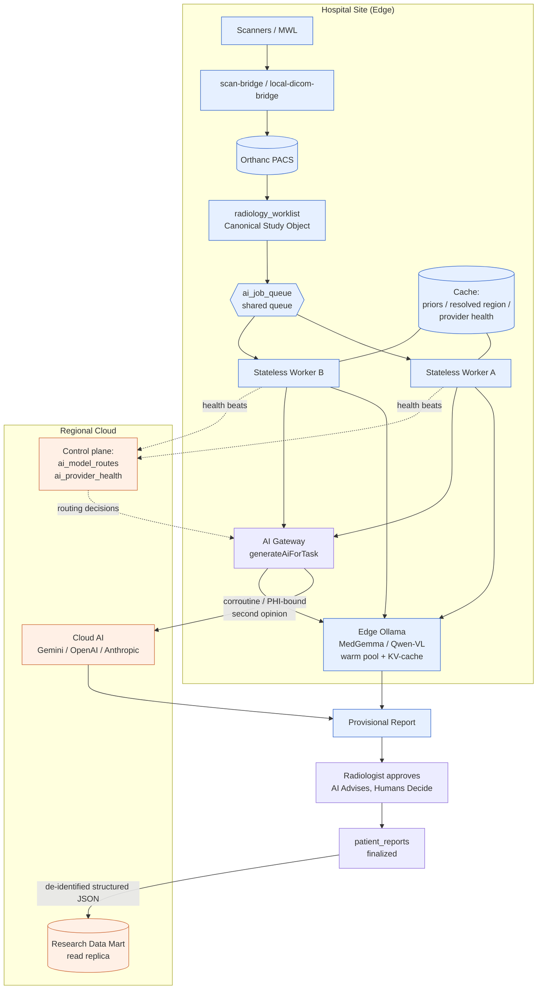

# 16 — Performance and Scalability

**Purpose.** This section defines the performance envelope and scaling path for the Radiology AI platform, from today's single-MRI Deoghar clinic on a Synology NAS to a multi-hospital, hybrid edge/cloud deployment. It is decisive about *where AI inference runs* at each stage, *where data lives*, and *what breaks first*. It obeys **Principle 7 (Measure Before Building)**: every recommendation is anchored to a metric the platform can already emit (`turnaround_times`, `ai_provider_health_logs`, `ai_job_queue` depth) and every SLO is measurable before it is optimized. The load-bearing architectural stance: keep the `generateAiForTask()` / `resolveTaskRoute()` seam of the **AI Gateway** (see `04-ai-gateway.md`) stable while scaling everything *behind* it — a shared **Study Processing Pipeline** queue fed by horizontally scaled, stateless workers. We do not scale by making the ERP smarter about models; we scale by making the queue and workers wider.

---

## 1. The scaling path — six stages

Scaling is a staircase, not a switch. Each stage adds a topology layer without invalidating the prior one (**Principle 6, Backward Compatibility / strangler**). The Canonical Study Object (keyed by `studyInstanceUID`, spanning `dicom_studies` + `radiology_worklist` + `radiology_studies`; see `03-canonical-data-model.md`) is the stable identity that survives every topology change — a study reported on the NAS today and one reported in a regional cloud in year three are the same object with the same crosswalk.

### Stage table

| Stage | Deployment topology | AI inference placement | Data locality | Key optimization | First bottleneck |
|---|---|---|---|---|---|
| **1. Single MRI (today)** | One Synology NAS: Express `api-server`, PostgreSQL, Orthanc, Ollama; `local-dicom-bridge` on LAN; Tailscale for remote read | Ollama on NAS (MedGemma / Qwen-VL / gemma3 / gpt-oss); cloud (Gemini/OpenAI/Anthropic) optional per route | All PHI + pixels on NAS; nothing leaves the LAN unless a cloud route is enabled | Model **warm pool** (keep Ollama model resident); async **Study Processing Pipeline** worker so reporting UI never blocks | Single GPU serializes inference; synchronous route handlers block on the provider HTTP call |
| **2. Multiple scanners (one site)** | Same NAS; multiple modalities push to Orthanc; `continuous-scan` / `scan-bridge` feed the worklist | Still local Ollama; batch small tasks, cascade large ones | Same-site; worklist grows, priors accumulate | **Worklist partitioning by date**, GIN indexes, queue **backpressure** so a burst of studies doesn't starve STAT | GPU queue depth; DB worklist scans; base64 image payloads inflate memory |
| **3. Multiple hospitals** | Per-site NAS/edge box (edge AI); each site autonomous; central registry for routing rules | **Edge-first**: each site runs its own Ollama + worker pool; central only for overflow/second-opinion | PHI stays on-site; only de-identified structured reports flow to a central **Research Data Mart** | **Horizontal scale-out** of stateless workers per site; per-site `ai_model_routes`; **read replica** at HQ for cross-site analytics | Cross-site identity/crosswalk consistency; network partitions between site and HQ |
| **4. Cloud AI** | Sites + a cloud inference tier (managed GPUs) behind the AI Gateway | Heavy/vision models in cloud; local Ollama handles routine + PHI-sensitive tasks | Pixels streamed on-demand (WADO), **never** base64-bloated into the DB; de-identify before cloud when policy requires | **Right-size model per task** (routine → small local; complex → large cloud); **speculative/cascade** small→large | Egress cost + latency; PHI governance gate; base64 image passing (current risk) becomes prohibitive at cloud scale |
| **5. Edge AI (mature)** | Purpose-built edge inference appliance per site (GPU), central control plane | Optimized local inference (quantized models, KV-cache reuse) with cloud burst | Full data locality; edge caches priors + resolved regions | **Quantization + KV-cache reuse + batching** on edge GPU; provider-health-aware failover | Edge GPU capacity planning; model version drift across sites |
| **6. Hybrid (target)** | Edge + cloud continuously; Gateway routes per task, per confidence, per load, per data-residency policy | Dynamic: routine/STAT-safe on edge, complex/second-opinion/overflow in cloud; **cascade** spans the boundary | Data-residency-driven: PHI-bound tasks pinned to edge; only Evidence Envelope metadata + de-identified reports traverse | All of the above + **cache** (priors, resolved region, provider health) + **cascade routing** across edge/cloud | Global scheduling fairness; cache coherence; cross-boundary observability |

The **critical current-state fact**: the queue that makes any of this work does not yet execute. `ai_job_queue` (in `radiologyWorkflow.ts`) has the right shape — `studyId`, `jobType`, `priority`, `retryCount`, `gpuMode`, `confidenceScore`, `result_json`, `humanOverridden` — but is **CRUD-only**: `POST /ai-jobs` inserts and `PATCH` transitions status; nothing dequeues `queued → processing`, calls a provider, and writes `result_json`. Every stage above depends on writing that worker first (see `07-orchestration-and-night-processing.md`). Do **not** invent a new table.

---

## 2. Hybrid edge/cloud topology (target)

Two invariants the diagram encodes: (1) **PHI-bound and routine work stay on the edge**; only de-identified structured reports and Evidence Envelope metadata cross to cloud; (2) the **AI Gateway is the only routing brain** — workers never choose a model, they ask the Gateway, which consults `ai_model_routes` and `ai_provider_health`. This preserves the principle that "the ERP never knows which model answered" (see `04-ai-gateway.md`).

---

## 3. Performance recommendations

### 3.1 Inference

The current stack is a synchronous prompt-proxy: every AI call is a blocking HTTP request inside a route handler, `stream:false`, no batching, no caching, no retry/backoff (despite `maxRetries` being persisted to `pacs_settings`). The following are ordered by leverage.

- **Warm pools.** Keep the routed Ollama models resident (the `AiInferenceSettings.tsx` `warmUpOnStartup` flag, currently persisted-but-unwired, becomes real). Cold-loading MedGemma per request is the single largest avoidable latency on the NAS.
- **Right-size model per task.** `AI_TASK_CATALOG` already names ~18 tasks. Route routine/deterministic-adjacent tasks (normal-report scaffolding, measurement normalization) to small local models; reserve large vision models for genuine image reasoning. This is a `ai_model_routes` policy, not code.
- **Speculative / cascade (small → large).** Run a fast small model first; escalate to a large (possibly cloud) model only when the small model's confidence is low or the Evidence Envelope is thin. The cascade boundary can span edge→cloud in Stage 6.
- **Quantization.** Prefer quantized MedGemma/Qwen-VL builds on edge GPUs to fit more concurrent contexts and raise batch size within fixed VRAM.
- **Batching + KV-cache reuse.** Batch same-model jobs pulled from `ai_job_queue`; reuse KV-cache across the multi-step prompts of a single Organ Companion (Brain, Chest, …) analyzing one study. The `batchSize`/`concurrency` fields in `pacs_settings` become the worker's real dials once consumed.
- **Streaming** for the interactive Copilot surfaces so ghost text/margin cards render progressively rather than after a full blocking response.

### 3.2 Pipeline

- **Async, idempotent stages.** The Study Processing Pipeline must be a state machine (arrival → … → Provisional Report) where every stage is idempotent and keyed by `studyInstanceUID` — safe to retry after a crash without double-writing. `ai_job_queue.retryCount` + a unique job key per (studyId, jobType, inputHash) enforces this.
- **Parallelism across studies.** Workers are stateless and pull independently; N workers process N studies concurrently. This is the horizontal scale-out lever.
- **Backpressure.** When GPU queue depth exceeds a threshold, the queue must shed/defer *routine* work while preserving STAT/VIP/emergency lanes (priority already lives on `ai_job_queue.priority`; see `07-orchestration-and-night-processing.md`). Backpressure protects the STAT SLO under burst.

### 3.3 Data

- **Base64 image passing is the headline scaling risk.** Today `fetchStudyImages()` pulls Orthanc DICOMweb `/rendered` JPEGs, `sharp`-resizes to 512px, base64-encodes, and passes `string[]` to providers. Base64 inflates payloads ~33%, pins whole images in Node heap, and — if ever persisted into `result_json` or draft rows — bloats the DB catastrophically at multi-hospital scale. **Recommendation:** keep `fetchStudyImages()` as the *single* canonical image-acquisition function, but move toward **on-demand WADO streaming** with references (seriesUid/sopUid/frame) rather than embedding pixels; never store base64 image bytes in Postgres. This aligns with Measurement Provenance (seriesUid + sopUid + frameNumber) in `11-measurement-engine.md`.
- **Worklist partitioning by date.** `radiology_worklist` is append-heavy and queried by recent window. Partition (or at minimum index) by study date so hot queries touch only recent partitions.
- **Indexing + JSONB GIN indexes.** Structured drafts and results live in JSONB (`aiDraftJson`, `result_json`, structured-report JSON per `docs/STRUCTURED_REPORT_JSON_SPEC_v1.md`). Add **GIN indexes** on the JSONB columns that analytics and Copilot query by key/containment; add btree indexes on `studyInstanceUID`, `status`, `assignedRadiologistId`, and date.
- **Read replicas for research/analytics.** The **Research Data Mart** (`13-research-database.md`) and cross-site dashboards must read from a **replica**, never the operational primary. Reporting workloads (registries, ML dataset export via `ai_training_data_exports`) are analytical and must not contend with the finalize path.

### 3.4 Caching

- **Priors.** Cache the resolved prior study/report per patient+region so the Comparison engine (`radiologyComparison.ts`, `10-prior-comparison-and-timeline.md`) doesn't re-query and re-fetch on every open.
- **Resolved region.** Cache `matchStudyRegion` output (`lib/studyRegion.ts`) per study — region resolution is deterministic and stable for a study's life.
- **Provider health.** Cache `ai_provider_health` so routing decisions don't probe on every call (the existing radiologyOllama proxy already caches endpoint reachability for 5 minutes — generalize that pattern into the Gateway). The `cacheResults` flag persisted in `pacs_settings` becomes the response-cache toggle.

### 3.5 UI

- **Workspace virtualization.** `RadiologyReportingWorkspace.tsx` is ~6000 lines with 8 right-panel tabs. Virtualize long lists (worklist rows, prior timeline, lesion tables) and windowed rendering for the queue so the workspace stays responsive with thousands of studies.
- **Lazy panels.** Load right-panel tab contents on demand (Copilot/Prior/Measure/Teaching) rather than eagerly; the hero-card layout already gates Copilot behind a pref — extend lazy-mount to every panel.

---

## 4. Capacity targets and SLOs

SLOs are stated per priority lane. "Provisional-report latency" = study arrival → Provisional Report ready for radiologist (machine time only; excludes human reporting). These are provisional targets to be ratified against measured baselines (**Principle 7**).

| Metric | STAT / emergency | Routine | Measured from |
|---|---|---|---|
| Provisional-report latency (P50) | ≤ 3 min | ≤ 20 min | `ai_job_queue` enqueue→result timestamps |
| Provisional-report latency (P95) | ≤ 6 min | ≤ 60 min | `ai_job_queue` |
| Report turnaround time (TAT, arrival→final sign) | ≤ 60 min | ≤ 24 h | unified turnaround table (keyed by `studyId`) |
| Queue depth (per site) | STAT lane ≈ 0 | ≤ 1× worker throughput/hour | `ai_job_queue` count by status |
| GPU utilization (edge) | — | 60–80% steady (headroom for STAT burst) | node/GPU metrics + worker concurrency |
| AI provider availability | ≥ 99% | ≥ 99% | `ai_provider_health_logs` |

**Capacity sizing rule of thumb.** Per-site worker count = ceil(peak studies/hour × avg inference seconds/study ÷ 3600 × safety factor 1.5), capped by GPU concurrency the quantized model supports. Because workers are stateless and share `ai_job_queue`, capacity scales by adding worker processes — not by re-architecting.

**How to measure (must exist before optimizing).** Two tables already carry the truth: the unified **turnaround** table (keyed by the Canonical Study Object's integer `studyId`, TAT/SLA) and `ai_provider_health_logs` (per-provider latency/availability). Instrument the new worker to stamp enqueue/dequeue/complete timestamps on `ai_job_queue`, and derive queue depth, throughput, and provisional-latency percentiles from those. Per `03-canonical-data-model.md`, `radiology_tat_tracking` and `turnaround_times` converge onto one unified turnaround table keyed by the Canonical Study Object's integer `studyId`; dashboards read that single table rather than joining two separate TAT tables. Feed `ai_provider_health` back into **routing/failover** (today it is logging-only) so the Gateway degrades gracefully when a provider slows.

---

## 5. Horizontal scale-out: the core recommendation

The single most important scalability decision: **stateless workers behind a shared queue.** Concretely —

- Workers hold no session state; all state is in `ai_job_queue` + the Canonical Study Object. Any worker can process any job.
- The queue is the coordination point and the natural place for **priority lanes** (STAT/VIP/emergency), **backpressure**, **retry/backoff**, and **idempotency** (unique job key per (studyId, jobType, inputHash)).
- Scaling = run more worker processes (per site at the edge; in an autoscaling pool in cloud). No sharding of application logic, no per-worker configuration divergence.
- The **AI Gateway seam is preserved**: workers call `generateAiForTask(taskKey, …)`; the Gateway resolves override → `ai_model_routes` → global default and picks edge vs cloud. Adding cloud capacity or a new provider is a routing-table change, not a worker change.

This is why consolidation matters before scaling (see `01-current-state-and-simplification.md`): the **two Gemini paths** (registry `@google/generative-ai` vs env `@google/genai`) and **two Ollama paths** (registry `/v1` vs `radiologyOllama` native `/api/generate`) must converge behind the Gateway first, or every scaling knob (health-aware routing, warm pools, caching) has to be built twice. A horizontally scaled fleet calling divergent stacks is unscalable by construction.

---

## Cross-references

- `02-enterprise-and-service-architecture.md` — enterprise/service topology and the scalability context this section deepens (Goals 13, 14).
- `03-canonical-data-model.md` — Canonical Study Object, crosswalk, and the duplicate TAT/critical-finding tables that dashboards must reconcile.
- `04-ai-gateway.md` — `generateAiForTask` / `resolveTaskRoute` seam, provider abstraction, and health-aware failover this section scales behind.
- `05-study-pipeline-and-dataflow.md` — Study Processing Pipeline state machine whose stages must be async and idempotent.
- `07-orchestration-and-night-processing.md` — the `ai_job_queue` worker, GPU scheduling, priority/STAT lanes, retries, and backpressure implementation.
- `10-prior-comparison-and-timeline.md` — prior caching target (`radiologyComparison.ts`).
- `11-measurement-engine.md` — Measurement Provenance (seriesUid/sopUid/frame) referenced by the image-streaming recommendation.
- `12-explainability.md` — Evidence Envelope metadata that crosses the edge/cloud boundary.
- `13-research-database.md` — Research Data Mart read-replica and ML dataset export workloads.
- `15-security-model.md` — PHI/data-residency policy governing what may leave the edge.
