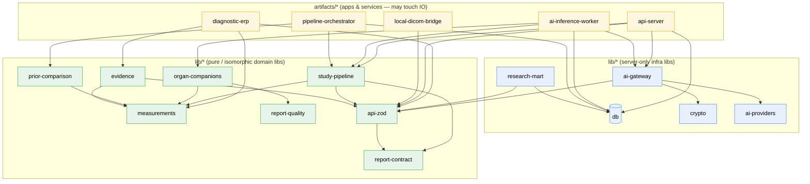

# 17 — API & Folder / Service Architecture

**Purpose.** This section defines *where the new Radiology-AI code lives* and *how the outside world talks to it*. It has two halves. The **API half** specifies the HTTP surface for the new AI capabilities as a **strangler extension of the existing Express `artifacts/api-server` + `lib/api-zod` contracts** — not a new gateway, not a new framework — with hardened conventions (versioning, zod-validated request/response, idempotency, SSE/webhooks for job completion, cursor pagination, one error contract, per-endpoint authz). The **folder half** proposes the pnpm-workspace packages and services the rest of this blueprint assumes: new `lib/*` packages (`ai-gateway`, `study-pipeline`, `organ-companions`, `prior-comparison`, `evidence`, `research-mart`) and two new long-running services under `artifacts/*` (`ai-inference-worker`, `pipeline-orchestrator`). Everything here obeys the Platform Constitution: One Engine behind the seam, Content over Code, Deterministic Before AI, AI Advises / Humans Decide, and Backward Compatibility (no-delete). No implementation code — contracts, tables, and trees only.

---

## Part A — API architecture

### A.1 Design stance

The current AI surface is ~60 endpoints in `routes/aiReporting.ts`, plus `routes/ai.ts`, `routes/radiologyOllama.ts`, `routes/radiologyWorkflow.ts` (the CRUD-only `ai_job_queue`), and `routes/smartRadiology.ts` — all unversioned `/api/*`, all returning raw `{ text }` with **zero schema enforcement** (grep-confirmed in the baseline). We do **not** rewrite these. We add **one new versioned namespace `/api/v1/*`** whose routers are the only place new AI capabilities are exposed, and we route them through the same Express app, the same auth middleware, and the same `auditLog()` hash-chain (`lib/audit.ts`). Legacy routes stay live and are strangled route-by-route (Principle 6). The single most load-bearing new primitive is **schema enforcement**: every `/api/v1` request and response is parsed by a zod schema exported from `lib/api-zod` — this is the platform-wide fix for the hand-rolled `match(/\{...\}/) + JSON.parse` fragility the baseline flags everywhere.

### A.2 Conventions (binding for every `/api/v1` endpoint)

| Concern | Rule |
|---|---|
| **Versioning** | Major version in the URL: `/api/v1/...`. Additive-only within a major (new optional fields, new endpoints). Breaking changes mint `/api/v2` and run in parallel (no-delete). Minor capability negotiation via `X-Api-Minor` request header, echoed in response. |
| **Request/response validation** | Every handler validates input **and** output against a zod schema in `lib/api-zod` (new `radiology-ai/` namespace). Invalid input → `422`. Invalid output is a server bug → `500` + audit. This replaces the ad-hoc fence-strip parsers. |
| **Idempotency** | All non-GET writes accept an `Idempotency-Key` header (reusing the pattern already on report `POST /:id/sign`). Enqueue (`POST /ai-jobs`) and feedback/export writes are idempotent; a replayed key returns the original result with `409`-free `200`/`202`. Keys persisted alongside `ai_job_queue`. |
| **Job completion → workspace** | Asynchronous. On enqueue we return `202` + a job handle. Completion is delivered two ways: (1) **SSE** stream `GET /api/v1/ai-jobs/:id/events` that the `RadiologyReportingWorkspace` subscribes to, flipping `radiology_worklist.aiDraftStatus → AI_DRAFT_READY`; (2) **outbound webhooks** to registered internal subscribers (orchestrator, integrations) for server-to-server fan-out. No polling loops in the ERP. |
| **Pagination** | Worklist and all list endpoints use **keyset/cursor** pagination (`?cursor=&limit=`, default 25, max 100), keyed on `(createdAt, id)` — not offset — so a growing worklist stays O(1). Response carries `nextCursor` and `hasMore`. |
| **Error contract** | One shape everywhere: `{ error: { code, message, details?, traceId } }`. Codes: `400` malformed, `401/403` authz, `404`, `409` idempotency/lock conflict, `422` validation or quality-gate block (matching USG `runQualityCheck → 422`), `429` rate-limit, `503` provider/gateway unavailable. `traceId` ties to the audit chain. |
| **AuthZ** | Every endpoint declares a required role/permission (table below). Reuse the real `role_permissions` bits (`canView`/`canFinalize`/`canApprove`) instead of coarse path gates — the baseline flags `canFinalize`/`canApprove` as dead code; `/api/v1` activates them. Internal-only endpoints require a service token, never a session cookie. |
| **Audit** | Every write emits an `auditLog()` row under the advisory-lock chain, and AI decisions additionally write `radiology_ai_review_audits`. No new AI audit store (Principle: converge, don't fork). |
| **AI safety invariant** | No `/api/v1` endpoint can finalize or sign. Provisional Reports are always labelled "AI Draft — Requires Radiologist Review"; approval happens only through the human finalize path in `lib/radiologyReportLifecycle.ts`. |

### A.3 Resource-oriented vs task-oriented split

Two families. **Resource-oriented** endpoints expose the Canonical Study Object and its satellites (studies, provisional-reports, measurements, comparison, evidence) as REST nouns the ERP reads. **Task-oriented** endpoints wrap actions that don't map to a noun — enqueueing inference, invoking the gateway, running an export. The **AI Gateway task endpoint is internal-only** and is the single seam behind which model selection lives (`generateAiForTask` → `ai_model_routes` → default); the ERP calls resource endpoints and **never** learns which model answered.

### A.4 API table

Base path `/api/v1`. Auth column: `staff` = any authenticated staff session; `radiologist` = `canView` on radiology; `approver` = `canApprove`; `admin` = admin/super_admin; `service` = internal service token (no cookie).

| Method | Path | Purpose | Auth |
|---|---|---|---|
| GET | `/studies` | Worklist / Canonical Study Object list; cursor-paginated, filterable by status/modality/assignee | staff |
| GET | `/studies/:studyInstanceUID` | Resolve one Canonical Study Object (crosswalk over `dicom_studies`+`radiology_worklist`+`radiology_studies`) | staff |
| GET | `/studies/:studyInstanceUID/timeline` | Prior-study timeline for this patient/region | radiologist |
| GET | `/studies/:studyInstanceUID/comparison` | Progression / regression / stable vs selected prior | radiologist |
| GET | `/studies/:studyInstanceUID/measurements` | Canonical measurements with Measurement Provenance | radiologist |
| POST | `/studies/:studyInstanceUID/measurements` | Ingest a measurement (server resolves label→registry id, attaches provenance) | radiologist |
| POST | `/ai-jobs` | Enqueue an inference job into `ai_job_queue` (idempotent) | radiologist |
| GET | `/ai-jobs` | List jobs for a study/queue; cursor-paginated | staff |
| GET | `/ai-jobs/:id` | Job status + `result_json` handle | staff |
| GET | `/ai-jobs/:id/events` | **SSE** stream of job lifecycle → workspace | staff |
| GET | `/studies/:studyInstanceUID/provisional-report` | The AI-generated structured draft (never final) | radiologist |
| GET | `/provisional-reports/:id` | Fetch a provisional report by id (structured JSON) | radiologist |
| GET | `/provisional-reports/:id/evidence` | Evidence Envelope for the draft (confidence, images, measurements, reasoning) | radiologist |
| GET | `/companions` | List registered Organ Companions | staff |
| GET | `/companions/resolve?studyInstanceUID=` | Resolve which Companion(s) serve a study/region (most-specific-wins) | staff |
| GET | `/evidence/:findingId` | Evidence Envelope for a single finding | radiologist |
| POST | `/feedback` | Append a Feedback Ledger entry (AI-suggestion vs radiologist-edit diff) | radiologist |
| GET | `/feedback` | Query Feedback Ledger (learning analytics; no auto-retrain) | admin |
| POST | `/research/exports` | Request a Research Data Mart export job (de-identified) | admin |
| GET | `/research/exports/:id` | Export job status + artifact handle | admin |
| POST | `/internal/gateway/tasks` | **Task-oriented** gateway call (`generateAiForTask` seam) — model-agnostic | service |
| GET | `/internal/gateway/tasks/:id` | Gateway task result (schema-validated) | service |
| GET | `/admin/ai/providers` · PUT | Provider registry read / config (`ai_provider_settings`, encrypted keys) | admin |
| GET | `/admin/ai/routes` · PUT | Task→provider routing (`ai_model_routes`) | admin |
| GET | `/admin/ai/health` | Provider health + reachability (`ai_provider_health`) — read for failover | admin |

Notes: `POST /ai-jobs` reuses the existing `ai_job_queue` shape (`studyId, jobType, priority, retryCount, gpuMode, confidenceScore, result_json, humanOverridden`) — **no new queue table** — and is consumed by `ai-inference-worker` (§B). Provider-admin endpoints replace the disconnected `pacs_settings(category=ai_inference)` config surface once a real worker exists. There is deliberately **no** `PUT /provisional-reports/:id/finalize`; finalize stays in the human lifecycle path.

### A.5 Rate-limiting, quota & cost-cap

Throughput and spend are bounded at two layers. A **token-bucket throttle at the API/gateway** smooths burst traffic per caller (session or service token); write and gateway-task endpoints additionally enforce **per-role and per-study-type quotas** (e.g. a radiologist's hourly `POST /ai-jobs` budget; a cap on concurrent Chest vs Brain jobs). Independently, each cloud provider carries a **monthly cost ceiling** tracked from the gateway's token/cost accounting; when a ceiling is hit the AI Gateway **automatically falls back to the local model** (`radiologyOllama`) instead of blocking the study — degraded, never denied, and audited (the ERP still never learns which model answered). Throttle and quota breaches return the standard error contract with **`429`** plus a `Retry-After` header; a cost-ceiling fallback is transparent to the caller.

| Limit | Scope | Enforced at | On breach |
|---|---|---|---|
| Token bucket | Per session / service token | API / gateway | `429` + `Retry-After` |
| Per-role quota | Role (`role_permissions`) × time window | `POST /ai-jobs`, `/internal/gateway/tasks` | `429` + `Retry-After` |
| Per-study-type quota | Modality / organ (e.g. Brain, Chest, Abdomen) | Enqueue admission control | `429` + `Retry-After` |
| Monthly cost ceiling | Per cloud provider (`ai_provider_settings`) | AI Gateway cost accounting | Auto-fallback to local model (audited) |

---

## Part B — Folder & service structure

### B.1 Principles

The workspace globs are `artifacts/*` and `lib/*` (+ `lib/integrations/*`, `scripts`). We honour three rules:

1. **Apps depend on libs; libs never depend on apps.** `artifacts/*` (api-server, diagnostic-erp, workers) import `lib/*`. No `lib/*` imports from `artifacts/*`.
2. **Domain libs are pure/isomorphic; only infrastructure libs touch the server.** Like `lib/measurements` and `lib/report-quality` today (pure TS, client+server identical), the new **`study-pipeline`, `organ-companions`, `prior-comparison`, `evidence`** libs are pure — deterministic domain logic with no `pg`/`fs`/network. `ai-gateway` and `research-mart` are the exception: they touch DB/crypto/HTTP and are server-only.
3. **Contract leaves are split by concern.** `lib/report-contract` owns the Provisional Report + structured-report **clinical** schema — isomorphic, formalizing and extending `docs/STRUCTURED_REPORT_JSON_SPEC_v1.md` via its `$defs` overlay. `lib/api-zod` holds **only** the transport (request/response) wrappers for the new `radiology-ai/` namespace and references `lib/report-contract` types, so client and server validate identical shapes without api-zod owning the clinical schema. Both stay pure leaves everything depends on.

### B.2 New packages & services

```text
care-on-synology1/
├── lib/
│   ├── ai-providers/         # EXISTING — provider registry + generateAiForTask seam
│   ├── ai-gateway/           # NEW  hardened evolution of ai-providers: schema-validated
│   │                         #      task contracts, response_format/zod repair, failover,
│   │                         #      streaming, token/cost accounting. Re-exports providers.
│   ├── study-pipeline/       # NEW  Canonical Study Object aggregate + lifecycle state
│   │                         #      machine (arrival → … → Provisional Report). PURE.
│   ├── organ-companions/     # NEW  Organ Companion registry + 12 per-organ module specs;
│   │                         #      self-registering like Copilot modules. PURE.
│   ├── prior-comparison/     # NEW  prior selection + progression/regression/stable +
│   │                         #      timeline assembly. PURE (uses lib/measurements compare).
│   ├── evidence/             # NEW  Evidence Envelope types + assembly (confidence, images,
│   │                         #      measurements, reasoning). PURE / isomorphic.
│   ├── research-mart/        # NEW  Research Data Mart projection from finalized structured
│   │                         #      reports; de-identification + ML dataset builders. SERVER.
│   ├── measurements/         # EXISTING — canonical registry (pure). +MeasurementProvenance.
│   ├── report-quality/       # EXISTING — deterministic Quality Engine (pure).
│   ├── report-contract/      # NEW  Provisional Report + structured-report SCHEMA OWNER —
│   │                         #      isomorphic (like measurements). Formalizes/EXTENDS
│   │                         #      docs/STRUCTURED_REPORT_JSON_SPEC_v1.md ($defs overlay). PURE.
│   ├── api-zod/              # EXISTING — transport (request/response) wrappers ONLY;
│   │                         #      +radiology-ai/ namespace; references lib/report-contract.
│   ├── db/                   # EXISTING — Drizzle schema (ai_job_queue, feedback, etc.).
│   ├── crypto/               # EXISTING — AES key encryption.
│   └── integrations-gemini-ai/ # EXISTING — folds behind ai-gateway (unify dual Gemini paths).
└── artifacts/
    ├── api-server/           # EXISTING Express — mounts new /api/v1 routers + SSE.
    ├── ai-inference-worker/  # NEW  service: dequeues ai_job_queue 'queued'→'processing',
    │                         #      calls ai-gateway, writes result_json, retries/backoff,
    │                         #      GPU scheduling. THE missing execution engine.
    ├── pipeline-orchestrator/# NEW  service: drives study-pipeline state machine (arrival,
    │                         #      companion fan-out, provisional-report assembly, webhooks).
    ├── diagnostic-erp/       # EXISTING React workspace — consumes /api/v1 + SSE.
    ├── local-dicom-bridge/   # EXISTING — DICOM networking / continuous scan.
    ├── clinic-site/          # EXISTING
    └── diagno-booking-mobile/# EXISTING
```

**One-line purpose per new package**

| Package | Purpose |
|---|---|
| `lib/ai-gateway` | The "AI Gateway": hardened evolution of `lib/ai-providers` — schema-validated `AiQueryResult`, provider `response_format` + zod repair loop, failover using `ai_provider_health`, streaming, cost accounting, unified Gemini/Ollama paths. ERP never sees the model. |
| `lib/study-pipeline` | Canonical Study Object aggregate + the arrival→provisional-report **state machine** (server-enforced, replacing today's string-convention lifecycle). |
| `lib/organ-companions` | Framework + 12 per-region Organ Companions (Brain, Spine, Chest, …), each with templates/measurements/checklists/rules, self-registering (Content over Code). |
| `lib/prior-comparison` | Prior-study selection, progression/regression/stable classification, and timeline assembly — dispatching on `MeasurementDefinition.comparisonStrategy`. |
| `lib/evidence` | Evidence Envelope: the explainability payload contract and assembler (confidence band, evidence, key images, measurements, reasoning). |
| `lib/report-contract` | **Schema owner** for the Provisional Report + structured-report JSON — an isomorphic package (like `lib/measurements`) that formalizes and EXTENDS `docs/STRUCTURED_REPORT_JSON_SPEC_v1.md` (the provisional overlay lives in that spec's `$defs`). `lib/api-zod` re-exports only the transport wrappers referencing these types; it does not own the clinical schema. |
| `lib/research-mart` | Research Data Mart: builds registries and ML datasets from finalized structured reports; de-identification lives here. |
| `artifacts/ai-inference-worker` | The real queue consumer that turns `ai_job_queue` from a data model into a running pipeline. |
| `artifacts/pipeline-orchestrator` | Drives the `study-pipeline` state machine and emits job-completion webhooks/SSE. |

### B.3 Dependency direction



**The rule, stated once:** arrows only ever point *down* (app → infra-lib → pure-lib) or *sideways within a lower tier*; never up. Green (pure/isomorphic) libs must stay free of `pg`, `fs`, and network so they run identically in the ERP browser and in Node — exactly the property that makes `lib/measurements` and `lib/report-quality` reusable today. `api-zod` and `report-contract` are the universal leaves — api-zod's transport wrappers reference report-contract's clinical types (a sideways edge within the pure tier), and both stay free of IO. If any future edit makes a green lib import `db` or `ai-gateway`, that lib has been mis-placed and must be split.

---

## Cross-references

- **`04-ai-gateway.md`** — internals of `lib/ai-gateway`, the schema-validated `AiQueryResult`, routing, and resilience the `/internal/gateway/tasks` endpoint fronts.
- **`03-canonical-data-model.md`** — the Canonical Study Object and crosswalk that `GET /studies/:studyInstanceUID` resolves.
- **`05-study-pipeline-and-dataflow.md`** and **`07-orchestration-and-night-processing.md`** — the `study-pipeline` state machine and `ai-inference-worker`/`pipeline-orchestrator` behaviour behind `POST /ai-jobs` and the SSE/webhook completion path.
- **`06-ai-report-generation.md`** — how a Provisional Report's structured JSON is produced and converted; the shape returned by `/provisional-reports/:id`.
- **`08-learning-and-feedback-system.md`** — the Feedback Ledger contract behind `POST /feedback` (no auto-retrain).
- **`09-organ-companions.md`** — the `lib/organ-companions` registry that `/companions` and `/companions/resolve` expose.
- **`10-prior-comparison-and-timeline.md`** and **`11-measurement-engine.md`** — `lib/prior-comparison`, `lib/measurements`, and Measurement Provenance behind the comparison/timeline/measurement endpoints.
- **`12-explainability.md`** — the Evidence Envelope returned by `/evidence/:findingId` and `/provisional-reports/:id/evidence`.
- **`13-research-database.md`** — `lib/research-mart` behind `/research/exports`.
- **`15-security-model.md`** — the per-endpoint authz roles, service-token model, and audit-chain requirements the API conventions rely on.
- **`02-enterprise-and-service-architecture.md`** — where `ai-inference-worker` and `pipeline-orchestrator` sit in the deployment/service topology.
