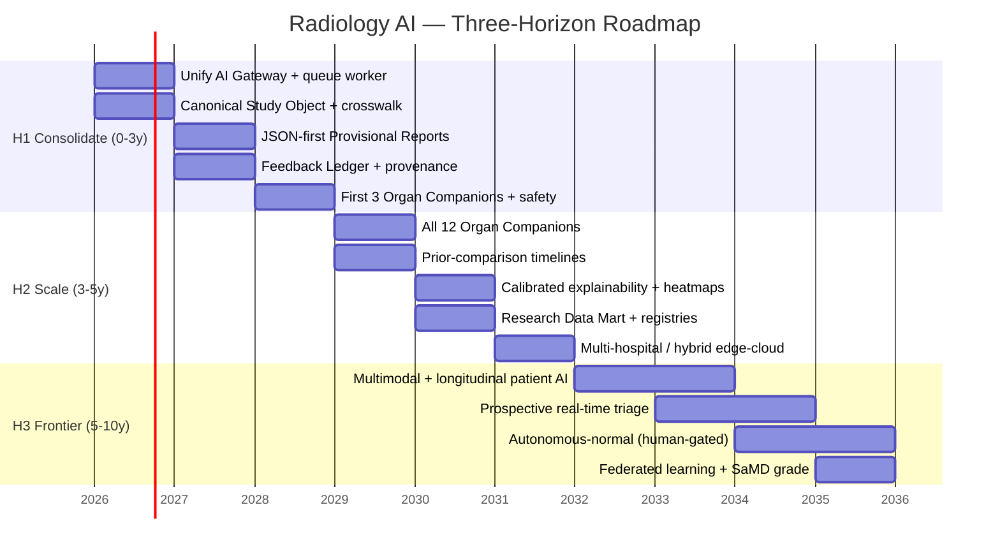
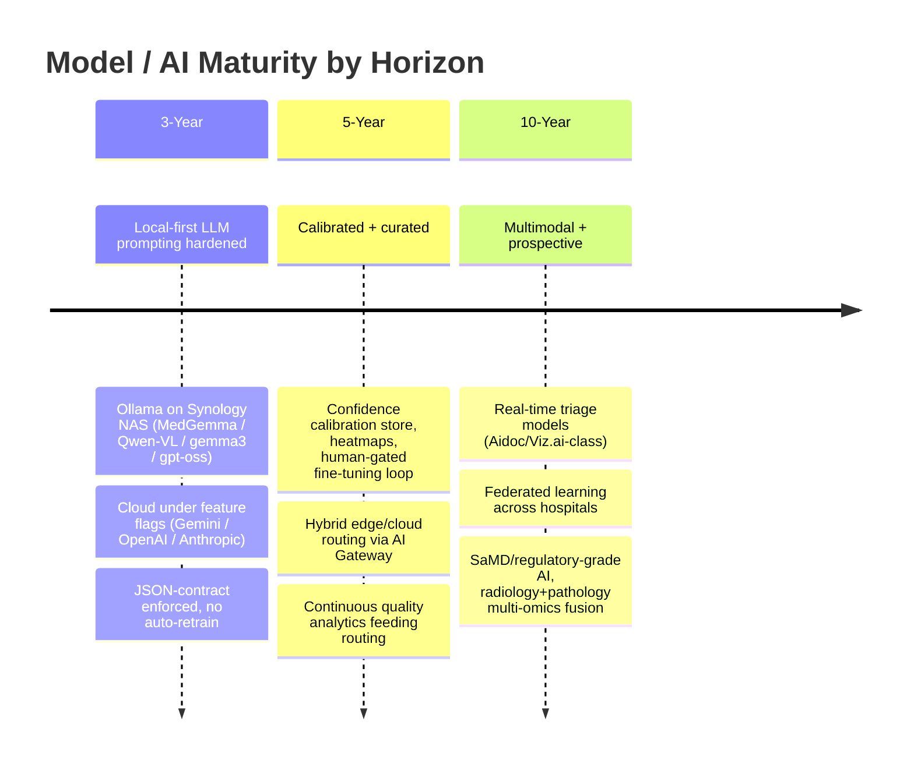

# 18 — Roadmap: 3-Year / 5-Year / 10-Year Horizons

**Purpose.** This section sequences the entire blueprint into three decisive horizons so future coding agents and the Chief Architect build in the right order and never build ahead of the invariants. Every capability named here traces to an earlier section (the AI Gateway from `04`, the Study Processing Pipeline from `05`, the Feedback Ledger from `08`, the Organ Companions from `09`) and to a real seam in the current codebase (`lib/ai-providers`, `lib/measurements`, `lib/report-quality`, `ai_job_queue`, `radiology_worklist`, `audit_logs`). The through-line is the Platform Constitution: **Deterministic Before AI**, **AI Advises / Humans Decide**, **Content over Code**, **Measure Before Building**, and **Backward Compatibility (no-delete / strangler)**. Horizon 1 consolidates the sprawl the recon documented (per `01`) and stands up the execution engine that is missing today; Horizon 2 scales the pattern across all organs and out to multiple hospitals; Horizon 3 goes multimodal, longitudinal, and prospective — regulated SaMD territory — but only after the trust chassis is proven at scale. Each horizon ends with an explicit **do-not-do-yet** list, because the fastest way to destroy this platform is to skip a horizon.

---

## Horizon overview

---

## Horizon 1 — 3-Year: "Consolidate the Sprawl, Stand Up the Engine"

**THEME.** Turn the thin synchronous prompt-proxy that exists today into a hardened, single-hospital inference platform with an enforced trust chassis. Nothing new gets scaled until the seams are clean. This horizon *is* Deliverable 16 / `01` executed to completion.

### Capabilities delivered

| Capability | Builds on (real seam) | Blueprint ref |
|---|---|---|
| **AI Gateway** — one provider abstraction the ERP calls; ERP never knows which model answered | Hardened `generateAiForTask()` / `resolveTaskRoute()` / `AI_TASK_CATALOG` / `ai_model_routes` in `lib/ai-providers` | `04` |
| Unify the **two Gemini paths** (`@google/generative-ai` registry vs `integrations-gemini-ai` env `@google/genai`) and **two Ollama paths** (registry `/v1` vs `radiologyOllama` native `/api/generate`) behind the Gateway | `lib/ai-providers`, `radiologyOllama.ts` SSRF guard + templates wrap the registry provider | `01`, `04` |
| **Study Processing Pipeline** — a real worker that dequeues `ai_job_queue` (`queued → processing → done`), calls a provider, writes `result_json` | `ai_job_queue` already has the right shape (studyId, jobType, priority, retryCount, gpuMode, confidenceScore, result_json, humanOverridden) — no new table | `05`, `07` |
| **JSON-first Provisional Reports** — structured draft generation with a schema-validated variant of `AiQueryResult` (provider `response_format` where supported, zod + repair loop where not) | `docs/STRUCTURED_REPORT_JSON_SPEC_v1.md`; retire per-consumer `match(/\{...\}/)+JSON.parse` | `06` |
| **Feedback Ledger** — AI-suggestion vs radiologist-edit diff store; learning signal only, **no auto-retrain** | Extend `ai_reporting_drafts` / `radiology_ai_review_audits`; wire `radiology_memory` counters into prompt assembly (absent today) | `08` |
| **First 3 Organ Companions** — Brain, Chest, Abdomen — registered like Copilot modules (self-registering, Content over Code) | `copilotOrchestrator` + `registerCopilotModule` pattern; `UsgCompanionPanel` precedent | `09` |
| **Measurement Provenance complete** — `seriesUid + sopUid + frameNumber + extractionMethod + confidence` on every value | Adopt one typed `MeasurementProvenance` across `lib/measurements` types and every storage table; `viewer_measurements` is the reference schema | `11` |
| **Safety gates** — server-enforced draft state machine; segment-level AI provenance markers; AI-never-auto-signs invariant hard-wired | `report_quality_checks` PASS/WARNING/BLOCKER + acknowledge; USG `runQualityCheck → HTTP 422` bypass-with-reason pattern; PCPNDT fail-CLOSED gate reused | `14`, `15` |

### Architectural milestones

1. **Canonical Study Object stood up** (`03`) — one logical aggregate keyed by `studyInstanceUID`, with a crosswalk mapping `radiology_studies.id ↔ radiology_worklist.id ↔ dicom_studies.id ↔ studyInstanceUID ↔ accessionNumber`. Fix the **`patient_reports.studyId` overloading** (radiology_studies.id vs radiology_worklist.id, no discriminator) first — it is the single most dangerous ambiguity in the schema.
2. **Two blocking CRITICALs closed before anything ships** (per `14` / CTO review): CRIT-1 (backup truncates every table at 5,000 rows yet stamps success) and CRIT-2 (audit hash-chain forks under concurrency — apply the existing `pg_advisory_xact_lock` already landed via E0.2 and add the unique `chain_hash` index + `REVOKE UPDATE/DELETE` + bigint PK).
3. **Queue worker behind the Gateway seam** — the scheduler/worker sits *behind* `generateAiForTask()` so all ~60 `aiReporting.ts` callers stay unchanged. Collapse the unused GPU-inference config (`batchSize/concurrency/warmUp/priority/cacheResults/maxRetries` in `pacs_settings`) into the real queue once the worker exists.
4. **Feature-flag every new behavior** behind `ff_radiology_*` server flags (fail-safe to false), and audit flag PATCHes through the hash chain (currently unaudited).
5. **Single-hospital hardened** — Deoghar / Synology NAS, local-first default (Ollama over Tailscale, e.g. `http://100.79.100.41:11434`), cloud providers optional and flagged.

### Model / AI maturity

Local-first LLM prompting, **hardened**, not autonomous. MedGemma / Qwen-VL / gemma3 / gpt-oss on the NAS for text and (newly) vision via the unified Ollama path that finally passes images through `fetchStudyImages()`. Cloud (Gemini / OpenAI / Anthropic) under flags for hard cases. Confidence is the honest three-band model (Routine / Worth-a-look / Attention, **no percentages**) from the master design spec — surfaced but not yet calibrated. Every structured output passes JSON-contract validation.

### Risks / dependencies

- **Depends on**: the Canonical Study Object (`03`) and the closed CRITICALs (`14`) — the pipeline cannot key work reliably until study identity is unambiguous and the audit chain is fork-proof.
- **Risk**: consolidation churn. Two Gemini + two Ollama stacks, five template families, and 4+ report stores must be strangled, not big-banged — parity tests and shadow-first per `report-quality`'s proven pattern.
- **Risk**: JSON-contract adoption regressing existing fragile parsers; mitigate with one schema-validated parse helper and a repair loop before deleting the old fence-strip paths.

### Do-not-do-yet (Horizon 1)

- **No** multi-tenancy / `tenant_id` re-key (explicitly deferred by the frozen design; single clinic only) — but *do* honor the identity strategy (bigint PKs, nullable tenant/branch key, globally-unique business keys) so H2 can inherit it.
- **No** auto-retraining, fine-tuning, or model weight changes from the Feedback Ledger — capture diffs only.
- **No** prospective / real-time triage, no STAT auto-paging from AI.
- **No** GPU cluster / cloud burst — the NAS + optional cloud APIs are the only backends.
- **No** heatmaps or pixel-level explainability yet (Evidence Envelope ships confidence + evidence text + key images + measurements + reasoning; heatmaps are H2).
- **No** more than 3 Organ Companions — prove the framework before scaling to 12.

---

## Horizon 2 — 5-Year: "Twelve Companions, Calibrated Trust, Multi-Hospital"

**THEME.** Generalize the proven single-hospital pattern to full organ coverage, calibrated explainability, a research substrate, and a second (then Nth) hospital — with a human-gated learning loop that finally closes but never auto-deploys.

### Capabilities delivered

| Capability | Builds on | Blueprint ref |
|---|---|---|
| **All 12 Organ Companions** (Brain, Spine, Chest, Abdomen, Liver, Kidney, Prostate, Breast, OBGYN, Ultrasound, Doppler, Musculoskeletal as scoped in `09`) | The Companion framework proven in H1; each is Content-over-Code registry-driven | `09` |
| **Prior-comparison timelines** — progression / regression / stable across the patient's imaging history | `radiologyComparison.ts`, `ComparisonPanel`, `radiology_lesion_timeline`, `MeasurementComparison` with strategy dispatch | `10` |
| **Calibrated explainability + heatmaps** — Evidence Envelope gains a confidence-calibration store and pixel/region overlays | Extend Evidence Envelope from `12`; calibration backing for the three bands | `12` |
| **Research Data Mart + registries** — analytics/registry store built from finalized structured reports | New mart fed from `patient_reports` structured JSON; disease registries | `13` |
| **Multi-hospital / multi-tenant** — the deferred tenancy lands here | The bigint + nullable tenant-key groundwork from H1 | `02`, `15`, `16` |
| **Hybrid edge/cloud AI** — Gateway routes to local NAS, edge GPU, or cloud by task/latency/cost/privacy | AI Gateway routing (`ai_model_routes`) + health (`ai_provider_health`) feeding failover | `04`, `16` |
| **HL7 / FHIR interop** — outbound structured reports + inbound orders/results | `hl7Schema`, `dicom_sr_export_queue` scaffolds | `02`, `17` |
| **Peer-review + continuous quality analytics** | `peer_review_assignments` (LOW_AI_CONFIDENCE auto-assign), `turnaround_times`, `ai_quality_scores` finally wired into routing | `13`, `14` |
| **Curated fine-tuning loop (human-gated)** | `ai_training_data_exports` + Feedback Ledger diffs, curated and gated — never auto-deployed | `08` |

### Architectural milestones

1. **Health and quality feed routing.** Today `ai_provider_health` and `ai_quality_scores` are logging/aggregation only. In H2 they become inputs to Gateway failover and model-route decisions.
2. **Explainability calibration store.** The three honest bands get a backing calibration model so "Routine / Worth-a-look / Attention" reflect measured reliability per Companion — still no percentages surfaced.
3. **Research Data Mart** built strictly from finalized, signed structured reports (no drafts) — ML datasets exported through the governed `ai_training_data_exports` path.
4. **Multi-tenant projection** of the Canonical Study Object; per-tenant AI provider settings and routes; per-tenant feature flags (retire per-browser localStorage flags).
5. **Human-gated fine-tuning loop** — curated datasets from the Feedback Ledger produce candidate models that a human promotes into `ai_model_routes`; shadow-evaluated before any live traffic.

### Model / AI maturity

**Calibrated and curated.** Confidence bands are calibrated per organ. Heatmaps supplement textual evidence. The Gateway routes across a hybrid fleet (NAS, edge GPU, cloud) by policy. Fine-tuning exists but is entirely human-gated: **AI still advises, humans still decide, and no model self-promotes.** Continuous quality analytics create the first real feedback-to-routing loop — measured, not assumed (Measure Before Building).

### Risks / dependencies

- **Depends on**: H1's clean Gateway seam and Canonical Study Object — multi-tenancy cannot be retrofitted onto the fragmented three-study model.
- **Risk**: calibration debt — heatmaps and bands that are not calibrated on local data are worse than none; gate behind per-Companion calibration evidence.
- **Risk**: multi-tenant PHI isolation (per `15`) — network trust boundaries (LAN / Tailscale / Cloudflare / Public) must be enforced per tenant before a second hospital connects.
- **Risk**: fine-tuning loop leaking un-consented PHI into training sets — the `ai_training_data_exports` governance gate must be the only export path.

### Do-not-do-yet (Horizon 2)

- **No** autonomous actions — no auto-sign, no auto-send, no AI-initiated STAT paging. Peer-review auto-*assignment* is allowed; auto-*decision* is not.
- **No** prospective real-time triage on the acquisition stream (that is H3's Aidoc/Viz.ai-class capability).
- **No** federated learning yet — each hospital trains/curates locally; cross-hospital model sharing waits for H3 governance.
- **No** self-deploying models — every fine-tuned candidate is human-promoted through `ai_model_routes`.
- **No** pathology / multi-omics fusion.
- **No** regulatory SaMD claims — the platform remains clinician-assistive, not a medical device.

---

## Horizon 3 — 10-Year: "Multimodal, Prospective, Federated, Regulated"

**THEME.** Move from retrospective report assistance to prospective, multimodal, longitudinal patient intelligence — and cross the regulatory threshold into SaMD-grade AI — while preserving the founding invariant that a human radiologist remains the author of record.

### Capabilities delivered

| Capability | Character | Blueprint ref |
|---|---|---|
| **Multimodal + longitudinal patient AI** | Fuse imaging, priors, labs, HL7/FHIR clinical context, and reports into a per-patient longitudinal model | `10`, `13` |
| **Prospective / real-time triage (Aidoc/Viz.ai-class)** with **STAT paging** | Inference on the acquisition stream at arrival; worklist reprioritization; STAT alert to on-call | `07` STAT/VIP/emergency lanes, `criticalFindings` escalation |
| **Autonomous-normal workflows (human-gated)** | AI proposes "normal" studies for expedited human confirmation — never auto-final | Draft state machine + authorship gate from `14` |
| **Federated learning across hospitals** | Models improve on the network without centralizing PHI | `13`, `15` model governance |
| **Pathology + radiology multi-omics fusion** | Cross-domain diagnostic corroboration | `13` Research platform |
| **SaMD / regulatory-grade AI** | Versioned, validated, auditable models under a quality management system | `15` model governance, `14` risk |
| **Research platform + data network effects** | The Research Data Mart becomes a multi-hospital research network | `13` |

### Architectural milestones

1. **Prospective inference lane** in the Study Processing Pipeline — a high-priority branch that runs *at arrival* (before a radiologist opens the study) and can raise a STAT via the `criticalFindings` escalation lifecycle (`pending_notification → notified → acknowledged → escalated`). This is the first time AI touches the workflow *before* the human — so it is gated by the strongest safety controls in the blueprint.
2. **Autonomous-normal, human-gated.** AI may *propose* a normal study for fast-track confirmation; a human still signs. The AI-never-auto-signs invariant and segment-level provenance from `14` are non-negotiable prerequisites.
3. **Federated learning** — model updates computed locally per hospital and aggregated without moving PHI; every round recorded in the governed model registry.
4. **SaMD-grade model governance** — immutable `(model-version + prompt-version + input-hash)` lineage (the tuple `06`/`12` require), validation datasets, and a change-control process suitable for regulatory submission.
5. **Multi-omics fusion** on the research platform — radiology + pathology co-registered per patient.

### Model / AI maturity

**Multimodal, prospective, federated, regulated.** Real-time triage models rival dedicated vendors (Aidoc / Viz.ai) but run inside the platform's own Gateway and governance. Federated learning creates data network effects without central PHI pooling. Models are SaMD-grade: versioned, validated, auditable. And still — by constitutional design — **AI advises, the radiologist decides and authors.** Autonomy is bounded to "propose normal for human confirmation," never "sign and release."

### Risks / dependencies

- **Depends on**: everything in H1 and H2 — prospective triage on un-calibrated, un-provenanced AI is a patient-safety hazard. Do not start H3 until calibration (H2) and provenance (H1) are proven.
- **Risk**: regulatory exposure — the moment AI reprioritizes a worklist prospectively, the system may meet SaMD definitions in some jurisdictions; legal/regulatory sign-off precedes deployment.
- **Risk**: alert fatigue from STAT paging — the interruption budget (an AI law from the master design spec) must govern real-time alerts as strictly as it governs in-report interruptions.
- **Risk**: federated learning poisoning / drift across hospitals — model governance must detect and quarantine degraded rounds.

### Do-not-do-yet (Horizon 3)

- **No** fully autonomous sign-off or auto-release, ever — the authorship gate is permanent, not a phase.
- **No** unbounded autonomy beyond "propose normal, human confirms."
- **No** federated learning without the SaMD-grade governance and PHI-isolation controls in place first.
- **No** deployment of prospective triage in a jurisdiction before its regulatory clearance.

---

## Sequencing rules (why this order is non-negotiable)

1. **Deterministic before AI, engine before scale.** H1 stands up the *execution engine* (`ai_job_queue` worker) and the *deterministic substrate* (Canonical Study Object, Measurement Provenance, quality gates) before any AI capability scales. Scaling a prompt-proxy would only scale the sprawl `01` documented.
2. **Trust chassis before assistive features.** The master design spec rule holds across horizons: feat 1/9/10/19/20 (Copilot home, confidence, explainability, unconditional audit, authorship gate) precede any content feature. H1 ships the chassis; H2/H3 ship features on top.
3. **Measure before building.** Health/quality logging exists in H1 but only *feeds decisions* in H2 once there is data to calibrate on; H3's prospective models require H2's calibration evidence.
4. **No-delete / strangler throughout.** Every consolidation (two Gemini paths, two Ollama paths, five template families, dual critical-finding and TAT tables) is a shadow-first strangler migration, never a big-bang rewrite.

---

## Cross-references

- `00-executive-summary.md` — vision, principles, and headline decisions this roadmap sequences.
- `01-current-state-and-simplification.md` — the sprawl and simplification plan that Horizon 1 executes.
- `02-enterprise-and-service-architecture.md` — the service architecture that multi-hospital / hybrid (H2) and federated (H3) build on.
- `03-canonical-data-model.md` — the Canonical Study Object and crosswalk that gate Horizon 1.
- `04-ai-gateway.md` — the provider abstraction and routing that every horizon calls through.
- `05-study-pipeline-and-dataflow.md` / `07-orchestration-and-night-processing.md` — the pipeline and queue worker (H1) and STAT/prospective lanes (H3).
- `06-ai-report-generation.md` — JSON-first Provisional Reports (H1).
- `08-learning-and-feedback-system.md` — the Feedback Ledger (H1) and human-gated fine-tuning loop (H2).
- `09-organ-companions.md` — first three Companions (H1) and all twelve (H2).
- `10-prior-comparison-and-timeline.md` — prior-comparison timelines (H2) and longitudinal patient AI (H3).
- `11-measurement-engine.md` — Measurement Provenance completed in Horizon 1.
- `12-explainability.md` — the Evidence Envelope, with calibration + heatmaps added in Horizon 2.
- `13-research-database.md` — the Research Data Mart (H2) and research network / multi-omics (H3).
- `14-safety-risk-and-failure-recovery.md` — the CRITICALs to close before H1 ships and the safety gates every horizon respects.
- `15-security-model.md` — PHI isolation, model governance, and network trust required for H2 multi-tenancy and H3 federation.
- `16-performance-and-scalability.md` — the single → multi-hospital → hybrid edge/cloud scaling curve mirrored by these horizons.
- `17-api-and-folder-architecture.md` — the module/folder structure new Companions and pipeline services slot into.
- `19-critical-decisions-before-coding.md` — the decisions that must be locked before Horizon 1 coding begins.
