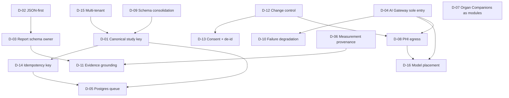
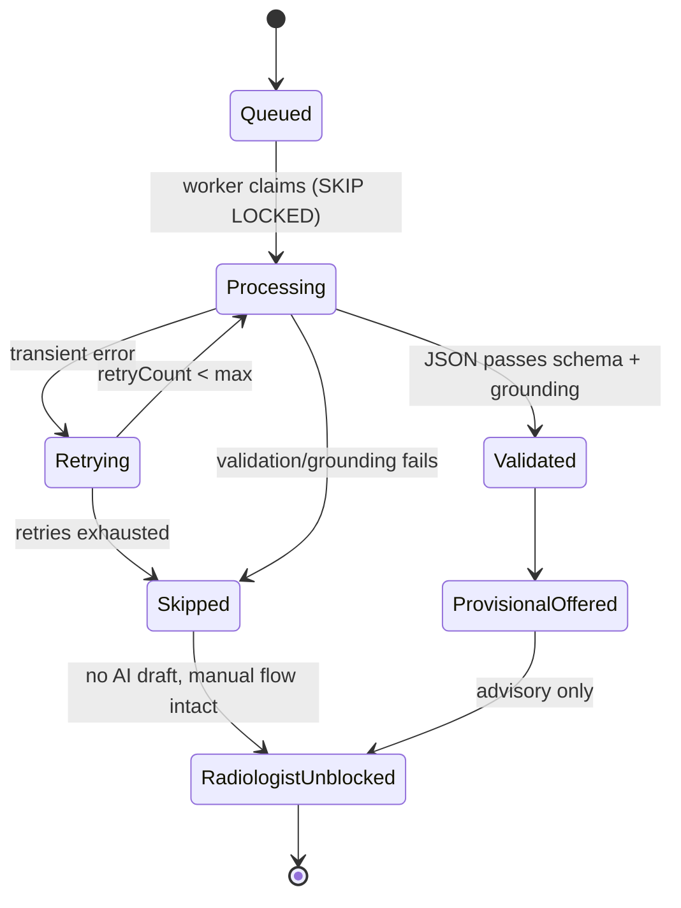

# 19 — Critical Decisions to Lock BEFORE Additional Coding

**Purpose.** This is the most important operational document in the blueprint. Sections 00–18 describe a target architecture; this one names the sixteen decisions that must be *frozen and signed off* before another line of AI code is written, because each is a fork that — left implicit — the next coding agent will resolve incorrectly and inconsistently. The codebase already shows the cost of unmade decisions: three competing "study" tables, two Gemini integrations, two Ollama integrations, an `ai_job_queue` with no worker, and structured output hand-parsed with `result.match(/\{[\s\S]*\}/)` in a dozen places. Nothing below invents a subsystem — every recommendation extends a real, named component (`lib/ai-providers`, `lib/measurements`, `audit_logs`, `generateAiForTask`, `patient_reports`). Each decision states what it **blocks**: no downstream work in the named docs may begin until its upstream decision is ticked on the sign-off checklist.

---

## ADR Summary Table

| ID | Decision | Recommendation (opinionated) | Blocks until locked |
|----|----------|------------------------------|---------------------|
| D-01 | Canonical study identity key | `studyInstanceUID` is imaging identity; ERP accession is billing identity; add a `canonical_study` crosswalk projection | 03, 05, everything |
| D-02 | Structured-JSON-first contract | Inviolable. Every AI task returns schema-validated JSON, never free text | 04, 06 |
| D-03 | Provisional Report schema ownership + versioning | `lib/report-contract` owns it; SemVer; extends `STRUCTURED_REPORT_JSON_SPEC_v1` additively | 06, 08, 13 |
| D-04 | AI Gateway as sole AI entry point | Mandatory. Ban all direct provider SDK calls; retire the env-keyed Gemini OCR path | 04, all AI callers |
| D-05 | Queue technology | Postgres `SKIP LOCKED` on the existing `ai_job_queue` table; no Redis/NATS | 07 |
| D-06 | Measurement provenance mandatory | Every value carries `Measurement Provenance`; no value persists without it | 11 |
| D-07 | Organ Companions = registered modules | Content over Code: data + self-registering modules, never forks | 09 |
| D-08 | PHI egress policy | Local-first default; cloud AI only behind explicit per-task flag + de-id gate | 04, 08, 15 |
| D-09 | Schema consolidation sign-off | Adopt doc 01's plan: `studyInstanceUID` anchors via new `canonical_study` crosswalk; `radiology_studies` = order/financial spine; `dicom_studies` = UID authority | 01, 03 |
| D-10 | AI failure degradation | AI is never on the critical path; failure = silent skip, radiologist unblocked | 04, 05, 14 |
| D-11 | Evidence/grounding rule | No finding without an `Evidence Envelope` anchor; ungrounded output is discarded | 06, 12 |
| D-12 | Versioning + change control | Prompts, models, registries all versioned + audited via `audit_logs` | 04, 08, 15 |
| D-13 | Research/training consent + de-id | Opt-in consent flag + de-id transform gate the `Research Data Mart` | 13 |
| D-14 | Idempotency / exactly-once key | `(studyId, jobType, inputHash)` unique key on `ai_job_queue` | 05, 07 |
| D-15 | Multi-tenant strategy | Nullable `tenant_id` on core tables now; single-tenant runtime; defer isolation | 15, 16 |
| D-16 | Which model runs where | MedGemma-on-Ollama local default; cloud fallback only per D-08/D-10 policy | 04, 07 |

---

## Decision Dependency Graph

---

## Per-Decision Write-Ups

### D-01 — Canonical Study Identity Key
- **Decision.** What single key identifies "a study" across `radiology_studies`, `radiology_worklist`, and `dicom_studies`.
- **Options.** (a) `studyInstanceUID` everywhere; (b) ERP accession `ACC-YYYYMMDD-MOD-NNN`; (c) `radiology_worklist.id`; (d) a new canonical projection over all three.
- **Recommendation.** Adopt the **Canonical Study Object**: the identity spine is `studyInstanceUID`, anchored via a **new `canonical_study` crosswalk/projection** (keyed by `studyInstanceUID`, exposing a stable internal `canonicalStudyId` surrogate) over `{radiology_studies.id, radiology_worklist.id, dicom_studies.id, studyInstanceUID, accessionNumber}`; ERP accession is *billing identity* (external DICOM accessions are explicitly non-unique). `dicom_studies` is the `studyInstanceUID` **uniqueness authority** (`study_instance_uid` notNull + unique); `radiology_studies` stays the **order/financial/report spine** whose integer `study_id` is the surrogate used by orders, bills, `patient_reports`, and `ai_job_queue.study_id`; `radiology_worklist` is the PACS-pushed reporting/queue spine.
- **Rationale.** Three tables with conflicting uniqueness rules, and `patient_reports.studyId` overloaded to mean *either* `radiology_studies.id` or `radiology_worklist.id` with no discriminator. Nothing downstream is safe until identity is deterministic.
- **Consequences / blocks.** Blocks docs 03 and 05 and all AI joins. Forces a typed report linkage ending the `studyId` overload; every AI job references the canonical key, not a table-local id.

### D-02 — Structured-JSON-First as an Inviolable Contract
- **Decision.** Do AI tasks return free text or schema-validated JSON.
- **Options.** (a) Free text with downstream regex parsing (status quo); (b) JSON-first, schema-validated, non-negotiable.
- **Recommendation.** **JSON-first is inviolable.** Every routable task in `AI_TASK_CATALOG` declares an output schema; the Gateway validates with zod, using provider `response_format`/`responseSchema` where supported and a bounded repair loop where not (Ollama native `/api/generate`). A response that fails validation after repair is a *failure*, not a fallback to prose.
- **Rationale.** Zero structured-output enforcement today; consumers hand-roll fence-stripping and silently fall back to text. This is the single highest-leverage missing primitive.
- **Consequences / blocks.** Blocks docs 04 and 06; kills the silent-text-fallback pattern; `AiQueryResult` gains a validated variant.

### D-03 — Provisional Report JSON Schema: Owner, Versioning, Lineage
- **Decision.** Who owns the Provisional Report schema, how it versions, and its relation to `docs/STRUCTURED_REPORT_JSON_SPEC_v1.md`.
- **Options.** (a) Ad-hoc per-endpoint shapes; (b) one shared library, SemVer, extending the existing spec.
- **Recommendation.** A new shared lib `lib/report-contract` **owns** the Provisional Report type as the machine-checkable descendant of `STRUCTURED_REPORT_JSON_SPEC_v1.md` — the provisional overlay lives in that spec's `$defs` — extended **additively only** (no renames, no deletes — Principle 6). SemVer; every persisted draft stamps `schemaVersion`. `lib/api-zod` only re-exports transport (request/response) wrappers that reference `lib/report-contract` types; it does **not** own the clinical schema. Reuses the authored seed namespaces (`sev.*`, `loc.*`, `meas.*`, `crit.*`, finding-key prefixes `mrbr.`/`ctbr.`/`usab.`).
- **Rationale.** The design spec is authoritative but contains no schema; `patient_reports` already has staged, unused `structuredJson`/`templateVersion`/`catalogVersion` columns waiting for this owner.
- **Consequences / blocks.** Blocks docs 06, 08, 13, which consume the same versioned type; divergence is prohibited.

### D-04 — AI Gateway as the Sole AI Entry Point
- **Decision.** May any code call an AI provider SDK directly.
- **Options.** (a) Allow direct calls for "special cases" (status quo); (b) the **AI Gateway** (hardened `lib/ai-providers` + `generateAiForTask`) is the *only* way to reach a model.
- **Recommendation.** **Sole entry point, enforced.** Every AI invocation routes through `generateAiForTask(taskKey, …)` → `resolveTaskRoute` → provider; the ERP never knows which model answered. The **direct `@google/genai` Gemini OCR path (`lib/integrations-gemini-ai`) is the anti-pattern to eliminate** — it bypasses the registry, uses env keys, and diverges on model defaults. Fold its OCR tasks (`id_card_ocr`, USG measurement OCR, bill/bank) into `AI_TASK_CATALOG`; fold the `radiologyOllama.ts` proxy's SSRF guard + templates into the registry `OllamaProvider` so Ollama gets the vision path it lacks.
- **Rationale.** Two Gemini and two Ollama stacks with unshared config are the root cause of drift; a single seam is the only place routing, PHI policy (D-08), failover (D-10), and audit (D-12) can be enforced.
- **Consequences / blocks.** Blocks doc 04 and every AI caller. CI lint rejects `@google/genai`/`@google/generative-ai`/`new OpenAI(` imports outside `lib/ai-providers`.

### D-05 — Queue Technology
- **Decision.** What backs the Study Processing Pipeline queue.
- **Options.** (a) Redis; (b) NATS/JetStream; (c) Postgres `SELECT … FOR UPDATE SKIP LOCKED` on the existing `ai_job_queue`.
- **Recommendation.** **Postgres `SKIP LOCKED` on the existing `ai_job_queue` table.** Do *not* introduce Redis or NATS. The table already has the right shape (`studyId`, `jobType`, `priority`, `retryCount`, `gpuMode`, `confidenceScore`, `result_json`, `humanOverridden`) — it is a data model with no worker. Write the worker behind the `generateAiForTask` seam so callers stay unchanged.
- **Rationale.** Single on-prem Synology clinic; a broker adds an operational failure domain for throughput we don't have. Postgres gives transactional enqueue-with-the-write, native to Drizzle. Collapse the dead GPU config (`batchSize`/`concurrency` in `pacs_settings`) into this queue.
- **Consequences / blocks.** Blocks doc 07. Commits to a claimed-with-heartbeat worker (reuse the `radiology_study_locks` TTL idiom).

### D-06 — Measurement Provenance Mandatory on Every Value
- **Decision.** Whether a measurement may exist without provenance.
- **Options.** (a) Provenance optional / per-table (status quo); (b) mandatory typed `Measurement Provenance` on every value.
- **Recommendation.** **Mandatory.** One typed `Measurement Provenance` = `seriesUid + sopUid + frameNumber + extractionMethod{dicom_sr|private_tag|ocr|ai_normalize|manual} + confidence(0–1 numeric) + engineVersion`, added to `lib/measurements` types and every storage table. No value persists without it. `viewer_measurements` is the reference schema.
- **Rationale.** The canonical `MeasurementDefinition` carries *no* provenance and four+ tables disagree (text-vs-real confidence, `source` vs `viewerName`). Explainability (12), comparison (10), and research (13) are unsafe without it.
- **Consequences / blocks.** Blocks doc 11; re-homes `spinal_measurements` free-text columns onto registry ids; retires the untyped `provenanceJson` column.

### D-07 — Organ Companions as Registered Modules, Not Forks
- **Decision.** How the 12 Organ Companions are built.
- **Options.** (a) Fork the workspace/pipeline per organ; (b) data + self-registering modules (Content over Code).
- **Recommendation.** **Registered modules.** Each **Organ Companion** (Brain, Spine, Chest, …) is data (templates, measurements, checklists, rules in versioned registries) plus a module self-registering like the ~20 Copilot modules (`registerCopilotModule`, side-effect import, zero core edits). No per-organ forks of `RadiologyReportingWorkspace.tsx` or the pipeline.
- **Rationale.** Principle 3 (Content over Code) and the frozen Reporting Platform: behaviour lives in registries; engines interpret. The Copilot plug-in pattern proves this works.
- **Consequences / blocks.** Blocks doc 09. The prompt-assembly layer must read `radiology_memory`/`radiology_lesions`/organ-intelligence rows as context — wiring absent today.

### D-08 — PHI Egress Policy: Local-First vs Cloud AI
- **Decision.** When PHI may leave the on-prem boundary to a cloud model.
- **Options.** (a) Cloud-first for quality; (b) local-first, cloud only under explicit gated flag; (c) local-only.
- **Recommendation.** **Local-first default; cloud AI only behind an explicit per-task `ff_radiology_*` flag AND a de-identification gate.** Image + report content stays on the Synology/Ollama path by default. Any route to Gemini/OpenAI/Anthropic requires (1) the task flag on, (2) de-id transform applied, (3) an `audit_logs` egress record. Flags fail safe to false.
- **Rationale.** Single on-prem clinic, medico-legal PHI floor; the design's local-first doctrine and disclosed-engine footer depend on this being hard policy, not a config accident.
- **Consequences / blocks.** Blocks docs 04, 08, 15. Defines the Gateway routing guardrail and what D-16 fallback may do.

### D-09 — Schema Consolidation Plan Sign-Off
- **Decision.** Ratify doc 01's simplification plan before building on the schema.
- **Options.** (a) Build AI on the current 3-table sprawl; (b) sign off the consolidation first.
- **Recommendation.** **Sign off doc 01.** Identity is anchored on `studyInstanceUID` via the **new `canonical_study` crosswalk**; `radiology_studies` stays the order/financial spine that supplies the integer `studyId` surrogate; `dicom_studies` is the `studyInstanceUID` uniqueness authority; `radiology_worklist` is the PACS-pushed reporting/queue spine. Merge the duplicate critical-finding and TAT tables onto the canonical key; enforce real FKs and a discriminated report link.
- **Rationale.** Reconciliation code (`reconcileMissingStudies`, `matchingEngine.ts`) exists only to paper over missing identity; AI must not add a fourth representation.
- **Consequences / blocks.** Blocks docs 01 and 03. Gate: tick the doc-01 plan before D-01's crosswalk is implemented.

### D-10 — How AI Failures Degrade
- **Decision.** What happens when an AI job errors, times out, or fails validation.
- **Options.** (a) Block/deny the report; (b) retry then surface a hard error; (c) silent skip — radiologist proceeds unaffected.
- **Recommendation.** **AI is never on the critical path.** A failed AI job means the Provisional Report simply isn't offered (or is marked unavailable); the radiologist's manual workflow is *never* blocked. Preserve the `AI Draft — Requires Radiologist Review` invariant and the never-auto-sign guard. Health/quality signals feed routing (D-12) but never gate finalize.
- **Rationale.** Principle 5 (AI Advises, Humans Decide) and the design law "offer-never-act; silence is output." Deterministic-before-AI means the pipeline stands without AI.
- **Consequences / blocks.** Blocks docs 04, 05, 14. State machine below is normative.

### D-11 — Evidence / Grounding Rule
- **Decision.** May an AI finding exist without a traceable anchor.
- **Options.** (a) Ungrounded findings allowed; (b) no finding without an `Evidence Envelope` anchor.
- **Recommendation.** **No finding without evidence.** Every AI-asserted finding carries an `Evidence Envelope` (confidence band, evidence, source image `seriesUid/sopUid/frame`, contributing measurements, reasoning). An unanchored finding is *discarded before it reaches the draft* — never shown ungrounded. Confidence uses the three honest bands (Routine / Worth-a-look / Attention), **no percentages** to the radiologist.
- **Rationale.** Design features 9/10/19/20 (trust chassis) require every claim source-traceable; today `insert-to-report` writes no provenance marker, making signed text AI-indistinguishable.
- **Consequences / blocks.** Blocks docs 06 and 12. Forces segment-level provenance markers into the report body.

### D-12 — Versioning + Governance / Change Control
- **Decision.** How prompts, models, and registries change over time.
- **Options.** (a) Edit in place; (b) versioned, immutable-tuple, audited change control.
- **Recommendation.** **Full change control.** Persist an immutable `(promptVersion, modelVersion, inputHash)` tuple with every AI output. Prompts live in versioned registries; model routes change only via audited `ai_model_routes` edits; measurement/knowledge registries are append-only with `deprecate + replacedBy` (never rename). Every governance mutation — feature-flag toggles, route changes — writes an `audit_logs` hash-chain row via `auditLog()`.
- **Rationale.** Explainability's "second-press shows model/version/prompt lineage" is impossible today (`ai_reporting_drafts` stores only provider/model/promptText), and feature-flag PATCH is unaudited.
- **Consequences / blocks.** Blocks docs 04, 08, 15. Requires DB-level audit immutability (unique chain-hash index, REVOKE UPDATE/DELETE, bigint PK) as a pre-req.

### D-13 — Research / Training Data Consent + De-Identification
- **Decision.** What may enter the Research Data Mart / training exports.
- **Options.** (a) All finalized reports auto-flow to research; (b) consent + de-id gated.
- **Recommendation.** **Opt-in consent flag + mandatory de-id transform** gate the `Research Data Mart`. Only *finalized*, PHI-stripped, consent-flagged structured reports enter research/`ai_training_data_exports`. No auto-retrain (doc 08's Feedback Ledger). De-id reuses the D-08 transform.
- **Rationale.** Medico-legal PHI floor; the design keeps learning as a diff ledger, not silent training.
- **Consequences / blocks.** Blocks doc 13. Defines the Data Mart ingestion contract.

### D-14 — Idempotency / Exactly-Once Processing Key
- **Decision.** How re-arrival of the same study avoids duplicate AI work.
- **Options.** (a) At-least-once with dedup downstream; (b) unique idempotency key on enqueue.
- **Recommendation.** **`UNIQUE (studyId, jobType, inputHash)` on `ai_job_queue`**, where `studyId` is the existing integer `study_id` FK column already on the queue (referencing the Canonical Study Object's order/financial spine row — the queue keeps its integer surrogate; do **not** add a `studyInstanceUID` or `canonicalStudyId` column to the queue). `inputHash` is a **new `input_hash` text column** = SHA-256 over the normalized tuple `{ sorted SOPInstanceUIDs (series manifest) of the analyzed series, promptTemplateVersion, provisionalReportSchemaVersion }` — it hashes **input content, not model identity**. `modelVersion` is deliberately **not** part of the key: re-running identical inputs is deduped, while a model upgrade that must re-analyze prior studies is an explicit, audited reprocessing job (new row via a reprocess flag), never a silent key collision. Re-enqueue of an identical job is a no-op (upsert returns the existing row). Mirrors the `Idempotency-Key` on report sign and the `dicom_pulled_studies` `hashSignature` dedup.
- **Rationale.** PACS pushes and pull agents re-deliver the same study; without this, night processing double-bills GPU time and produces conflicting drafts.
- **Consequences / blocks.** Blocks docs 05 and 07. Makes the worker safe to retry. **Migration:** add the `input_hash` column + the unique index to `ai_job_queue` backward-compatibly (nullable → backfill → enforce).

### D-15 — Multi-Tenant Strategy for Multi-Hospital
- **Decision.** How schema accommodates future multi-hospital without re-keying.
- **Options.** (a) Ignore (defer entirely); (b) nullable tenant key now, single-tenant runtime; (c) full isolation now.
- **Recommendation.** **Nullable `tenant_id`/`branch_id` on core tables now; single-tenant runtime; defer isolation logic.** Multi-tenancy is *explicitly deferred* per the frozen design (single Deoghar clinic), but the schema must not foreclose it — 319 serial int4 PKs and no tenant column are a future re-key trap. Add the nullable column and globally-unique business keys now; wire isolation later.
- **Rationale.** Honors the frozen "multi-tenancy deferred" decision while obeying the identity-strategy warning (bigint PKs + nullable tenant key) so multi-site AI routing can inherit the schema.
- **Consequences / blocks.** Blocks docs 15 and 16. Cheap now, catastrophic later if skipped.

### D-16 — Which Model Runs Where
- **Decision.** Default model placement and cloud-fallback policy.
- **Options.** (a) Cloud default; (b) local default with gated cloud fallback; (c) local only.
- **Recommendation.** **MedGemma on local Ollama (Synology NAS via Tailscale, e.g. `http://100.79.100.41:11434`) is the default** for radiology drafting/vision; Qwen-VL/gemma3/gpt-oss are local alternates per task route. **Cloud (Gemini/OpenAI/Anthropic) is fallback only**, strictly under D-08 (flag + de-id + audit) and D-10 (never blocks). Placement lives in `ai_model_routes` rows, not code.
- **Rationale.** Local-first PHI policy + confirmed stack. The Ollama vision path (text-only in `radiologyOllama.ts`) must be unified with the registry provider (D-04) so MedGemma can receive `fetchStudyImages()` output.
- **Consequences / blocks.** Blocks docs 04 and 07. Depends on D-04 unification landing first.

---

## Sign-Off Checklist

The Chief Architect ticks every box before greenlighting implementation. Each unchecked box blocks the docs listed in its ADR row.

- [ ] **D-01** Canonical study key + `canonical_study` crosswalk + `patient_reports` report-link discriminator.
- [ ] **D-02** JSON-first inviolable; every `AI_TASK_CATALOG` task has a zod schema.
- [ ] **D-03** `lib/report-contract` owns the schema; SemVer, additive-only, lineage to the v1 spec.
- [ ] **D-04** Gateway is sole entry point; CI bans direct SDK imports; Gemini-OCR + Ollama-proxy folding approved.
- [ ] **D-05** Postgres `SKIP LOCKED` worker on `ai_job_queue`; no broker.
- [ ] **D-06** Typed `Measurement Provenance` in `lib/measurements` + every table.
- [ ] **D-07** Organ Companions are self-registering modules; no forks.
- [ ] **D-08** Local-first PHI policy; cloud egress requires flag + de-id + audit.
- [ ] **D-09** Doc-01 consolidation signed; no fourth study table; duplicate tables merge scheduled.
- [ ] **D-10** AI-never-blocks degradation ratified; never-auto-sign + draft-label preserved.
- [ ] **D-11** No finding without an `Evidence Envelope`; three bands, no percentages.
- [ ] **D-12** `(promptVersion, modelVersion, inputHash)` tuple; registries append-only; audit + flag toggles chain-recorded.
- [ ] **D-13** Consent flag + de-id gate on the Research Data Mart; no auto-retrain.
- [ ] **D-14** `UNIQUE (studyId, jobType, inputHash)` on `ai_job_queue` (new `input_hash` column, nullable → backfill → enforce).
- [ ] **D-15** Nullable `tenant_id`/`branch_id` added; runtime stays single-tenant.
- [ ] **D-16** MedGemma-local default + gated cloud fallback as `ai_model_routes`; Ollama vision unified.
- [ ] **Pre-reqs:** CRIT-1 (backup 5,000-row truncation) and CRIT-2 (audit hash-chain fork) fixed before any AI writes to the chain.

Only when all boxes are ticked does additional AI coding begin.

## Cross-references
- `01-current-state-and-simplification.md` — consolidation plan (D-09).
- `03-canonical-data-model.md` — Canonical Study Object + crosswalk (D-01).
- `04-ai-gateway.md` — sole-entry Gateway (D-02, D-04, D-08, D-10, D-12, D-16).
- `05-study-pipeline-and-dataflow.md` — pipeline state machine (D-05, D-10, D-14).
- `06-ai-report-generation.md` — JSON-first + grounding (D-02, D-03, D-11).
- `07-orchestration-and-night-processing.md` — `ai_job_queue` worker (D-05, D-14, D-16).
- `08-learning-and-feedback-system.md` — Feedback Ledger (D-03, D-08, D-12).
- `09-organ-companions.md` — registered-module framework (D-07).
- `11-measurement-engine.md` — Measurement Provenance (D-06).
- `12-explainability.md` — Evidence Envelope (D-11).
- `13-research-database.md` — Research Data Mart (D-13).
- `14-safety-risk-and-failure-recovery.md` — degradation + audit hardening (D-10, D-12).
- `15-security-model.md` — PHI egress, model governance, tenancy (D-08, D-12, D-15).
- `../STRUCTURED_REPORT_JSON_SPEC_v1.md` — the contract D-03 extends.
