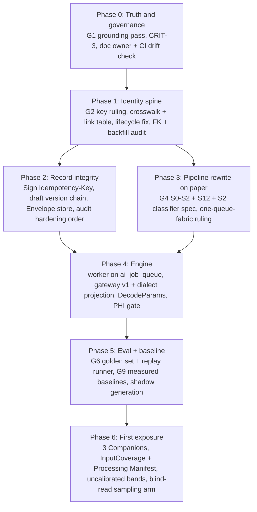

# INDEPENDENT ARCHITECTURE AUDIT — CARE ERP Radiology AI Platform Blueprint (v1)

**Audit date:** 2026-07-18
**Subject:** `docs/architecture/radiology-ai/` — files 00–19 plus README (~4,300 lines of normative design prose)
**Auditor:** External Chief Enterprise Architect (independent; not the original architect)
**Status of this document:** Final written audit. Supersedes no blueprint file; it is a gate on all of them.

---

## Preamble: mandate and stance

I was retained to audit this blueprint as an independent reviewer with enterprise radiology platform experience of the Sectra / Siemens / Nuance class. I did not write any of the twenty documents under review, and I hold no stake in their approval.

The audit assumes the blueprint's own stated mandate at full weight: this platform is to be the **primary RIS for multiple hospitals over a ten-year horizon**, covering MRI, CT, XR, mammography, ultrasound, and Doppler, with pathology AI on the roadmap and enterprise PACS integration — not a single-clinic ultrasound assistant. Every judgment below is calibrated to that mandate, because that is the mandate the blueprint claims.

Method in brief (full methodology in Appendix B): fourteen specialist reviewers attacked the blueprint dimension-by-dimension, each ground-truthing the blueprint's factual claims against the actual codebase. Every critical and major finding was then **independently challenged by a referee pass** whose job was to refute it. Findings that did not survive were rejected outright (Appendix A); findings that partially survived carry their **reduced** severity here. Nothing in this document asserts a criticism that failed adjudication. What remains is, to the best of this process's ability, true.

Two things should be said before the first table, because they frame everything else:

1. **This is a better blueprint than most brownfield RIS efforts produce.** Its diagnosis of the existing codebase — the three-table study-identity fracture, the overloaded `patient_reports.studyId`, the worker-less `ai_job_queue`, the dual Gemini/Ollama stacks — is largely accurate to the line, and its candor about the paper-reality gap ("a thin synchronous prompt-proxy… no execution engine") is rare and valuable. The headline topology calls are the right ones.

2. **It nonetheless cannot be signed off as written.** The blueprint contradicts itself on its single most load-bearing key decision, cites as "existing safety baselines" at least two controls that do not exist in the code, canonizes an arrival/dedup mechanism built on a column no code writes, is blind to a production job-runner already running in the codebase, and treats DICOM conformance — the thing that makes a RIS a citizen of a hospital — as a two-word promise its own spec says is currently impossible. A blueprint that disagrees with itself cannot lock decisions for anyone, and locking decisions is file 19's entire stated purpose.

---

## EXECUTIVE SUMMARY

### Architecture score: **40 / 100**

Weighted composite of fourteen adversarially-reviewed dimensions (weights are clinical-safety-heavy; method in §1).

| # | Dimension | Score /10 | Weight | One-line judgment |
|---|-----------|-----------|--------|-------------------|
| 1 | AI safety | 3.5 | 12% | Doctrine (never-auto-sign, degrade-to-deterministic) is excellent; the four mechanisms beneath it — grounding, calibration, scope control, degradation visibility — are each hollow or under-specified. |
| 2 | Study pipeline | 3.5 | 10% | Competent middle (queue, retries, priority lattice); both DICOM-facing ends are written against a deployment that does not exist. |
| 3 | DICOM compliance | 2.5 | 10% | No TID, no SR encoder, no dose, no MPPS, no SEG/KOS, hollow mammography — disqualifying as written for the hospital mandate. |
| 4 | Canonical Study Object | 4 | 9% | Correct diagnosis and crosswalk direction; cardinality, versioning, lifecycle-derivation, and merge/split mechanics unsound. |
| 5 | Overall architecture | 6 | 8% | Right skeleton, self-contradictory joints; blind to running queue fabric; no doc governance. |
| 6 | Security | 4.5 | 8% | Strong egress/classification skeleton and honest recon; non-repudiation, threat model, service identity, and DPDP operations missing. |
| 7 | Database | 4.5 | 8% | Accurate three-spine inventory and right queue design; recovery chapter and audit-permanence claims contradicted by live code. |
| 8 | AI Gateway | 4 | 7% | Right seam and macro-shape; no evaluation harness, decode-parameter capture, or provider-dialect schema projection. |
| 9 | Workflow / UX | 4 | 7% | Excellent trust chassis; dictation orphaned, productivity bet unmeasured, multi-reader workflows absent. |
| 10 | Missing enterprise capabilities | 3.5 | 6% | An AI-layer blueprint wearing an enterprise-RIS title; downtime mode, dose, protocoling, peer review, referrer portal all absent. |
| 11 | Coding order | 5.5 | 5% | File 19's ADR discipline is genuinely good; file 18 has no eval gate, stale blockers, and no first-90-days plan. |
| 12 | Scalability | 3.5 | 4% | Scales one clinic well; every hard multi-hospital sub-problem is a phrase or an admitted-open bottleneck. |
| 13 | Performance | 3.5 | 3% | Good queue mechanics; not one measured number in the performance chapter; frame-selection never designed. |
| 14 | Simplification | 5.5 | 3% | Consolidates semantics but grows artifact inventory sharply; Companion framework duplicates the existing Knowledge Pack system. |

Scorecard reading notes:

- No dimension scored above 6. The ceiling is set by the overall-architecture dimension precisely because the strategy is right — everything below it is dragged down by specification and grounding failures, not by wrong direction.
- The two lowest scores (DICOM 2.5, missing-enterprise 3.5) share one root cause: the blueprint audits its AI ambitions rigorously and its RIS obligations barely at all.
- The two highest scores below overall (simplification and coding-order, 5.5 each) reflect genuinely good *instruments* (file 19's ADR discipline, file 01's recon) undermined by their own unverified inputs.

### Final verdict (stated up front): **APPROVE WITH CONDITIONS**

The strategic direction is approved: modular monolith + worker processes, Postgres `SKIP LOCKED` queue, canonical-study crosswalk over big-bang merge, JSON-first report generation, cell-per-site scaling, and the clinical invariants (AI never signs, never blocks, degrades to deterministic). These should not be relitigated.

Implementation sign-off is **blocked** until the twelve gates in §15 are met. Roughly two of the twenty files (05 and 16) require rewriting, two more (03, 14 Part C) require major surgery, and a reconciliation pass is required over the rest. The blueprint's own sign-off checklist in file 19 is **un-tickable in its current state** because the document set disagrees with itself on decisions that checklist exists to lock.

### The five findings that matter most

1. **The blueprint contradicts itself on its most load-bearing key** *(CONFIRMED, critical)* — 03 §6 says `ai_job_queue` (and all new AI tables) reference `canonicalStudyId`; 19 D-14, 05 §2, and 07 §2 say the exact opposite ("do NOT add a canonicalStudyId column to the queue"). File 19 even forks internally (D-01 recommendation vs D-01 consequences). Two coding agents following different files today would build incompatible queues — the precise failure mode file 19 exists to prevent. Meanwhile the column both texts argue over is, in code, a bare integer with **no FK**, populated by a route that accepts any client-supplied number.

2. **Arrival dedup and study revisioning rest on a hash that no code writes and that cannot detect content change** *(CONFIRMED, critical)* — 05 §2 and 14 C2 hang re-processing and "pipeline revision" on `dicom_pulled_studies.hashSignature`. That column is never populated anywhere in the repo, and its documented formula — sha256(studyUID+date+patient) — is invariant under new series. Combined with the bridge's UID-level skip-forever dedup, a study pulled mid-acquisition **permanently loses its late sequences** (delayed post-contrast, mammo add-on views): they never transfer, and even if they did, "same hash = no-op" means no revision ever opens. Silent permanent study truncation, affecting the human read as well as the AI.

3. **The S0 arrival topology is fiction** *(CONFIRMED, critical)* — 05 S0 and four other files describe DICOM ingestion via "scan-bridge" (in reality a WIA/SANE **paper-document scanner** bridge with zero DICOM capability) doing "DICOMweb pull" from Orthanc (in reality the DIMSE agent C-MOVEs studies into **Conquest** on a 10-minute poll). Conquest — half the live PACS estate, with the actual per-instance intake hook — appears **zero times** in twenty files. The pipeline's entry contract names the wrong programs, the wrong protocol, and half the PACS deployment.

4. **A nonexistent safety control is cited as the existing baseline for exactly-once signing** *(CONFIRMED, critical)* — 05 §2 and 17 state the sign endpoint "already carries an `Idempotency-Key` (safety baseline)". No route in the api-server reads that header; `POST /patient-reports/:id/sign` is an untransacted check-then-update that two racing submissions can both pass. The blueprint's S11 exactly-once guarantee — on the medico-legal document-freezing path — is asserted, not real, and because it is marked "already done", nobody is scheduled to build it.

5. **DICOM conformance is structurally hollow** *(three CONFIRMED criticals)* — (a) "Encapsulated PDF + DICOM SR to Orthanc" at S12 has no template, no IOD, no encoder anywhere in repo or blueprint, and the blueprint's own normative spec (STRUCTURED_REPORT_JSON_SPEC_v1 §11) states conformant SR export is "**Not yet possible**" pending coding-column migrations no document schedules; (b) SR *import* matches concepts by **CodeMeaning regex** rather than (CodeValue, CodingSchemeDesignator) — with laterality inferred by a substring match on `/right|lt|rt|left/i` that classifies "Aorta" as right-sided — and file 11 freezes this as an "immovable" invariant; (c) the word "**dose**" does not occur once in twenty files or the schema: no RDSR, no DLP/CTDIvol/AGD, no cumulative-dose safety, for a platform claiming CT and mammography under AERB recording duties.

### How to read this audit

- If you own the sign-off decision: read §15 (verdict and gates) and §3.1 (findings register), then §3.4 (what the code actually says).
- If you are revising the blueprint: §13 (what to redesign), §14 (what not to touch), and the per-finding recommendations embedded in §3.2/§3.3.
- If you are planning the build: §16 replaces file 18's sequencing; the never-until list is binding.
- If you doubt the audit's fairness: §2, the HOLDS table in §3.4, and Appendix A (the criticisms this process itself rejected).
- Cross-reference key: **F*n*** = adjudicated finding (§3.1); **C*n*** = ground-truth contradiction (§3.4); **m*n*** = minor finding (§3.5); **G*n*** = sign-off gate (§15).

---

## 1. Architecture score and scoring method

**Score: 40/100.**

Method: each of the fourteen dimensions was scored /10 by a specialist reviewer after (a) reading the relevant blueprint files in full, (b) ground-truthing every load-bearing factual claim against the codebase (results in §3.4), and (c) submitting all critical/major findings to an independent refutation pass. Dimension scores were then combined with fixed weights chosen before scoring, biased toward clinical safety and data integrity (ai-safety 12%, study-pipeline and dicom-compliance 10% each, canonical-data 9%, security/database/overall-architecture 8% each, gateway and workflow 7% each, descending to 3% for performance and simplification). Weighted sum: 40.35, reported as 40.

Calibration notes:

- A score of 40 does **not** mean 60% of the work is wrong. It means the blueprint is roughly at the midpoint between "reject" and "build": the strategic layer would score in the 70s on its own; the mechanism layer — where blueprints earn the right to direct coding agents — scores in the 30s because in multiple places the specified mechanism is contradicted by the code it claims to be grounded in, or by another blueprint file.
- The scoring penalizes **self-serving grounding failures** heavily, by design. This blueprint's README instructs future coding agents to treat it as authoritative ("authored against the actual codebase — real packages… real tables"). A document claiming that authority is held to the standard it claims: every "already exists" that turns out not to exist (sign idempotency, in-profile series selection, streaming replication, digest pinning phrased in present tense, break-glass, the hashSignature dedup) is a defect of a different kind than a mere design gap, because it actively prevents the missing thing from being built.
- The score is of the **blueprint**, not the platform. The shipped codebase contains genuinely good engineering (the BEND-1 job runner, the JCS content-hash sign path, the amendment chain, the matching engine) — some of which the blueprint ignores, which itself costs points.

### 1.1 Per-dimension verdict summaries

Each specialist reviewer closed with a verdict. Condensed, post-adjudication:

**Overall architecture (6/10).** Keep the skeleton, redesign the joints, and do not let a coding agent touch it as-is. The topology decisions, clinical invariants, and identity diagnosis are correct and worth preserving. But it fails its own stated purpose in three places: the 03-vs-19 contradiction on queue keying means two agents following different files would build incompatible systems; the design is blind to the queue fabric already running in production; and the multi-hospital mandate answers only the easy half (replicate cells) while deferring the hard half (identity, priors, fleet ops) to a table cell labelled "first bottleneck." Roughly two of twenty files rewritten plus a reconciliation pass — not rejection.

**Canonical Study Object (4/10).** Redesign, do not reject. The author correctly found and code-verified the identity disease that kills most ten-year RIS installations, and the crosswalk direction is right. But the object as specified cannot be implemented safely: cardinality, version chain, the queue-key fork, a lifecycle derivation citing a nonexistent column value, and absent merge/split/discontinue mechanics are each migration-shaped decisions that become expensive precisely after the crosswalk ships. Gate D-01/D-09 on a revised doc 03 — roughly two weeks of design work that prevents a re-key event in year three.

**AI Gateway (4/10).** Redesign, not reject. The seam choice, routing funnel, degradation semantics, and consolidation targets are worth keeping — written by someone who actually read the codebase. But file 04 is not buildable as specified: the breaker persists to a table that cannot hold it, Tier-1 decoding is incompatible with the cloud dialects it names, and above all a gateway that routes, falls back, and stamps lineage but has **no evaluation harness** will efficiently deploy regressions to radiologists across multiple hospitals.

**Study pipeline (3.5/10).** Split: the middle third (queue mechanics, retry taxonomy, priority lattice, degrade posture) is keepable largely as written — better than what several shipped RIS vendors run. Both ends are built on a deployment that does not exist. Ship it as-is and the first late-arriving post-contrast series, the first amended report synced to a hospital PACS, and the first long NAS outage each produce an incident.

**DICOM compliance (2.5/10).** Redesign the dimension; do not reject the platform. The foundations that exist are sound and honestly reported. Everything above the ingest straw is hand-waved, and the standards that make a RIS a citizen of a hospital enterprise are absent from all twenty files. For a single-clinic USG deployment the omissions are survivable debt; for the stated mandate they are disqualifying as written. The fix is bounded and additive (one chapter, three ADRs) but must precede H1 because several decisions are migration-shaping.

**AI safety (3.5/10).** Redesign, not reject. The doctrinal layer is worth keeping verbatim — better safety scaffolding than several shipping commercial products. But each of the four mechanisms that turn doctrine into protection is unsound as written, and two (anchor semantics against a UID-less image path; per-stage degradation invisibility) would, if built as specified, produce a system that tells radiologists studies were screened and findings were grounded when neither is true — the failure mode that ends radiology AI programs in litigation. Files 12 and 14 need a mechanism-level rewrite before 06/09 machinery is coded.

**Workflow/UX (4/10).** Keep the trust chassis, redesign the workflow layer before H1 commits. As a description of how radiologists will actually work it is not buildable: dictation is never addressed, the central productivity bet is unmeasured in violation of the platform's own constitution, per-radiologist adaptation is specified in a way the pipeline timeline makes impossible, and every multi-radiologist workflow a multi-hospital RIS lives on is absent. All fixes are additive within the existing spine but must be locked in 19 because each changes schemas and state machines.

**Scalability (3.5/10).** Redesign the multi-hospital story from scratch; keep the intra-cell mechanics as-is. "Per-site cell federation" is currently a phrase whose every hard sub-problem is either admitted as an open bottleneck in the blueprint's own stage table or absent entirely. A hospital network procuring against the ten-year mandate fails this at technical due diligence on HA and identity federation alone.

**Performance (3.5/10).** Keep 07's orchestration core (build roughly as written, after adding the abort contract and reserved-STAT design); redesign 16 essentially from scratch. Until representative frame selection is a designed subsystem rather than an inherited accident canonized across five documents, every throughput number, SLO, and scaling stage is arithmetic on an undefined workload.

**Database (4.5/10).** Keep the core with mandatory corrections; reject two chapters as written. The crosswalk, queue reuse, and mart doctrine survive. The failure-recovery chapter (14 C5/C6) and the audit-retention row of 15 must be rewritten from measured reality — they cite replication that does not exist, promise RPO 0 on a single NAS, and declare permanent a chain a live cron truncates nightly. Re-baseline the whole set against HEAD: it was stale on day one.

**Security (4.5/10).** Keep the skeleton (egress rule, P0–P4 classification, gateway-as-sole-seam), redesign the load-bearing walls: the two things a hospital's lawyers and attackers will actually test — non-repudiation of a signed report, and the injection/exfiltration surface of the AI layer — are respectively an unkeyed hash on an unanchored fire-and-forget chain, and a strip that never lists DICOM metadata as untrusted while shipped code concatenates it into prompts and selects templates by it. None of the fixes force rework of the good parts, which is exactly why they should happen on paper now.

**Missing enterprise (3.5/10).** Redesign scope, not architecture: this is an AI-layer blueprint wearing an enterprise title — a category error. It needs a corrected schema census plus a second volume before any hospital procurement or the H1 build treats it as the reference. Absent that, a ten-hospital buyer discovers in the first RFP round that the platform competes with Aidoc's AI layer but not with Sectra's RIS — and it is being sold as the RIS.

**Simplification (5.5/10).** Force the blueprint through its own Principle 7: dissolve the Companion framework into Knowledge Packs, cut two services to one worker, strip day-one contracts to satisfiable preconditions, and add an inventory delta and sunset schedule so "consolidation" becomes measurable. As written, a fleet of coding agents following these files will faithfully build a second, larger architecture on top of the sprawl the blueprint so accurately diagnosed.

**Coding order (5.5/10).** Keep the decision layer (file 19 nearly intact — the best part of the blueprint); redesign the sequencing layer (file 18 fails as a coding-order document). As written, a competent agent following it faithfully would build a demo-ready engine on an ambiguous identity spine, show uncalibrated drafts to radiologists with no measured baseline, and certify an audit chain that is being deleted nightly.

---

## 2. Strengths

These are real, verified, and should be preserved through every revision this audit demands.

1. **The diagnosis layer is code-accurate and honest.** The three-table identity inventory (partial-unique UID on `radiology_worklist`, deliberately non-unique accession, `dicom_studies`' self-labelled "single source of truth", `radiology_studies`' nullable non-unique UID), the `patient_reports.studyId` overload (verified at the exact cited line, `aiReporting.ts:1041`), the worker-less `ai_job_queue`, the dead `pacs_settings(ai_inference)` config, and the dual Gemini/Ollama stacks all check out column-by-column. File 01 is the best current-state recon I have audited in a vendor-grade blueprint, and the #1-blocker diagnosis (study identity) is correct and correctly prioritized.

2. **Rare candor about the paper-reality gap.** The blueprint states plainly that today's stack is "a thin synchronous prompt-proxy with strong governance scaffolding but no execution engine," and that the doc set is design-only. It names its own platform's worst defects (backup truncation, chain-fork risk, swallowed audit writes, hand-rolled JSON scraping) rather than hiding them. Most vendor blueprints do the opposite.

3. **The headline topology calls are right for this deployment.** Postgres `FOR UPDATE SKIP LOCKED` + `LISTEN/NOTIFY` over a broker on a single NAS; modular monolith over microservices; cell-per-site replication over a shared multi-tenant database; the sync-serving vs async-processing process split as the one enforced boundary. These match how successful RIS/PACS platforms actually began.

4. **The clinical-safety invariants are sound and consistently threaded.** AI never auto-signs; AI never blocks the read (the ARRIVED→READING bypass is mandatory in the state machine, and every failure path re-converges on ReadyForRead); structured-JSON-first with no silent prose fallback; no finding without an evidence anchor; deterministic paging independent of AI availability; local-first PHI posture. `humanOverridden` cancelling pending jobs the moment a human starts authoring is exactly right. This is better safety scaffolding than several shipping commercial products.

5. **File 19 is the right operational instrument.** Sixteen ADRs with options, opinionated recommendations, an explicit dependency graph, blocking relationships, and a sign-off checklist. Few blueprints make decision-locking this explicit — which is precisely why its internal contradictions (§3) are so damaging.

6. **The idempotency philosophy in 05/07/D-14 reflects real distributed-systems maturity.** Content-based input hashing with model identity deliberately excluded so model upgrades are explicit audited reprocessing, never silent dedup collisions; preemption not counted as a retry; poison DICOM quarantined on first contact; a nullable→backfill→enforce migration discipline.

7. **JSON-first with prose-as-projection (06) is the correct architectural bet.** It eliminates an entire hallucination class by construction (a finding cannot exist in prose but not in JSON) and makes the feedback loop analyzable per coded atom in a way prose diffing never can be. Profiling the existing STRUCTURED_REPORT_JSON_SPEC_v1 rather than minting a new schema was the right call.

8. **The research-mart doctrine (13) is enterprise-grade.** Finalized-only one-way projection, amendments as appended content-hashed versions, tiered de-identification bound to consent rather than exporter choice, linkage-quarantine for UNMATCHED studies, and — sophisticated — keeping the Feedback Ledger out of the research corpus so provisional AI text can never leak into training ground truth.

9. **Discipline against scope creep.** Per-horizon do-not-do-yet lists (no auto-retrain ever, no heatmaps before calibration, max three Companions before the framework is proven, no autonomy) show the scar tissue that keeps clinical AI programs alive.

10. **The codebase precedents the blueprint leans on are mostly real.** The `generateAiForTask`/`resolveTaskRoute`/`AI_TASK_CATALOG` seam, the matching engine's GREEN/YELLOW/RED verdicts, `viewer_measurements` as the fullest-provenance table, the `patient_report_amendments` provably-linear chain, ~20 self-registering Copilot modules, the Ollama vision-capability probing — verified, and the strangler strategy of building behind them is correct.

A note on what these strengths mean for the verdict: they are why every dimension reviewer independently chose "redesign" over "reject," and why this audit's conditions are gates rather than a commission to start over. The author of these documents understands this codebase, this deployment, and clinical-AI failure modes better than most architects I have reviewed in this class. The defects catalogued below are overwhelmingly defects of *verification* (present-tense claims unchecked against the schema), *reconciliation* (files locked without cross-reading), and *scope honesty* (an AI layer titled as an enterprise RIS) — all curable by process, none by talent the project lacks. That is the most optimistic finding in this audit.

---

## 3. Weaknesses

### 3.1 Adjudicated findings register

Every finding below survived an independent refutation pass. Severity shown is the **post-adjudication** severity (several were reduced; the reduced claims are stated precisely — refuted sub-claims appear only in Appendix A). CONF = confirmed as filed; WEAK = confirmed in core but reduced in scope/severity.

Severity distribution after adjudication:

| Severity | Count | Of which confirmed unreduced | Concentration |
|---|---|---|---|
| Critical | 10 | 10 | Study pipeline (4), DICOM compliance (3), identity/data model (2), overall architecture (1) |
| Major | 15 | 0 (all reduced from critical) | AI safety mechanisms (5), gateway/eval (2), identity & lifecycle (4), interop/MG (2), workflow (1), recon blind spot (1) |
| Minor | 4 in register + 19 in §3.5 | — | Spread across all dimensions |

Two structural observations before the table. First, **every critical that survived unreduced is a blueprint-vs-reality defect**, not a judgment call: a self-contradiction, a nonexistent column value, a nonexistent control asserted as existing, or a mechanism resting on code that does not do what the text says. The referee pass reliably downgraded findings that were "merely" design disagreements; it could not downgrade findings where the text is factually wrong. Second, the criticals cluster at the two places the blueprint touches the outside world — DICOM arrival and DICOM export — plus the identity spine that joins them. The AI-specific material, ironically, adjudicated better than the RIS plumbing.

| # | Sev | Status | Finding | Attacks |
|---|-----|--------|---------|---------|
| F1 | CRITICAL | CONF | Blueprint contradicts itself on whether `ai_job_queue` keys on `canonicalStudyId` (03 §2/§6) or `radiology_studies.id` with an explicit ban on the canonical column (19 D-14, 05 §2, 07 §2); 19 forks internally between D-01's recommendation and consequences. Code: the column has no FK and accepts arbitrary client integers. | 03 §6; 19 D-14/D-01; 05 §2; 07 §2 |
| F2 | CRITICAL | CONF | Normative lifecycle derivation cites a column value that does not exist: `aiDraftStatus=AI_DRAFT_READY` (real enum: NONE/PENDING/READY/ERROR; `AI_DRAFT_READY` belongs to the separate `status` column). Repeated in four documents; implemented literally, PROVISIONAL_READY is never derivable. | 03 §5; 05 S9/§4/§6; 07 §1; 17 |
| F3 | CRITICAL | CONF | Arrival dedup / pipeline revisioning rests on `dicom_pulled_studies.hashSignature` — never written by any code, and formulaically identity-based (cannot change when instances arrive). Bridge dedup is UID-only skip-forever; late series are permanently dropped and no revision ever opens. | 05 §2/S0; 19 D-14; 14 C2 |
| F4 | CRITICAL | CONF | S0 arrival topology is written against a deployment that does not exist: "scan-bridge" is a paper-document scanner; the DIMSE agent C-MOVEs into Conquest (10-min poll), not "DICOMweb pull" from Orthanc; Conquest and its per-instance Lua intake hook appear zero times in 20 files; 07's "scanner-idle" mode is grounded on the Aadhaar ID-card `scan_sessions` table. | 05 S0/§4/§6; 07 §1; 02 §1–§4 |
| F5 | CRITICAL | CONF | Series classification (S2) is a table-row of vapor: no classifier exists or is specified (no tag rules, no vendor alias tables, no UNCLASSIFIED fallback, no MG view/laterality model), the declared sink has no classification columns, and 14 A5 asserts in present tense an "in-profile series" exclusion that `fetchStudyImages()` does not perform. R6's residual "Low" hangs on an unspecified component. | 05 S2; 14 A5/R6; 09 |
| F6 | CRITICAL | CONF | The claimed sign-path `Idempotency-Key` does not exist; S11 exactly-once is asserted, not real. Sign is an untransacted check-then-update; racing submissions can both pass; 05 §8 simultaneously admits concurrent-sign chain-forking as an unlanded pre-req while §2 lists finalize idempotency as done. | 05 §2/S11; 17 §conventions |
| F7 | CRITICAL | CONF | Amendment export violates DICOM versioning: no new-SOPInstanceUID discipline, no Predecessor Documents Sequence, no PACS-visible supersession (the pre-amendment Encapsulated PDF stays in PACS unlabeled); `dicom_sr_export_queue` is a CRUD scaffold commented "Future"; the store-back key in 05 §2 does not match the schema's actual unique key. | 05 S12/§2; 14 C1/C6; 02 §4 |
| F8 | CRITICAL | CONF | "DICOM SR export" is a two-word promise with no TID, no SOP class, no content-tree mapping, no encoder library — and the blueprint's own spec (STRUCTURED_REPORT_JSON_SPEC_v1 §11) says conformant SR export is "Not yet possible" pending coding-column migrations that appear in no roadmap horizon or ADR. | 05 S12; 00 C4; 02 §4; 18 H2 |
| F9 | CRITICAL | CONF | SR import matches concepts by CodeMeaning regex, not (CodeValue, CodingSchemeDesignator); laterality by substring `/right|lt|rt|left/i` (mis-classifies "Aorta"/"Heart"); file 11 canonizes this as "deterministic, never fuzzy" and freezes the pattern registry as immovable. Multi-vendor meaning-string drift then silently drops or mis-attributes measurements at "high (machine-authored)" confidence. | 11 §3/§5; usgExtractor.ts |
| F10 | CRITICAL | CONF | Radiation dose is entirely absent — zero occurrences of dose/RDSR/DLP/CTDI/AGD across 20 files and the schema; dose SRs would be dropped or naively NUM-walked; AERB recording duties and cumulative-dose safety are foreclosed as designed. | 03; 13; 14 Part B; whole set |
| F11 | MAJOR | WEAK | The codebase already runs a durable SKIP LOCKED job fabric (`radiologyJobs.ts` on `dicom_retry_queue`: idempotent enqueue, claim, stale-lock requeue, backoff, dead-letter, cron tick) that no blueprint file mentions; D-05 never evaluates "extend the existing runner"; the platform is set to run two queue fabrics with different state vocabularies and two dead-letter surfaces. | 02 §3; 05 §2; 07; 19 D-05; README grounding claim |
| F12 | MAJOR | WEAK | Crosswalk cardinality: `canonical_study`'s scalar `radiologyStudyId`/accession cannot represent N billing rows per DICOM study (the grouped-procedure case `radiology_studies` was built to permit — unique accession/orderTestId per row, non-unique UID). The N:M case is never considered in a document that claims to definitively lock identity; if it occurs, billing rows are silently orphaned from the canonical projection. | 03 §3/§4/§6/§9; 19 D-01/D-09 |
| F13 | MAJOR | WEAK | Provisional AI output has no append-only version chain: ER cardinality allows at most one draft per study; S7 is upsert-overwrite-in-place; `draftRevision` appears in two idempotency keys but is defined nowhere; and 03/15 (Evidence Envelope = new append-only table, ≥7yr) contradicts 12 (envelope payload parked in mutable `ai_reporting_drafts`, purged 90 days post-sign). | 03 §4; 05 §2 S7/S9/S13; 12 §7; 15; 19 D-12/D-14 |
| F14 | MAJOR | WEAK | Missing RIS lifecycle entities: no patient-merge event model (merges happen today via manual super-admin DB surgery per the repo's own SOP), no study merge/split/UID-supersede events, no MPPS/DISCONTINUED state (an exam aborted mid-acquisition is unrepresentable — no exit from ACQUIRING), and completeness gating by heuristic instead of the technologist attestation signals the code already has. | 03 §4/§5; 14 R4; 19 (no ADR) |
| F15 | MAJOR | WEAK | Multi-hospital identity is unresolved at the decision level: 15 Part F specifies row-level `branchId` tenancy in a shared DB while 02 §5 specifies cell-per-site with per-site Postgres — two irreconcilable isolation topologies, with no doc ruling which wins; the cross-cell addressing rule (always (site, studyInstanceUID); surrogates never cross cells) is implied but never stated; cross-site prior discovery is undesigned. | 15 Part F vs 02 §5; 16 stage 3; 19 D-15 |
| F16 | MAJOR | WEAK | No evaluation harness exists or is designed: zero occurrences of a golden set or eval gate; "shadow-first until parity is proven" appears in five files with no parity metric, reference dataset, or thresholds defined anywhere; 08's cross-reference to 04 for shadow/parity dangles (04 contains neither word); no ADR covers evaluation. Model/prompt changes deploy into live drafting with detection only via lagging radiologist-feedback aggregates. | 04 §8/§9; 08 §8.5; 14; 18 item 5; 19 |
| F17 | MAJOR | WEAK | Tier-1 "schema-constrained decoding" of SPEC_v1 is not implementable on the two cloud mechanisms as written (patternProperties + additionalProperties:false + deep $refs are rejected by OpenAI strict mode and Gemini responseSchema; Ollama silently ignores unsupported keywords), no provider-dialect schema-projection layer is designed, the consolidated Ollama adapter's endpoint (/v1 vs /api/chat) is undecided, and repair budgets are fiat (04 says one attempt; 06 says two; 07 adds one more). | 04 §5; 06 §3; 19 D-02 |
| F18 | MAJOR | WEAK | MPPS/UPS absent; study-complete inferred by instance-count + quiescence-window heuristic that mis-fires on multi-phase and add-on acquisitions. The existing MWL return-leg endpoint (`mwl-order-status` accepting IN_PROGRESS/COMPLETED/CANCELLED) is never wired into pipeline gating; UPS-RS never considered as the AI work-item contract. Harm ceiling bounded by human-read independence, but completion semantics have no standard trigger. | 14 A6/A9; 05 S0; 02 §4 |
| F19 | MAJOR | WEAK | Mammography is claimed but structurally unsupported: zero MG measurements in the 52-definition catalog ("distance-from-nipple" cited as a canonical id that does not exist), no tomosynthesis/For-Processing/CC-MLO view model anywhere, and the architecture-wide single-image-path invariant (512px renditions) is physically incompatible with microcalcification-scale content, with no acknowledged exception. Either descope MG explicitly or write the MG annex. | 09 §2/§4; 02 §1; 13; 10 |
| F20 | MAJOR | WEAK | The grounding rule validates anchor *existence*, not *evidence*: a vision hallucination pointing at any valid in-study UID passes the "hard gate" and gets a credibility-lending thumbnail. Fusion (§4.1–4.2) does bound vision-only findings to low bands, but "bounded by the strongest verifiable anchor" is ambiguous for image anchors, and the Envelope lacks a per-anchor validation status (referential vs evidentiary). | 12 §1/§2.1/§3; 14 A1 |
| F21 | MAJOR | WEAK | The anchor-generation protocol is unwritten at the exact blueprint/code seam: `fetchStudyImages()` returns bare base64 strings with no UID/index manifest, yet 12 §3 requires the model to emit series/SOP/frame per finding. No manifest-in-prompt or index→UID contract exists anywhere; the vision evidence path fails closed (mass quarantine) but visibly and unusably. | 12 §2.1/§3; 04 §1; 05 §5 |
| F22 | MAJOR | WEAK | Input coverage is never disclosed: the canonical image path sends ~one middle slice per series (≤20 images, 512px q80 JPEG, no windowing control) to the vision model, and no file requires the draft or Envelope to state what fraction of instances the AI saw. The satisfaction-of-search trap is real even with the deterministic checklist layer; an InputCoverage attestation is mandatory. | 05 §5; 09 §4; 12 §2.1; 14 A1/R-register |
| F23 | MAJOR | WEAK | Confidence bands lack a calibration procedure (no fitting method, sample floors, validation metric, or owner), labels are automation-bias-contaminated raw acceptance (adjudicated `peer_review_assignments` never wired in), and on the default local path a vision-only finding has an **empty attestation set** — its fused confidence is undefined and the §5.1 flowchart has no branch for it. | 12 §4.1–4.3/§5.1; 06 §2.1; 08 §5 |
| F24 | MAJOR | WEAK | Degradation visibility is under-specified at the decision level: D-10's unqualified "failure = silent skip" wording (echoed by the README's "silently degrades") is hazardous drafting for a pre-coding lock, and there is no per-study, per-stage processing manifest — "prior fetch failed" vs "no priors exist" is indistinguishable on an otherwise complete-looking draft; no reprocess-on-recovery policy exists. | 19 D-10; README; 14 A8/C7; 05 §3 |
| F25 | MAJOR | WEAK | Dictation is orphaned: the shipped M1.6B2 voice subsystem (voiceDictate into findings/impression/recommendation, VoiceCommandBar, Gemini transcription endpoint outside the sanctioned AI seam) appears nowhere in the recon, task catalog, folder plan, or roadmap; D1's findings require catalog-resolved refs with no unstructured atom kind, so dictated findings-prose has no defined home and silently thins the Feedback Ledger and calibration corpus. | 01; 04; 06 §1; 08 §3; 14 C4; 17; 18 |
| F26 | minor | WEAK | CSO lifecycle scoping defect: 03 §3 rule 1 requires a non-null studyInstanceUID per row, yet §5's REGISTERED/ACQUIRING states precede UID existence in the order-first flow — the enum's first two states predate the object's possible existence. Fix: scope the CSO/enum to ARRIVED+, resolve pre-imaging status from the order spine. | 03 §3/§5/§9; 05 S1 |
| F27 | minor | WEAK | Pipeline persistence spec gap: no table is specified for runs (canonicalStudyId+pipelineVersion) or non-S6 stage inputDigests; "at most one active run" has no stated enforcement; the orchestrator's restart/backfill enumeration predicate is implied but never written. (S6 itself is durably ledgered via `ai_job_queue`.) | 05 §2/§3; 03 lifecycle note |
| F28 | minor | WEAK | PHI egress hardening gaps: `phiPolicy` remains a caller-visible Gateway parameter in tension with 15's "server-side, not in the caller"; flag granularity drifts between per-task (D-08/15) and per-workspace (04 §7); 04 §7 omits the de-id step 15 mandates; gateway-level burned-in-pixel language is coarser than OCR masking; `getDefaultProviderName()`'s terminal "gemini" fallback and the dead cloud-first `pacs_settings` defaults are never named for remediation; no chaos test specified. | 04 §2/§7; 19 D-08; 15 A1 |
| F29 | minor | WEAK | Reproducibility spec gap: decode/sampling parameters (temperature/seed/top_p/num_ctx) appear nowhere in 20 files, `AiQueryOptions`, the §9 telemetry record, or the D-12 tuple — regeneration-reproducibility and sampling config escape change control; 04 §8/§9 stamp the mutable tag while 15 pins by digest, leaving digest-to-draft linkage implicit. (Digest pinning itself IS mandated by 15 as a pre-coding target.) | 04 §8/§9; 15 Part H; 19 D-12 |

### 3.2 The critical findings, in prose

**F1 — the fork at the center.** File 19's preamble says it exists so "the next coding agent" does not resolve forks "incorrectly and inconsistently." The fork it fails to resolve is its own: doc 03 (the self-declared identity/persistence authority) twice orders every new AI artifact including `ai_job_queue` onto `canonicalStudyId`; D-14 (the sign-off ADR for the idempotency key) categorically forbids it, and 05/07/D-01 repeat the prohibition — while D-01's own consequences paragraph flips back ("every AI job references the canonical key"). No precedence rule anywhere resolves which document wins. This is not pedantry: the disputed column is the **leading column of the exactly-once key** `UNIQUE(studyId, jobType, inputHash)` that prevents double GPU inference and conflicting drafts. And beneath the argument, the code offers neither semantic: `study_id` is a bare `integer.notNull()` with no `.references()`, no comment, written only by a route that accepts any client-supplied number — and an existing AI-path endpoint (`internal-radiology.ts:1276`) already interprets a client "studyId" as a *worklist* id. The blueprint calls this discriminator-free ambiguity "the single most dangerous defect in the schema" when it appears on `patient_reports`; it has reproduced it, in prose, on its own flagship table. *Resolution before any sign-off: one ruling, in one place, propagated to 03/05/07/19, plus a real FK and a backfill audit of the legacy column.*

**F2 — the lifecycle that can never fire.** The single most load-bearing table in doc 03 — the derivation of the canonical `lifecycleStatus` — matches `worklist.aiDraftStatus = AI_DRAFT_READY`. The schema's enum for that column is `NONE|PENDING|READY|ERROR`; `AI_DRAFT_READY` is a value of the *separate* `status` column. The only code path that performs this write sets `status:"AI_DRAFT_READY", aiDraftStatus:"READY"` — exactly the pair the blueprint conflates. The error is systemic: 05 repeats it in a stage row and two diagrams, 07 §1 orders an enum-violating write ("flips aiDraftStatus to AI_DRAFT_READY"), 17 repeats it again. Implemented as written, PROVISIONAL_READY is never derived and every AI draft is invisible to the canonical worklist. Doc 03 §1 even correctly describes the two columns as independent before conflating them — the doc set was not verified against the schema it cites. *This, more than any single content error, is why Gate 1 in §15 demands a mechanized schema-grounding check.*

**F3 + F4 — both ends of the pipeline are built on a deployment that does not exist.** The arrival story (S0–S2) names a paper-document scanner bridge as a DICOM ingester, describes the DIMSE agent as doing "DICOMweb pull" from Orthanc when it actually C-FINDs modalities every 10 minutes and C-MOVEs into Conquest, and never once mentions Conquest — the modality-facing half of a dual-PACS estate whose Lua converter hook is the real per-instance arrival signal. On top of that fictional topology sits a dedup/revision mechanism (F3) keyed on a column no code writes, with a formula that could not detect content change even if written, behind a bridge whose duplicate check is UID-level skip-forever (and whose `/check-duplicate` ERP endpoint does not even exist — dedup is an in-memory Set for the process lifetime). The compound failure is silent, permanent study truncation: an MRI pulled while sequences 5–8 are still acquiring never receives them, for the human as well as the AI, and the promised "new pipeline revision" never opens because "same hash = no-op" over a hash that never changes. The stability window in 14 A6 sits at the AI-enqueue layer and cannot recover instances the transfer layer permanently dropped — a truncated study *is* quiescent. *S0–S2 must be rewritten against the real dual-PACS estate (or a single-PACS consolidation ADR), with per-instance eventing (the Conquest hook or Orthanc /changes + StableAge) and a real manifest digest over sorted (SeriesUID, SOPUID).*

**F5 — the unspecified classifier holding up five safety claims.** S2 promises localizer/sequence/contrast-phase/plane classification; no classifier exists in the repo, no mechanism is specified (tag physics? vendor regex? model?), the declared sink (`dicom_study_series`) has no columns to store the output, the target ER model omits it too, there is no UNCLASSIFIED fallback, and mammographic view/laterality classification is absent entirely. Meanwhile 14 A5 asserts — present tense — that "fetchStudyImages() selects only in-profile series"; the real function has no profile logic at all and iterates every series including stray localizers, which is the exact scenario A5 claims is mitigated. Risk R6 (mixed-series contamination) is discharged to residual "Low" on the strength of a component that has never been designed.

**F6 — the sign path.** Covered in the executive summary; one addition. The repo's own implementation guide specifies the sign `Idempotency-Key` convention in explicitly *future* language ("once this convention is in force") and lists it as build-order item 3 — "the higher patient-safety priority." The blueprint promoted a scheduled-but-unbuilt control to "already carries." That is the mechanism by which asserted-as-done safety work never gets done.

**F7 + F8 — the export end.** The platform's only real store-back is an Encapsulated PDF posted to Orthanc `/tools/create-dicom` with a server-minted SOPInstanceUID in a fresh series, `Modality=OT` (should be DOC), and **no deprecation of the prior instance on amendment** — supersession lives only in an ERP table no PACS peer can see. A downstream VNA or second-hospital PACS sees two PDFs, the stale one unlabeled (the version suffix is only applied when `totalVersions>1` at archive time, so the pre-amendment instance says simply "Radiology Report PDF"). DICOM's amendment model — new SOP instance, Predecessor Documents Sequence (0040,A360), KOS/rejection-note deprecation — appears nowhere in twenty files. And the promised "DICOM SR" half of S12 is a CRUD scaffold whose own schema comment says "Future," with the blocking coding-column migration named by the blueprint's own JSON spec scheduled in no horizon. Over ten years and multiple hospitals this is a guaranteed wrong-version-read incident class.

**F9 + F10 — the standards floor.** Concept identity by CodeMeaning string and laterality by substring regex is not an implementation nit; PS3.16 made (CodeValue, CodingSchemeDesignator) the identity pair precisely because meaning strings vary by vendor, version, and language, and the blueprint *freezes* the string-match registry as "immovable" while planning to generalize it across modalities and bake it into `measurement_instances`. And the total absence of radiation dose — data model, pipeline, mart, risk register — in a CT+MG platform under AERB recording duties means the system cannot answer the dose audits it will face and cannot ever build cumulative-dose safety, because the RDSR objects are discarded (or mis-parsed by the NUM walker) at ingest.

### 3.3 The major findings, in prose

Each survived adjudication in the scope stated here; refuted sub-claims are in Appendix A.

**F11 — the queue fabric the recon never saw.** `radiologyJobs.ts` (merged three days before the blueprint's commit) is a complete durable job runner — idempotent enqueue on a unique key, `FOR UPDATE SKIP LOCKED` claiming, stale-lock requeue, bounded backoff, dead-letter listing, repair endpoints — draining `dicom_retry_queue` on a one-minute cron tick with its own ops surface. Grep across the twenty files: zero mentions. Doc 05 even models the retry *behavior* this runner executes (S12 "Auto (obligation retry)") without ever naming its engine, and D-05's technology ADR — which cites the `radiology_study_locks` TTL idiom from the same codebase — never evaluates "extend the runner that already exists." The consequence is not an invalidated technology choice (D-05 independently converged on the same Postgres design) but a missed unification ruling: as specified, the platform runs two SKIP LOCKED fabrics with different state vocabularies (`queued/processing/completed/failed/cancelled` vs `pending/retrying/running/success/failed/abandoned`), two idempotency schemes, and two dead-letter surfaces — the "same concept implemented multiple times" sprawl file 01 diagnoses in schema, reproduced in runtime. One page in 19 fixes it; its absence is a guaranteed operational incident class.

**F12 — the cardinality the identity chapter never considered.** `canonical_study` holds exactly one scalar `radiologyStudyId`/accession per UID, but `radiology_studies` was explicitly built one-row-per-ordered-test with unique accession/orderTestId and *non-unique* UID — i.e., the schema permits N billing rows sharing one DICOM study (CT chest/abdomen/pelvis billed as three tests, one acquisition). Doc 03 claims its reconciliation rules are "locked" yet never examines this case; if it occurs, the specified crosswalk silently orphans billing rows from the canonical projection that TAT and critical-findings convergence are re-keyed on. Because the model is an additive projection with no code yet written, converting the scalar columns to a `canonical_study_order_links` entity (with a designated primary link for report attachment) is a contained amendment — but it must happen before D-01 locks, not after the backfill.

**F13 — mutable drafts under an append-only doctrine.** The ER model permits at most one provisional report per study; S7 is upsert-overwrite-in-place into a table that is mutable by design; `draftRevision` appears in two idempotency keys and is defined nowhere; and the Evidence Envelope is simultaneously a new append-only table retained ≥7 years (03/15) and a payload parked inside mutable `ai_reporting_drafts` purged 90 days post-sign (12). The blueprint's *intent* is append-on-regenerate (D-14's reprocess-as-new-row; 05's revision language), and mechanical guards (`humanOverridden`, S10 diff capture) close the worst race — but intent without a schema home is exactly how a medico-legal record ends up unable to answer "which revision did the radiologist see?" Required: a `(canonicalStudyId, revisionNo)`-unique version chain with a `presentedRevision` recorded at open and sign, and one ruling on where the Envelope physically lives.

**F14 — the lifecycle entities that destroy RIS deployments.** Zero occurrences of MPPS, patient merge, or study merge/split across twenty files — while the repo's own registration SOP documents duplicate-patient remediation as *manual super-admin database merges*, and doc 07 cites "study superseded" as a job-cancel reason without modelling supersession. An exam aborted mid-acquisition (contrast reaction, patient leaves — a daily event) is unrepresentable: the lifecycle has no exit from ACQUIRING and reaches CANCELLED only from REGISTERED. The blueprint substitutes an instance-count heuristic for the technologist attestation signals the code already carries (`technician_workflow.scanCompletedAt`, `mwl_entries.completedAt`). All four fixes are additive event tables plus one enum state; each needs an ADR because each shapes migrations.

**F15 — two tenancy models, no ruling.** 02 §5 is decisive: multi-hospital is a cell of {api-server + workers + Orthanc + Postgres} per site. 15 Part F, equally normative, describes row-level `branchId` scoping in a shared database — a different topology. No document reconciles them, in a decision register whose stated purpose is locking exactly such forks. The cross-cell addressing rule (always (site, studyInstanceUID); surrogates and accessions never cross a cell boundary) is *implied* by the design's UID-as-natural-key spine and de-identified-reports-only federation, but never stated as a rule — and cross-site prior discovery, clinically mandatory in a hospital group and half-scaffolded in shipped code (`teleradiology_sites`, `radiology_multi_site_worklist`), is undesigned. Choosing a globally unique surrogate for a brand-new table costs nothing today; "can be re-keyed without a rewrite" is asserted, not demonstrated, for the FK target of every new AI table.

**F16 — no gate between model and radiologist.** "Shadow-first until parity is proven" appears in five files; no file defines the parity metric, the reference dataset, the diff tooling, or thresholds — and 08's cross-reference to 04 for the shadow/parity mechanics dangles (04 contains neither word). The only quality signals are post-deployment: radiologist thumbs aggregated with weeks of latency, and a deterministic rule engine that checks one document's plausibility but cannot detect that a model tag re-pull regressed pleural-effusion recall 8%. Change governance (versioned prompts, PR review, structured drift monitors) bounds the blast radius but cannot substitute for a promotion gate. Notably, the blueprint *does* specify eval discipline for its highest-harm subsystem (14 R7: labelled validation set, ≥99% recall, named owner) — the discipline exists and was simply never generalized to the Gateway. Gate 6 makes it ADR D-17.

**F17 — Tier 1 as written 400s on both clouds.** SPEC_v1's constructs (patternProperties on every core object, additionalProperties:false, deep $refs, ULID regexes) are rejected by OpenAI strict mode and unsupported in Gemini's OpenAPI-subset responseSchema; Ollama ignores unsupported keywords (cost: grammar size and format-restriction quality on 12B-class models, not impossibility). No provider-dialect projection layer is designed anywhere; the consolidated Ollama adapter's endpoint (/v1 vs native /api/chat, which decides options/num_ctx control) is undecided; and the repair budget is stated three different ways across 04/06/07. The architecture's saving grace — unconditional post-hoc Zod validation with typed `degraded` results — means the failure is loud unavailability of the strongest tier rather than silent corruption; but the strongest tier is currently unimplementable on the providers named for it.

**F18 — completion semantics without a standard trigger.** MWL C-FIND exists; the return leg (MPPS IN PROGRESS/COMPLETED/DISCONTINUED, or UPS) is absent from all twenty files, and the scheduled-procedure COMPLETED status has no standard trigger. The quiescence-window substitute mis-fires on exactly the routine cases (triphasic liver CT's delayed phase, interrupted-and-resumed MR, mammo add-on views). Harm is bounded — partial studies stay human-readable, drafts are advisory, and a manifest-hash change forces re-analysis *once F3 is fixed* — but the deeper miss is that an MPPS-shaped ingestion endpoint (`mwl-order-status`, accepting IN_PROGRESS/COMPLETED/CANCELLED from the MWL agent) already exists in the code and is never wired into pipeline gating. Wire it as the primary S0→S2 completion signal; keep the window as fallback; evaluate UPS-RS as the long-term exterior queue contract.

**F19 — mammography: claimed, structurally unsupported.** MG appears in 02's scanner inventory, 09's Breast Companion modality list, and 13's research cohort example. Behind the claims: zero of 52 catalog definitions declare MG; "distance-from-nipple" is cited as a canonical id that resolves to nothing; tomosynthesis, For-Processing images, CC/MLO view modelling, CAD SR, and outcome audit appear nowhere; and the architecture-wide single-image-path invariant (512px renditions) is physically incompatible with microcalcification-scale content, with no acknowledged exception. Adjudication removed the direct clinical-harm mechanism (the must-not-miss checklist is deterministic and pre-AI; the radiologist reads at diagnostic resolution; MG drafting is H2) — what stands is an internal inconsistency an H2 planner must resolve: write the MG annex or descope MG explicitly. Silence is the one indefensible option.

**F20 — grounding proves existence, not evidence.** A hallucinating vision model does not emit invalid UIDs; it points a wrong claim at a valid slice it was shown. That anchor passes 12 §3's check, mints a real thumbnail, and renders in the Envelope — the thumbnail actively lending credibility to the hallucination. The design partially compensates (no image-derived ConfidenceSource exists, so vision-only findings fuse low), but "bounded by the strongest verifiable anchor" is ambiguous when image anchors are listed as verifiable, and the Envelope cannot express the difference between "checked to exist" and "checked to be evidence." Split the gate; cap referential-only vision findings at a dedicated presentation tier; add per-anchor validation status.

**F21 — the unwritten protocol at the exact blueprint/code seam.** The model is required to emit series/SOP/frame per finding; the canonized image function returns bare base64 strings, holding the UIDs internally and discarding them. No manifest-in-prompt, no index→UID contract, nothing — in the decision register that exists to catch exactly this. The failure is fail-closed and loudly measurable (mandatory quarantine logging), so this is a broken-and-visible vision path rather than a silent safety hole; but it will force an unreviewed ad-hoc protocol at implementation time unless the index-based anchoring contract (model references image #N; server resolves; never ask a generative model to reproduce a DICOM UID) is written now.

**F22 — undisclosed input coverage.** One middle slice per series, ≤20 images, 512px, no windowing control — and no file requires the draft, Envelope, or workspace to state what fraction of the study the model saw. Every layer that bounds the harm (deterministic checklists, "AI Draft — Requires Radiologist Review", never-auto-sign) is real; what remains is an honesty defect in a blueprint whose own doctrine is "honest display": a time-pressed radiologist seeing "draft ready, no critical flags" will reasonably infer the volume was screened. The InputCoverage attestation ("AI reviewed 5 of 1500 images") is cheap, mandatory, and — for CT/MR until a volumetric sampling design exists — should accompany re-labelling vision output as representative-image commentary.

**F23 — bands without calibration, and a class without confidence.** No fitting method, sample floors, validation metric, or owner; labels are raw acceptance, which automation bias contaminates in exactly the direction calibration exists to catch (the more persuasive a wrong finding, the more it is accepted); the adjudicated-review table that could supply clean labels is never wired in. H1's posture — bands "surfaced but not yet calibrated" — is at least phased honestly in the roadmap, but no "uncalibrated" display state exists, and the deepest hole is definitional: on the default local path a vision-only finding has an empty attestation set, an undefined fused confidence, and no flowchart branch. Define the conservative default now; specify the protocol as versioned content; calibrate per source × model × Companion on adjudicated labels.

**F24 — "silent skip" in a pre-coding lock.** Adjudication cleared the blueprint of *mandating* invisible degradation (D-10's own text contemplates "marked unavailable"; per-study surfaces exist). What stands: the unqualified "failure = silent skip" phrasing in the ADR table, checklist, and README is hazardous drafting in the one document class whose premise is that ambiguous decisions get implemented wrong; and no per-study, per-stage manifest exists, so "prior fetch failed" and "no priors exist" — clinically opposite statements — are indistinguishable on an otherwise complete-looking draft. The classic incident: the missed-progression case attributed to the human at deposition, while the platform's records show it skipped the comparison without telling anyone. Fix the wording; mandate the Processing Manifest; define reprocess-on-recovery.

**F25 — the microphone the blueprint never mentions.** A full shipped voice subsystem — dictation into findings/impression/recommendation, a command bar, push-to-talk, a transcription endpoint that calls Gemini *outside the sanctioned AI seam* — exists in the very file the blueprint's recon audited, and appears nowhere in twenty documents. Doctrinally, dictation is compatible with JSON-first (the prohibitions bind model prose; the base contract already enumerates 'voice' provenance; ASR→structured extraction is itself a Gateway task — the Nuance/Rad AI pattern). But the D1 findings profile has no unstructured atom kind, so dictated findings-prose has no defined home; every dictated span silently exits the Feedback Ledger, the quality gates, and the calibration corpus. For the MRI/CT narrative reporting this platform must scale to, dictation is the primary authoring modality. The blueprint decided the future of report authoring without mentioning the microphone; the fix is a dictation chapter locked in 19 before H1.

### 3.4 Ground truth: blueprint vs code

Each dimension reviewer ran explicit blueprint-vs-code checks: for every load-bearing factual claim, the cited artifact was located (or exhaustively searched for), read, and the claim graded HOLDS / CONTRADICTED / UNVERIFIABLE with file-and-line evidence. Searches for negative claims ("no X exists") were repo-wide, not path-guessed. Claims about out-of-repo runtime state (models pulled on the NAS, the Windows MWL SCP binary) were graded UNVERIFIABLE and never counted against the blueprint.

The full pass/fail pattern: **the current-state diagnosis overwhelmingly HOLDS** (identity tables, queue shape, seam functions, matching engine, provenance tables, memory tables, crypto envelope — all verified, many to the line); **the "already exists" and "grounded" claims fail repeatedly**. The CONTRADICTED register is headline material and is reproduced here in full.

| # | Blueprint claim (file) | Verified reality |
|---|------------------------|------------------|
| C1 | `ai_job_queue.study_id` is "the existing integer FK… referencing the order/financial spine row" (19 D-14, 05 §2) | Bare integer, **no FK**, no comment; only writer is `POST /ai-jobs` accepting any client number; an existing AI endpoint treats the same client field as a worklist id. |
| C2 | Lifecycle derives from `aiDraftStatus=AI_DRAFT_READY` (03 §5; 05 ×3; 07; 17) | Value does not exist in that column's enum (`NONE|PENDING|READY|ERROR`); it belongs to the separate `status` column. |
| C3 | "Content changes are detected by hashSignature… a changed hash opens a new pipeline revision" (05 §2; 14 C2 "guarantees dedup") | Column is never written anywhere in the repo; documented formula is identity-based (UID+date+patient), invariant under new instances. |
| C4 | S0: DICOM arrival via "local-dicom-bridge / scan-bridge… DICOMweb pull" from Orthanc (05 §1/§4/§6; 02) | scan-bridge is a WIA/SANE **paper scanner** bridge; the DIMSE agent C-MOVEs into **Conquest** (10-min C-FIND poll); Conquest: zero mentions in 20 files. |
| C5 | Scanner-idle scheduling "reuses the acquisition signal the bridges already emit" via `scanSessions` (07 §1) | `scan_sessions` is the front-desk Aadhaar/ID-card capture table. No modality-activity signal exists anywhere. |
| C6 | "The sign endpoint already carries an Idempotency-Key (safety baseline)" (05 §2; 17) | No route in the api-server reads that header; sign is an untransacted check-then-update; the repo's own guide lists this control as **future** work. |
| C7 | "Off-profile series are excluded from the AI image set (fetchStudyImages selects only in-profile series)" (14 A5) | Function has no profile/modality logic; iterates all series; optional caller allowlist is unpopulated by draft-generation call sites. |
| C8 | "Structured drafts and results live in JSONB… add GIN indexes" (16 §3.3) | `result_json` and `aiDraftJson` are both **TEXT**; the recommended index is impossible without a type migration no file orders. |
| C9 | "The monolith already exists and works (295/295 tests)" (02 §5) | The repo's own master audit (L18) flags "295" as one of several contradictory, stale test counts. |
| C10 | "One queue" invariant + complete grounding (README; 07 "today there is no engine") | A production SKIP LOCKED job fabric (`radiologyJobs.ts` / `dicom_retry_queue`: idempotent enqueue, claim, dead-letter, cron tick, ops endpoint) is never mentioned in any file. *(Invariant is scoped to AI calls — see Appendix A — but the recon blind spot stands.)* |
| C11 | Breaker persists to "ai_provider_health" (04 §1/§6/§9, named seven times) | Real table is `ai_provider_health_logs` — an append-only probe log with no circuit-state columns; the specified persistence cannot fit the shape. |
| C12 | Prompt stamping `{templateId, templateVersion}` resolvable to text (04 §8) | `ai_prompt_templates` keeps a mutable version int on a mutable row with no history table; a stamped version cannot be resolved back to prompt text after any edit (only the library store has version history). |
| C13 | Tier-1 schema-constrained decoding of SPEC_v1 on Gemini/GPT/Ollama (04 §5) | Spec uses patternProperties + additionalProperties:false + deep $refs — rejected by OpenAI strict mode and Gemini responseSchema; no dialect-projection layer designed. |
| C14 | "The two critical-finding tables" are unified by move #9 (01, 03, 14) | **Four** critical-finding stores exist; the two richest (`critical_findings_alerts` with ack/escalation/channels; `critical_escalation_log` with a 3-level ladder) are never mentioned — the plan merges the weakest two and orphans the strongest machinery. |
| C15 | `enterpriseRadiology` cited as the FHIR resource scaffold (02 §4) | The file contains performance-stats/alerting/ops tables — no FHIR scaffolding; cited by filename without being opened, while its actual contents are enterprise capabilities the blueprint elsewhere lacks. |
| C16 | Grounding census completeness (README; 01) | ≥10 shipped enterprise tables never mentioned: `ai_billing_suggestions`, `ai_patient_communications`, `teaching_cases`+5, `mri_protocol_specs`, `radiologist_performance_stats`, `report_delivery_tracking`, `dicom_routing_rules`, `hanging_protocols` — including two AI-suggestion islands 01's own STOP rule forbids. |
| C17 | patient_reports has "staged, **unused** structuredJson…" (19 D-03) and "body content-hashed at sign" via `bodyContentSha256` (03 ER; 14 C5) | Stale in both directions: structuredJson is live (D5–D8 read/write/verify it); no `bodyContentSha256` column exists — the hash lives inside structuredJson + audit rows. |
| C18 | CRIT-1 backup truncation is an **open** blocking pre-req (14 R9; 18; 19 checklist) | Fixed before the blueprint was committed (pg_dump, no row cap, fail-loud). The checklist sends the first agent to fix a fixed bug — while missing the live defect in C19. |
| C19 | audit_logs is "Permanent — never updated or deleted", RPO 0 (15 A1.1; 14 C6) | A daily 03:00 cron **hard-deletes** all audit rows older than 730 days after archiving at most the first 5,000 per run to a local gzip — backlog beyond 5,000/day is destroyed unarchived (the CRIT-1 defect class, still live), and deletion decapitates the hash chain. Collides head-on with the planned REVOKE DELETE. |
| C20 | "Streaming replication to a standby is the durability spine"; signed reports RPO 0 / RTO ≤15 min (14 C5/C6) | No streaming replication, WAL archiving, standby, or pg_basebackup exists anywhere. The real mechanism is encrypted pg_dump export/import; achievable RPO is the backup cadence (hours); restore reads the whole dump via `readFileSync` into one Node string. |
| C21 | Post-sign amendments "via report_amendments" (13 §1; 15 A1.1) | Wrong table: the DB-enforced linear chain is `patient_report_amendments`; `report_amendments` is a legacy draft-keyed free-text log. A mart projection listening on the named table version-tracks the wrong artifact and misses every real structured amendment. |
| C22 | "break_glass already exists in study_access_log" (15 Part B) | Exists only as a word in a code comment listing permitted strings; zero code paths write it. |
| C23 | SSRF guard means a user endpoint "can never" reach internal/off-tailnet hosts (15 §A3) | Guard blocks RFC1918 hostname literals only; wholly bypassed when `ollamaLocalOnly=true`; never blocks 100.64.0.0/10 (the entire tailnet); no DNS resolution, so public names resolving internally pass. |
| C24 | Breast Companion "Key measurements (canonical ids): lesion size, distance-from-nipple" (09 §4); modalities include MG | 0 of 52 catalog definitions declare MG; no breast/nipple measurement exists; the cited canonical ids resolve to nothing. |
| C25 | Hand-rolled JSON scraping "in a dozen places" (19) | Three source files. Directionally true, numerically inflated — on a claim used to size consolidation work. |
| C26 | "37 files reference radiology_studies; 26 the worklist" (03 §2) | 55 measured for the former — the denominator justifying projection-over-merge is stale. |
| C27 | Local node runs "MedGemma / Qwen-VL…" (README; 04; 07; 16) | MedGemma appears nowhere in provider code or registry — only as a UI placeholder string (alongside a recommendation for "gemma4:12b", a model that does not exist); registry defaults are gpt-oss:20b / gemma3:12b. The headline model roster is aspiration presented as current state, and it is the largest input to the (absent) VRAM/capacity math. |
| C28 | Cloudflare tier: "TLS terminates at the app" (15 A3) | With Cloudflare Tunnel, client TLS terminates at Cloudflare's edge; PHI-bearing traffic is cleartext at a third-party processor with no DPA/localization analysis anywhere. |
| C29 | "dicom_pulled_studies (unique studyInstanceUID + hashSignature)" (14 C2) | Only the UID is unique; hash_signature is a nullable, un-indexed, never-written column. |
| C30 | Sign path emits per-report audit under the chain lock "unconditionally" (13 §9 implication; 15 Part D) | `auditLog()` is fire-and-forget (errors swallowed) on most paths; only the structured finalize row is transactional. The legacy sign handler writes **no** audit row on success. |

**Selected checks that HELD** — reproduced for symmetry, because they are why this audit approves the direction rather than rejecting the document. The blueprint's current-state diagnosis is verifiably honest:

| Claim (file) | Verification |
|---|---|
| Three study tables with the exact conflicting identity rules described (01, 03 §1) | Column-by-column match, including the worklist's partial-unique UID `WHERE NOT NULL`, the deliberately non-unique accession with its explanatory comment, and dicom_studies' "single source of truth" header |
| `patient_reports.studyId` overload, cited to the line (01 §a.2) | `aiReporting.ts:1041` is exactly `eq(patientReportsTable.studyId, worklistId)` against a schema comment saying "FK → radiology_studies" — line-precise grounding |
| `ai_job_queue` full column inventory; CRUD-only, no consumer (00, 03, 05, 07, 16, 19) | All eight named columns present; no dequeue loop anywhere; bonus evidence the surface is dead: the status-transition route is defined with a missing slash (`/ai-jobs:id/status`), so a well-formed client call 404s |
| The `generateAiForTask`/`resolveTaskRoute`/`AI_TASK_CATALOG` seam; dual Gemini SDKs; dual Ollama paths (00 §5.7, 01, 04) | All verified, including the two different Google SDK dependencies and the native `/api/generate` bespoke path |
| `parseDicomSr` walks ContentSequence/ConceptName/MeasuredValue as described; "only 8 OB fields mapped" (11 §3) | Exact match — the blueprint reports its own extractor's limits accurately (the F9 defect is in what it *canonizes*, not what it describes) |
| `viewer_measurements` as fullest-provenance table; `usg_key_images` UID+confidence reuse (11 §2, 12 §7) | Both confirmed |
| Matching engine GREEN/YELLOW/RED; fetchStudyImages mechanics; offline draft rescue; best-effort `.catch()` audit writes (05 §4/§8) | All four exist as described |
| OCR extraction defaults `pending_review`/`humanReviewRequired=true`/`autoFinalize=false` (11 §3, 14) | Confirmed in schema defaults |
| pg_advisory_xact_lock chain serialization landed; unique index/REVOKE/bigint still missing (14 R10, 15 Part D) | Confirmed both halves — the blueprint is honest about its own unlanded hardening |
| `radiology_memory_*` family, `learningEnabled` gate, `ai_training_data_exports` (08) | Confirmed (9 tables vs claimed 8 — immaterial) |
| Per-revision PACS archive ledger + redelivery obligations (05 S12) | Tables exist and are genuinely written (BEND-1) — the F7 defect is in DICOM-side semantics, not the ERP ledger |
| Teleradiology least privilege (`canDoFinalReport`/`canUseAI` default false), role_permissions matrix, crypto envelope details incl. the CBC fallback string (15) | Confirmed to the line |
| Hand-rolled JSON scraping with silent fallback in current consumers (04 §5, 06 §1) | Confirmed in six instances across three files |
| "8-tab RightTab union", ~6k-line workspace, ~20 self-registering Copilot modules (01, 09) | Union matches character-for-character; wc -l = 5,999; 25+ modules found |
| Knowledge Pack spec owns checklists/required-measurements/templates with a reserved companion-manifest slot (verified against 09's claims) | Confirmed — which is what convicts the Companion framework of duplication (§12.1) |
| Canonical measurement ids STONE_SIZE, CBD, CANAL_AP, CORD_DIAMETER, DISC_HEIGHT (09 §4) | All five verified in the catalog |
| Three parallel TAT tables; dead `pacs_settings(ai_inference)` config; 5-minute endpoint reachability cache (07, 16 §3.4) | All confirmed |
| Local models expose no logprobs today (12 §4.1's admission) | Confirmed — zero logprobs plumbing anywhere (understated if anything) |

The pattern across C1–C30 is the audit's central point about this document set: **its diagnosis of the past is trustworthy; its assertions about the present are not; and it has no governance mechanism (owner, amendment log, CI drift check) to stop 4,300 lines of prose from rotting further.** Several checks (C17, C18) show the blueprint was stale against HEAD *on the day it was committed* — code landed the same week (D5–D8, M14, E0.1) already contradicted its "current state." A 10-year reference document that is wrong on day one, and that instructs coding agents to treat it as authoritative, will be resolved incorrectly by exactly those agents.

### 3.5 Minor findings register

Individually small; collectively they show the doc set was not verified against the schema it cites. Cross-references indicate where the remediation is folded into this audit's sections.

| # | Finding | Attacks | Disposition |
|---|---------|---------|-------------|
| m1 | Zero measured baselines despite "Measure Before Building" being constitutional; SLOs invented; NAS resource envelope never sized | 16 §4; 00 §2 P7; 02 §5 | Gate G9; §10.1/10.3 |
| m2 | Residual grounding slips: stale test count, TEXT-vs-JSONB, a third confidence scale the consolidation story doesn't count | 02 §5; 16 §3.3; 01/03/D-06 | Gate G1; C8/C9; Tech-debt 5 |
| m3 | Prime-contract incoherence: 04's "the ERP must never know which model produced a report" is contradicted by 06's persisted `ai.model` block and 12's second-press lineage. Real invariant: model identity opaque to **control flow**, present in **provenance**. One sentence fixes it; left as-is, implementers will either strip the ai block (breaking 06/12) or ignore the contract wholesale | 04 §Purpose/§11 vs 06 §162, 12 | Fix wording in G1 pass |
| m4 | Telemetry promises token/cost fields the frozen result type discards; hardcoded probe models poison health data and can falsely evict working providers; fire-and-forget health writes race the breaker reads | 04 §9/§3/§6 | §10.8; G6/G9 |
| m5 | S5's region resolver is a frontend module the server pipeline cannot import; 17 never relocates it — inviting a region-tree fork | 05 S5; 17 | Tech-debt 6 |
| m6 | Three uncoordinated jobType vocabularies (catalog, 07's list, queue schema comment) silently defeat the dedup key | 07 §2; 05 S6 | Tech-debt 5 |
| m7 | MWL SCP — the integration point every scanner depends on — is an out-of-repo, unversioned "Windows agent" listed as an existing anchor, unclassified in 02 §3.1, with no conformance description or HA story | 02 §1/§4 | G10; §9 |
| m8 | Feedback Ledger presumes a structured editor that does not exist; free-text edits break lid linkage; consent default contradicts (schema opt-out TRUE vs 08's opt-in hedge) | 08 §2–§3/§9; 06 §4 | §8.9; G12 |
| m9 | Quarantine-tray economics mislabel grounding failures as model misses; 08 §7 feeds the corrupted "added" clusters into checklist changes | 12 §5; 08 §2/§7 | Hidden risk 7 |
| m10 | H1 covers 3 of 12 regions until ~2030 with no defined uncovered-region surface, against a vision promising "every imaging study" | 18 H1; 00 §1 | Hidden risk 10; §7.8 |
| m11 | Partitioning/queue-hygiene guidance hedged into meaninglessness — no sentinel thresholds, no partition-key ruling, no ai_job_queue maintenance policy | 16 §3.3; 03 §7; 07 §7 | §11.8 |
| m12 | MedGemma presented as the running local model; registry defaults differ; capacity math keyed to an unverified roster | 04/07/16/README | C27; G9 |
| m13 | bigint mandate exempts the reused hot tables (audit_logs, ai_job_queue, patient_reports int4 PKs); audit_logs int4→int8 later is the worst migration in Postgres | 03 §7; 19 D-14 | Tech-debt 3 |
| m14 | pgvector promotion asserted without the Synology packaging decision (DSM Postgres lacks the extension), dimension ADR, or index build budget | 03 §7 | §10.7 |
| m15 | Cloudflare tier misdescribes TLS termination; Cloudflare is an unacknowledged PHI processor | 15 A3 | Hidden risk 6; C28 |
| m16 | Reference-path and matrix inaccuracies that will misdirect coding agents: `lib/audit.ts` does not exist (real path `artifacts/api-server/src/lib/audit.ts`); RBAC bit inventory omits `canRefund`; CLOUDFLARE host handling misplaced | 15 preamble/Part B | G1 pass |
| m17 | Three overlapping state machines; three confidence scales; speculative v1 API machinery | 03 §5/05 §3/07 §2; 17 §A | Tech-debt 4/5/10; §12.5 |
| m18 | Sign-off checklist un-falsifiable: no owner, date, or evidence criterion per box — demonstrated by the checklist itself carrying a stale blocker (C18) and an inflated count (C25) | 19 checklist; README | §16 exit criterion; G1 |
| m19 | CSO lifecycle scoping, pipeline persistence spec, PHI-egress hardening, reproducibility residue | see F26–F29 | Register above; G3/G7/G8 |

---

## 4. Missing enterprise capabilities

Judged as what a hospital group procuring a primary RIS for ten sites would score in an RFP against Sectra/Visage/GE/Nuance. The blueprint earns partial credit for: an AI-independent critical-finding paging path (07 §5), TAT consolidation (01 #10, 07 §7), the follow-up/overdue queue in the mart (13 §9), coded-document multi-locale rendering (06 principle 8), and clean HL7/FHIR boundary-adapter seams (02 §4). Everything below is absent or a bare table with no workflow:

**Mandate-blocking (would fail procurement):**

1. **Downtime mode / business continuity** — the word appears once, in an RTO table header. No read-only worklist + prior cache, no downtime accession series, no paper + re-entry reconciliation, no planned-downtime runbook. The single NAS is a total-RIS single point of failure with a broken-until-recently backup and no failover topology drawn at any scaling stage.
2. **Radiation dose program** (F10) and **contrast/allergy tracking** with acquisition-time gating — zero coverage.
3. **ACR CTRM-grade closed-loop critical results** — severity categories with deadlines, escalation timers, on-call directory, referrer acknowledgment. The code's two richest existing stores for exactly this (`critical_findings_alerts`, `critical_escalation_log`) are unknown to the blueprint (C14).
4. **Pre-acquisition protocoling workflow** — `mri_protocol_specs` (with technologist QA and failAction 'reject') ships unused and unmentioned.
5. **Master patient index / cross-site patient identity federation and prior-study fetch** — without it the cell model cannot deliver enterprise priors, the platform's flagship clinical feature, at hospital #2 (F15).

**Competitive-parity gaps (lost RFP points):**

6. Subspecialty auto-assignment and load balancing (`smart_routing_rules` orphaned); prelim→final/co-sign/overread workflows; shift handoff.
7. RADPEER-grade peer review — `peer_review_assignments` is a bare tracker with no score scale, sampling, blinding, or committee output, deferred to 2029–31.
8. RVU/productivity analytics (`radiologist_performance_stats` unused); technologist QC/reject-retake capture.
9. Mammography tracking program: BI-RADS-driven recall, lay letters, pathology correlation, outcomes audit (F19).
10. Referrer portal, EMR-embedded launch / SMART-on-FHIR context sync; report distribution matrix (per-referrer ORU/fax/email/print with unified delivery confirmation — `report_delivery_tracking` exists, unmentioned).
11. Billing/coding automation and patient-friendly summaries — `ai_billing_suggestions` and `ai_patient_communications` ship today and are precisely the AI-suggestion islands 01's STOP rule forbids, yet are absent from the census and will be rebuilt as new sprawl.
12. Outside-study/CD import with identity reconciliation (IHE IRWF-class); teaching-file disposition + MIRC/DICOM-TCE export; enterprise ops dashboards (modality utilization, site SLA scorecards) beyond AI-pipeline KPIs.
13. Speech/dictation subsystem design (F25) — the shipped voice pipeline has no blueprint disposition.
14. Fleet control plane for N cells: schema-migration rollout, model/prompt/calibration pinning and distribution, config-drift detection (16 draws the box; nothing specifies it).
15. A DICOM Conformance Statement and IHE Integration Statement as first-class deliverables.

**Shipped-but-orphaned assets.** A recurring aggravator: much of the missing capability is *half-built in the codebase already* and unknown to the blueprint. The corrected census must assign each a disposition (adopt / fold / retire) before new sprawl is minted:

| Existing asset (verified in schema/code) | Capability it anchors | Blueprint status |
|---|---|---|
| `critical_findings_alerts` + `critical_escalation_log` | Closed-loop critical results with ack + 3-level escalation | Never mentioned; consolidation plan merges the two *weakest* tables instead |
| `mri_protocol_specs` + `mri_protocol_quality_results` | Protocoling + technologist QA (failAction 'reject') | Never mentioned |
| `radiologist_performance_stats`, `turnaround_times` peer-review columns | Productivity/RVU analytics | Never mentioned |
| `report_delivery_tracking` / `report_delivery_logs`, `dicom_routing_rules` | Distribution matrix + delivery confirmation | Never mentioned |
| `ai_billing_suggestions`, `ai_patient_communications` | Coding automation; reviewed patient summaries | Never mentioned — two AI islands 01's own STOP rule forbids |
| `teaching_cases` + 5 satellites | Teaching files, anonymization, research candidates | One tab reference; no disposition, tasks unregistered |
| `hanging_protocols` (incl. per-protocol required-measurement checklists) | Viewer layouts; overlaps Companion contract | Never mentioned |
| `smart_routing_rules`, `radiology_multi_site_worklist`, `teleradiology_sites` | Subspecialty routing; multi-site worklist scaffolding | Never mentioned / undesigned |
| M1.6B2 voice subsystem (`voiceDictate`, grammar, transcription endpoint) | Dictation | Never mentioned (F25) |
| `mwl-order-status` ingestion endpoint | MPPS-shaped completion signal | Never wired into gating (F18) |
| `pacs_storage_tier` | Storage lifecycle tiering | Never mentioned |
| `radiologyJobs.ts` / `dicom_retry_queue` runner | The durable job fabric itself | Never mentioned (F11) |

The remedy is not a rewrite but a **second volume**: roughly 6–8 chapters covering workflow/operations, plus a corrected schema census. Absent it, this platform competes with Aidoc's AI layer while being sold as Sectra's RIS.

---

## 5. Hidden risks

Risks not named in the blueprint's own risk register (14 Part B) that this audit surfaced:

1. **The live audit-purge cron (C19).** The blueprint's entire provenance story ("permanent tamper-evident chain", ≥7-year Envelope retention) sits on a table a nightly job truncates at 730 days with a 5,000-row archive cap — the same defect class as CRIT-1, still running. Worse, it deadlocks the planned hardening: land REVOKE DELETE first and the purge fails nightly; land the purge first and "permanent" is false. No blueprint file inventories this cron. *This audit registers it as CRIT-3.*
2. **Two queue fabrics diverging (F11).** Ops staff will monitor one dead-letter surface while the other silently accumulates. The blueprint's recon was exhaustive on tables and blind on runtime workers; a re-audit for further runtime blind spots (e.g., `AiPipelineManager.tsx`, a second AI UI surface unmentioned despite One Workspace) is warranted.
3. **Doc-set drift as a first-order hazard.** No owner, no supersession ruling over the three pre-existing radiology specs, no single-sourcing of schema facts, no CI doc-vs-code check, no amendment log — for a document set that was already stale at commit (C17/C18) and that coding agents are instructed to obey.
4. **Regulatory classification silence.** Mammography drafting and critical-finding triage place this in regulated SaMD/CAD territory (CDSCO; FDA if ever exported). No device-classification analysis, clinical-validation requirement, or predetermined-change-control plan for model swaps exists anywhere.
5. **Model licensing.** MedGemma is distributed under Google's Health AI Developer Foundations terms — use restrictions, clinical-use disclaimers, no support SLA or indemnification. Grep for "licens" across 20 files returns no model-licensing hit, while the model is named ~25 times as the clinical default.
6. **Cloudflare as an unacknowledged PHI processor (C28)** — cross-border edge decryption of viewer traffic with no DPA, localization settings, or DPDP processor inventory.
7. **Automation-bias contamination of the learning loop.** Calibration labels are raw acceptance (F23); quarantine-tray economics mislabel grounding failures as model misses (radiologists will type a finding faster than promote it, recording "added"); 08 §7 then feeds those mislabeled clusters into Companion checklist changes. The loop will optimize against corrupted signals from day one unless dispositions distinguish `quarantine_confirmed_manually` and calibration uses adjudicated labels.
8. **DPDP/PCPNDT as a paragraph, not a program** — no breach-notification runbook, consent/notice framework for AI processing, data-principal rights workflow, or incident-response plan; detective controls (export anomaly detection, break-glass alerting) absent.
9. **Non-repudiation theater.** The "signature" on finalized reports is an unkeyed SHA-256 plus a fire-and-forget hash chain with no external anchor, no verification cadence, and no fork runbook — tamper-*evident* against nobody with DB write access; `signedByName` remains client-supplied text. The first legal challenge to a signed report will test exactly this.
10. **Coverage-asymmetry trust erosion.** H1 ships real drafts for 3 of 12 regions until ~2030 while the vision statement promises "every imaging study"; no uncovered-region UX is defined, and "works on some studies" reads to clinicians as "unreliable" — for the whole feature.

Each hidden risk needs a named detection signal before it can be considered managed:

| Risk | Earliest detection signal | Where it must be wired |
|---|---|---|
| Audit purge vs permanence (CRIT-3) | Nightly chain-verification job failing on decapitated head | G5; scheduled `verifyAuditChain` with alerting |
| Dual queue fabrics diverging | Unified backlog metric spanning both tables | F11 ruling; one ops dashboard |
| Doc-set drift | CI doc-vs-code check red | G1 |
| Regulatory classification | Pre-H2 legal/SaMD review milestone | G10/G12; new 19 entry |
| Model licensing | License inventory per pulled model at deploy | G9 roster capture |
| Cloudflare processor exposure | DPA + localization config review | 15 A3 correction |
| Learning-loop contamination | quarantine_confirmed_manually disposition rate; blind-arm vs assisted-arm delta | F23/G7; day-one of exposure |
| Non-repudiation gap | External chain-anchor checkpoint verification | Security roadmap (§8/G5) |
| Coverage-asymmetry erosion | Per-region draft-availability display + feedback rate by region | m10; workspace |

---

## 6. Technical-debt risks

1. **The strangler has no scheduled completion.** No horizon retires a spine, cuts a dual-write, or drops a superseded table; the no-delete doctrine has no companion sunset mechanism, so named-artifact inventory grows monotonically for ten years. `canonical_study` risks becoming the *fourth* stalled "source of truth" absent a mechanical adoption-forcing function (CI gate, read-only legacy views, decommission dates with metrics).
2. **Crosswalk consistency machinery is missing** — no reconciliation job, drift detector, or disagreement-authority rule for the dual-written `studyId`/`canonicalStudyId` pair; no authority ruling or reconciler between `patient_reports.structuredJson` findings[] and `report_finding_instances` rows (already dual-written live via M14).
3. **Type migrations never ordered:** TEXT→JSONB for `result_json`/`aiDraftJson` (prerequisite for 16's own index advice, C8); int4→bigint for `audit_logs` (the single worst migration in Postgres once the permanent hash-chained table is large — schedule it now while small, together with the unique chain_hash index and partitioning, in one rewrite).
4. **Three overlapping state machines** (03 §5's 11-status enum, 05 §3's ~20-state pipeline, 07 §2's 9-state job machine) with non-identical vocabularies and no owned mapping — the exact implicit fork 19's preamble warns about. Declare 05 normative, define 03's enum as a named total projection, scope 07 to the S6 sub-machine.
5. **Three confidence scales** ship simultaneously (queue int 0–100, provenance real 0–1, three-band UI enum) in the design that promises to kill "two incompatible scales"; no conversion rule exists. Likewise three uncoordinated `jobType` vocabularies (catalog keys, 07's list, the queue schema comment) will silently defeat the dedup key.
6. **Module boundaries are asserted, not enforced** — no allowed-dependency matrix or dependency-cruiser/eslint-boundaries CI for the "modular" monolith; `studyRegion.ts` (S5's resolver) lives in the React app tier where the server pipeline cannot import it, and 17's otherwise-detailed package plan never relocates it — inviting the copy-paste fork One Engine bans.
7. **Non-radiology consumers of the shared seam** (WhatsApp bot, echo, ID-card OCR) have no inventory or compatibility contract before the seam is hardened; the shipped voice-transcription endpoint calls Gemini *outside* the seam entirely.
8. **Key-management debt:** no key-version in either crypto envelope makes the promised rotation non-executable; backup keys are not separated from the session master secret; the hard-coded CBC fallback key persists.
9. **Prompt/content authority sprawl:** generation-affecting content lives in git seeds, versioned DB registries, unversioned `radiology_prompts` rows, and hardcoded templates with no authority ruling, drift detection, or inclusion of user-edited prompt text in the input hash.
10. **Speculative v1 API machinery** (webhook fan-out to internal subscribers of a single-process monolith, X-Api-Minor negotiation, per-study-type quotas) adds failure domains no requirement motivates — while real needs (Idempotency-Key persistence, cost-ceiling fallback) hide in the same section.

**Proposed sunset schedule** (the missing companion to the no-delete doctrine — first candidates, each gated on a metric, not a date):

| Strangled artifact | Sunset gate (metric) | Mechanism |
|---|---|---|
| `patient_reports.studyId` overload | 100% of readers on `canonicalStudyId` for 90 days (measured via query-log sampling) | Column comment → deprecated; CI ban on new readers; drop in the following major migration |
| `radiology_worklist.aiDraftJson` as authoritative | Version-chain reads at 100% | Demote to documented cache |
| Legacy bespoke Ollama path (`radiologyOllama` proxy) | Zero route hits for 60 days after gateway cutover | Route removal |
| Env-keyed Gemini imports outside the seam | Grep-empty CI rule green | Import ban enforced |
| Two of three TAT tables | Unified table backfilled + dashboards migrated | Read-only views, then drop |
| Weakest two critical-finding stores | Unified store live with escalation parity | Fold per corrected census |
| `dicom_sr_export_queue` free-text scaffold | Real SR encoder + coded queue live | Migrate or drop |
| Second AI UI surface (`AiPipelineManager`) | One Workspace parity confirmed | Remove page |

---

## 7. Clinical workflow risks

1. **Dictation (F25).** The dominant authoring modality in every reading room this platform aspires to serve has no architecture: no dictated-span handling in the D1 profile, no voice-driven structured editing spec (despite shipped `voiceQuickSelect`/grammar machinery and a reserved feature-flag strand), no ASR→structured-extraction bridge plan. Free-text dictated findings have no lid home, silently thinning the Feedback Ledger and calibration corpus that files 08 and 12 depend on.
2. **The central productivity bet is unmeasured** — a direct violation of the blueprint's own Principle 7. No baseline open→sign capture before rollout, no draft-on/draft-off crossover pilot, no acceptance thresholds or kill criteria. Whether editing an AI draft beats fresh dictation is *the* question, and no file plans to answer it.
3. **Per-radiologist style adaptation is specified in a way the pipeline makes impossible:** memory tables are staffId-scoped and injected into generation prompts (09 §2) at stages S6/S7 — which run overnight, before any radiologist is assigned. Style must move to render/projection time; the blueprint never resolves this.
4. **Triage never reorders anything a human sees until Horizon 3 (2033–35).** The worklist is `createdAt DESC` with a badge; 07's priority lattice orders GPU jobs only. Deterministic-signal reordering (criticalRange breaches, STAT) belongs in H1 and requires no AI.
5. **Multi-reader constructs absent:** prelim→final, resident/attending co-sign, overread discrepancy classification, subspecialty routing, shift handoff — every workflow a multi-hospital RIS lives on (also §4).
6. **No designed acceptance gesture or click budget** — no one-click accept-and-sign for band-routine normals, no batch reading mode (screening mammography), no keystroke budget anywhere.
7. **Anchoring/automation-bias countermeasures missing:** no blind-first-read sampling arm (which would also produce the uncontaminated calibration labels F23 needs), no sign-time acknowledgment of unviewed attention-band findings, no late-draft-during-STAT-read policy beyond the (correct) never-mutate-editor principle, no numeric interrupt budget (the "master design spec" the blueprint cites for its interruption laws does not exist in the repo under any searched name).
8. **Uncovered-region experience undefined** (Hidden risk 10): does the AI tab show "not supported," an empty state, or an error for the 9 of 12 regions without Companions until ~2030? Nothing says; trust erosion is the default outcome.

**Workflow decisions that must be locked in file 19 before H1 coding** (each changes schemas or state machines the blueprint itself calls expensive to reverse):

| Decision | Why it is schema-shaping | Proposed ruling |
|---|---|---|
| Dictated-span contract in the D1 profile | Atom kinds and provenance enums are migration-bound | `free_text` atom kind with 'unstructured' provenance; Ledger counts, does not classify (F25) |
| Multi-reader actor model (prelim/final, co-sign, overread) | Report and worklist state machines gain actors and states | Add before the state machines are server-enforced |
| Style application point | Prompt-injection at S6/S7 vs render-time projection | Projection-time, with visible "adapted to you" provenance and a stated latency target |
| Blind-read sampling arm | Requires a draft-withholding flag in the pipeline | Randomized fraction, day one of exposure (dual purpose: bias control + clean calibration labels) |
| Acceptance gesture & click budget | Sign-path API shape | One-gesture accept-and-sign for band-routine normals, budgeted in keystrokes |
| Deterministic worklist ordering | Worklist query contract | criticalRange + STAT above `createdAt DESC` in H1 (no AI required) |
| Uncovered-region surface | Worklist/AI-tab states | Quiet "not yet enabled for this study type" state + published coverage matrix |
| Late-draft-during-read policy | Workspace event contract | Pull-only affordance; editor never mutates (formalize the existing principle) |

---

## 8. AI safety risks

The doctrine is strong (see §2 item 4); the mechanisms beneath it are where the risk lives. Status of each claimed safety mechanism after adjudication:

| Mechanism (as claimed) | Doctrine | Specified mechanism | Implementable against code as written | Verdict |
|---|---|---|---|---|
| Never auto-sign / never block | Sound | Sound (state machine + document flag) | Yes | Freeze |
| Degrade-to-deterministic | Sound | Mostly sound; per-study manifest missing | Yes | Fix visibility (F24) |
| Evidence grounding | Sound | Referential only; evidentiary tier absent | No — image path carries no UIDs (F21) | Rewrite (F20/F21) |
| Confidence bands | Sound | No calibration protocol; class with no signal | Partially (deterministic backing only) | Rewrite (F23) |
| Input honesty | Claimed implicitly | Absent (no coverage attestation) | No | Add (F22) |
| Scope control | Implied | Absent (no allowlist/namespace enforcement) | No | Add (§8.6) |
| Structured cross-checks | Claimed via Q-rules | Substring scans on prose, WARNING tier | Weakly | Re-implement on atoms (§8.8) |
| Learning-loop integrity | Sound (no auto-retrain) | Diff presumes nonexistent editor; labels contaminated | Partially | Gate + degraded mode (§8.9) |
| Pre-clinical evaluation | Absent | Absent | — | Add (G6/F16) |

Post-adjudication detail:

1. **Grounding is referential, not evidentiary (F20).** The gate proves a finding points at a real slice — which any fluent model satisfies trivially. Fusion partially compensates (vision-only findings bound to low bands), but the "strongest verifiable anchor" bound is ambiguous for image anchors and the Envelope cannot express "checked to exist" vs "checked to be evidence." Required: split anchor validation into referential (hard, cheap) and evidentiary (deterministic corroboration or localization overlap, required above the floor band), with per-anchor status in the Envelope.
2. **The anchor protocol is unwritten at the code seam (F21)** and the image substrate cannot support it: bare base64 blobs, one middle slice per series. Required: index-based anchoring as a normative contract (model references image #N; server resolves index→UIDs; never ask a generative model to reproduce a DICOM UID) plus a UID-bearing manifest return type for `fetchStudyImages`.
3. **Input coverage is undisclosed (F22).** "AI draft ready, no critical flags" on a 1,500-slice CT of which the model saw five thumbnails is an implicit over-claim, even with the deterministic checklist layer and never-auto-sign bounding harm. Required: an InputCoverage attestation on every draft and Envelope ("AI reviewed 5 of 1500 images"), rendered in the workspace; gate cross-sectional "provisional read" language on a real volumetric sampling design; until then, re-label vision output for CT/MR as representative-image commentary.
4. **Confidence is uncalibrated and, for the most dangerous class, undefined (F23).** No fitting method, floors, metric, or owner; labels contaminated by automation bias; vision-only findings on the default local path carry an empty attestation set with no flowchart branch. Required: a versioned calibration protocol (isotonic, per source×model×companion with minimum-n, adjudicated labels via `peer_review_assignments`, quarterly reliability reporting), a mandatory "uncalibrated" visual state below the sample floor (including all of day one — H1's "surfaced but not yet calibrated" posture must be visible, not silent), and an explicit most-conservative band ruling for attestation-less findings.
5. **Degradation visibility (F24).** Fix D-10's "silent skip" wording now (it is a pre-coding lock); mandate a per-study Processing Manifest (stage → ran/degraded/skipped + reason), persisted with the draft, rendered as a chip row, included in the Envelope; define reprocess-on-recovery for degraded-window studies. Per-study surfaces exist (aiDraftStatus, AiDegraded) but cannot distinguish "no priors exist" from "prior fetch failed."
6. **No hard out-of-scope allowlist:** no-Companion ⇒ no-AI is never stated as an enforced rule, and per-Companion finding-code namespaces are not validated — scope creep is unconstrained by construction.
7. **No pre-clinical evaluation gate (F16)** — the single most dangerous transition in the platform (model output → radiologist eyes) has nothing between them. See Gate 6 and §16.
8. **Structured safety rules are weaker than implied:** the Q-rule laterality/contradiction checks are substring scans on prose at WARNING tier — near-vacuous once prose is a projection of the JSON; they must be re-implemented as validation-tier rules over coded atoms, with a post-edit re-gate before sign. Deterministic criticalRange triggers cannot cover non-measurement criticals (pneumothorax, free air); R7's remediation must acknowledge this. Pertinent-negative (`presence:'absent'`) atoms need a defined grounding semantic.
9. **Learning-loop integrity:** the per-lid diff presumes a structured editor that does not exist (prose edits break lid linkage exactly when it matters); define the degraded capture mode (report-level disposition only) so early data is not mislabeled; lock the consent default (schema says opt-out TRUE, 08 hedges opt-in).
10. **Reproducibility residue (F29):** add DecodeParams capture with deterministic defaults for clinical tasks, and stamp digest (not tag) into the per-draft tuple — one-line fixes inside the change-control framework 15 already mandates.

---

## 9. DICOM compliance review

Score 2.5/10 — the weakest dimension, and for the stated mandate the disqualifying one as written.

**What is sound and honestly reported:** studyInstanceUID-anchored identity with the crosswalk; the UID→series→SOP→frame Measurement Provenance ladder made mandatory; extraction precedence (DICOM SR > private tags > OCR > AI > manual) — verified as already implemented; a real DIMSE pull agent and MWL source; a working (if non-conformant) Encapsulated PDF store-back with a per-revision archive ledger many commercial RIS lack; 12 §8's discipline of reserving a typed HeatmapRef slot now.

**What is absent — across all twenty files:** not one **TID** (no TID 1500/2000 mapping for export; no TID 300/5000-series template-aware SR import); no SR SOP class discussion; no **KOS** for key images; no **MPPS/UPS** (F18) or Storage Commitment; no **RDSR/dose** (F10); no **SEG or Parametric Map** — 12 §8 prefers GSPS for heatmaps, but GSPS cannot carry probability maps; no hanging-protocol layer despite the codebase's own `hanging_protocols` table (with per-protocol required-measurement checklists overlapping the Companion contract) going unmentioned; no IHE profile mapping (SWF, REM, AIR, AIW-I, XDS-I) or Integration Statement; no concrete FHIR ImagingStudy/DiagnosticReport mapping — SNOMED/LOINC/RadLex are never named; no per-vendor private-tag dictionary with Private Creator element resolution (creator is guessed from group number today); no frame-addressed multi-frame/cine path compatible with the single-image invariant; no Conformance Statement in the deliverable map.

**What is asserted and contradicted:** SR export (F7/F8); CodeMeaning-regex concept identity frozen as invariant (F9); mammography (F19). Additionally the MWL SCP — the single integration point every scanner depends on — is an out-of-repo, unversioned "Windows agent" known only from a schema comment, absent from 02 §3.1's component classification, with no conformance description of the return keys it populates and no HA story.

**Conformance matrix** (status across the entire 20-file set):

| Standard / service | Blueprint status | Consequence if unaddressed | Remediation home |
|---|---|---|---|
| Study/series/SOP identity, UID anchoring | Designed, correct | — | Freeze (§14.4) |
| MWL C-FIND (SCU side) | Exists (out-of-repo SCP, unversioned) | Unauditable demographics path into every scanner | G10 / m7 |
| MPPS or UPS (acquisition lifecycle) | Absent; heuristic substitute | No standard completion/discontinue trigger | G4/G10 (F18) |
| Storage Commitment | Absent (no unsafe delete today — inapplicable until bridges delete) | Document the ruling | Conformance chapter |
| SR import (TID-aware, coded triplets) | String-regex, frozen as invariant | Silent measurement drops / mis-attribution multi-vendor | G10 (F9) |
| SR export (TID 1500/2000, encoder) | Two-word promise; own spec says "not yet possible" | Cannot deliver results to hospital PACS | G4/G10 (F8) |
| Encapsulated PDF | Working, non-conformant (Modality OT, no supersession) | Wrong-version reads at PACS peers | G4 (F7) |
| KOS (key images) | Absent | Evidence anchors invisible to enterprise viewers | Conformance chapter |
| GSPS / SEG / Parametric Map (AI results carrier) | GSPS named for a payload it cannot carry | Heatmap contract dead on arrival | G10 ADR |
| RDSR / dose (TID 10001/10011) | Absent entirely | AERB audits unanswerable; no cumulative-dose safety | G10 (F10) |
| MG stack (DBT, For-Processing, CAD SR, CC/MLO) | Absent behind explicit MG claims | Hollow modality commitment | G10 (F19) |
| Hanging protocols | Own table unmentioned | Rebuilt as sprawl or lost | Census (§4) |
| IHE profiles (SWF, REM, AIR, AIW-I, XDS-I) + Integration Statement | Absent | Fails hospital integration review | Conformance chapter |
| HL7 v2 boundary adapter | Correctly seamed, scaffold real | — | Keep direction |
| FHIR ImagingStudy/DiagnosticReport + terminology (SNOMED/LOINC/RadLex) | Named; wrong scaffold cited (C15); no resource mapping or bindings | Interop promise unbacked | Conformance chapter |
| DICOM Conformance Statement | Absent from deliverable map | Procurement non-starter | G10 |

**Required remediation (bounded and additive):** a twenty-first chapter — *DICOM & Interop Conformance* — plus three new ADRs in 19 (SR template + encoder library, e.g. highdicom sidecar or dcmjs; dose ingestion; AI-results carrier: SEG/Parametric Map/SR), written **before** H1 coding because several decisions (coding columns, dose fields, For-Processing ingestion) are migration-shaping. Either descope MG explicitly (honest) or write the MG annex (DBT, For-Processing, full-res ROI fetch exception, CAD SR, CC/MLO in S2, BI-RADS outcomes in the mart, MG catalog entries).

---

## 10. Performance review

Score 3.5/10. **File 07's orchestration core is the best-engineered material in the blueprint** — the SKIP LOCKED queue, job state machine, content-hash idempotency, clamped-aging priority lattice with bounded preemption, and AI-independent paging should be built roughly as written. File 16 is a vocabulary of techniques with no engineering behind it.

Defects, in order of consequence:

1. **Not one measured number exists.** No GPU/VRAM spec for the inference node, no tokens/s, no seconds/study per model/task, no studies/day at any of six scaling stages, no night-window arithmetic. The capacity "rule of thumb" in 16 §4 is a formula with zero inputs; every SLO (STAT provisional P50 ≤3 min) is unfalsifiable against hardware never characterized — and 16 and 07 contradict each other on the STAT SLO itself (P95 ≤6 min vs SLA ≤15 min). "Measure Before Building" is invoked in nearly every file and practiced in none.
2. **The single largest real bottleneck is never designed:** which of an MRI's several thousand images does the model see? The inherited accident (≤20 middle slices, first-N series in Orthanc order, no localizer filtering, silent un-resized fallback when sharp fails) is canonized as "the single canonical image path" in five documents. Until representative frame selection is a designed subsystem (per-modality budgets, classification-driven selection, selected-frame manifest folded into the inputHash), every throughput number is arithmetic on an undefined workload.
3. **Co-residency is never sized:** one NAS runs Postgres + Orthanc + Express + Ollama (multi-GB resident model per the warm-pool mandate) + two new workers; RAM/IO contention between a resident LLM and the hospital's only database is the first thing that falls over, and 16 §3.3 mandates read replicas that cannot exist in the single-NAS topology.
4. **Batching claims the runtime cannot execute** (Ollama serializes; 07 knows this, 16 doesn't — adopt vLLM as an explicit Stage-5 migration or delete the claims); the persisted `concurrency=4` default encodes parallelism the single-flight node cannot deliver.
5. **No in-flight cancellation contract** (no AbortController/timeout wiring exists in any adapter) — 07's preemption design has no abort mechanism; no reserved-STAT capacity design (always-warm small model or sanctioned spill) exists inside the 5-minute SLA.
6. **Cache invalidation is unspecified for all three proposed caches** (priors on finalize/amend events; region by rule version; provider health vs STAT bypass — the real 5-minute endpoint cache is fine as reachability, dangerous as routing input).
7. **pgvector is one sentence:** no embedding model/dimension ADR (current column literally hedges 384 vs 1536), no metric, no HNSW parameters or NAS RAM budget for the index build, no re-embed runbook — and DSM's bundled Postgres does not support the extension, so the containerized-Postgres deployment decision must be recorded.
8. **Context/token budgets unmanaged for local models** (no num_ctx assertion, no truncation detection — requires the native endpoint the consolidation never chose); telemetry promises token/cost fields the frozen result type discards; hardcoded probe models (gpt-oss:20b et al.) poison health data for installations running other models, and under §4 that false negative removes a working provider from eligibility.

**Internal SLO contradictions to reconcile into one owner file** (currently two files disagree and neither derives from measurement):

| Metric | 16 §4 says | 07 §5 says | Ruling required |
|---|---|---|---|
| STAT provisional | P50 ≤3 min / P95 ≤6 min | SLA ≤15 min | One number, derived from G9 bench, with reserved-capacity design |
| Batching | "Batch where beneficial" | Single-flight ("Ollama serializes anyway") | 07 is correct today; batching only via a Stage-5 vLLM ADR |
| Queue observability | Derived from scanning ai_job_queue | Promised metrics, no maintenance policy | Partial index + archival policy first |

**Minimum measurement set before any SLO is ratified (G9):** per-task tokens/s and seconds/study on the production node for each pulled model (prefill and generation, with images); studies/day by modality from `radiology_studies`; current TAT percentiles from the existing tables; peak RSS of Postgres+Orthanc+Ollama co-resident under a replayed day's load; night-window arithmetic (studies × seconds × repair/fan-out multipliers vs window hours) per scaling stage.

---

## 11. Scalability review

Score 3.5/10. **A competent single-site performance memo wearing a multi-hospital costume.** Intra-cell mechanics worth keeping as-is: the broker-agnostic queue contract, stateless workers with content-hash idempotency, replica-isolated analytics, studyInstanceUID as the one identity that survives federation.

Every mechanism the 10-hospital/100-radiologist mandate requires is a phrase, an admitted-open bottleneck, or absent:

1. **Cell control plane** — fleet model registry, prompt/calibration/knowledge-pack distribution with per-cell pin state, schema-migration rollout, config-drift detection, cell-to-HQ projection transport: 16 draws the box; nothing specifies it. "Model version drift across sites" and "global scheduling fairness" appear in 16's own stage table as known failure modes with no design anywhere.
2. **Identity federation (F15)** — the 15-Part-F row-tenancy vs 02 §5 cell-topology fork must be ruled; the cross-cell addressing rule ((site, studyInstanceUID); surrogates and accessions never cross a cell) must be stated, not implied; MPI and site-qualified business keys and a site dimension in the mart star schema are absent; cross-site prior discovery is undesigned despite shipped multi-site scaffolding.
3. **Per-tenant fairness** (WFQ/DRR lanes, admission quotas) does not exist for any shared inference tier.
4. **HA/DR is not engineered (C19/C20):** no RTO/RPO per tier derived from real mechanisms, no standby/WAL/failover, no redundant api-server or external SSE fan-out, backup verification not a deployment gate. A hospital network fails this at technical due diligence on HA and identity federation alone.
5. **Storage capacity engineering absent:** no GB/study or TB/year model, no lifecycle tiering (the existing `pacs_storage_tier` table is unmentioned), no object store for thumbnails/heatmaps/envelopes.
6. **Network trust fabric:** a single hardcoded tailnet IP is load-bearing topology across seven files; no ACL policy-as-code, per-site tailnets, key lifecycle, or device posture; no authentication in front of Ollama.
7. **Model governance at fleet scale:** licensing (Hidden risk 5), per-site clinical-validation gates before enablement, and pinning distribution are absent.
8. **Queue hygiene hedged into meaninglessness:** "partition or at minimum index" with no sentinel thresholds, no partition-key ruling, and no maintenance policy (partial index on claimable statuses, terminal-row archival, vacuum/fillfactor) for the design's highest-churn table — noting Postgres cannot attach partitioning to populated tables, so day-one partitioning of new tables is the cheap moment.

The gap, stage by stage — 16's own staircase annotated with what is actually designed:

| Scaling stage (16 §1) | 16's named "first bottleneck" | Design that exists for it |
|---|---|---|
| 1. Single NAS cell | GPU serialization; RAM co-residency | Queue + lattice designed; co-residency never sized (G9) |
| 2. Cell + second inference node | Model placement; cache coherence | One sentence; no placement or coherence design |
| 3. Multi-site cells | "Cross-site identity/crosswalk consistency"; "model version drift across sites" | **None** — named as bottlenecks in the blueprint's own table, designed nowhere |
| 4. Regional aggregation | "Global scheduling fairness" | **None** — no tenant fairness, no admission quotas |
| 5. Central/cloud tier | Cost, licensing, PHI egress at scale | Egress rule exists; licensing and fairness absent |

Rewrite 16's multi-hospital story from scratch; keep the staircase framing; demote the Synology/Tailscale topology to an explicitly disposable Stage-1 artifact rather than the hardcoded foundation.

---

## 12. Simplification recommendations

The blueprint consolidates *semantics* (one identity, one seam, one queue, one document) while growing *artifact inventory* sharply. The delta the blueprint never states about itself:

| Artifact class | Added by blueprint | Retired by blueprint | Net |
|---|---|---|---|
| Lib packages | 7 | 0 | +7 |
| Long-running services | 2 | 0 | +2 |
| Tables / stores | ~18 | 0 (no-delete doctrine, no sunset) | +18 |
| API endpoints | ~24 | 0 | +24 |
| Registries | 12 (incl. a 4th dispatch registry duplicating Knowledge Packs) | 0 | +12 |
| State machines | 3 overlapping | 0 | +3 |
| Confidence scales | +1 (net three concurrent) | promised −1, delivered 0 | +1 |

"Consolidation, not reinvention" must become a measurable claim:

1. **Dissolve the Organ Companion framework into the existing Knowledge Pack + Copilot system.** Verified: the pack spec already owns per-study templates, required measurements, checklists, and recommendations, and its `manifest_json` explicitly reserves slots for "companion/copilot module ids… critical findings, quality rules"; `radiology_protocols` physically backs it. The OrganCompanion interface duplicates this field-for-field and adds a fourth registry with an incoherent anatomy-vs-modality roster and a resolver (`matchStudyRegion`) that is (a) in the wrong tier and (b) cannot evaluate the applicability contract claimed for it — `OrganCompanionRegistry.resolve` IS a new dispatch mechanism, contrary to 09's "no new dispatch" rule. Companions should be pack manifest sections + ordinary Copilot modules on the existing modality.region taxonomy.
2. **One queue fabric (F11):** either generalize `runRadiologyJobTick`'s claim/retry/dead-letter core over `ai_job_queue`, or migrate `dicom_retry_queue` obligations onto the new orchestrator in H1 — one state vocabulary, one dead-letter/ops surface. Add the ruling to 19.
3. **Cut day-one contracts to satisfiable preconditions:** fixed versioned band mapping instead of calibration fusion (until labels exist); section-level instead of per-atom feedback diffs (until the structured editor exists); a reporting replica instead of the coded star schema (until a finalized corpus exists); a two-tier queue instead of the VRAM-aware lattice (until a GPU fleet exists). Move each deferred piece to an explicitly gated appendix.
4. **Two new services → one worker; seven new packages → three or four.** Delete v1 webhooks, X-Api-Minor, and per-study-type quotas (SSE + LISTEN/NOTIFY suffice for one deployment); keep Idempotency-Key persistence and the cost-ceiling fallback.
5. **One state machine (05) with named projections** (Tech-debt 4); **one confidence scale** (0–1 + band, queue int deprecated); **one jobType vocabulary** (catalog keys, DB-validated).
6. **Add an artifact-inventory delta (added vs retired) to 00/01 and a sunset schedule** with dates and metrics, so the 19 review can judge consolidation quantitatively.
7. **Adopt, don't rebuild, the shipped orphans:** `ai_patient_communications` as the patient-summary surface, `ai_billing_suggestions` into the task catalog, the four critical-finding stores unified around the two richest, `report_translations` given a disposition, teaching registered in the census.

---

## 13. Components to redesign

In descending urgency:

| Component | Files | Why | Scope |
|---|---|---|---|
| Pipeline ends: arrival (S0–S2) and export (S12) | 05, 14 C2, 02 | F3, F4, F5, F7, F8 — both DICOM-facing ends are fiction | Rewrite against the real dual-PACS estate; per-instance eventing + manifest digest; series-classifier spec; DICOM-conformant amendment/export |
| Performance & scalability chapter | 16 | No measurements, contradicted claims, undesigned federation | Rewrite from measured baselines + the missing multi-hospital chapters (§10, §11) |
| Canonical data model joints | 03, 19 D-01/D-14 | F1, F2, F12, F13, F14, F26 | Resolve the queue-key fork; fix the lifecycle derivation; N:M link entity; append-only draft version chain; merge/split/DISCONTINUED entities; scope CSO to ARRIVED+ |
| Failure-recovery & retention truths | 14 Part C, 15 A1.1 | C18–C21, CRIT-3 | Rewrite from real mechanisms (pg_dump cadence, honest RPO/RTO); reconcile the audit purge with permanence; real DR engineering |
| Explainability & safety mechanisms | 12, 14, 19 D-10/D-11 | F20–F24 | Anchor validation tiers; index-anchoring contract; InputCoverage; calibration protocol; Processing Manifest; fix D-10 wording |
| Gateway enforcement details | 04 | F16, F17, C11–C13, F28, F29 | Eval harness as a first-class component; dialect schema-projection; circuit-state schema; DecodeParams; delete caller phiPolicy; endpoint decision |
| Measurement/SR concept identity | 11 §3/§5 | F9 | Coded triplets + template-aware walking + modifier-derived laterality; regex demoted to flagged low-confidence fallback |
| Workflow layer | 06/08/09 edges, 18 | F25, §7 items | Dictation chapter; style-at-projection; deterministic worklist sort in H1; multi-reader model; measurement plan |
| Roadmap sequencing | 18, 19 checklist | coding-order findings | Evidence-gated increments replacing year-bars; falsifiable checklist (owner+date+evidence per box); see §16 |

Three notes on executing the redesigns:

- **Order matters within the table.** The pipeline-ends rewrite and the data-model surgery interlock (S0's arrival key needs the manifest digest; the digest's home needs the version chain; the version chain needs the queue-key ruling). Do the rulings (G2, F11, F15, topology ADR) as one decision sprint before any of the four rewrites start, or the rewrites will fork again.
- **Redesign means re-derive, not re-decorate.** File 16 in particular must not be edited into compliance; its every quantitative claim must be regenerated from the G9 bench. A revised 16 that still contains no measured number fails the gate regardless of prose quality.
- **Each redesigned file gets a supersession header** (version, date, what changed, which findings it discharges) — the amendment-log discipline G1 institutes, applied first to the files this audit forces open.

## 14. Components to freeze unchanged

Approved as written; revisions must not reopen these:

1. **The clinical invariants** — never-auto-sign; never-block (ARRIVED→READING bypass); degrade-to-deterministic with every terminal path reaching the human; `humanOverridden` job cancellation; AI-independent paging. Verbatim.
2. **Queue technology ruling (D-05):** Postgres `SKIP LOCKED` + `LISTEN/NOTIFY` on the existing table; no Redis/NATS; broker-agnostic contract. (Fabric unification per §12.2 changes the *implementation sharing*, not the ruling.)
3. **The idempotency philosophy (D-14 mechanics):** content-based inputHash excluding model identity; explicit audited reprocessing; nullable→backfill→enforce. (The *key's identity column* is Gate 2's decision; the hash design stands.)
4. **Projection/strangler crosswalk over big-bang merge**, with the spines as write authorities and DB-enforced FKs on all new tables.
5. **JSON-first, prose-as-projection (06 §1)** and the choice to profile SPEC_v1 rather than mint a schema.
6. **The generateAiForTask seam as the single strangler surface** for AI consolidation; task-oriented public API; capability-based eligibility before policy.
7. **Research-mart doctrine (13):** finalized-only one-way projection; content-hashed amendment versions; tiered de-id at the export boundary bound to consent; linkage quarantine; Feedback Ledger excluded from the research corpus.
8. **The priority lattice** (clamped aging, bounded preemption, P0 deterministic paging) as the scheduling design (parameters pending measurement).
9. **Measurement Provenance as a mandatory typed value object** anchored on `viewer_measurements`, and extraction precedence SR > private tags > OCR > AI > manual (the *matching mechanism* is F9's redesign; the precedence and provenance model stand).
10. **No-auto-retrain, human-gated PR-reviewed learning exports; per-horizon do-not-do-yet lists.**
11. **The modular monolith + two-worker process topology and cell-per-site direction** (pending the F15 tenancy ruling), and file 19's ADR *format* (options, recommendation, dependency graph, blocking map).

Freezing these is not a courtesy; it is load-bearing for the revision itself. The failure mode of audits like this one is a defensive rewrite that reopens settled questions — a team stung by thirty contradicted claims relitigating the queue technology or the monolith decision. Nothing in this audit's evidence casts doubt on the frozen list; every critical finding lives *underneath* these decisions, in their specification or their grounding, not in their substance. The revision should treat this section as its constitution: any change proposal touching items 1–11 requires a new ADR that cites which audit finding motivates it — and none does.

---

## 15. Final verdict

### APPROVE WITH CONDITIONS

**Why not reject.** The dimension reviewers returned "redesign, not reject" fourteen times out of fourteen, and adjudication bore that out: not one *strategic* decision was overturned. The topology, the invariants, the crosswalk, JSON-first, the queue ruling, the mart doctrine — these survived adversarial review intact, and several (the idempotency philosophy, the never-blocks discipline, the finalized-only mart) are better than what shipping commercial products can show. A blueprint whose diagnosis is line-accurate and whose direction is sound has earned revision, not disposal. Rejecting it would also discard the one thing hardest to recreate: an honest map of the existing sprawl.

**Why not approve.** Three reasons, in descending order. First, the document set **disagrees with itself** on decisions its own sign-off checklist exists to lock (F1, F15, the Envelope's home, the repair budget) — a self-contradictory blueprint cannot govern coding agents regardless of its quality elsewhere. Second, it **asserts nonexistent controls as existing baselines** (C3, C6, C7, C19–C22) — each such assertion actively prevents the missing control from being built, which is worse than omission. Third, the mandate-defining surfaces — DICOM conformance, multi-hospital identity, the evaluation gate, the enterprise workflow layer — are **absent rather than wrong**, and absence at this stage is a scheduling decision this audit is not willing to make silently on the hospitals' behalf.

- **Approved:** the strategic architecture (§14 list) as the platform's direction. Re-litigating those decisions would waste the best work in this document set.
- **Blocked:** the D-01/D-09 sign-off file 19 demands, all AI-engine coding beyond the pre-existing ticketed streams, and any use of files 05 §S0–S2/S12, 14 Part C, or 16 as coding-agent instructions — until the gates below are met.
- **Rejected as written:** files 16 (performance/scalability) and 05's two ends (S0–S2, S12), plus 14 Part C5/C6 — rewrite, not amend.

**Conditions (numbered gates). Gates 1–8 block any new AI-engine code; 9–12 block Horizon-1 exit / hospital #2.**

1. **G1 — Mechanized grounding pass.** Every cited table/column/value/function in all 20 files verified against HEAD; C1–C30 corrected; a CI doc-vs-code drift check and a named document owner with an amendment log established. Re-baseline against the D5–D8/M14/E0.1 code that already landed.
2. **G2 — One identity ruling.** The ai_job_queue key fork (F1) resolved in one place and propagated (03/05/07/19); a real FK on `study_id` plus a backfill audit of the legacy column; the lifecycle derivation corrected (F2) with the authoritative column pair stated.
3. **G3 — Data-model surgery.** Doc 03 revised: N:M `canonical_study_order_links` (F12); append-only provisional-report version chain with `presentedRevision` recorded at open and sign, and the 03/15-vs-12 Envelope storage contradiction resolved in favor of the immutable store (F13); patient-merge / study-supersede events, DISCONTINUED state, and completeness attestation wired to the existing technologist signals (F14); CSO scoped to ARRIVED+ (F26); pipeline_runs/stage ledger specified (F27).
4. **G4 — Pipeline ends rewritten.** S0–S2 against the real topology with per-instance eventing and a true manifest digest, plus the bridge re-issue fix (F3/F4); the S2 classifier specified with UNCLASSIFIED fallback and vendor alias tables (F5); S12 with named SR TID/IOD/encoder, the coding-column migration scheduled, and PACS-visible supersession (F7/F8). Sign-path Idempotency-Key reclassified as a blocking pre-req and built (F6).
5. **G5 — CRIT-3 registered and resolved.** The audit-purge cron reconciled with the append-only doctrine (partitioning + chain-checkpointed off-NAS archival before any REVOKE), and 14 C5/C6 rewritten from the real recovery mechanisms with honest RPO/RTO (C18–C21).
6. **G6 — Evaluation gate before first radiologist exposure (new ADR D-17).** Versioned golden set (≥50 de-identified studies per region/modality with approved reference reports), offline replay runner scoring schema-conformance, repair rate, finding precision/recall, and measurement-hallucination rate; CI-blocking thresholds on route/prompt promotion; a parity metric defined wherever "shadow until parity" appears (F16).
7. **G7 — Safety mechanism rewrite.** Anchor validation tiers + index-anchoring contract + InputCoverage attestation + calibration protocol with uncalibrated display state + per-study Processing Manifest + D-10 wording fix + no-Companion⇒no-AI rule (F20–F24; §8).
8. **G8 — PHI/egress and reproducibility hardening.** Server-side-only policy resolution (delete caller `phiPolicy`); per-task granularity everywhere; de-id including burned-in pixel masking specified at the gateway; the terminal "gemini" fallback and dead cloud-first defaults migrated; DecodeParams captured with deterministic clinical defaults; digest stamped per draft; chaos test (kill Ollama mid-batch, assert zero cloud calls) (F28/F29).
9. **G9 — Measured baseline (Principle 7 enforced).** Studies/day by modality, per-task inference seconds on the production node (actual `ollama list` roster, not the aspirational one), TAT distribution, co-residency budget, minimum per-cell hardware spec; SLO tables re-derived or marked aspirational; frame-selection designed (§10.1–10.3).
10. **G10 — DICOM & interop conformance chapter** + three ADRs (SR encoder; dose; AI-results carrier), coded-triplet SR import (F9), MG annex or explicit descope (F19), MWL SCP brought into the repo or fully classified (§9).
11. **G11 — Federation ruling.** 15-Part-F vs 02 §5 tenancy fork resolved; cross-cell addressing rule stated ((site, studyInstanceUID); surrogates/accessions never cross); site-qualified accession format; MPI and cross-site prior design, or an explicit written deferral with the hospital-#2 gate (F15; §11).
12. **G12 — Enterprise volume II** (§4) drafted, and the workflow locks (dictation contract, multi-reader state machine, measurement plan for the productivity bet) added to 19 before H1 exit (F25; §7).

**Acceptance evidence per gate.** Consistent with finding m18, no gate is "met" by assertion. Each closes only on a named owner, a date, and a machine-checkable artifact:

| Gate | Evidence artifact that closes it |
|------|----------------------------------|
| G1 | CI job `doc-drift-check` green; corrected files committed; owner + amendment log in README |
| G2 | One ADR amendment merged; migration ID for the FK; backfill audit query output archived (zero foreign-family ids) |
| G3 | Revised doc 03 merged; migration IDs for link table, version chain, event tables; grep for `AI_DRAFT_READY` against `aiDraftStatus` returns empty across docs |
| G4 | Rewritten 05 §S0–S2/S12 merged; classifier spec with vendor alias tables as versioned content; sign-idempotency test file passing a concurrent-double-submit test |
| G5 | Purge cron replaced (migration + code PR); rewritten 14 C5/C6 with per-tier RPO/RTO derived from the real mechanism; restore drill log |
| G6 | ADR D-17 merged; golden-set manifest versioned; CI rule blocking route/prompt promotion below thresholds demonstrably firing on a seeded regression |
| G7 | Revised 12/14 merged; Processing Manifest schema; D-10 text amended; validation test rejecting a referential-only vision finding above the floor band |
| G8 | `phiPolicy` removed from GatewayOpts (grep empty); migration flipping cloud-first defaults; chaos test in CI (Ollama killed mid-batch, zero cloud calls asserted) |
| G9 | Baseline report committed (studies/day, per-task latency on the real roster, TAT distribution, co-residency budget); SLO tables re-derived with sources |
| G10 | Conformance chapter + three ADRs merged; coded-triplet SR mapping in the catalog schema; MG annex or a descope line in 02/09/13/18 |
| G11 | Tenancy ADR merged superseding 15 Part F or 02 §5; addressing rule stated in 03 §9; accession format includes a site component |
| G12 | Volume II table of contents + dictation/multi-reader ADRs in 19; baseline time-motion telemetry live before first draft exposure |

---

## 16. RECOMMENDED CODING ORDER

The decision layer of file 19 is preserved; the sequencing layer of file 18 (one-year Gantt bars, stale blockers, no eval gate) is replaced by the evidence-gated order below. Governing rule: **identity → truth-of-record → engine → exposure**, with a hard human-exposure gate that file 18 currently lacks entirely.

Why this order and not 18's: the blueprint's own Gantt runs the Gateway and worker in parallel with the identity work, contradicting file 01's stated "identity → execution seam" order and 19's pre-req rule. Building the engine first is the seductive path — it demos well — and it is precisely how this platform would end up with a demo-ready engine on an ambiguous identity spine. The order below refuses that trade: nothing that persists rows keyed by study identity is built until the identity rulings are locked, and nothing a radiologist sees is built until the evaluation gate can fail it.

### Never-until-prerequisites list

| Never do this… | …until |
|---|---|
| Show any AI draft to a radiologist | G6 eval harness passes on the golden set AND baseline time-motion capture (G9) is running |
| Build the ai_job_queue worker | G2 key ruling + the F11 one-fabric ruling are locked |
| Write any code against 05 S0–S2/S12 | G4 rewrite lands |
| Land REVOKE UPDATE/DELETE on audit_logs | CRIT-3 purge reconciliation (G5) lands first — otherwise the nightly job fails or the doctrine is false |
| Enqueue AI for a RED-match or UNCLASSIFIED-series study | never (existing rule — keep; add the UNCLASSIFIED case) |
| Connect hospital #2 | G11 federation ruling + fleet control-plane minimum + HA story |
| Enable MG drafting | G10 MG annex + regulatory classification analysis (SaMD) |
| Calibrated-band display | adjudicated-label pipeline live + per-cell sample floors met; "uncalibrated" state until then |
| Auto-retrain / autonomy / heatmaps | never in scope of this audit's horizon (blueprint's own rule — keep) |
| Trust the doc set over the schema in any conflict | G1's CI drift check exists and the conflict is resolved in the docs — schema wins until then |
| Delete or dual-write-cut any strangled surface | its sunset gate metric (§6 table) is green for the stated window |
| Ship calibrated-language UI copy ("high confidence") | the calibration protocol (G7) is versioned, owned, and its sample floors are met for that cell |
| Point the AI image path at full studies for CT/MR | representative frame selection (G9) is designed, with the selected-frame manifest in the inputHash |

### Blockers and dependencies

| Work item | Blocked by | Blocks | Rationale |
|---|---|---|---|
| Doc grounding pass (G1) | — | Everything (it is the map) | Agents cannot follow a document that is wrong about the schema |
| CRIT-3 purge fix | — | Audit REVOKE hardening; all "permanent chain" claims | Landing REVOKE first makes the purge cron fail nightly |
| Queue-key ruling (G2) | G1 | Worker build; input_hash migration; all new AI tables | The idempotency key's leading column cannot be ambiguous |
| One-fabric ruling (F11) | — | Worker build | Prevents institutionalizing two queue vocabularies |
| Sign Idempotency-Key | — | Any S11/S12 exactly-once claim; store-back revisioning | The control everything downstream cites must exist |
| Crosswalk + link table (G3) | G2 | TAT/critical-findings convergence; every canonicalStudyId FK | Re-keying after backfill is the expensive path |
| S0–S2/S12 rewrite (G4) | Topology ADR (Conquest ruling) | Pipeline orchestrator build; SR encoder | Cannot code against a fictional deployment |
| Draft version chain + Envelope DDL | G3 | Feedback Ledger; second-press lineage; calibration | Diff/replay need immutable revisions to diff against |
| Gateway v1 + dialect projection | G2; endpoint decision | Worker's S6 stage; eval replay runner | The runner replays through the gateway contract |
| Eval harness (G6) | Golden set; gateway v1 | **First radiologist exposure** (hard gate) | The transition with no gate today |
| Baseline telemetry (G9) | — (start day 1) | Crossover measurement; SLO ratification | Pre-exposure data cannot be captured retroactively |
| Calibration pipeline | Blind-read arm; adjudicated labels; version chain | Calibrated band display | Raw-acceptance labels are contaminated by construction |
| Federation ruling (G11) | — | Hospital #2; H2 schema decisions | Cheapest now; every deferral compounds |
| MG annex or descope (G10) | Conformance chapter | Breast Companion; MG drafting | Migration-shaping (For-Processing, view model) |

### Build-order dependency graph

### First 90 days

Staffing note: the first 30 days are deliberately light on engine code — roughly one senior engineer on items 1/4, one on item 5's telemetry, and the architect(s) on items 2–3. Resist the pressure to parallelize the worker build into this window; every line of worker code written before the G2/F11 rulings is a line written against an ambiguous key.

**Days 1–30 — stop the bleeding, fix the paper.**
1. Register CRIT-3; ship the audit-purge fix (partition + checkpointed archival, no unarchived deletion). *(code)*
2. Run the G1 mechanized grounding pass; publish the corrected doc set with owner + amendment log + CI drift check. *(docs+CI)*
3. Lock G2 (queue key), F11 (one fabric), F15 (tenancy) as three one-page ADR amendments to 19. *(decisions)*
4. Build the sign-path Idempotency-Key + advisory-lock transaction (the repo's own guide already calls this the higher patient-safety priority). *(code)*
5. Start baseline telemetry: studies/day, TAT distribution, open→sign times — before any draft exists to contaminate it. *(measurement)*

**Days 31–60 — identity and record.**
6. `canonical_study` + `canonical_study_order_links` migration with the S1 write hook in every spine's transactional path; nullable→backfill→verify.
7. Provisional-report version chain + Envelope physical DDL; dual-write behind flags.
8. Rewrite 05 S0–S2/S12 and the S2 classifier spec (design work, G4); decide PACS consolidation vs Conquest→Orthanc forwarding as an ADR.
9. Bench the real model roster on the real NAS (G9); publish the co-residency budget and honest SLO table.

**Days 61–90 — engine in shadow.**
10. Worker on `ai_job_queue` using the unified fabric core; input_hash column (nullable→backfill→enforce); LISTEN/NOTIFY + poll fallback.
11. Gateway v1: dialect schema projection, three-tier ladder with measured (not fiat) repair budgets, server-side PHI policy, circuit-state schema on a table that can hold it.
12. Golden-set assembly from the signed-report archive (≥50/region for the three H1 regions); replay runner in CI.
13. Shadow generation on live arrivals — output to the eval store only, **zero radiologist exposure** — until G6 thresholds pass and the blind-read sampling protocol is approved.

Exit criterion for the quarter: every box ticked has an owner, a date, and a machine-checkable evidence artifact (migration ID, CI rule, test file, or a grep that must return empty) — the falsifiable-checklist discipline file 19 currently lacks.

### Days 91–180 — controlled exposure

14. First radiologist exposure, gated: G6 thresholds passed on the golden set for the three H1 regions; baseline telemetry (item 5) has ≥60 days of pre-draft data; InputCoverage attestation and Processing Manifest rendering live; bands displayed in the explicit "uncalibrated" state; the blind-read sampling arm (a randomized fraction of studies where the draft is withheld until the impression is committed) running from day one of exposure — it is both the anchoring countermeasure and the only source of uncontaminated calibration labels.
15. Draft-on/draft-off crossover measurement per Companion against pre-agreed acceptance thresholds and kill criteria — the productivity bet answered with data, per the platform's own Principle 7.
16. Deterministic worklist reordering (criticalRange breaches + STAT above `createdAt DESC`) — requires no AI and should not wait for Horizon 3.
17. S12 export rebuilt per G4: Encapsulated PDF with Modality DOC and app-generated SOPInstanceUIDs recorded per revision; supersession visible to PACS peers; the SR encoder started against the scheduled coding-column migration.
18. DR minimum viable: WAL archiving + a warm standby with a written promotion runbook and a quarterly restore drill; backup verification (per-table row counts, fail-loud) as a deployment gate.

### Horizon-1 exit criteria (replaces 18's year-bar)

H1 does not exit on a date. It exits when: (a) all twelve gates hold with evidence; (b) the eval harness has blocked at least one real regression (proof the gate works, not just exists); (c) measured crossover data shows draft-editing non-inferior to baseline authoring for at least two of three Companions, with the kill criterion exercised or explicitly waived by the clinical lead for the third; (d) the strangler has retired at least one legacy surface (a measurable inventory *decrease* — the first test of the sunset mechanism §12.6 adds); and (e) the federation ruling (G11) and enterprise volume II (G12) are locked, because hospital #2 conversations start in H2 and every H2 schema decision depends on them.

---

## Appendix A — Examined and rejected

No finding in the register was refuted outright, but the independent refutation pass **rejected specific assertions inside fifteen findings**, reducing their severity. In fairness to the blueprint, the rejected claims are listed here and are **not** asserted anywhere above:

| Rejected assertion | Why it failed adjudication |
|---|---|
| "The Canonical Study Object has no authorized writer" | 03's Purpose paragraph and 05 S1 explicitly name the pipeline as the crosswalk writer; the §9 "read-only resolver" clause governs the read side only. |
| "Non-AI / AI-disabled studies never get crosswalk rows, so unified TAT/critical-findings are unaddressable" | 05 defines S0–S5 as deterministic stages run for **every** arriving study; only pre-acquisition cancellations lack rows. |
| "D-14's key choice makes the AI pipeline dead for unmatched studies" | The HeldForMatch gate (05 §3) ensures every study reaching S6 has a linked billing row; AI on imaging-first studies is deliberately deferred behind a human match gate as a wrong-patient safety posture. |
| "PHI egress is caller-controlled; de-identification and burned-in PHI are never addressed" | Doc 15 mandates the server-side conjunctive gate, de-id at the gateway (five separate mandates), burned-in-annotation stripping before any adapter, and degrade-instead-of-send. Residue (parameter visibility, granularity drift) retained at minor. |
| "No digest-pinning mechanism exists anywhere; file 15 is contradicted by the schema" | Genre error: 15 mandates digest pinning as a pre-coding **target** (a digest change "is a new model requiring re-validation"); the absent column is the current state the blueprint orders changed. Residue (tag-vs-digest stamping drift, absent decode params) retained at minor. |
| "Medico-legal replay cannot identify what produced a draft" | Drafts are persisted verbatim with the (model version, prompt version, input hash) tuple and prompt digest; regeneration is not required for reconstruction. |
| "The README's 'one queue' invariant is already false" | The invariant is scoped to AI model calls; the dicom_retry_queue runner makes none, and the blueprint approvingly retains other non-AI queues. The recon blind spot (F11) stands; the invariant-violation framing does not. |
| "A regenerated draft destroys what the radiologist saw mid-read" | `humanOverridden` cancels pending jobs the moment authoring starts; the suggestion-vs-edit diff is captured in the workspace at S10, not by re-reading the draft row at sign. |
| "Tier-1 constrained decoding is unimplementable on all three named providers" | True for the two cloud dialects; false for Ollama, which ignores unsupported JSON-Schema keywords (cost is grammar size/quality, not impossibility) — and 06's primary local path never depended on Tier 1. |
| "Silent degradation is normatively mandated and has no per-study surface" | D-10's own text contemplates "marked unavailable"; per-study surfaces exist (aiDraftStatus, lifecycle bypass, AiDegraded state). The wording hazard and the missing per-stage manifest stand (F24); the outright contradiction does not. |
| "The quiescence heuristic means AI permanently reads partial studies (MPPS finding)" | 14 A6 holds the AI trigger, keeps the human read unaffected, and a manifest-hash change forces re-analysis — *when the hash works*, which is F3's separate confirmed defect. The Storage-Commitment sub-claim also failed: no bridge deletes source DICOM, so there is no unsafe delete to guard. |
| "A 512px pipeline missing microcalcifications is a live clinical-harm mechanism" | The must-not-miss checklist is deterministic and pre-AI, prompting the radiologist who reads at diagnostic resolution; MG is an H2 commitment. The architectural incompatibility and absent MG annex stand (F19); the harm mechanism does not. |
| "512px sampling makes R7's ≥99% recall unachievable by construction" | R7 targets the critical-finding detection layer over report text and measurements, not vision recall from pixels. |
| "Dictation is effectively banned by the JSON-first doctrine — a doctrinal contradiction" | 06's prohibitions are scoped to **model** prose; the base D1 contract already enumerates 'voice' provenance; an ASR→structured bridge is itself a JSON-first task. The orphaned-subsystem and unspecified-span findings stand (F25); the ban does not. |
| "Multi-hospital cells mint colliding canonical ids and accessions, breaking federation and the HQ mart" | The cross-site identity is the globally-unique studyInstanceUID; designed cross-cell flows carry only UID/hash-keyed de-identified reports; accession uniqueness is per-database by explicit rule. The unresolved tenancy fork and unstated addressing rule stand (F15); the collision catastrophe does not. |
| "reconcileMissingStudies' 48h window loses studies during week-long outages" | That function is a billing fan-out net, not Orthanc intake; arrivals persist in the intake tables regardless of orchestrator downtime. (The missing restart-sweep *spec* stands at minor, F27.) |
| "The grounding rule's 'impossible by construction' headline is false as specified" | The sentence is scoped in-text to reasoning-paragraph substitution, which holds. The existence-vs-evidence gap stands (F20); the quote-attack does not. |
| "Vision anchor failure would silently divert findings to the tray" | Quarantine is mandatorily logged and auditable; a mass-failure mode is loud and measurable, not silent. The unwritten protocol stands (F21). |

Two observations on this table. First, the refutations cluster where the blueprint's *safety doctrine* is strong: most rejected assertions failed because a doctrinal guard the reviewer overlooked (HeldForMatch, humanOverridden, mandatory quarantine logging, deterministic-first checklists, server-side egress language in file 15) genuinely bounds the claimed harm. That is evidence the doctrine layer earns its keep. Second, not one refutation rescued a *factual* claim about the codebase — every "the code does not do what the text says" finding survived. The blueprint's problem is not that its critics were careless; it is that its present-tense assertions were.

---

## Appendix B — Methodology

**Structure.** Fourteen specialist reviewers, one per dimension: overall architecture, canonical study object, AI gateway, study pipeline, DICOM compliance, AI safety, workflow/UX, scalability, performance, database, security, missing enterprise capabilities, simplification, and coding order. Each reviewer read the relevant blueprint files in full and was instructed to be adversarial: to hunt specifically for self-serving claims ("already exists", "grounded in the actual codebase"), internal contradictions between files, and mechanisms asserted without specification. Reviewers were additionally required to produce, per dimension: a score with written justification, a strengths list (to prevent pure-negative drift), a missing-capabilities inventory judged against the stated mandate, and a closing verdict choosing among approve / redesign / reject for their dimension.

**Attack surfaces prioritized.** (a) Cross-file consistency on load-bearing decisions (keys, state machines, retention, SLOs); (b) present-tense claims about the codebase ("already carries", "already exists", "is pinned"); (c) mechanisms whose specification stops at a noun ("DICOM SR", "series classification", "calibration", "cell federation"); (d) the gap between the blueprint's constitutional principles (Measure Before Building, One Engine, honest display) and its own practice of them; (e) the fitness of single-clinic decisions under the multi-hospital/10-year mandate the blueprint claims.

**Ground-truthing.** Every load-bearing factual claim was checked against the repository at HEAD (schema files under `lib/db/src/schema`, routes under `artifacts/api-server/src`, provider code under `lib/ai-providers`, bridges, cron, migrations), with each check recorded as HOLDS / CONTRADICTED / UNVERIFIABLE with file:line evidence. Roughly seventy explicit checks were run; the CONTRADICTED set is §3.4. Claims that HELD are credited in §2 — the point of the exercise is symmetry: the blueprint's accuracy about the past is affirmed as strongly as its inaccuracy about the present is condemned.

**Adjudication.** Every critical and major finding was passed to an independent referee whose explicit brief was to **refute** it: re-read the attacked blueprint text in context, re-verify the code citations, and hunt for blueprint passages the reviewer ignored. Outcomes: CONFIRMED (10 findings — asserted here at full severity), WEAKENED (19 findings — asserted here only in their surviving scope, at reduced severity, with refuted sub-claims quarantined to Appendix A), REFUTED (0 whole findings, 17 sub-assertions — Appendix A). The referee's rulings are binding on this document: nothing rejected in adjudication is asserted anywhere above.

Adjudication statistics worth recording: the referee pass reduced severity on 66% of critical filings, which is evidence the reviewers were calibrated aggressively (as briefed) and the refutation stage was doing real work rather than rubber-stamping. Reduction causes, in order of frequency: a doctrinal guard elsewhere in the blueprint bounding the claimed harm (8 findings); the claimed consequence chain overstating clinical impact relative to the never-auto-sign / human-read-primary posture (6); genre errors treating mandated-future-state as false present-state claims (2); and misattributed code references (2). Zero reductions were granted on "the text is factually wrong about the code" claims — see Appendix A's closing note.

**Scoring.** Dimension scores were set by the specialist reviewers after adjudication; weights (§1) were fixed before composite calculation, biased toward clinical safety and data integrity. The composite (40.35 → 40) is reported alongside the method so it can be recomputed under different weightings; no plausible clinical-safety-respecting weighting moves it above ~47 or below ~35.

Sensitivity checks performed: equal weighting across all fourteen dimensions yields 41.4; weighting only the four clinical dimensions (ai-safety, study-pipeline, dicom-compliance, workflow-ux) yields 33.8; weighting only the four architecture dimensions (overall, canonical, database, simplification) yields 50.0. The verdict is therefore weight-robust: under every tested scheme the blueprint lands in the "approve direction, block implementation" band — strongest where it philosophizes, weakest where it meets a scanner.

Severity vocabulary used throughout: **critical** = a defect that, implemented as written, produces a wrong-record, wrong-version, lost-data, or self-contradictory-build outcome with a concrete mechanism, or a factual claim about the codebase that is false and load-bearing; **major** = a defect requiring design work before the affected component is buildable or safe, but with a bounded harm ceiling under the existing doctrine layer; **minor** = a defect fixable by a localized correction that does not change any structure. Adjudication applied this vocabulary uniformly; the referee explicitly re-graded findings whose original severity rested on refuted consequence chains.

**Limitations.** The audit is repository-internal: runtime state of the production NAS (models actually pulled, Postgres build, Orthanc/Conquest configuration) could not be inspected, and claims depending on it are marked UNVERIFIABLE rather than judged. The blueprint was audited at its committed version against HEAD of the same date; both continue to move — indeed, part of the finding set (C17/C18) exists *because* they move, which is why G1 institutes the drift check this audit itself will need at its next revision. Reviewer independence was procedural (separate dimension briefs, refutation by a party incentivized to overturn), not organizational; a future audit cycle should rotate referees. Finally, no radiologist observation or time-motion data existed to audit against — the workflow dimension's judgments are therefore architectural, and G9/G12's measurement program is the remedy for the audit's own blind spot as much as the blueprint's.

---

## Appendix C — Abbreviations and referenced artifacts

| Term | Meaning |
|---|---|
| CSO | Canonical Study Object (doc 03) |
| D-01…D-16 | The blueprint's sixteen pre-coding ADRs (doc 19); D-17 = the evaluation-gate ADR this audit adds |
| CRIT-1/2 | The blueprint's named blocking defects (backup truncation — since fixed; audit-chain fork — partially fixed) |
| CRIT-3 | This audit's addition: the live audit-log purge cron vs the append-only doctrine (§5.1, G5) |
| S0–S14 | Pipeline stages (doc 05); lids | stable atom identifiers in the structured report (doc 06) |
| MPPS / UPS / KOS / GSPS / SEG / RDSR | DICOM services/IODs: performed procedure step; unified procedure step; key object selection; grayscale softcopy presentation state; segmentation; radiation dose SR |
| TID 1500/2000; TID 300/5000-series | DICOM SR templates: measurement report; basic diagnostic imaging report; measurement/OB-US import templates |
| SPEC_v1 / D1 | `docs/STRUCTURED_REPORT_JSON_SPEC_v1.md`, the structured-report contract doc 06 profiles |
| BEND-1 / M14 / D5–D8 / E0.1 / M1.6B2 | Shipped ticket streams: job runner; finding-instance dual-write; structured-report sign path; backup fix; voice subsystem |
| AERB / DPDP / PCPNDT / MQSA | Indian atomic-energy regulator (dose); Indian data-protection act; Indian prenatal-diagnostics act; US mammography quality act (contextual reference) |
| JCS | RFC 8785 JSON Canonicalization Scheme (content hashing at sign) |

---

## Sign-off

| | |
|---|---|
| Audit subject | CARE ERP Radiology AI Platform blueprint v1 (`docs/architecture/radiology-ai/`, files 00–19 + README) |
| Composite score | **40 / 100** |
| Verdict | **APPROVE WITH CONDITIONS** — direction approved (§14); implementation sign-off blocked pending Gates G1–G12 (§15) |
| Findings | 10 critical (all confirmed under independent refutation), 15 major (adjudicated down from critical), 23 minor |
| Ground truth | ~70 blueprint-vs-code checks; 30 CONTRADICTED (§3.4), diagnosis-layer claims overwhelmingly verified |
| Files requiring rewrite | 05 (S0–S2, S12), 16 (in full), 14 Part C, 03 (surgery per G3); reconciliation pass over all others |
| Next review | On submission of the G1–G5 evidence package, or 90 days, whichever is earlier |

**Distribution and intended audience.** This audit is written for (a) the platform owner making the sign-off decision, (b) the blueprint's author(s) executing the revision, (c) the engineers and coding agents who will otherwise treat the blueprint as ground truth — for whom §3.4 and the never-until list are the operative sections — and (d) any future hospital partner's technical due-diligence team, who should receive it together with the revised blueprint rather than instead of it. It should live beside the documents it audits, under the same governance G1 institutes, and it should be superseded — visibly, with an amendment log — the day the gates close.

This audit contains no implementation code by design; every remediation is expressed as a decision, a specification requirement, or an evidence artifact, so that the revision remains the blueprint authors' work — as it should be.

*End of audit. — External Chief Enterprise Architect, 2026-07-18*
