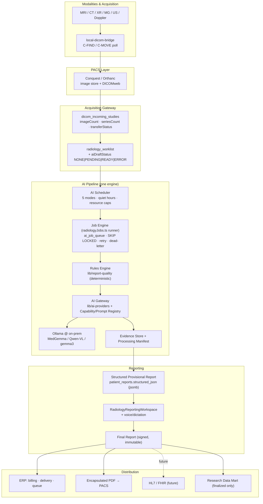
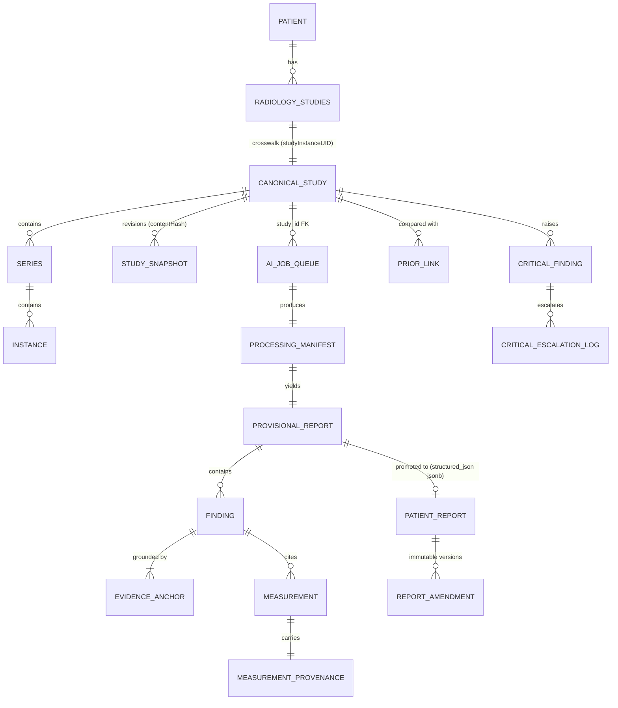
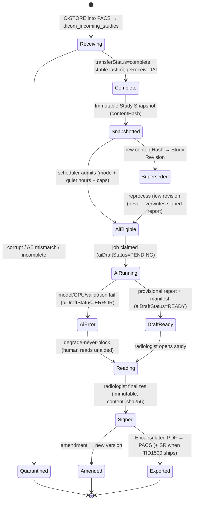
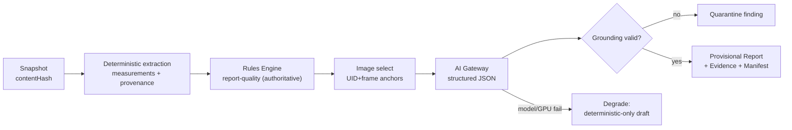
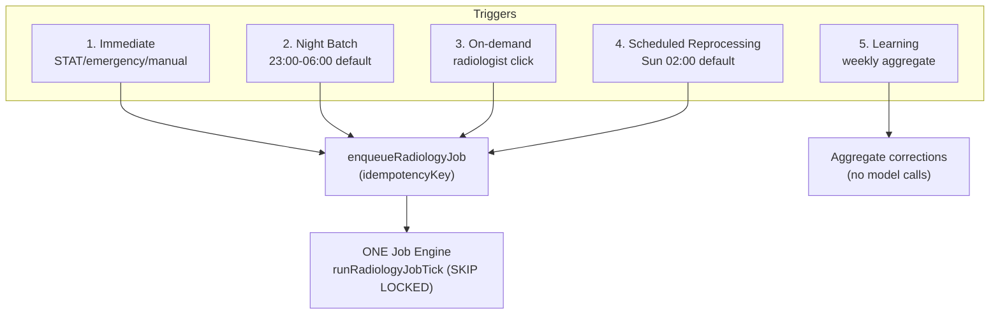
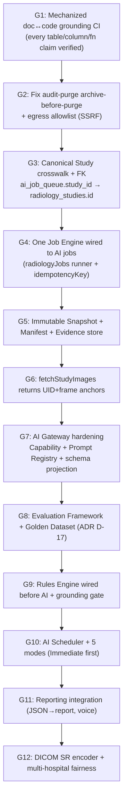

# CARE ERP Radiology AI Platform — v1.1 Implementation Constitution

**Status: THE SINGLE SOURCE OF TRUTH.** This document is the authoritative architecture for
the CARE ERP Radiology AI Platform. It merges the original v1 Master Blueprint
(`00`–`19` in this folder) and the Independent Architecture Audit
(`INDEPENDENT_AUDIT.md`) into ONE internally consistent architecture, corrected against the
actual codebase. Where any v1 blueprint file disagrees with this document, **this document
wins**. The v1 files are retained as design-rationale annex; the audit is retained as the
review of record. After this document, **implementation begins** — no further audits or
redesigns are required to start.

**Version:** 1.1 · **Date:** 2026-07-18 · **Mandate:** primary RIS for multiple hospitals over
a 10-year horizon — MRI, CT, XR, mammography, ultrasound, Doppler; pathology AI and enterprise
PACS on the roadmap. **Optimize for:** simplicity, reliability, clinical safety, scalability,
maintainability. Never for novelty.

---

## 0. Reconciliation Ledger (how the merge was resolved)

The audit found 38 places where the v1 blueprint asserted things about the code that were false,
and several internal contradictions. Every one is resolved here. This ledger is the merge; the
rest of the document is built on it. **No design statement in this constitution contradicts the
real schema.**

| # | Issue (blueprint vs. reality) | v1.1 RULING (grounded) |
|---|---|---|
| R1 | Blueprint designs a *new* SKIP-LOCKED worker; a production durable runner already exists (`artifacts/api-server/src/lib/radiologyJobs.ts`, BEND-1) over `dicom_retry_queue`, unmentioned. | **ONE job engine.** Adopt the existing `radiologyJobs.ts` runner (`runRadiologyJobTick`, `enqueueRadiologyJob`) as the single execution fabric. AI jobs are driven by it. No second runner is built. See §6, §14. |
| R2 | `ai_job_queue.study_id` is a bare `integer notNull` with **no FK**, written from a client-supplied `z.number()`. Blueprint treats it as a proven FK to `radiology_studies.id`. | Add the FK `ai_job_queue.study_id → radiology_studies.id`; stop accepting client-supplied study ids on `POST /ai-jobs` (resolve server-side from the Canonical Study). See §4. |
| R3 | Idempotency "UNIQUE (studyId, jobType, inputHash)" references columns `ai_job_queue` does not have. | Use the runner's **existing** dedup: a unique `idempotencyKey` string = `ai:{studyId}:{jobType}:{inputHash}`, deduped via `onConflictDoNothing` (exactly how BEND-1 already works). ONE dedup mechanism. See §6. |
| R4 | Lifecycle keys on `aiDraftStatus = AI_DRAFT_READY`. Real enum is `NONE \| PENDING \| READY \| ERROR`; `AI_DRAFT_READY` is a value of the *separate* `status` column. | Draft readiness = `radiology_worklist.aiDraftStatus = 'READY'`. See §5. |
| R5 | Arrival/dedup built on `dicom_pulled_studies.hashSignature` — a nullable column no code writes, whose formula is identity not content. | Use `dicom_incoming_studies` (real columns: `imageCount`, `seriesCount`, `lastImageReceivedAt`, `transferStatus`, `reprocessCount`) for arrival, stability, and late-series detection. The Immutable Study Snapshot manifest is computed from actual instance UIDs, not `hashSignature`. See §4, §5. |
| R6 | Arrival shown as "DICOMweb pull from Orthanc via scan-bridge / local-dicom-bridge". `scan-bridge` is a *paper-document* scanner; `local-dicom-bridge` polls modalities by C-FIND/C-MOVE. | Correct ingestion path: modalities → **Conquest/Orthanc PACS** → acquisition gateway populates `dicom_incoming_studies` (`ingestSource='conquest'`) → worklist. See §3. |
| R7 | `result_json` / `ai_draft_json` described as JSONB with recommended GIN indexes. Both are `text`. Only `patient_reports.structured_json` is `jsonb`. | Query-bearing structured output lives in **`jsonb`** (`patient_reports.structured_json`, already in production use with `content_sha256` + amendment chain). Transient `ai_job_queue.result_json` stays `text` (pointer/blob, never queried). No GIN index on a text column. See §4, §13. |
| R8 | `audit_logs` declared "permanent, never deleted, RPO 0", but a daily cron deletes rows > 730 days, archiving only the first 5,000. | **Retention reconciliation (CRIT-3):** clinical + AI provenance records are retained ≥ legal minimum via *complete* archive-before-purge; the 5,000-row archive cap is a blocking pre-req to fix before AI writes provenance. Operational logs may age at 730 days. See §16. |
| R9 | Backup "truncates every table at 5,000 rows" listed as an open blocker (CRIT-1). | **Already fixed** (`cron.ts`, Ticket E0.1: `pg_dump`, no cap, fail-loud). Removed from the blocker list. The *audit-archive* 5,000 cap (R8) is a different, still-open issue. |
| R10 | Circuit breaker reads/writes an `ai_provider_health` table. Real table is `ai_provider_health_logs` (append-only probe log, no breaker-state columns). | Breaker state is **derived** from a windowed query over `ai_provider_health_logs` (consecutive failures in last N probes). No phantom state table. See §7. |
| R11 | Model "pinned by name and digest in `ai_provider_settings`". No digest column exists. | Model version + digest pinning lives in the **new Capability Registry** (§7), declared as new — a legitimate accepted improvement, not a claim about existing schema. |
| R12 | Prompt `{templateId, templateVersion}` stamping against `ai_prompt_templates`, which has a mutable version and no history. | Immutable prompt versions live in the **prompt *library* store** (which already has version history); `ai_prompt_templates` is the editable working set. The Processing Manifest stamps the immutable library version id. See §7, §10. |
| R13 | `fetchStudyImages()` claimed to select in-profile series and supply UIDs. It returns bare base64 (no UIDs), one middle instance/series, cap 20; no profile logic. | Evidence requires provenance → `fetchStudyImages` is redefined to return `{seriesUid, sopUid, frameNumber, base64}[]` with **series-profile + representative-frame selection**. This is a named build task, not an existing capability. See §6, §9. |
| R14 | "Two critical-finding tables." There are **four** (`critical_findings`, `radiology_critical_findings`, `critical_findings_alerts`, `critical_escalation_log`). | Consolidate to ONE critical-findings model + the existing 3-level `critical_escalation_log` ladder. See §5, §16. |
| R15 | `matchStudyRegion` (companion/region resolver) cited as reusable by the server worker, but it lives in the React app tier (`artifacts/diagnostic-erp/src/lib/studyRegion.ts`). | Promote `matchStudyRegion` to a pure `lib/study-region` package so the worker and companions may import it (libs never depend on apps). See §12, §20. |
| R16 | SR export (`dicom_sr_export_queue`) treated as a working provenance sink. It is a "Future" stub with no encoder. | Encapsulated PDF → PACS is real now (`/tools/create-dicom`); **DICOM SR (TID 1500) is a staged roadmap item** with a named encoder task. See §17. |
| R17 | SSRF guard "cannot reach internal/off-tailnet hosts". It blocks RFC1918/loopback only, misses `100.64.0.0/10` (the whole tailnet), and is bypassed when `ollamaLocalOnly=true`. | Local-first egress enforced by an **exact-endpoint allowlist**, not RFC1918 blocking. See §16. |
| R18 | Blueprint ignores a shipped voice/dictation subsystem and the `hanging_protocols` table. | The Reporting Engine integrates the existing voice pipeline (§13); companions/DICOM conformance reuse `hanging_protocols` (§12, §17). |

---

## 1. Executive Summary

CARE ERP already contains a mature, mostly-correct radiology platform: a frozen "One Workspace /
One Engine" reporting system, a canonical Measurement Registry (`lib/measurements`), a
DB-backed AI provider registry with task routing (`lib/ai-providers`), a deterministic Quality
Engine (`lib/report-quality`), a durable job runner (`radiologyJobs.ts`), and a structured
report already persisted as `jsonb` with a content-hash amendment chain (`patient_reports`).
**What is missing is not architecture — it is the AI execution layer wired correctly onto what
exists, plus the safety, provenance, and DICOM-conformance scaffolding a hospital-grade RIS
requires.**

v1.1 delivers exactly that, and nothing more. Every study receives a **structured provisional
report** produced by a deterministic-first AI pipeline, scheduled by **one scheduler** across
five processing modes, executed by **one job engine**, grounded by **one Evidence Store**,
reproducible from **one Processing Manifest**, and gated by **one Evaluation Framework** — then
handed to the radiologist who alone signs. The AI never signs, never blocks, and on any failure
the workflow degrades to the existing deterministic, human-driven path unchanged.

The v1 blueprint's *diagnosis* was right; its *citations* were often wrong. This document keeps
the diagnosis, discards the wrong citations, and binds every decision to a real table, column,
or function. It is deliberately smaller than v1: consolidation, not accretion.

**Headline decisions (all detailed in §22):** ONE job engine (the existing runner) · ONE scheduler
(the new AI Scheduler policy layer above it) · ONE canonical study identity (`studyInstanceUID`
with a real crosswalk + FK) · JSON-first reporting into the existing `jsonb` structured report ·
deterministic Rules Engine runs before AI · Evidence-anchored findings only · local-first egress
by allowlist · reproducibility via the Processing Manifest · exposure gated by the Evaluation
Framework.

---

## 2. Architecture Constitution (frozen)

These are constitutional. They may not be modified by any coding agent without an explicit
architecture-change decision recorded as a new ADR that supersedes this section.

**Workflow (frozen, only to be strengthened):**

```
MRI / CT / USG / XR / MG / Doppler
        │
        ▼
Conquest / Orthanc PACS
        │
        ▼
CARE ERP Radiology Worklist  (study metadata · images · priors · clinical history · protocol · measurements)
        │
        ▼
AI Pipeline  (Deterministic Rules Engine → AI Gateway: Ollama · MedGemma · future multimodal)
        │
        ▼
Structured Provisional Report
        │
        ▼
Radiologist Review
        │
        ▼
Final Report  →  ERP · Encapsulated PDF to PACS · HL7/FHIR (future)
```

**The ONE-of-each guarantees (enforced in §Final Consistency):** one workspace · one reporting
engine · one canonical study object · one job engine · one scheduler · one AI gateway · one rules
engine · one measurement engine · one evidence store · one provenance manifest · one evaluation
framework.

**The invariants (never violated):**

1. **Deterministic before AI** — anything the platform can compute or validate deterministically
   is never delegated to a model.
2. **AI advises, the radiologist decides** — AI output is always a *provisional* draft; only a
   human signs; a signed report is immutable (amendments create new versions).
3. **Degrade, never block** — any AI/GPU/model/network failure silently falls back to the
   deterministic human workflow; the degraded state is *displayed*, never hidden.
4. **No finding without evidence** — every AI finding carries a verifiable Evidence Envelope
   anchor (existing series/SOP/frame or measurement); ungrounded findings are quarantined.
5. **Local-first PHI** — images/PHI default to the on-prem model; any cloud egress is explicit,
   allowlisted, and audited.
6. **Content over code** — clinical behaviour (measurements, checklists, prompts, rules,
   knowledge packs) lives in versioned registries; engines only interpret them.
7. **Backward compatible, incremental** — no deletes; strangler migrations; every step ships
   value and is reversible.
8. **Reproducible** — every provisional report is reconstructable from its Processing Manifest
   (model+digest, prompt version, pack version, rules version, image set, input hash).

---

## 3. Enterprise Architecture Diagram



**Process boundaries:** the ERP (`artifacts/diagnostic-erp`) and API (`artifacts/api-server`)
remain the modular monolith. The **only** new process is the **AI inference worker** — a headless
runner that calls `runRadiologyJobTick()` with AI handlers on a tick, plus the on-prem Ollama
node. No microservice fleet. This is a modular monolith with one worker, deliberately, for a
NAS-first deployment that federates per-site (§18).

---

## 4. Canonical Data Model

**The Canonical Study Object** is the single logical study, identity-anchored on
`studyInstanceUID`. It is not a new monolithic table; it is a thin **crosswalk** over the real
spines, plus the FK discipline the audit found missing:

- `dicom_incoming_studies.studyInstanceUID` / `dicom_studies` — imaging identity (UID authority).
- `radiology_studies.id` — the integer surrogate used by orders, bills, `patient_reports`, and
  `ai_job_queue.study_id`. **`ai_job_queue.study_id` gains a real FK to `radiology_studies.id`**
  (R2); `POST /ai-jobs` resolves the study server-side and never trusts a client id.
- `radiology_worklist` — the reporting/queue spine (holds `aiDraftStatus`, `status`).
- **`canonical_study`** (new, thin) — one row per `studyInstanceUID` mapping it to
  `radiology_studies.id`, `radiology_worklist.id`, and `dicom_studies`, exposing a stable
  `canonicalStudyId`. This is the crosswalk, not a fourth study spine.

**Immutable Study Snapshot.** When a study reaches processing eligibility, the pipeline records an
immutable **snapshot manifest**: the ordered set of `{seriesInstanceUID, sopInstanceUID}` present,
`imageCount`, `seriesCount`, and a `contentHash = sha256(sorted instance UIDs + counts)`. This is
computed from the real `dicom_incoming_studies` counts and the DICOMweb instance list — **not**
from the dead `hashSignature` column (R5). A later change in the instance set produces a new
`contentHash` → a new **Study Revision** (see §5), never a silent overwrite.



**Storage rulings (R7):** the *canonical, query-bearing* structured report lives in
`patient_reports.structured_json` (**`jsonb`**, already in production with `content_sha256` and the
amendment chain). Provisional AI output that is not yet promoted may live in a `jsonb` column on
its own row; `ai_job_queue.result_json` stays `text` as a transient execution artifact and is
never indexed or queried. **Priors and measurements are separate aggregates** (they have
independent lifecycles and provenance) — confirmed correct and kept. **AI output is versioned and
immutable per revision:** a regenerated draft is a new Provisional Report version bound to a new
Processing Manifest; nothing is overwritten in place.

**Database recommendations:** PostgreSQL is the system of record; `jsonb` (+ GIN where actually
`jsonb`) for structured reports and evidence; append-only provenance tables with archive-before-
purge (§16); worklist partitioned by date; `pgvector` for RAG/similar-case only when that feature
lands (not v1 day one). Net new tables are few and each replaces ambiguity, not adds it.

---

## 5. Study Lifecycle

One state machine, expressed in the **real** status columns (`dicom_incoming_studies.transferStatus`,
`radiology_worklist.status` + `aiDraftStatus`, report finalize/amend):



**Late-arriving series / study revision (R5):** detected by a change in `dicom_incoming_studies`
counts or a new `contentHash` for the same `studyInstanceUID`. A revision after a signed report
**never** mutates it — it creates a new AI Revision flagged for radiologist attention. Critical
findings raised at any state route through the single consolidated critical-findings model and the
existing `critical_escalation_log` 3-level ladder (R14).

---

## 6. AI Pipeline

Deterministic-first, executed as jobs on the **one** engine. Stages (each a handler registered
with `runRadiologyJobTick`):

1. **Snapshot & eligibility** — build the Immutable Study Snapshot; confirm stability.
2. **Deterministic extraction** — metadata, series classification (via promoted
   `lib/study-region`), measurement ingestion (DICOM SR / private tags / OCR / manual) through
   `lib/measurements` with mandatory provenance.
3. **Deterministic Rules Engine** — `lib/report-quality` (Q001–Q115 + measurement-range rules)
   computes everything that can be computed without a model. **This runs before AI and its output
   is authoritative over the model's** (invariant 1).
4. **Prior linkage** — resolve priors (same patient + region + modality) via the comparison engine.
5. **Image selection** — the redefined `fetchStudyImages()` returns
   `{seriesUid, sopUid, frameNumber, base64}` for **profile-selected series + representative
   frames** (R13), so every image carries provenance for the Evidence Store.
6. **AI Gateway call** — one gateway call (§7) requests a structured provisional report with
   schema-constrained output; the model's findings must reference the supplied UID/frame anchors.
7. **Grounding & validation** — anchors validated (the referenced instance must exist in the
   snapshot); findings failing grounding are quarantined; contradictions (finding vs. impression,
   laterality, negation) flagged by deterministic checks.
8. **Assemble** — Provisional Report (JSON) + Evidence Store entries + Processing Manifest.

**Dedup / exactly-once (R1, R3):** enqueue via `enqueueRadiologyJob` with
`idempotencyKey = "ai:{studyId}:{jobType}:{inputHash}"` where
`inputHash = sha256(snapshot.contentHash + promptVersion + schemaVersion)`. `onConflictDoNothing`
guarantees one job per (study, type, input). A model/prompt/pack upgrade changes `inputHash` →
a *new, explicit* reprocessing job (§15 mode 4) — never a silent collision.



---

## 7. AI Gateway

The single entry point for all model calls — the hardened evolution of `lib/ai-providers`
(`generateAiForTask` / `resolveTaskRoute` / `ai_model_routes`). The ERP never learns which model
answered. Additions, each grounded:

- **Capability Registry (new, R11):** declares each model's name, **digest**, capabilities
  (vision, long-context, grounded-JSON), sampling params, and PHI-eligibility. This is where model
  version pinning lives — *not* in `ai_provider_settings` (which has no digest column). Routing =
  task → required capability → eligible registered models → policy pick.
- **Prompt Registry (R12):** immutable, versioned prompts live in the prompt **library** store
  (which already has version history); `ai_prompt_templates` is the editable working set that gets
  *promoted* into an immutable library version. The Processing Manifest stamps the library version id.
- **Contract enforcement:** structured output is enforced via provider-native JSON modes with a
  **schema-projection layer** — the full `STRUCTURED_REPORT_JSON_SPEC_v1` is projected to the
  restricted subset each backend supports (OpenAI strict `json_schema`, Gemini `responseSchema`,
  Ollama GBNF), then validated + repaired against the full spec server-side. (The audit correctly
  noted the full spec is not directly enforceable on any backend — the projection layer is the fix.)
- **Resilience (R10):** per-provider circuit state is **derived** from a windowed query over
  `ai_provider_health_logs` (consecutive failures in the last N probes) — no phantom
  `ai_provider_health` table. Timeouts, bounded retry (via the runner), fallback chains, and
  degrade-to-deterministic.
- **Egress control (R17):** cloud providers receive PHI/images only when the Capability Registry
  marks them PHI-eligible AND policy allows; local-first is the default; egress is allowlisted by
  exact endpoint and audited.

Reproducibility = Capability Registry pin (model+digest+params) + Prompt Registry version +
input hash, all recorded in the Processing Manifest (§10).

---

## 8. Rules Engine

ONE deterministic clinical rules engine: `lib/report-quality` (rule catalog Q001–Q115 + structured
measurement-range rules; provider/executor pattern). It is the embodiment of *deterministic before
AI*: it validates measurements against `normalRange`/`criticalRange`, enforces required-by-protocol
completeness, detects contradictions, and its verdicts **override** the model where they disagree.
No second rules system, no `modality === 'X'` branches — rules are data. Critical-range crossings
feed the consolidated critical-findings path directly (deterministic, not model-derived) — this is
the durable fix for the audit's negation-blind keyword-scanner risk.

---

## 9. Evidence Store

Every provisional finding carries an **Evidence Envelope**, persisted in the Evidence Store:

- **Image anchors** — `{seriesInstanceUID, sopInstanceUID, frameNumber}` from the snapshot
  (supplied by the redefined `fetchStudyImages`, R13) + a key-image thumbnail.
- **Measurement anchors** — canonical measurement id + full provenance (§12).
- **Reasoning summary** and **confidence band** (`routine | worth_a_look | attention`, coded
  snake_case; title-case is UI-only).
- **Heatmap slot** — reserved now, populated later via DICOM GSPS/SEG (§17); the contract exists so
  no rework is needed.

**Grounding rule (hard gate):** the pipeline validates that each anchor's referenced instance
exists in the study snapshot before the finding is shown. A finding whose anchor does not resolve
is quarantined — this closes the "model hallucinates its own `sopUid`" hole the audit raised. The
Evidence Store is append-only and versioned per Provisional Report revision.

---

## 10. Processing Manifest

The immutable record of **how** a provisional report was produced — the reproducibility spine:

`{ canonicalStudyId, snapshotContentHash, modelName, modelDigest, samplingParams,
promptLibraryVersion, knowledgePackVersion, measurementEngineVersion, rulesCatalogVersion,
imageSelectionSet[], inputHash, gatewayRoute, startedAt, completedAt, degraded:boolean }`

It answers "which model, which prompt, which rules, which images produced this draft?" for every
report, enabling: (a) the Scheduled Reprocessing decision (§15 mode 4) — reprocess only when a
manifest input version is superseded; (b) medico-legal discovery; (c) the Evaluation Framework's
regression attribution. One manifest per Provisional Report version; never mutated.

---

## 11. Evaluation Framework

No model output reaches a radiologist until it passes evaluation. Components:

- **Golden Dataset** — a curated, de-identified set of studies with reference structured reports
  and known measurements, versioned.
- **Regression gate** — on any change to a model pin, prompt version, knowledge pack, rules
  catalog, or measurement engine, the framework re-runs the golden set and compares structured
  output (finding presence/absence, measurement deltas, critical-finding recall) to reference.
- **Exposure gate** — a model/prompt/pack version is `shadow → candidate → live` only after
  meeting thresholds (esp. **critical-finding recall**), with human sign-off. This is a **new ADR
  (D-17)** and is a hard prerequisite before Immediate/Night modes are enabled for real reads.

This is the single most important addition over v1: it converts "trust the model" into "measure the
model", satisfying *Measure Before Building*.

---

## 12. Measurement Platform

ONE canonical measurement engine: `lib/measurements` (immutable `MeasurementDefinition` ids,
`canonicalKey`, `viewerMapping`, `comparisonStrategy`, `normalRange`/`criticalRange`). **Provenance
is mandatory on every value:** `{seriesUid, sopUid, frameNumber, extractionMethod, confidence,
extractorVersion, timestamp}`. Sources: DICOM SR (concept-name match via `dicomSrPattern`), private
tags, OCR (with confidence + human-confirm before entering a report), manual/viewer calipers.
Conflicts resolved by source precedence + confidence. The existing `hanging_protocols` per-protocol
required-measurement lists are reused as the completeness checklist (R18) rather than a parallel
companion list. `matchStudyRegion` is promoted to `lib/study-region` so the worker resolves region
without importing app-tier code (R15).

---

## 13. Reporting Engine

ONE reporting engine — the frozen "One Workspace / One Engine" platform. JSON-first: the AI
produces structured JSON that is converted into the **same** canonical report objects a human
authors, persisted in `patient_reports.structured_json` (`jsonb`) with `content_sha256` and the
existing amendment chain. A signed report is immutable; amendments create new versions (DICOM
requires a new SOPInstanceUID + predecessor reference on any re-export). **The existing
voice/dictation subsystem** (`voiceCommandGrammar`, `voiceSafetyPolicy`, `voiceTranscription`,
`useVoiceDictation`) is a first-class part of the workspace — the radiologist dictates over any
draft section (R18). Print/PDF uses the one canonical server artifact; the same document previews,
prints, and delivers.

---

## 14. AI Scheduler

ONE scheduler — a policy module in **Radiology Settings** that decides *what* to enqueue and *when*,
sitting **above** the one job engine (which only executes). It never contains a second queue or
runner. Configuration (all persisted in clinic settings):

| Group | Settings |
|---|---|
| **Night AI** | enable Night AI · start time · end time |
| **Quiet hours** | quiet-hours window (§15) |
| **Resources** | GPU utilization limit · CPU utilization limit · max concurrent jobs · max studies per batch |
| **Inclusion** | include priors · include OCR · include measurements · include comparison |
| **Skip rules** | skip finalized reports · skip already-processed (by manifest inputHash) |
| **Retry** | retry failed jobs · auto-retry · manual retry |
| **Observability** | queue dashboard · GPU monitor · CPU monitor · ETA · last run · failed jobs · running jobs · **cancel job** |

The dashboard reads live from the job engine (`jobBacklogCounts`, `listDeadLetterJobs`) and
`ai_provider_health_logs`. "Skip already processed" keys on the Processing Manifest `inputHash`
(§10), so reprocessing is decided by content/version, not guesswork.

---

## 15. AI Processing Modes

All five modes enqueue into the **same** job engine; they differ only in *trigger*, *priority*, and
*resource envelope*. Priority ladder (highest → lowest): **STAT → Pending Reports → Routine →
Research** (mapped onto `ai_job_queue.priority`, 1 = highest).



1. **Immediate Mode** — study arrives (or manual "Generate AI") → highest priority → draft ready
   before the radiologist opens it. For emergency CT/MRI and STAT. Runs even during quiet hours.
2. **Night Batch Mode** — configurable, default **23:00–06:00**. Processes completed, pending,
   newly received, and reprocessing-eligible studies; runs prior comparison and research indexing.
   Uses maximum GPU. Priority order STAT → Pending → Routine → Research within the window.
3. **On-demand Mode** — radiologist clicks **Generate Draft / Regenerate Draft / Compare with
   Prior / Generate Differential** → executes immediately at interactive priority.
4. **Scheduled Reprocessing** — weekly, default **Sunday 02:00**. Reprocesses a study **only if** a
   manifest input is superseded: new AI model, new prompt version, new knowledge pack, new
   measurement engine, or a better model became available. **Never overwrites a radiologist's
   report** — always creates an AI Revision (§5).
5. **Learning Mode** — weekly. Aggregates human corrections, measurements, template usage, feedback,
   and statistics into the Feedback Ledger. **Never retrains automatically** — it prepares
   human-gated datasets for the Evaluation Framework.

**AI Quiet Hours** — configurable (e.g. 08:00–20:00). During quiet hours only **STAT, manual
requests, and emergency studies** run; maximum-GPU batch work is confined to the Night Batch window.

---

## 16. Security

- **PHI & egress (R17):** encryption at rest (`@workspace/crypto` pattern + disk), TLS in transit,
  and a **hard local-first egress allowlist** — cloud models reachable only if the Capability
  Registry marks them PHI-eligible and the exact endpoint is allowlisted. The current SSRF guard is
  rewritten to allowlist exact hosts (it must block the `100.64.0.0/10` tailnet range and must not
  be bypassable via `ollamaLocalOnly`).
- **Prompt injection:** DICOM metadata (`PatientName`, `StudyDescription`) and OCR'd burned-in text
  are **attacker-controllable** and are treated as untrusted input — sanitized and delimited before
  entering any prompt; the model is instructed to treat study text as data, not instructions.
- **Cross-study isolation:** each inference is scoped to one study's snapshot; no cross-study
  context bleed (prevents PHI of patient A leaking into patient B's draft).
- **Access control & break-glass (R14 partial):** RBAC via `rolePermissions`; per-study authz;
  the AI worker runs with least privilege, not god-mode DB creds. **`break_glass` is currently only
  a word in a comment** — v1.1 implements it as a real audited emergency-access path in
  `study_access_log`.
- **Audit & retention (R8/CRIT-3):** the AI provenance chain (Processing Manifest, Evidence Store,
  report amendments) and `audit_logs` are tamper-evident (hash-chained). **Blocking pre-req:** the
  daily audit purge currently archives only the first 5,000 rows before deleting >730-day rows —
  this must be changed to *complete* archive-before-purge (or retention extended) **before** AI
  writes provenance, so no clinical/AI audit record is destroyed unarchived. Backup truncation
  (CRIT-1) is already fixed (R9).
- **Tamper detection:** the hash-chain is verified on a schedule with a documented fork-response
  runbook (the audit noted a fork risk).

---

## 17. DICOM Conformance

Honest, staged — the thing that makes a RIS a citizen of the hospital.

| Capability | Status in v1.1 | Plan |
|---|---|---|
| Encapsulated PDF → PACS | **Real now** | `/tools/create-dicom` (Orthanc); versioned on amendment (new SOPInstanceUID + predecessor ref) |
| MWL / MPPS | **Real** (`mwl_entries`) | keep; add MPPS status write-back |
| DICOM SR (TID 1500 Measurement Report) | **Roadmap** | named encoder task; `dicom_sr_export_queue` is a stub today (R16) — build the encoder + template before claiming SR export |
| Structured Reporting round-trip (import modality SR) | Roadmap | ingest SR measurements via `dicomSrPattern` (partially real in `lib/measurements`) |
| Private tags | Per-vendor dictionaries | maintained in the measurement registry |
| Secondary Capture / KOS (key images) | Roadmap | KOS for evidence key-images |
| GSPS / DICOM SEG (AI overlays / heatmaps) | Roadmap | the Evidence Store heatmap slot maps to GSPS/SEG |
| Cine / multi-frame (US, XA) | Supported via viewer | `hanging_protocols` already models cine/MPR layouts |
| Hanging protocols | **Real table** (`hanging_protocols`) | reused for viewer layout + required measurements (R18) |
| Dose (RDSR) | Roadmap | required in some jurisdictions; schedule for multi-hospital |
| Mammography (MG CAD SR, tomo, tracking) | **Gap** | `MG` exists only in the registry type union; MG measurements + Breast companion content must be authored before mammography is "supported" |
| FHIR ImagingStudy / DiagnosticReport | Future | `hl7Schema` is a real HL7 scaffold; FHIR resources are new (not in `enterpriseRadiology`, contrary to the v1 claim) |

---

## 18. Multi-hospital Architecture

**Cell-per-site.** Each hospital runs its own cell (PACS + ERP + on-prem AI node + PostgreSQL).
Shared, centrally-versioned artifacts: Capability Registry, Prompt Registry, Knowledge Packs,
Measurement Registry, Rules Catalog, Golden Dataset. **Not** shared across cells by default: PHI,
worklists, `audit_logs`. Identity federation uses `studyInstanceUID` (globally unique) as the join
key; integer surrogates stay cell-local (avoids the cross-site integer-collision trap). Patient
identity across sites is reconciled by an EMPI mapping, not by assuming integer id equality. The
Research Data Mart aggregates **de-identified, finalized** data upward from cells. Tenant fairness
in the scheduler (per-cell caps so one site's backlog cannot starve another) is a prerequisite
before the second hospital goes live.

---

## 19. Future Roadmap (must not complicate v1)

Explicitly deferred, with contracts reserved so they don't force rework — but **none is built in
v1.1**: AI Knowledge Graph (over the structured reports + registries) · Multi-Agent AI (companion
agents coordinated by the gateway) · Digital Twin (longitudinal patient model) · Pathology
integration (radiology+pathology fusion) · Longitudinal disease timeline · Research Database +
cohort/registry builders · Enterprise Analytics/SLA dashboards. Each is a horizon item in the v1
roadmap (`18-roadmap.md`); this constitution's job is to ensure v1 does not paint them out.

---

## 20. Coding Order

Build order is dependency-driven and safety-gated. **Never implement a later item before its
prerequisites exist.**



**Blockers (must land first):** G1 (grounding CI — because the whole v1 blueprint drifted from
code), G2 (audit-retention truncation + egress). **Never until prerequisites:** no provisional
report reaches a radiologist before G5+G6+G8+G9 (snapshot, anchors, evaluation, grounding); no
cloud fallback before G2 (egress); no second hospital before G12 (fairness + federation).

---

## 21. Implementation Phases

| Phase | Theme | Exit criteria |
|---|---|---|
| **P0 — Foundation** | Grounding CI, audit-retention fix, egress allowlist, study crosswalk + FK | doc↔code CI green; no unarchived audit deletes; every study has a `canonicalStudyId` |
| **P1 — Execution** | One job engine wired to AI jobs; snapshot; manifest; evidence store; image anchors | an AI job runs end-to-end producing a manifest + evidence-anchored draft (shadow only) |
| **P2 — Trust** | Gateway hardening (registries + projection); Evaluation Framework + golden set; rules-before-AI + grounding gate | golden-set regression gate blocks bad versions; ungrounded findings quarantined |
| **P3 — Clinical** | Scheduler + 5 modes; JSON→report; voice; first companions (Chest/Abdomen/Neuro) | radiologists read AI drafts for pilot modalities; Immediate + Night modes live |
| **P4 — Enterprise** | DICOM SR encoder; critical-findings consolidation; mammography content; multi-hospital fairness + federation | SR export conformant; second hospital onboarded |
| **P5 — Frontier** | Roadmap items (§19), each behind its own ADR | — |

---

## 22. Non-negotiable Design Principles

1. **One workspace, one reporting engine, one canonical study object.**
2. **One job engine** (the existing `radiologyJobs.ts` runner) — never a second queue or worker.
3. **One scheduler** (policy) above the one engine (mechanism) — never a scheduler with its own queue.
4. **One AI gateway** — no direct provider calls anywhere; the ERP never knows the model.
5. **One rules engine, one measurement engine, one evidence store, one provenance manifest, one
   evaluation framework.**
6. **JSON-first**; prose derived from validated structure; the canonical report is `jsonb`.
7. **Deterministic before AI; AI advises, the human signs; degrade never blocks; no finding without
   evidence; local-first PHI; content over code; backward-compatible; reproducible.**
8. **Every claim about the code must be true** — enforced by the grounding CI (G1). A blueprint that
   disagrees with the schema is a defect, not a design.
9. **Simplicity over abstraction** — no new package, table, or state machine unless it removes more
   ambiguity than it adds. Net complexity must trend **down**.

---

## Final Consistency Pass

This document was written to satisfy the mandate's consistency requirement. Enumerated guarantees:

- **ONE implementation path** — the coding order (§20) and phases (§21) are the only path.
- **ONE canonical data model** — §4; identity anchored on `studyInstanceUID`; one crosswalk; real FKs.
- **ONE scheduler** — §14; policy only; no embedded queue.
- **ONE AI pipeline** — §6; one set of job handlers on one engine.
- **ONE reporting engine** — §13; the frozen platform; `jsonb` structured report.
- **ONE job engine / queue discipline** — §6, §14; the existing runner; one idempotency mechanism;
  one state vocabulary. The v1 "build a new SKIP-LOCKED worker" instruction is **retired** in favor
  of the runner that already exists.
- **No duplicate registries / workflows / state machines / schedulers / queues** — the Reconciliation
  Ledger (§0) resolved each; the four critical-finding stores collapse to one (§5); the two TAT
  concepts collapse to one (per v1 doc 03); companions reuse Knowledge Packs and `hanging_protocols`
  rather than duplicating them.

**Sign-off gate:** implementation may begin at Phase P0. No provisional report may be shown to a
radiologist until G5, G6, G8, and G9 are complete. This constitution is the reference; deviations
require a new ADR that supersedes the relevant section.

---

## Cross-references

- Design rationale (annex): `00`–`19` in this folder — authoritative only where this document is silent.
- Review of record: `INDEPENDENT_AUDIT.md` — the findings this constitution resolves (§0).
- Real components this document binds to: `lib/ai-providers`, `lib/measurements`, `lib/report-quality`,
  `lib/db/src/schema/{radiologyWorkflow,radiologyWorklist,patientReports,aiReporting}.ts`,
  `artifacts/api-server/src/lib/radiologyJobs.ts`, `docs/STRUCTURED_REPORT_JSON_SPEC_v1.md`,
  `docs/reporting-platform/CARE_REPORTING_PLATFORM_ARCHITECTURE_V1.md`.
