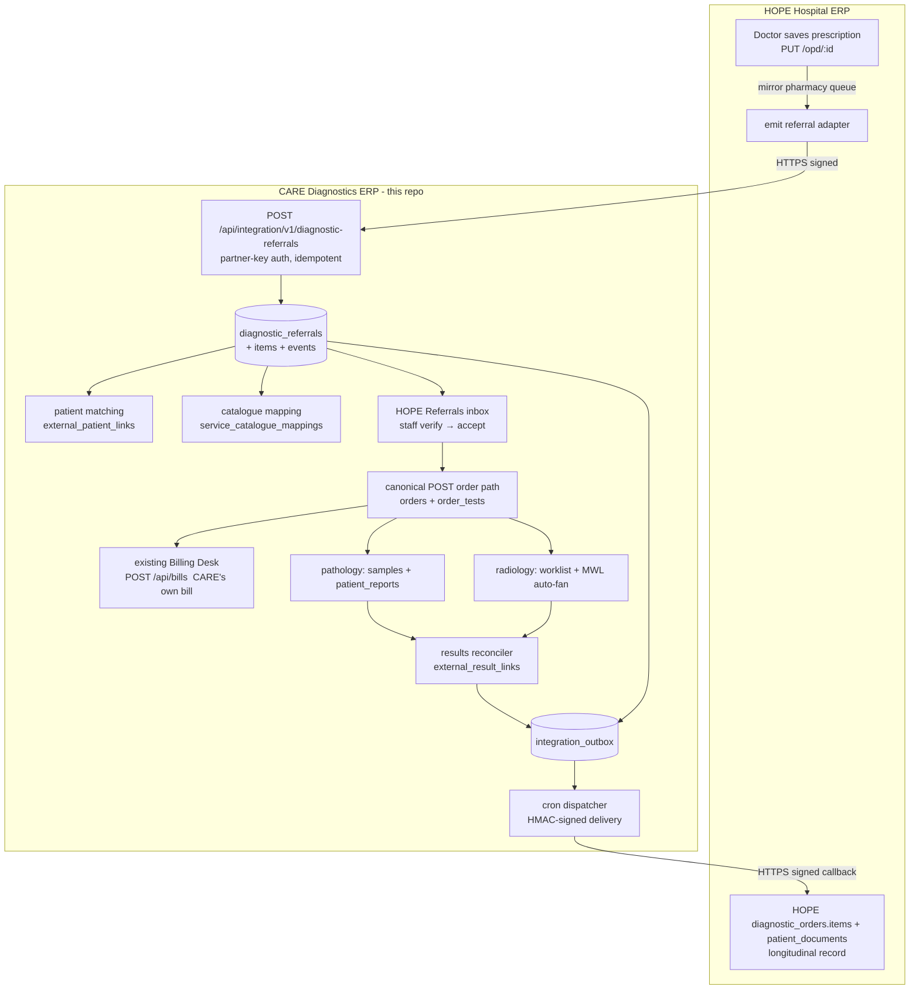

# Architecture & Data Flow — HOPE → CARE Diagnostic Referral Platform

## Design principles

1. **Two separately-owned organisations, loosely coupled.** HOPE emits a *clinical
   referral*; CARE decides to accept, bill, perform and report. The only coupling is
   a versioned, signed HTTP contract — no shared database, no shared billing.
2. **100% additive on CARE.** New tables + new routes only. No frozen billing/
   accounting file or table is modified; CARE's canonical order/bill endpoints do all
   money work. The integration *never* creates a bill.
3. **Reuse, don't duplicate.** Canonical CARE `patients`, `diagnostic_tests`,
   `orders`/`order_tests`, `samples`, `patient_reports`, `doctors`, and the existing
   `requireAiCallerAuth`-style hashed-credential + audit pattern.
4. **Safety first.** Deterministic, staff-reviewed patient matching (never auto-merge
   on name); a validated referral state machine; idempotency everywhere; transactional
   outbox so nothing is lost on downtime.

## Component map (CARE side)

```
artifacts/api-server/src/
├── middleware/requireIntegrationPartnerAuth.ts   inbound partner-key auth (hashed, audited, allowlisted)
├── routes/integration/
│   ├── inbound.ts        HOPE→CARE API  /api/integration/v1/*      (partner-key auth)
│   ├── hopeReferrals.ts  CARE staff inbox /api/hope-referrals/*    (staff session + /hope-referrals perm)
│   └── admin.ts          partner/mapping/outbox admin /api/integration/admin/* (admin only)
└── services/integration/
    ├── normalize.ts            name/phone/test normalisation + DOB-from-age
    ├── referralStateMachine.ts validated header + item transitions
    ├── patientMatching.ts      deterministic tiered matcher (+ conflict block)
    ├── providerMatching.ts     HOPE doctor → CARE doctors crosswalk
    ├── catalogueMapping.ts     HOPE test → CARE test/package (code→name→synonym)
    ├── careOrder.ts            canonical CARE order create/append (no bill)
    ├── referralIngest.ts       idempotent ingest orchestration (txn)
    ├── outbox.ts               enqueue + HMAC-signed dispatch + retry/dead-letter
    ├── resultsEmitter.ts       decoupled result reconciler (report finalised → HOPE)
    └── scheduler.ts            node-cron: outbox dispatch (1m) + reconcile (5m)

lib/db/src/schema/  +7 files (integration_partners, external_patient_links,
    external_provider_links, service_catalogue_mappings, diagnostic_referrals(+items,
    +events), integration_outbox(+attempts), external_result_links)
migrations/hope_care_diagnostic_referral_integration.sql  (idempotent, 13 tables)
artifacts/diagnostic-erp/src/pages/HopeReferrals.tsx      CARE staff inbox UI
```

## End-to-end data flow



## Acceptance scenario as a sequence

```mermaid
sequenceDiagram
  participant Dr as HOPE Doctor
  participant HOPE
  participant CARE as CARE API
  participant Staff as CARE Staff
  participant Path/Rad as Path/Radiology
  Dr->>HOPE: Prescribe CBC, LFT, USG whole abdomen; Save
  HOPE->>CARE: POST diagnostic-referrals (idempotent)
  CARE->>CARE: match patient · map CBC/LFT/USG · status RECEIVED_BY_CARE
  CARE-->>HOPE: 201 {matchStatus, mappingStatus}
  Staff->>CARE: open referral → confirm patient → Accept all
  CARE->>CARE: create canonical order (CBC,LFT → path; USG → radiology)
  Staff->>CARE: existing Billing Desk → confirm → CARE's own bill
  Path/Rad->>CARE: collect sample / perform USG → verify report (patient_reports)
  CARE->>CARE: reconciler → external_result_links + outbox
  CARE-->>HOPE: diagnostic_report.finalised (+ critical if flagged)
  HOPE->>HOPE: result appears in patient encounter (read-only)
  Dr->>CARE: acknowledge critical (documented)
```

## Idempotency & reliability model

* **No duplicate patient/order/bill:** unique `referral_uuid` + `idempotency_key`;
  patient crosswalk means a re-sent referral reuses the same CARE patient; accept
  appends to the single referral-linked order.
* **No lost work on downtime:** HOPE emit is fire-and-forget (prescription still
  saves); CARE→HOPE events sit in `integration_outbox` with retry/backoff/dead-letter
  and a reconciler; the admin "Sync errors" view + manual retry close the loop.
* **Accounting boundary:** CARE bills only through its frozen endpoints; HOPE prices
  (if ever sent) are estimates and are re-priced from `diagnostic_tests`; no revenue
  is shared or cross-recorded.
