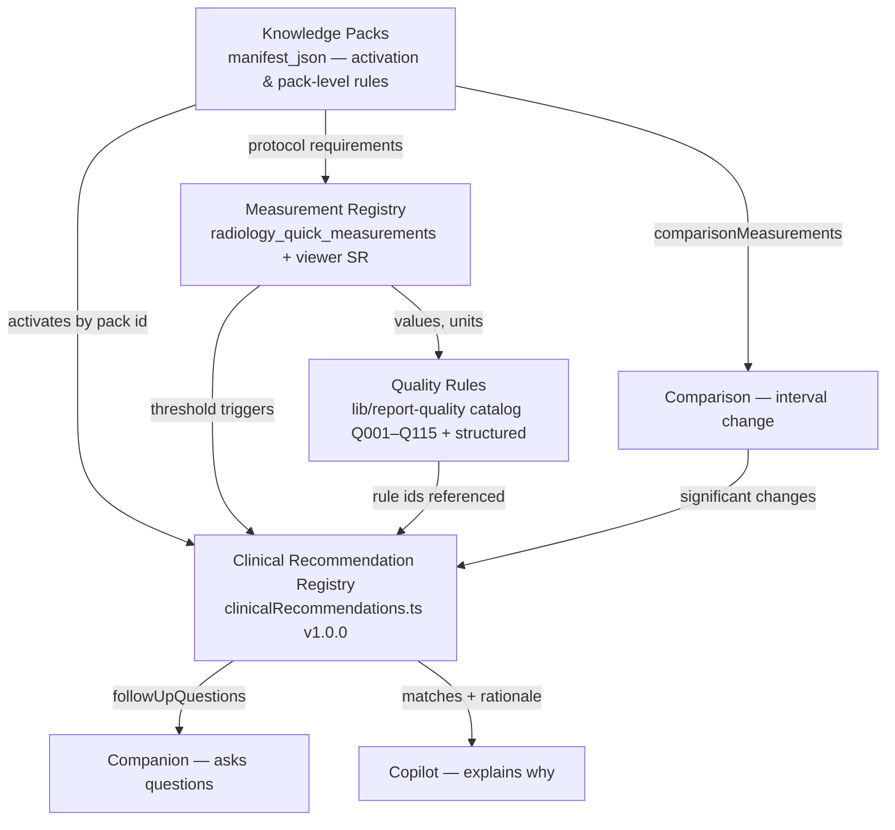

# CARE Reporting Platform — Architecture v1.0 (Canonical Reference)

**Status: FROZEN.** This is the official architecture handbook for the CARE
Reporting Platform, describing the system **exactly as implemented** at the
v1.0 freeze. A new engineer should be able to understand the entire platform
from this document without reading source first. Companion documents:
`PLATFORM_V1_FREEZE.md` (freeze declaration, contracts, scores),
`HOW_TO_ADD_NEW_MODALITY.md` (extension guide),
`PLATFORM_DEPENDENCY_GRAPH.md` / `PLATFORM_COVERAGE_REPORT.md` /
`PLATFORM_CONTRACT_SUITE.md` (contract-suite deliverables).

---

## 1. High-level overview

The CARE Reporting Platform is **one modality-agnostic radiology reporting
system**. MRI, USG, CT and X-Ray are **clients** of the same platform: the same
workspace, the same engines, the same admin surfaces. What differs per modality
is **data** — Knowledge Packs, protocols, templates, findings, measurements,
quality rules and recommendations — never code paths.

The platform's one sentence: *"The Reporting Platform is the operating system;
Knowledge Packs are the applications."*

Seven design principles — the **Platform Constitution**, stated in full in
`PLATFORM_V1_FREEZE.md` — govern everything: **One Workspace** · **One Engine**
· **Content over Code** · **Deterministic Before AI** · **AI Advises, Humans
Decide** · **Backward Compatibility** · **Measure Before Building**. Their
practical effect: a second implementation of any engine is a defect the
contract suite fails on; clinical behaviour lives in versioned, reviewed
registries that engines only interpret; nothing the platform cannot evaluate
deterministically is ever guessed or silently written into a report.

## 2. Component hierarchy

```
CARE ERP (artifacts/diagnostic-erp)
└── Reporting Workspace  — RadiologyReportingWorkspace.tsx (ONE instance)
    ├── Left rail: Study · Protocol · Clinical History · Templates · Findings editor
    ├── Right tabs: Copilot · Quick Select · Templates · Follow-up · Prior · AI · Measurements · Teaching
    ├── Side panels: Companion (US/CT) · Comparison · Viewer measurements
    └── Action bar: Save · Print/PDF · Finalize & Sign
API server (artifacts/api-server)
    ├── knowledge-pack routes (list/stats/assemble/validate/import/export)
    ├── template / protocol / quick-findings / measurement routes
    ├── report lifecycle routes (drafts, print-preview, finalize, amendments)
    └── report-quality routes (evaluate, overrides — shadow)
Shared packages (lib/*)
    └── lib/report-quality — the canonical Quality Engine (provider-based)
Database (Postgres, Drizzle; migrations auto-applied by care-db-patch-v2)
    ├── content tables: radiology_study_tabs · radiology_protocols ·
    │   radiology_quick_findings · radiology_quick_measurements ·
    │   structured_report_templates · radiology KB · teaching_cases
    ├── knowledge_packs (manifest registry)
    └── report_quality_* (append-only evaluations/findings/overrides)
```

## 3. Subsystem audit (Step 1)

For each: purpose · owner (canonical source) · depends on · consumed by ·
maturity · known limitations · extension point.

| Subsystem | Purpose / Owner | Depends on | Consumers | Maturity | Limitations | Extension point |
|---|---|---|---|---|---|---|
| **Workspace** | The one reporting UI. `pages/RadiologyReportingWorkspace.tsx` | resolver, all registries/engines | radiologists; every panel mounts here | Production (all 4 modalities) | 5.8k lines — large but single | Right-tab/panel composition; never a modality fork |
| **Study→region resolver** | Map `modality + studyDescription` → study tab. `lib/studyRegion.ts` | `radiology_study_tabs` names | Workspace, QuickFindingsPanel | Production; most-specific-wins | Substring matching needs well-named tabs | Add tabs (data) |
| **Knowledge Packs** | Source of truth per study. `knowledge_packs` + `knowledgePackManifest.ts` + routes + Manager | content tables (assembled live) | Companion, Copilot, Comparison, Quality, Cockpit | Production; 89 packs (58 enabled) | 28 placeholders; MRI/USG base packs are `{}` registry stubs (content is table-driven) | New pack row + manifest (data) |
| **Measurements** | Quick measurements, viewer/DICOM-SR import, manual calculators. `radiology_quick_measurements`, `useViewerMeasurements`, `MeasurementAssistantPanel` | viewer bridge, content seeds | Workspace, Quality, Recommendations, Comparison, Copilot | Production | Some CT protocol tokens not substring-aligned (data fix backlog) | Seed measurement rows (data) |
| **Templates** | Normal/structured report templates. `structured_report_templates` + routes + `ReportTemplates.tsx` | — | Workspace auto-select + pickers | Production | No CT/XR structured template rows yet (packs mark N/A or seed later) | Template rows (data) |
| **Protocols** | Technique/normals/recommendation text + required measurements + checklist. `radiology_protocols` | study tabs | Workspace, Companion, Quality | Production | required_measurements token alignment (CT backlog) | Protocol rows (data) |
| **Quick/Structured Findings** | One-click findings with `questionsJson` structured assistant, `suggests`, `conflictGroup`. `radiology_quick_findings` | study tabs | Workspace, Companion suggestions | Production | CT/XR breadth partial (6/26 CT tabs) | Finding rows (data) |
| **Clinical History** | Region-scoped history chips, non-destructive insert | study tabs | Workspace | Production | — | Chip rows (data) |
| **Companion** | Pre-report snapshot + auto-populate plan + provenance ledger + suggestions/questions. ONE panel: `UsgCompanionPanel.tsx` | protocols, findings, measurements, Recommendation Registry, server assembly | Workspace (US + CT via `companionEligible`) | Production (US); enabled (CT) | USG-shaped study-type detection + prior-text field (cosmetic for CT); name still "Usg"-prefixed for history | Pack `companionRules` + registry questions (data) |
| **Copilot** | Deterministic advisory orchestrator + self-registering modules. `copilotOrchestrator.ts` + `copilotModules.ts` | registries; ctx threaded by workspace | Workspace `CareCopilotPanel` | Production; ~20 modules | Modules are code (small, reviewed); rules/registry entries are data | `registerCopilotModule` (code) fed by registries (data) |
| **Quality Engine** | Canonical deterministic quality validation. `lib/report-quality` (provider engine, executors, rule catalog Q001–Q115 + 23 structured rules) | contract/context assemblers | live badge (text tier), shadow API persistence | Text tier production-parity; structured tier **shadow** (Phase 3; Phases 4+ pending) | Free-text tier heuristic-advisory by design; structured blocking gate not yet enabled | Data-driven `RuleDefinition` + executors; Authoring Guide governs |
| **Recommendation Registry** | ONE source of deterministic clinical recommendations. `lib/clinicalRecommendations.ts` (53 entries v1.0.0) | measurement labels, rule ids, pack ids | Copilot module, Companion questions, Follow-Up panel (derived), admin Manager | Production-advisory | Override/ignored telemetry absent (needs schema, future) | Registry entries (data, code-reviewed) |
| **Comparison** | Previous-study comparison engine + panel. `radiologyComparison.ts`, `ComparisonPanel` | priors, measurements, pack `comparisonMeasurements` | Workspace, Copilot comparison module, Recommendations | Production | — | Pack comparisonMeasurements (data) |
| **Print/PDF** | Canonical server print artifact + preview. `/print-preview`, `/print?preview=true`, premium layout | report lifecycle | Workspace, delivery | Production | — | Layout settings (config) |
| **Voice** | ONE voice pipeline: dictation + command grammar. `useVoiceSession`, `voiceCommandGrammar` | transcription providers | Workspace | Production | Provider availability environment-dependent | Grammar/config |
| **Viewer** | Image panel + DICOM viewer bridge + SR measurement import | PACS/bridge | Workspace, Measurements | Production | — | Bridge config |
| **Engineering Cockpit** | Versioned audit snapshots + readiness dashboards. `docs/reporting-platform/cockpit` + pack `/stats` | pack registry | Engineering/admin | Production (snapshot-based; labeled not-live) | Snapshots are judgments at a commit, not telemetry | Refresh workflow documented in cockpit README |
| **Admin** | Pack Manager, Quick Select, Protocol, Templates, Recommendation Registry Manager, Quality dashboard | registries | admins | Production | Registry Manager read-only (by design) | Modality-parameterised pages; no per-modality admin |
| **Contract Tests** | Permanent regression suite. `platform-contract.test.ts` + focused suites | source + migrations | CI-at-deploy, engineers | Production | Structural (no live DB/browser in dev env); runtime verified at deployment | Add modality row to `MODALITIES` |

## 4. Runtime flow (one report, end to end)

1. **Launch** — worklist opens `?modality=&accession=` → the one Workspace.
2. **Resolve** — `matchStudyRegion` (most-specific wins) → study tab → protocols,
   history chips, quick findings, measurements for that study; Knowledge Pack
   assembled by pack id for pack-level rules.
3. **Compose** — radiologist applies template/protocol; Companion (US/CT) offers
   an explainable auto-populate plan; findings via free text, quick findings or
   the structured assistant; measurements smart-insert.
4. **Advise** — Copilot's debounced analysis runs every registered module over
   the threaded context (text, measurements, prior changes, critical state);
   Recommendation Registry matches surface as WHY-explained advisories;
   Comparison panel diffs the selected prior.
5. **Score** — the Quality Engine text tier computes the live badge; the
   structured tier evaluates in shadow and persists append-only evaluations.
6. **Finalize** — `finalizeSafety` composes deterministic safety blocks; the
   only modality-specific gate in the platform is the obstetric-USG PCPNDT
   guard (regulatory, by design). Sign → immutable report; amendments follow
   the existing lifecycle.
7. **Print/Deliver** — the canonical server print artifact renders the same
   document for preview, PDF and delivery.

## 5. Data flow & registry relationships (Step 6)



One platform: packs **activate**, measurements **feed**, quality rules
**anchor**, recommendations **advise**, Companion **asks**, Copilot
**explains**, Comparison **contextualises**. No registry duplicates another's
content; every edge is a reference (ids/labels), not a copy.

## 6. Lifecycles

- **Knowledge Pack**: author manifest row (SQL seed or admin import) → validate
  (`validatePack`, 15 sections, `notApplicableSections` honesty) → status
  `placeholder → enabled` → assembled live from content tables → readiness/
  health on the Cockpit → version bump on change; `is_system` guards deletion.
- **Measurement**: seed `radiology_quick_measurements` row (template text +
  units) → appears in study's Quick Measurements → values enter reports via
  one-click / viewer SR / manual calculator → consumed by Quality (ranges,
  units, required-by-protocol), Recommendations (thresholds), Comparison
  (interval change).
- **Quality rule**: per the **Quality Rule Authoring Guide** — data-driven
  `RuleDefinition` + generic executor → shadow → parity/fixtures → clinical
  review → (future) blocking eligibility for deterministic structured rules
  only. Append-only evaluations; stable hierarchical rule ids.
- **Recommendation**: registry entry (full metadata contract, versioned) →
  matched by pure lookup from measurements/comparison/text → surfaced by
  Copilot (WHY) and Companion (questions) → advisory only; clinical review
  path mirrors the quality-rule lifecycle before any future gating.
- **Report**: draft (autosave, rescue) → advisory layers → quality badge →
  finalize gate (deterministic safety + PCPNDT where applicable) → signed
  immutable report → amendment lifecycle → delivery.
- **Comparison**: prior selected → engine diffs body + measurements →
  significant changes → panel + Copilot module + recommendation triggers.
- **Print**: draft/report id → canonical server artifact → preview iframe =
  PDF = delivered document (one renderer).
- **Finalization**: quality + safety + (PCPNDT if obstetric USG) → sign →
  status locked; further change = amendment, never mutation.

## 7. Developer extension workflow

**Add clinical content (the normal case — no code):** seed rows (study tab,
protocol, findings, measurements, templates, KB) + pack manifest; validate via
pack `/validate` + contract suite; deploy (migrations auto-apply).

**Add a quality rule:** follow `QUALITY_RULE_AUTHORING_GUIDE.md` — config over
an existing executor; new executor only for a genuinely new check *shape*.

**Add a recommendation:** add a registry entry (all metadata fields required;
hygiene tests enforce no duplicate/conflict/orphan).

**Add a Copilot module (rare):** `registerCopilotModule` — pure, alias-free,
consumes registries; never a second orchestrator.

**Add a modality:** see `HOW_TO_ADD_NEW_MODALITY.md` — packs + content + one
`MODALITIES` row in the contract suite. No engine.

**Never:** fork the workspace, add `modality === 'X'` branches, create a
per-modality engine, or hardcode a recommendation — the contract suite fails
each of these by construction.

## 8. Honest differences between principle and implementation

Documented per the freeze's honesty rule:

1. **Companion naming** — files/components are `Usg*`-prefixed for historical
   reasons though the panel now serves US + CT behind `companionEligible`, and
   its study-type detector and prior-text field are still USG-shaped (cosmetic
   for CT). Rename/generalisation is deliberate deferred polish, not a fork.
2. **MRI/USG base packs** are `{}` manifest stubs — their content predates the
   pack engine and lives in content tables; CT/XR packs carry rich manifests.
   Both are valid; the contract suite encodes the distinction.
3. **Quality Engine migration is mid-flight by design** — the shadow-first
   strangler plan (Phases 0–3 done, 4+ pending) intentionally keeps ~10 legacy
   quality surfaces alive until parity is proven; nothing may be deleted yet.
4. **Recommendation dashboard** shows registry-derived stats only; override/
   ignored rates need runtime telemetry (schema) and are explicitly future.
5. **Legacy pages remain** (`RadiologyLegacy`, `UsgReporting`, etc.) — routed,
   deprecated-labeled, retained per no-delete policy (see Migration Guide in
   `PLATFORM_V1_FREEZE.md`).
