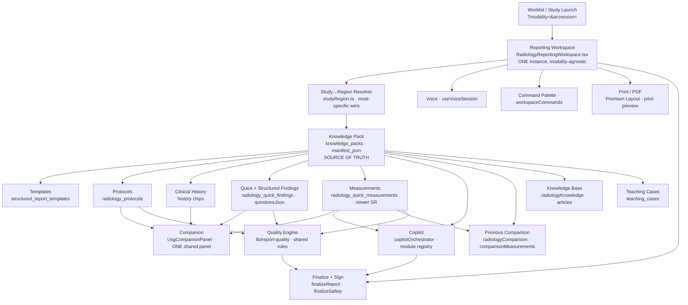

# CARE Reporting Platform — Dependency Graph

The Reporting Platform is **one modality-agnostic system**. A study of any
modality (MRI, USG, CT, X-Ray, and future modalities) opens the *same* Reporting
Workspace, which resolves a **Knowledge Pack** and, from it and the shared
content tables, drives every capability. Adding a modality means adding a
Knowledge Pack + clinical content — never a new node in this graph.

## Capability dependency graph

## Reading the graph

- **Worklist → Workspace.** A study opens the one canonical workspace via
  `?modality=&accession=`; there is no per-modality workspace.
- **Workspace → Resolver → Knowledge Pack.** The workspace resolves the study's
  region (`studyRegion.ts`, most-specific match), which selects the Knowledge
  Pack. The pack is the **source of truth** for that study's clinical behaviour.
- **Knowledge Pack → content.** Templates, protocols, history, findings and
  measurements are loaded from the shared content tables, keyed by the resolved
  region/study — CT/USG/XR/MRI rows sit side by side in the same tables.
- **Content → higher-order capabilities.** Companion (composes protocol +
  history + findings + measurements + Copilot), Copilot (module registry +
  measurement completeness), Comparison (pack `comparisonMeasurements`) and the
  Quality Engine all read the shared content — none is modality-specific.
- **Workspace-level services.** Voice, Command Palette, Print and Finalize are
  modality-agnostic and gated only by user preference / report state, never by
  modality.

## The invariant this encodes

Every arrow terminates at a **single** implementation. The platform contract
suite (`platform-contract.test.ts`, Step 4) asserts exactly one Workspace,
Companion, Copilot, Comparison engine, Knowledge-Pack engine, Template engine,
resolver and Quality-Engine package exist, and that **no modality-prefixed
second implementation** appears anywhere. If a `CtWorkspace`, `MriCopilot`, or
`UsgQualityEngine` is ever introduced, the suite fails.

> A future modality (PET-CT, Nuclear Medicine, Mammography, Fluoroscopy, DEXA)
> enters this graph **only** as a new Knowledge Pack + clinical content. No new
> node, no new arrow, no new engine.
